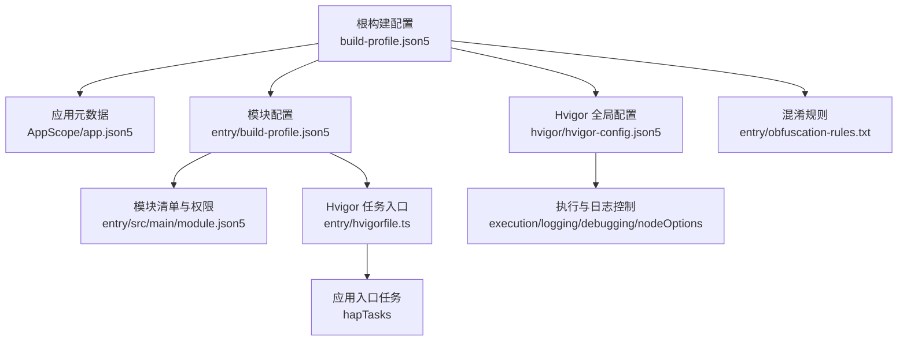
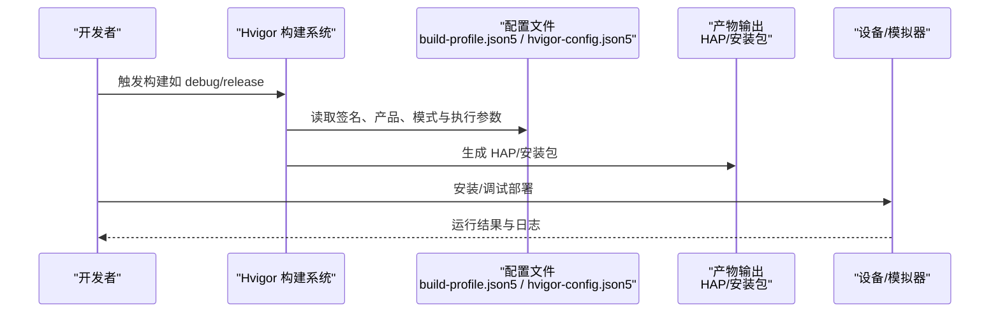
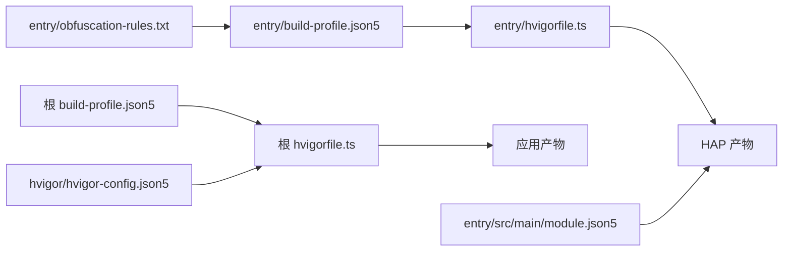

# 部署流程

<cite>
**本文引用的文件**
- [hvigor-config.json5](file://hvigor/hvigor-config.json5)
- [build-profile.json5（根）](file://build-profile.json5)
- [build-profile.json5（entry 模块）](file://entry/build-profile.json5)
- [hvigorfile.ts（根）](file://hvigorfile.ts)
- [hvigorfile.ts（entry 模块）](file://entry/hvigorfile.ts)
- [obfuscation-rules.txt（entry 模块）](file://entry/obfuscation-rules.txt)
- [app.json5（AppScope）](file://AppScope/app.json5)
- [module.json5（entry 模块）](file://entry/src/main/module.json5)
- [IMPLEMENTATION_SUMMARY.md（文件传输模块）](file://entry/src/main/ets/manager/transfer/IMPLEMENTATION_SUMMARY.md)
- [QUICK_REFERENCE.md（文件传输模块）](file://entry/src/main/ets/manager/transfer/QUICK_REFERENCE.md)
</cite>

## 目录
1. [简介](#简介)
2. [项目结构](#项目结构)
3. [核心组件](#核心组件)
4. [架构总览](#架构总览)
5. [详细组件分析](#详细组件分析)
6. [依赖分析](#依赖分析)
7. [性能考虑](#性能考虑)
8. [故障排查指南](#故障排查指南)
9. [结论](#结论)
10. [附录](#附录)

## 简介
本文件面向部署工程师与研发团队，提供从代码构建到设备部署的完整指导，涵盖本地调试部署、生产环境发布、配置说明、文档与规则自动化、多设备类型适配策略、CI/CD 集成方案、部署验证与回滚机制，以及性能监控与日志收集的部署配置要点。文中所有技术细节均以仓库中实际配置文件与模块文档为依据。

## 项目结构
本项目采用多模块结构，根目录通过 Hvigor 构建系统进行统一编排，entry 模块为应用入口模块，包含 ETS 业务代码、C/C++ 原生扩展、测试与打包配置。AppScope 提供应用级元数据，entry 模块的 module.json5 描述设备类型与权限声明，build-profile.json5 控制签名、产品与构建模式，hvigor-config.json5 控制构建执行与日志级别。

图表来源
- [build-profile.json5（根）](file://build-profile.json5#L1-L51)
- [AppScope/app.json5](file://AppScope/app.json5#L1-L11)
- [entry/build-profile.json5](file://entry/build-profile.json5#L1-L39)
- [entry/src/main/module.json5](file://entry/src/main/module.json5#L1-L86)
- [entry/hvigorfile.ts](file://entry/hvigorfile.ts#L1-L7)
- [hvigor/hvigor-config.json5](file://hvigor/hvigor-config.json5#L1-L21)
- [entry/obfuscation-rules.txt](file://entry/obfuscation-rules.txt#L1-L18)

章节来源
- [build-profile.json5（根）](file://build-profile.json5#L1-L51)
- [entry/build-profile.json5](file://entry/build-profile.json5#L1-L39)
- [hvigor/hvigor-config.json5](file://hvigor/hvigor-config.json5#L1-L21)

## 核心组件
- 构建系统与任务
  - 根级 hvigorfile.ts 引入 appTasks，用于应用整体构建；entry/hvigorfile.ts 引入 hapTasks，聚焦 HAP 包构建与打包。
  - Hvigor 全局配置 hvigor-config.json5 提供执行模式、日志级别、调试开关与 Node.js 运行参数控制。
- 应用与模块配置
  - 根 build-profile.json5 定义签名配置、产品与构建模式集合，entry/build-profile.json5 定义 Ark 编译选项、原生构建参数与目标产物。
  - AppScope/app.json5 定义 bundleName、版本号与图标等应用级元数据。
  - entry/src/main/module.json5 定义模块类型、设备类型、页面与权限声明。
- 文档与规则
  - 文件传输模块提供 IMPLEMENTATION_SUMMARY.md 与 QUICK_REFERENCE.md，明确协议选择、配置项与最佳实践，便于部署与运维参考。
  - entry/obfuscation-rules.txt 定义发布模式下的混淆规则启用与文件路径。

章节来源
- [hvigorfile.ts（根）](file://hvigorfile.ts#L1-L7)
- [hvigorfile.ts（entry 模块）](file://entry/hvigorfile.ts#L1-L7)
- [hvigor-config.json5](file://hvigor/hvigor-config.json5#L1-L21)
- [build-profile.json5（根）](file://build-profile.json5#L1-L51)
- [entry/build-profile.json5](file://entry/build-profile.json5#L1-L39)
- [AppScope/app.json5](file://AppScope/app.json5#L1-L11)
- [entry/src/main/module.json5](file://entry/src/main/module.json5#L1-L86)
- [IMPLEMENTATION_SUMMARY.md（文件传输模块）](file://entry/src/main/ets/manager/transfer/IMPLEMENTATION_SUMMARY.md#L1-L320)
- [QUICK_REFERENCE.md（文件传输模块）](file://entry/src/main/ets/manager/transfer/QUICK_REFERENCE.md#L1-L248)
- [entry/obfuscation-rules.txt](file://entry/obfuscation-rules.txt#L1-L18)

## 架构总览
下图展示从代码到设备部署的关键路径：开发者在本地执行构建命令，Hvigor 依据配置解析签名、产品与构建模式，生成 HAP 包或安装包；随后通过 DevEco Studio 或命令行工具安装到模拟器/真机；部署完成后进行验证与监控。

图表来源
- [hvigor/hvigor-config.json5](file://hvigor/hvigor-config.json5#L1-L21)
- [build-profile.json5（根）](file://build-profile.json5#L1-L51)
- [entry/build-profile.json5](file://entry/build-profile.json5#L1-L39)

## 详细组件分析

### 部署配置与环境设置（hvigor-config.json5）
- 执行控制
  - analyze、daemon、incremental、parallel、typeCheck 等字段用于控制分析模式、守护进程、增量编译、并行编译与类型检查。
- 日志控制
  - logging.level 可设置日志级别，便于在本地调试与 CI 环境中平衡可观测性与性能。
- 调试控制
  - debugging.stacktrace 控制是否输出堆栈信息，有助于定位编译与打包阶段的问题。
- Node.js 运行参数
  - nodeOptions.maxOldSpaceSize 用于设置守护进程的内存上限，避免大工程构建时 OOM。

章节来源
- [hvigor-config.json5](file://hvigor/hvigor-config.json5#L1-L21)

### 构建与签名配置（build-profile.json5）
- 应用签名
  - signingConfigs 定义签名材料（证书、密钥别名、密码、profile、签名算法、store 文件与密码），确保发布包可被系统信任。
- 产品与 SDK 版本
  - products 指定产品名称、签名配置、SDK 与兼容版本，确保运行时匹配。
- 构建模式
  - buildModeSet 定义 debug 与 release 模式，用于区分调试与发布行为（如混淆规则）。

章节来源
- [build-profile.json5（根）](file://build-profile.json5#L1-L51)

### 模块构建与原生扩展（entry/build-profile.json5）
- Ark 编译选项
  - apiType 为 stageMode，适合使用最新编译器优化与 PGO 等能力。
- 外部原生构建
  - externalNativeOptions.path 指向 CMakeLists.txt，abiFilters 限定 arm64-v8a，确保产物与目标设备一致。
- 发布混淆
  - release 构建模式下启用 obfuscation，并通过 files 引用 obfuscation-rules.txt，实现发布包的代码混淆与日志裁剪。

章节来源
- [entry/build-profile.json5](file://entry/build-profile.json5#L1-L39)
- [entry/obfuscation-rules.txt](file://entry/obfuscation-rules.txt#L1-L18)

### 模块清单与设备类型（entry/src/main/module.json5）
- 模块类型与入口
  - type 为 entry，mainElement 指向 EntryAbility，作为应用入口。
- 设备类型
  - deviceTypes 包含 default 与 tablet，适配平板与默认设备形态。
- 权限声明
  - 声明 GET_WIFI_INFO、LOCATION、ACCESS_BLUETOOTH、INTERNET 等权限，满足网络与位置相关功能需求。

章节来源
- [entry/src/main/module.json5](file://entry/src/main/module.json5#L1-L86)

### 应用元数据（AppScope/app.json5）
- 应用标识
  - bundleName、versionCode、versionName、icon、label 等，用于系统识别与展示。

章节来源
- [AppScope/app.json5](file://AppScope/app.json5#L1-L11)

### 文件传输模块与部署适配（文件传输模块文档）
- 协议选择与阈值
  - 小于阈值使用 MQTT，大于阈值使用 TCP 分块传输，支持自动切换与自定义阈值，便于在不同网络条件下优化传输效率。
- 配置项与最佳实践
  - sizeThreshold、tcpChunkSize、maxRetries、timeout、tcpPort 等参数可在部署前按网络环境调优。
- 事件与监控
  - 通过事件系统上报进度与状态，便于前端或上层系统进行部署可视化与告警。

章节来源
- [IMPLEMENTATION_SUMMARY.md（文件传输模块）](file://entry/src/main/ets/manager/transfer/IMPLEMENTATION_SUMMARY.md#L1-L320)
- [QUICK_REFERENCE.md（文件传输模块）](file://entry/src/main/ets/manager/transfer/QUICK_REFERENCE.md#L1-L248)

### 构建任务与插件（hvigorfile.ts）
- 根级与模块级任务
  - 根 hvigorfile.ts 引入 appTasks，entry/hvigorfile.ts 引入 hapTasks，分别承担应用级与 HAP 包级任务编排。
- 插件扩展
  - plugins 数组预留自定义插件扩展点，可用于接入 CI/CD、产物归档、签名与发布流程。

章节来源
- [hvigorfile.ts（根）](file://hvigorfile.ts#L1-L7)
- [hvigorfile.ts（entry 模块）](file://entry/hvigorfile.ts#L1-L7)

## 依赖分析
- 配置耦合关系
  - build-profile.json5（根）决定签名与产品，entry/build-profile.json5 决定 Ark 与原生构建参数，hvigor-config.json5 决定构建执行与日志策略。
  - module.json5 决定设备类型与权限，影响安装与运行时行为。
- 任务耦合关系
  - entry/hvigorfile.ts 的 hapTasks 依赖 entry/build-profile.json5 的配置；根 hvigorfile.ts 的 appTasks 依赖根 build-profile.json5 的配置。
- 文档与规则
  - 文件传输模块文档为部署与运维提供协议选择、配置与事件机制参考；obfuscation-rules.txt 与 entry/build-profile.json5 的 release 配置共同决定发布混淆策略。

图表来源
- [build-profile.json5（根）](file://build-profile.json5#L1-L51)
- [entry/build-profile.json5](file://entry/build-profile.json5#L1-L39)
- [hvigorfile.ts（根）](file://hvigorfile.ts#L1-L7)
- [hvigorfile.ts（entry 模块）](file://entry/hvigorfile.ts#L1-L7)
- [hvigor/hvigor-config.json5](file://hvigor/hvigor-config.json5#L1-L21)
- [entry/src/main/module.json5](file://entry/src/main/module.json5#L1-L86)
- [entry/obfuscation-rules.txt](file://entry/obfuscation-rules.txt#L1-L18)

章节来源
- [build-profile.json5（根）](file://build-profile.json5#L1-L51)
- [entry/build-profile.json5](file://entry/build-profile.json5#L1-L39)
- [hvigorfile.ts（根）](file://hvigorfile.ts#L1-L7)
- [hvigorfile.ts（entry 模块）](file://entry/hvigorfile.ts#L1-L7)
- [hvigor/hvigor-config.json5](file://hvigor/hvigor-config.json5#L1-L21)
- [entry/src/main/module.json5](file://entry/src/main/module.json5#L1-L86)
- [entry/obfuscation-rules.txt](file://entry/obfuscation-rules.txt#L1-L18)

## 性能考虑
- 构建性能
  - 启用并行编译与增量编译可显著缩短构建时间；根据硬件资源调整 nodeOptions.maxOldSpaceSize，避免内存不足导致的构建失败。
- 传输性能
  - 根据网络条件调整 sizeThreshold、tcpChunkSize、maxRetries、timeout 等参数，提升大文件传输稳定性与吞吐。
- 发布体积与安全
  - 在 release 模式启用混淆与日志裁剪，降低包体与泄露风险；结合权限最小化原则，仅声明必要权限。

章节来源
- [hvigor/hvigor-config.json5](file://hvigor/hvigor-config.json5#L1-L21)
- [entry/build-profile.json5](file://entry/build-profile.json5#L1-L39)
- [entry/obfuscation-rules.txt](file://entry/obfuscation-rules.txt#L1-L18)
- [QUICK_REFERENCE.md（文件传输模块）](file://entry/src/main/ets/manager/transfer/QUICK_REFERENCE.md#L177-L186)

## 故障排查指南
- 构建失败
  - 检查 hvigor-config.json5 的执行与日志级别设置，开启更详细的日志以定位问题；确认 Node.js 内存上限是否足够。
- 签名与安装失败
  - 核对 build-profile.json5 的 signingConfigs 是否正确；确认设备系统版本与兼容 SDK 版本匹配。
- 设备类型不匹配
  - 检查 module.json5 的 deviceTypes 与目标设备形态；确保 abiFilters 与设备 CPU 架构一致。
- 传输异常
  - 查看文件传输模块事件与日志，确认协议选择、阈值与超时配置是否合理；必要时增大重试次数或调整分块大小。

章节来源
- [hvigor/hvigor-config.json5](file://hvigor/hvigor-config.json5#L1-L21)
- [build-profile.json5（根）](file://build-profile.json5#L1-L51)
- [entry/src/main/module.json5](file://entry/src/main/module.json5#L1-L86)
- [IMPLEMENTATION_SUMMARY.md（文件传输模块）](file://entry/src/main/ets/manager/transfer/IMPLEMENTATION_SUMMARY.md#L1-L320)

## 结论
本部署指导以仓库中的配置文件与模块文档为基础，给出了从构建到设备部署的完整路径与关键配置点。通过合理设置 Hvigor 执行参数、签名与产品配置、模块清单与权限、以及发布混淆策略，可实现稳定高效的本地调试与生产发布。同时，文件传输模块的协议选择与事件机制为部署验证与监控提供了实用参考。

## 附录

### 本地调试部署步骤
- 准备
  - 确认 hvigor-config.json5 的日志级别与执行参数满足本地调试需求。
  - 确认 build-profile.json5 的 signingConfigs 与产品配置正确。
- 构建
  - 使用 Hvigor 执行 debug 模式构建，生成 HAP 包。
- 安装
  - 通过 DevEco Studio 或命令行安装到模拟器/真机。
- 验证
  - 观察日志与事件，确认应用启动与核心功能正常。

章节来源
- [hvigor/hvigor-config.json5](file://hvigor/hvigor-config.json5#L1-L21)
- [build-profile.json5（根）](file://build-profile.json5#L1-L51)
- [entry/build-profile.json5](file://entry/build-profile.json5#L1-L39)

### 生产环境发布步骤
- 准备
  - 在 build-profile.json5 的 release 模式下启用混淆与日志裁剪；核对签名材料与有效期。
  - 在 hvigor-config.json5 中设置合理的日志级别与执行参数。
- 构建
  - 使用 Hvigor 执行 release 模式构建，生成发布包。
- 安装与验证
  - 安装到目标设备，验证功能与性能；收集日志与事件进行回归分析。
- 回滚
  - 若发现问题，回滚至上一个稳定版本；保留发布包与日志以便复盘。

章节来源
- [build-profile.json5（根）](file://build-profile.json5#L1-L51)
- [entry/build-profile.json5](file://entry/build-profile.json5#L1-L39)
- [hvigor/hvigor-config.json5](file://hvigor/hvigor-config.json5#L1-L21)

### CI/CD 集成与自动化部署
- 任务编排
  - 在 CI/CD 中引入根 hvigorfile.ts 的 appTasks 与 entry/hvigorfile.ts 的 hapTasks，串联签名校验、构建、测试与打包。
- 环境变量
  - 通过环境变量注入签名材料路径与密码，避免硬编码；通过参数传递控制日志级别与执行模式。
- 产物归档
  - 将 HAP/安装包与日志上传至制品库；结合 obfuscation-rules.txt 与 release 配置，确保发布一致性。
- 自动化插件
  - 在 hvigorfile.ts 的 plugins 中扩展自定义插件，实现自动签名、发布与通知。

章节来源
- [hvigorfile.ts（根）](file://hvigorfile.ts#L1-L7)
- [hvigorfile.ts（entry 模块）](file://entry/hvigorfile.ts#L1-L7)
- [entry/obfuscation-rules.txt](file://entry/obfuscation-rules.txt#L1-L18)

### 不同设备类型的部署要求与适配策略
- 设备类型
  - module.json5 的 deviceTypes 包含 default 与 tablet，需分别进行测试与验证。
- ABI 与架构
  - entry/build-profile.json5 的 abiFilters 限定 arm64-v8a，确保产物与目标设备一致；如需支持其他架构，需相应调整。
- 权限与能力
  - 根据功能需求在 module.json5 中声明必要权限，避免安装后功能受限。

章节来源
- [entry/src/main/module.json5](file://entry/src/main/module.json5#L1-L86)
- [entry/build-profile.json5](file://entry/build-profile.json5#L1-L39)

### 部署验证与回滚机制
- 验证
  - 通过事件系统与日志记录部署过程中的关键节点；对核心功能进行冒烟测试与回归测试。
- 回滚
  - 保留上一个稳定版本的发布包与日志；在 CI/CD 中提供一键回滚脚本与人工审批流程。

章节来源
- [IMPLEMENTATION_SUMMARY.md（文件传输模块）](file://entry/src/main/ets/manager/transfer/IMPLEMENTATION_SUMMARY.md#L1-L320)
- [QUICK_REFERENCE.md（文件传输模块）](file://entry/src/main/ets/manager/transfer/QUICK_REFERENCE.md#L1-L248)

### 性能监控与日志收集的部署配置
- 日志级别
  - 在 hvigor-config.json5 的 logging.level 设置为 info 或更详细级别，便于问题定位。
- 传输监控
  - 使用文件传输模块的事件系统上报进度与状态；在 CI/CD 中收集构建日志与设备侧日志，形成闭环监控。

章节来源
- [hvigor/hvigor-config.json5](file://hvigor/hvigor-config.json5#L1-L21)
- [IMPLEMENTATION_SUMMARY.md（文件传输模块）](file://entry/src/main/ets/manager/transfer/IMPLEMENTATION_SUMMARY.md#L1-L320)
- [QUICK_REFERENCE.md（文件传输模块）](file://entry/src/main/ets/manager/transfer/QUICK_REFERENCE.md#L1-L248)