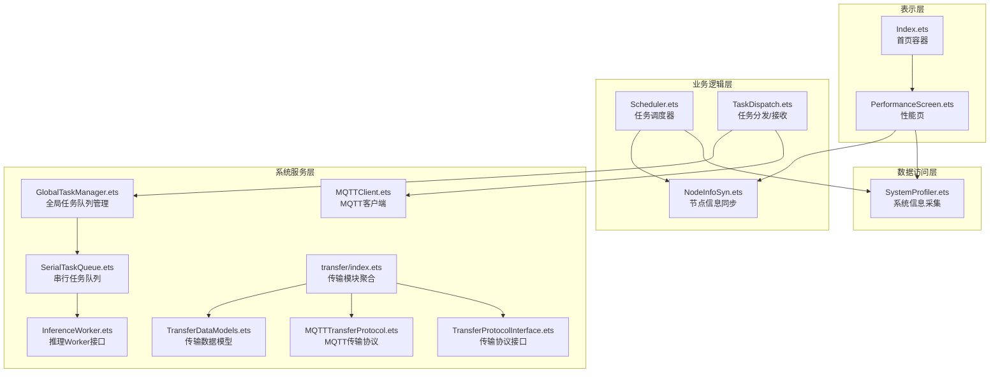
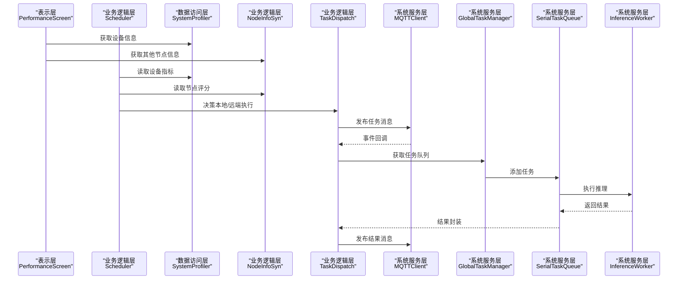
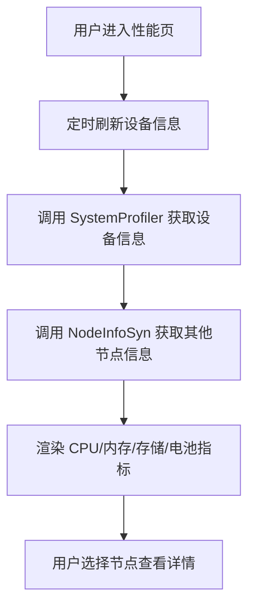
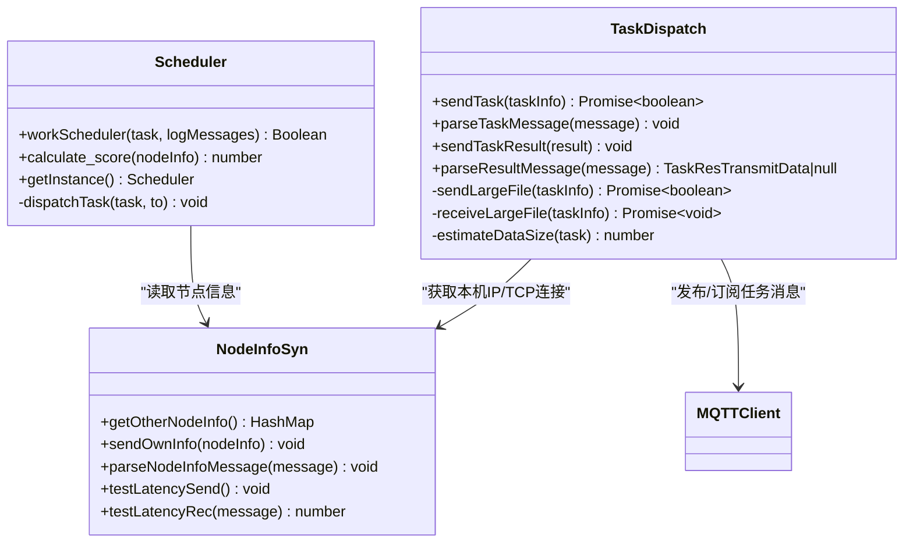
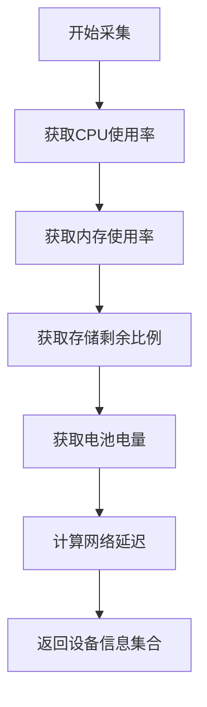
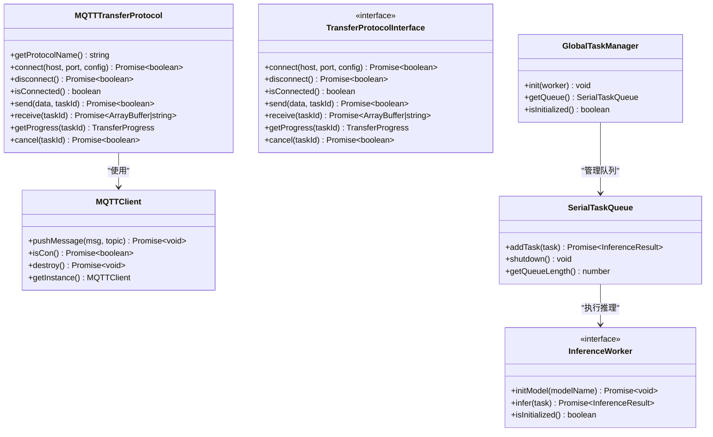
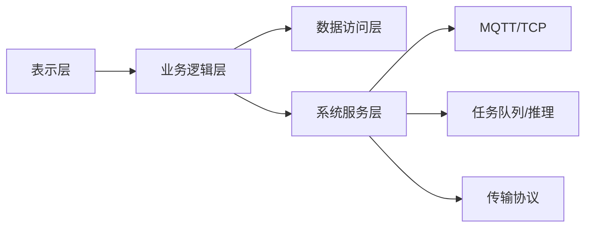

# 分层架构说明

<cite>
**本文引用的文件**
- [entry/src/main/ets/pages/Index.ets](file://entry/src/main/ets/pages/Index.ets)
- [entry/src/main/ets/pages/tabs/PerformanceScreen.ets](file://entry/src/main/ets/pages/tabs/PerformanceScreen.ets)
- [entry/src/main/ets/manager/broker/MQTTClient.ets](file://entry/src/main/ets/manager/broker/MQTTClient.ets)
- [entry/src/main/ets/manager/broker/monitor/NodeInfoSyn.ets](file://entry/src/main/ets/manager/broker/monitor/NodeInfoSyn.ets)
- [entry/src/main/ets/manager/broker/MQTTConfig.ets](file://entry/src/main/ets/manager/broker/MQTTConfig.ets)
- [entry/src/main/ets/manager/broker/task/TaskDispatch.ets](file://entry/src/main/ets/manager/broker/task/TaskDispatch.ets)
- [entry/src/main/ets/manager/scheduler/Scheduler.ets](file://entry/src/main/ets/manager/scheduler/Scheduler.ets)
- [entry/src/main/ets/manager/monitor/SystemProfiler.ets](file://entry/src/main/ets/manager/monitor/SystemProfiler.ets)
- [entry/src/main/ets/manager/worker/InferenceWorker.ets](file://entry/src/main/ets/manager/worker/InferenceWorker.ets)
- [entry/src/main/ets/manager/worker/GlobalTaskManager.ets](file://entry/src/main/ets/manager/worker/GlobalTaskManager.ets)
- [entry/src/main/ets/manager/worker/SerialTaskQueue.ets](file://entry/src/main/ets/manager/worker/SerialTaskQueue.ets)
- [entry/src/main/ets/manager/transfer/index.ets](file://entry/src/main/ets/manager/transfer/index.ets)
- [entry/src/main/ets/manager/transfer/model/TransferDataModels.ets](file://entry/src/main/ets/manager/transfer/model/TransferDataModels.ets)
- [entry/src/main/ets/manager/transfer/protocol/TransferProtocolInterface.ets](file://entry/src/main/ets/manager/transfer/protocol/TransferProtocolInterface.ets)
- [entry/src/main/ets/manager/transfer/protocol/MQTTTransferProtocol.ets](file://entry/src/main/ets/manager/transfer/protocol/MQTTTransferProtocol.ets)
</cite>

## 目录
1. 引言
2. 项目结构
3. 核心组件
4. 架构总览
5. 详细组件分析
6. 依赖分析
7. 性能考量
8. 故障排查指南
9. 结论
10. 附录

## 引言
本文件面向 OH_Co3 项目，系统阐述其分层架构设计与实现要点，覆盖表示层、业务逻辑层、数据访问层与系统服务层。文档重点说明各层职责边界、接口定义、层间通信协议、异常处理与错误传播机制，并结合具体代码路径给出实现模式示例。同时，讨论分层架构如何支撑模块化开发、测试隔离与维护便利性，并提出性能优化与缓存策略建议。

## 项目结构
OH_Co3 采用 ArkTS/ETS 开发，前端页面位于 pages 目录，业务与基础设施能力集中在 manager 目录下，按“功能域+职责”进行分层组织：
- 表示层：负责用户界面与交互，如首页与性能页。
- 业务逻辑层：负责任务调度、节点信息同步、任务分发与结果回传。
- 数据访问层：负责系统信息采集与设备状态监控。
- 系统服务层：负责通信（MQTT/TCP）、传输协议与任务队列。

图示来源
- [entry/src/main/ets/pages/Index.ets](file://entry/src/main/ets/pages/Index.ets#L1-L75)
- [entry/src/main/ets/pages/tabs/PerformanceScreen.ets](file://entry/src/main/ets/pages/tabs/PerformanceScreen.ets#L1-L204)
- [entry/src/main/ets/manager/scheduler/Scheduler.ets](file://entry/src/main/ets/manager/scheduler/Scheduler.ets#L1-L105)
- [entry/src/main/ets/manager/broker/task/TaskDispatch.ets](file://entry/src/main/ets/manager/broker/task/TaskDispatch.ets#L1-L302)
- [entry/src/main/ets/manager/broker/monitor/NodeInfoSyn.ets](file://entry/src/main/ets/manager/broker/monitor/NodeInfoSyn.ets#L1-L173)
- [entry/src/main/ets/manager/monitor/SystemProfiler.ets](file://entry/src/main/ets/manager/monitor/SystemProfiler.ets#L1-L120)
- [entry/src/main/ets/manager/broker/MQTTClient.ets](file://entry/src/main/ets/manager/broker/MQTTClient.ets#L1-L223)
- [entry/src/main/ets/manager/worker/GlobalTaskManager.ets](file://entry/src/main/ets/manager/worker/GlobalTaskManager.ets#L1-L27)
- [entry/src/main/ets/manager/worker/SerialTaskQueue.ets](file://entry/src/main/ets/manager/worker/SerialTaskQueue.ets#L1-L104)
- [entry/src/main/ets/manager/worker/InferenceWorker.ets](file://entry/src/main/ets/manager/worker/InferenceWorker.ets#L1-L90)
- [entry/src/main/ets/manager/transfer/index.ets](file://entry/src/main/ets/manager/transfer/index.ets#L1-L45)
- [entry/src/main/ets/manager/transfer/protocol/TransferProtocolInterface.ets](file://entry/src/main/ets/manager/transfer/protocol/TransferProtocolInterface.ets#L1-L120)
- [entry/src/main/ets/manager/transfer/protocol/MQTTTransferProtocol.ets](file://entry/src/main/ets/manager/transfer/protocol/MQTTTransferProtocol.ets#L1-L185)
- [entry/src/main/ets/manager/transfer/model/TransferDataModels.ets](file://entry/src/main/ets/manager/transfer/model/TransferDataModels.ets#L1-L113)

章节来源
- [entry/src/main/ets/pages/Index.ets](file://entry/src/main/ets/pages/Index.ets#L1-L75)
- [entry/src/main/ets/pages/tabs/PerformanceScreen.ets](file://entry/src/main/ets/pages/tabs/PerformanceScreen.ets#L1-L204)

## 核心组件
- 表示层组件
  - 首页容器与标签页：负责页面导航与状态管理。
  - 性能页：展示设备 CPU/内存/存储/电池等指标，联动系统信息采集。
- 业务逻辑层组件
  - 任务调度器：基于系统与节点信息计算评分，决定本地或远端执行。
  - 任务分发：根据任务大小选择 MQTT 直传或 TCP 大文件传输，负责结果回传。
  - 节点信息同步：周期性广播本机状态，接收并维护其他节点信息，支持延迟测试。
- 数据访问层组件
  - 系统信息采集：采集 CPU、内存、存储、电量、网络延迟等指标。
- 系统服务层组件
  - MQTT 客户端：统一的 MQTT 通信入口，事件发布/订阅与实例管理。
  - 推理 Worker：定义推理任务与结果的数据契约及执行接口。
  - 全局任务队列与串行队列：保证任务顺序执行与并发安全。
  - 传输模块：协议接口抽象、MQTT 传输协议实现、传输数据模型与工具类。

章节来源
- [entry/src/main/ets/pages/Index.ets](file://entry/src/main/ets/pages/Index.ets#L1-L75)
- [entry/src/main/ets/pages/tabs/PerformanceScreen.ets](file://entry/src/main/ets/pages/tabs/PerformanceScreen.ets#L1-L204)
- [entry/src/main/ets/manager/scheduler/Scheduler.ets](file://entry/src/main/ets/manager/scheduler/Scheduler.ets#L1-L105)
- [entry/src/main/ets/manager/broker/task/TaskDispatch.ets](file://entry/src/main/ets/manager/broker/task/TaskDispatch.ets#L1-L302)
- [entry/src/main/ets/manager/broker/monitor/NodeInfoSyn.ets](file://entry/src/main/ets/manager/broker/monitor/NodeInfoSyn.ets#L1-L173)
- [entry/src/main/ets/manager/monitor/SystemProfiler.ets](file://entry/src/main/ets/manager/monitor/SystemProfiler.ets#L1-L120)
- [entry/src/main/ets/manager/broker/MQTTClient.ets](file://entry/src/main/ets/manager/broker/MQTTClient.ets#L1-L223)
- [entry/src/main/ets/manager/worker/InferenceWorker.ets](file://entry/src/main/ets/manager/worker/InferenceWorker.ets#L1-L90)
- [entry/src/main/ets/manager/worker/GlobalTaskManager.ets](file://entry/src/main/ets/manager/worker/GlobalTaskManager.ets#L1-L27)
- [entry/src/main/ets/manager/worker/SerialTaskQueue.ets](file://entry/src/main/ets/manager/worker/SerialTaskQueue.ets#L1-L104)
- [entry/src/main/ets/manager/transfer/index.ets](file://entry/src/main/ets/manager/transfer/index.ets#L1-L45)
- [entry/src/main/ets/manager/transfer/protocol/TransferProtocolInterface.ets](file://entry/src/main/ets/manager/transfer/protocol/TransferProtocolInterface.ets#L1-L120)
- [entry/src/main/ets/manager/transfer/protocol/MQTTTransferProtocol.ets](file://entry/src/main/ets/manager/transfer/protocol/MQTTTransferProtocol.ets#L1-L185)
- [entry/src/main/ets/manager/transfer/model/TransferDataModels.ets](file://entry/src/main/ets/manager/transfer/model/TransferDataModels.ets#L1-L113)

## 架构总览
分层架构以“表示层-业务逻辑层-数据访问层-系统服务层”自顶向下组织，层间通过清晰的接口与事件驱动通信，避免交叉耦合。典型数据流如下：
- 表示层触发业务动作（如查看性能、发起任务）。
- 业务逻辑层调用数据访问层获取系统信息，结合节点信息做决策。
- 业务逻辑层通过系统服务层进行通信与传输。
- 系统服务层内部协作（如 MQTT 事件、任务队列、传输协议）。

图示来源
- [entry/src/main/ets/pages/tabs/PerformanceScreen.ets](file://entry/src/main/ets/pages/tabs/PerformanceScreen.ets#L1-L204)
- [entry/src/main/ets/manager/scheduler/Scheduler.ets](file://entry/src/main/ets/manager/scheduler/Scheduler.ets#L1-L105)
- [entry/src/main/ets/manager/monitor/SystemProfiler.ets](file://entry/src/main/ets/manager/monitor/SystemProfiler.ets#L1-L120)
- [entry/src/main/ets/manager/broker/monitor/NodeInfoSyn.ets](file://entry/src/main/ets/manager/broker/monitor/NodeInfoSyn.ets#L1-L173)
- [entry/src/main/ets/manager/broker/task/TaskDispatch.ets](file://entry/src/main/ets/manager/broker/task/TaskDispatch.ets#L1-L302)
- [entry/src/main/ets/manager/broker/MQTTClient.ets](file://entry/src/main/ets/manager/broker/MQTTClient.ets#L1-L223)
- [entry/src/main/ets/manager/worker/GlobalTaskManager.ets](file://entry/src/main/ets/manager/worker/GlobalTaskManager.ets#L1-L27)
- [entry/src/main/ets/manager/worker/SerialTaskQueue.ets](file://entry/src/main/ets/manager/worker/SerialTaskQueue.ets#L1-L104)
- [entry/src/main/ets/manager/worker/InferenceWorker.ets](file://entry/src/main/ets/manager/worker/InferenceWorker.ets#L1-L90)

## 详细组件分析

### 表示层：页面与状态管理
- 首页容器负责标签页切换与页面生命周期状态（显示/隐藏）。
- 性能页通过系统信息采集与节点信息同步，动态展示设备指标与节点列表。

图示来源
- [entry/src/main/ets/pages/Index.ets](file://entry/src/main/ets/pages/Index.ets#L1-L75)
- [entry/src/main/ets/pages/tabs/PerformanceScreen.ets](file://entry/src/main/ets/pages/tabs/PerformanceScreen.ets#L1-L204)
- [entry/src/main/ets/manager/monitor/SystemProfiler.ets](file://entry/src/main/ets/manager/monitor/SystemProfiler.ets#L1-L120)
- [entry/src/main/ets/manager/broker/monitor/NodeInfoSyn.ets](file://entry/src/main/ets/manager/broker/monitor/NodeInfoSyn.ets#L1-L173)

章节来源
- [entry/src/main/ets/pages/Index.ets](file://entry/src/main/ets/pages/Index.ets#L1-L75)
- [entry/src/main/ets/pages/tabs/PerformanceScreen.ets](file://entry/src/main/ets/pages/tabs/PerformanceScreen.ets#L1-L204)

### 业务逻辑层：调度与任务分发
- 任务调度器：收集设备信息，计算节点评分，选择最优节点；若非本机则分发任务。
- 任务分发：根据任务大小阈值选择 MQTT 直传或 TCP 大文件传输；负责结果回传与消息解析。
- 节点信息同步：广播本机状态、接收其他节点状态、延迟测试与更新。

图示来源
- [entry/src/main/ets/manager/scheduler/Scheduler.ets](file://entry/src/main/ets/manager/scheduler/Scheduler.ets#L1-L105)
- [entry/src/main/ets/manager/broker/task/TaskDispatch.ets](file://entry/src/main/ets/manager/broker/task/TaskDispatch.ets#L1-L302)
- [entry/src/main/ets/manager/broker/monitor/NodeInfoSyn.ets](file://entry/src/main/ets/manager/broker/monitor/NodeInfoSyn.ets#L1-L173)
- [entry/src/main/ets/manager/broker/MQTTClient.ets](file://entry/src/main/ets/manager/broker/MQTTClient.ets#L1-L223)

章节来源
- [entry/src/main/ets/manager/scheduler/Scheduler.ets](file://entry/src/main/ets/manager/scheduler/Scheduler.ets#L1-L105)
- [entry/src/main/ets/manager/broker/task/TaskDispatch.ets](file://entry/src/main/ets/manager/broker/task/TaskDispatch.ets#L1-L302)
- [entry/src/main/ets/manager/broker/monitor/NodeInfoSyn.ets](file://entry/src/main/ets/manager/broker/monitor/NodeInfoSyn.ets#L1-L173)

### 数据访问层：系统信息采集
- 统一采集 CPU、内存、存储、电量与网络延迟，封装为设备信息对象，供调度与展示使用。

图示来源
- [entry/src/main/ets/manager/monitor/SystemProfiler.ets](file://entry/src/main/ets/manager/monitor/SystemProfiler.ets#L1-L120)

章节来源
- [entry/src/main/ets/manager/monitor/SystemProfiler.ets](file://entry/src/main/ets/manager/monitor/SystemProfiler.ets#L1-L120)

### 系统服务层：通信与任务执行
- MQTT 客户端：统一的连接、订阅、发布与事件派发入口，支持实例化与销毁。
- 全局任务队列与串行队列：保证任务顺序执行，提供初始化、获取与关闭能力。
- 推理 Worker：定义任务输入/输出与执行接口，便于替换不同推理引擎。
- 传输模块：协议接口抽象、MQTT 传输协议实现、传输数据模型与工具类。

图示来源
- [entry/src/main/ets/manager/broker/MQTTClient.ets](file://entry/src/main/ets/manager/broker/MQTTClient.ets#L1-L223)
- [entry/src/main/ets/manager/worker/GlobalTaskManager.ets](file://entry/src/main/ets/manager/worker/GlobalTaskManager.ets#L1-L27)
- [entry/src/main/ets/manager/worker/SerialTaskQueue.ets](file://entry/src/main/ets/manager/worker/SerialTaskQueue.ets#L1-L104)
- [entry/src/main/ets/manager/worker/InferenceWorker.ets](file://entry/src/main/ets/manager/worker/InferenceWorker.ets#L1-L90)
- [entry/src/main/ets/manager/transfer/protocol/TransferProtocolInterface.ets](file://entry/src/main/ets/manager/transfer/protocol/TransferProtocolInterface.ets#L1-L120)
- [entry/src/main/ets/manager/transfer/protocol/MQTTTransferProtocol.ets](file://entry/src/main/ets/manager/transfer/protocol/MQTTTransferProtocol.ets#L1-L185)

章节来源
- [entry/src/main/ets/manager/broker/MQTTClient.ets](file://entry/src/main/ets/manager/broker/MQTTClient.ets#L1-L223)
- [entry/src/main/ets/manager/worker/GlobalTaskManager.ets](file://entry/src/main/ets/manager/worker/GlobalTaskManager.ets#L1-L27)
- [entry/src/main/ets/manager/worker/SerialTaskQueue.ets](file://entry/src/main/ets/manager/worker/SerialTaskQueue.ets#L1-L104)
- [entry/src/main/ets/manager/worker/InferenceWorker.ets](file://entry/src/main/ets/manager/worker/InferenceWorker.ets#L1-L90)
- [entry/src/main/ets/manager/transfer/protocol/TransferProtocolInterface.ets](file://entry/src/main/ets/manager/transfer/protocol/TransferProtocolInterface.ets#L1-L120)
- [entry/src/main/ets/manager/transfer/protocol/MQTTTransferProtocol.ets](file://entry/src/main/ets/manager/transfer/protocol/MQTTTransferProtocol.ets#L1-L185)

## 依赖分析
- 层内高内聚、跨层低耦合：业务逻辑层通过接口与系统服务层交互，避免直接依赖具体实现。
- 事件驱动与单例模式：MQTT 客户端与调度器均采用单例，配合事件派发降低模块间紧耦合。
- 传输协议抽象：通过协议接口屏蔽 MQTT/TCP 实现差异，便于扩展与替换。

图示来源
- [entry/src/main/ets/manager/broker/MQTTClient.ets](file://entry/src/main/ets/manager/broker/MQTTClient.ets#L1-L223)
- [entry/src/main/ets/manager/broker/task/TaskDispatch.ets](file://entry/src/main/ets/manager/broker/task/TaskDispatch.ets#L1-L302)
- [entry/src/main/ets/manager/worker/SerialTaskQueue.ets](file://entry/src/main/ets/manager/worker/SerialTaskQueue.ets#L1-L104)

章节来源
- [entry/src/main/ets/manager/broker/MQTTClient.ets](file://entry/src/main/ets/manager/broker/MQTTClient.ets#L1-L223)
- [entry/src/main/ets/manager/broker/task/TaskDispatch.ets](file://entry/src/main/ets/manager/broker/task/TaskDispatch.ets#L1-L302)
- [entry/src/main/ets/manager/worker/SerialTaskQueue.ets](file://entry/src/main/ets/manager/worker/SerialTaskQueue.ets#L1-L104)

## 性能考量
- 任务调度评分：综合 CPU、内存、电量、存储与延迟，提升整体吞吐与能耗平衡。
- 传输策略：小文件直传 MQTT，大文件走 TCP 并支持重连与校验，减少网络抖动影响。
- 队列串行化：串行队列确保任务有序执行，避免资源争用；必要时可引入优先级队列。
- 缓存策略：节点信息与系统指标定期刷新，避免频繁系统调用；传输进度与历史记录短期缓存。
- 异步与并发：系统信息采集与任务执行使用并发任务池，缩短等待时间。

## 故障排查指南
- MQTT 连接问题
  - 症状：无法发布/订阅或连接失败。
  - 排查：确认实例初始化与连接状态；检查 URL、用户名、密码与主题配置。
  - 参考路径
    - [entry/src/main/ets/manager/broker/MQTTClient.ets](file://entry/src/main/ets/manager/broker/MQTTClient.ets#L1-L223)
    - [entry/src/main/ets/manager/broker/MQTTConfig.ets](file://entry/src/main/ets/manager/broker/MQTTConfig.ets)
- 任务分发失败
  - 症状：任务未到达目标节点或结果未回传。
  - 排查：检查任务大小阈值与传输类型选择；验证 TCP 服务器启动与连接；确认结果消息过滤逻辑。
  - 参考路径
    - [entry/src/main/ets/manager/broker/task/TaskDispatch.ets](file://entry/src/main/ets/manager/broker/task/TaskDispatch.ets#L1-L302)
- 队列异常
  - 症状：任务堆积或执行失败。
  - 排查：检查队列状态与任务处理流程；必要时关闭队列并重建。
  - 参考路径
    - [entry/src/main/ets/manager/worker/SerialTaskQueue.ets](file://entry/src/main/ets/manager/worker/SerialTaskQueue.ets#L1-L104)
    - [entry/src/main/ets/manager/worker/GlobalTaskManager.ets](file://entry/src/main/ets/manager/worker/GlobalTaskManager.ets#L1-L27)

章节来源
- [entry/src/main/ets/manager/broker/MQTTClient.ets](file://entry/src/main/ets/manager/broker/MQTTClient.ets#L1-L223)
- [entry/src/main/ets/manager/broker/MQTTConfig.ets](file://entry/src/main/ets/manager/broker/MQTTConfig.ets)
- [entry/src/main/ets/manager/broker/task/TaskDispatch.ets](file://entry/src/main/ets/manager/broker/task/TaskDispatch.ets#L1-L302)
- [entry/src/main/ets/manager/worker/SerialTaskQueue.ets](file://entry/src/main/ets/manager/worker/SerialTaskQueue.ets#L1-L104)
- [entry/src/main/ets/manager/worker/GlobalTaskManager.ets](file://entry/src/main/ets/manager/worker/GlobalTaskManager.ets#L1-L27)

## 结论
OH_Co3 的分层架构以清晰的职责划分与接口抽象实现了模块化与可维护性。通过事件驱动与单例模式降低耦合，借助协议抽象与传输策略提升性能与可靠性。建议在后续迭代中进一步完善 TCP 传输的完整实现、引入更细粒度的错误分类与重试策略，并增强单元测试与集成测试覆盖面，以持续提升系统的稳定性与可演进性。

## 附录
- 关键实现模式参考路径
  - 表示层页面与状态：[Index.ets](file://entry/src/main/ets/pages/Index.ets#L1-L75)、[PerformanceScreen.ets](file://entry/src/main/ets/pages/tabs/PerformanceScreen.ets#L1-L204)
  - 业务逻辑：[Scheduler.ets](file://entry/src/main/ets/manager/scheduler/Scheduler.ets#L1-L105)、[TaskDispatch.ets](file://entry/src/main/ets/manager/broker/task/TaskDispatch.ets#L1-L302)、[NodeInfoSyn.ets](file://entry/src/main/ets/manager/broker/monitor/NodeInfoSyn.ets#L1-L173)
  - 数据访问：[SystemProfiler.ets](file://entry/src/main/ets/manager/monitor/SystemProfiler.ets#L1-L120)
  - 系统服务：[MQTTClient.ets](file://entry/src/main/ets/manager/broker/MQTTClient.ets#L1-L223)、[InferenceWorker.ets](file://entry/src/main/ets/manager/worker/InferenceWorker.ets#L1-L90)、[GlobalTaskManager.ets](file://entry/src/main/ets/manager/worker/GlobalTaskManager.ets#L1-L27)、[SerialTaskQueue.ets](file://entry/src/main/ets/manager/worker/SerialTaskQueue.ets#L1-L104)
  - 传输模块：[transfer/index.ets](file://entry/src/main/ets/manager/transfer/index.ets#L1-L45)、[TransferProtocolInterface.ets](file://entry/src/main/ets/manager/transfer/protocol/TransferProtocolInterface.ets#L1-L120)、[MQTTTransferProtocol.ets](file://entry/src/main/ets/manager/transfer/protocol/MQTTTransferProtocol.ets#L1-L185)、[TransferDataModels.ets](file://entry/src/main/ets/manager/transfer/model/TransferDataModels.ets#L1-L113)