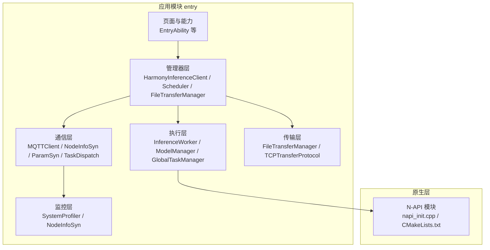
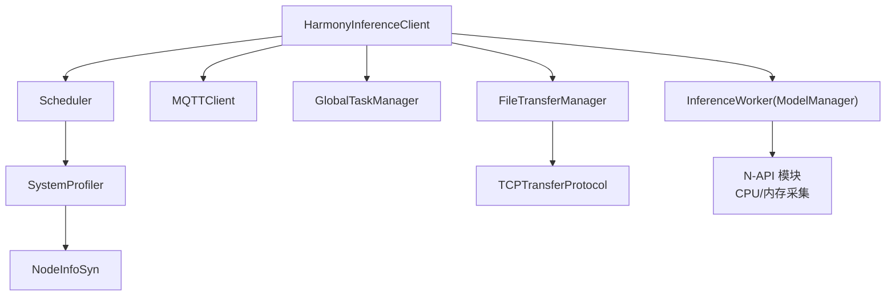
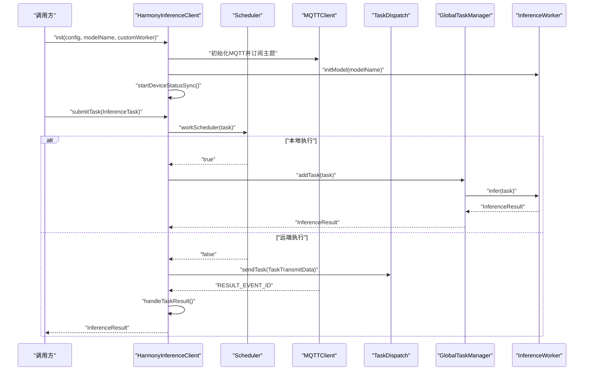
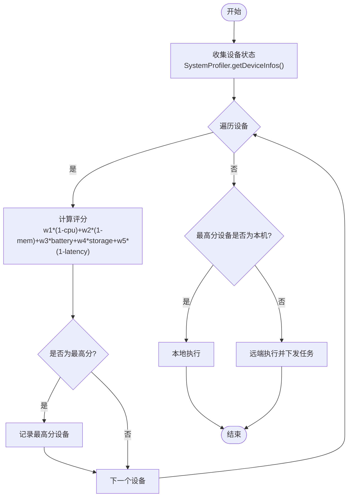
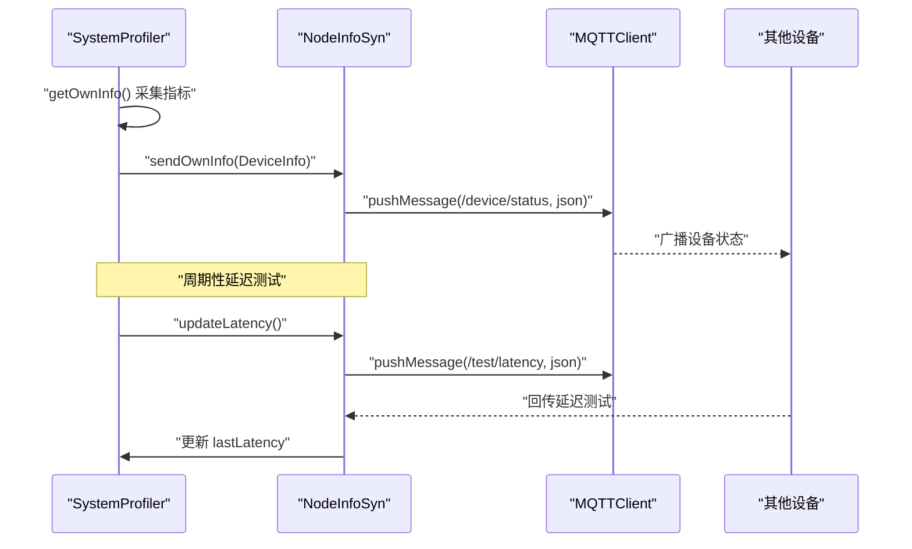
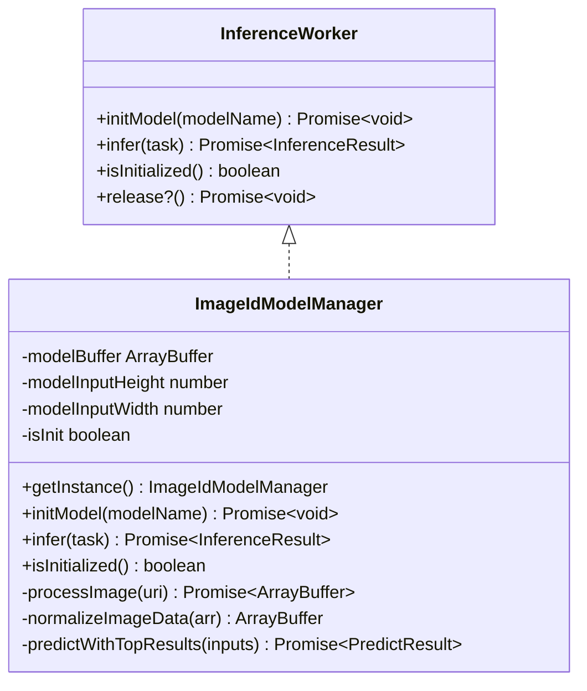
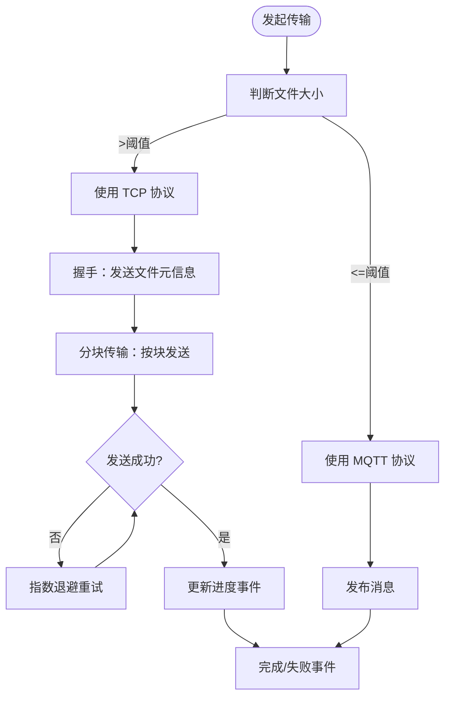
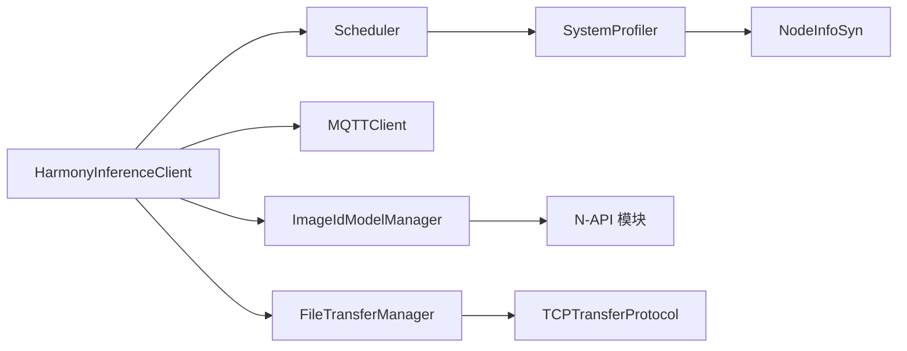

# 整体架构图和设计理念

<cite>
**本文引用的文件**
- [entry/src/main/module.json5](file://entry/src/main/module.json5)
- [entry/build-profile.json5](file://entry/build-profile.json5)
- [hvigorfile.ts](file://hvigorfile.ts)
- [entry/src/main/cpp/CMakeLists.txt](file://entry/src/main/cpp/CMakeLists.txt)
- [entry/src/main/cpp/napi_init.cpp](file://entry/src/main/cpp/napi_init.cpp)
- [entry/src/main/ets/manager/HarmonyInferenceClient.ets](file://entry/src/main/ets/manager/HarmonyInferenceClient.ets)
- [entry/src/main/ets/manager/scheduler/Scheduler.ets](file://entry/src/main/ets/manager/scheduler/Scheduler.ets)
- [entry/src/main/ets/manager/broker/MQTTClient.ets](file://entry/src/main/ets/manager/broker/MQTTClient.ets)
- [entry/src/main/ets/manager/monitor/SystemProfiler.ets](file://entry/src/main/ets/manager/monitor/SystemProfiler.ets)
- [entry/src/main/ets/manager/broker/monitor/NodeInfoSyn.ets](file://entry/src/main/ets/manager/broker/monitor/NodeInfoSyn.ets)
- [entry/src/main/ets/manager/worker/InferenceWorker.ets](file://entry/src/main/ets/manager/worker/InferenceWorker.ets)
- [entry/src/main/ets/TestImageTask/ImageIdModelManager.ets](file://entry/src/main/ets/TestImageTask/ImageIdModelManager.ets)
- [entry/src/main/ets/manager/transfer/FileTransferManager.ets](file://entry/src/main/ets/manager/transfer/FileTransferManager.ets)
- [entry/src/main/ets/manager/transfer/protocol/TCPTransferProtocol.ets](file://entry/src/main/ets/manager/transfer/protocol/TCPTransferProtocol.ets)
</cite>

## 目录
1. [简介](#简介)
2. [项目结构](#项目结构)
3. [核心组件](#核心组件)
4. [架构总览](#架构总览)
5. [详细组件分析](#详细组件分析)
6. [依赖关系分析](#依赖关系分析)
7. [性能考量](#性能考量)
8. [故障排查指南](#故障排查指南)
9. [结论](#结论)
10. [附录](#附录)

## 简介
OH_Co3 是一个面向 OpenHarmony 的分布式推理系统，旨在通过设备间协同实现跨设备的智能推理任务分配与执行。系统围绕“设备状态感知—任务调度—跨设备通信—本地/远端执行”的闭环展开，结合 MQTT 与 TCP 协议实现低延迟、高可靠的任务分发与数据传输，并通过系统性能采集与参数优化实现动态调度决策。

## 项目结构
项目采用 OpenHarmony Stage 模式工程组织，前端以 ArkTS/ETS 为主，配合 C/C++ NAPI 模块进行系统信息采集，构建模块化、可扩展的推理与通信子系统。

图表来源
- [entry/src/main/module.json5](file://entry/src/main/module.json5#L1-L86)
- [entry/build-profile.json5](file://entry/build-profile.json5#L1-L39)
- [hvigorfile.ts](file://hvigorfile.ts#L1-L7)
- [entry/src/main/cpp/CMakeLists.txt](file://entry/src/main/cpp/CMakeLists.txt#L1-L13)
- [entry/src/main/cpp/napi_init.cpp](file://entry/src/main/cpp/napi_init.cpp#L1-L31)

章节来源
- [entry/src/main/module.json5](file://entry/src/main/module.json5#L1-L86)
- [entry/build-profile.json5](file://entry/build-profile.json5#L1-L39)
- [hvigorfile.ts](file://hvigorfile.ts#L1-L7)

## 核心组件
- HarmonyInferenceClient：系统入口与编排者，负责初始化 MQTT、事件监听、任务提交与结果聚合。
- Scheduler：基于设备状态与参数权重的评分调度器，决定任务本地执行或远端下发。
- MQTTClient：统一的 MQTT 客户端，订阅/发布多主题，桥接设备间消息。
- SystemProfiler/NodeInfoSyn：设备状态采集与同步，包括 CPU、内存、存储、电量、延迟等。
- InferenceWorker/ModelManager：推理执行抽象与默认图像识别实现，支持多种输入类型。
- FileTransferManager/TCPTransferProtocol：文件传输管理与 TCP 分块传输协议实现。
- N-API 模块：提供 CPU/内存使用率采集，供系统性能监控使用。

章节来源
- [entry/src/main/ets/manager/HarmonyInferenceClient.ets](file://entry/src/main/ets/manager/HarmonyInferenceClient.ets#L1-L357)
- [entry/src/main/ets/manager/scheduler/Scheduler.ets](file://entry/src/main/ets/manager/scheduler/Scheduler.ets#L1-L105)
- [entry/src/main/ets/manager/broker/MQTTClient.ets](file://entry/src/main/ets/manager/broker/MQTTClient.ets#L1-L223)
- [entry/src/main/ets/manager/monitor/SystemProfiler.ets](file://entry/src/main/ets/manager/monitor/SystemProfiler.ets#L1-L120)
- [entry/src/main/ets/manager/broker/monitor/NodeInfoSyn.ets](file://entry/src/main/ets/manager/broker/monitor/NodeInfoSyn.ets#L1-L173)
- [entry/src/main/ets/manager/worker/InferenceWorker.ets](file://entry/src/main/ets/manager/worker/InferenceWorker.ets#L1-L90)
- [entry/src/main/ets/TestImageTask/ImageIdModelManager.ets](file://entry/src/main/ets/TestImageTask/ImageIdModelManager.ets#L1-L258)
- [entry/src/main/ets/manager/transfer/FileTransferManager.ets](file://entry/src/main/ets/manager/transfer/FileTransferManager.ets#L1-L375)
- [entry/src/main/ets/manager/transfer/protocol/TCPTransferProtocol.ets](file://entry/src/main/ets/manager/transfer/protocol/TCPTransferProtocol.ets#L1-L351)
- [entry/src/main/cpp/napi_init.cpp](file://entry/src/main/cpp/napi_init.cpp#L1-L31)

## 架构总览
系统采用“集中编排 + 分布式执行”的架构设计，核心理念如下：
- 设备协同：通过 MQTT 主题广播设备状态与参数，形成全网设备画像。
- 动态调度：依据评分函数（CPU/内存/电量/存储/延迟）选择最优节点。
- 低耦合：通信、调度、执行、传输解耦，便于替换与扩展。
- 可观测：系统状态采集与事件驱动，便于监控与诊断。
- 性能优先：大文件传输采用 TCP 分块，小数据走 MQTT，兼顾吞吐与实时性。

图表来源
- [entry/src/main/ets/manager/HarmonyInferenceClient.ets](file://entry/src/main/ets/manager/HarmonyInferenceClient.ets#L52-L357)
- [entry/src/main/ets/manager/scheduler/Scheduler.ets](file://entry/src/main/ets/manager/scheduler/Scheduler.ets#L14-L105)
- [entry/src/main/ets/manager/broker/MQTTClient.ets](file://entry/src/main/ets/manager/broker/MQTTClient.ets#L24-L223)
- [entry/src/main/ets/manager/monitor/SystemProfiler.ets](file://entry/src/main/ets/manager/monitor/SystemProfiler.ets#L43-L120)
- [entry/src/main/ets/manager/broker/monitor/NodeInfoSyn.ets](file://entry/src/main/ets/manager/broker/monitor/NodeInfoSyn.ets#L40-L173)
- [entry/src/main/ets/manager/worker/InferenceWorker.ets](file://entry/src/main/ets/manager/worker/InferenceWorker.ets#L75-L90)
- [entry/src/main/ets/TestImageTask/ImageIdModelManager.ets](file://entry/src/main/ets/TestImageTask/ImageIdModelManager.ets#L31-L258)
- [entry/src/main/ets/manager/transfer/FileTransferManager.ets](file://entry/src/main/ets/manager/transfer/FileTransferManager.ets#L17-L375)
- [entry/src/main/ets/manager/transfer/protocol/TCPTransferProtocol.ets](file://entry/src/main/ets/manager/transfer/protocol/TCPTransferProtocol.ets#L23-L351)
- [entry/src/main/cpp/napi_init.cpp](file://entry/src/main/cpp/napi_init.cpp#L6-L30)

## 详细组件分析

### 1) 推理客户端与任务生命周期
HarmonyInferenceClient 作为系统入口，负责：
- 初始化 MQTT 客户端与事件监听
- 初始化模型与全局任务队列
- 启动设备状态同步
- 提交任务并通过调度器决定本地/远端执行
- 等待远端结果并聚合返回

图表来源
- [entry/src/main/ets/manager/HarmonyInferenceClient.ets](file://entry/src/main/ets/manager/HarmonyInferenceClient.ets#L163-L353)
- [entry/src/main/ets/manager/scheduler/Scheduler.ets](file://entry/src/main/ets/manager/scheduler/Scheduler.ets#L30-L103)
- [entry/src/main/ets/manager/broker/MQTTClient.ets](file://entry/src/main/ets/manager/broker/MQTTClient.ets#L148-L182)
- [entry/src/main/ets/manager/worker/GlobalTaskManager.ets](file://entry/src/main/ets/manager/worker/GlobalTaskManager.ets#L8-L21)
- [entry/src/main/ets/manager/worker/InferenceWorker.ets](file://entry/src/main/ets/manager/worker/InferenceWorker.ets#L75-L90)

章节来源
- [entry/src/main/ets/manager/HarmonyInferenceClient.ets](file://entry/src/main/ets/manager/HarmonyInferenceClient.ets#L52-L357)

### 2) 调度器与评分机制
调度器基于设备状态与参数权重计算综合评分，选择最优节点执行任务。评分函数包含 CPU、内存、电量、存储、延迟等维度，权重由参数同步模块下发。

图表来源
- [entry/src/main/ets/manager/scheduler/Scheduler.ets](file://entry/src/main/ets/manager/scheduler/Scheduler.ets#L30-L103)
- [entry/src/main/ets/manager/monitor/SystemProfiler.ets](file://entry/src/main/ets/manager/monitor/SystemProfiler.ets#L43-L118)
- [entry/src/main/ets/manager/broker/monitor/NodeInfoSyn.ets](file://entry/src/main/ets/manager/broker/monitor/NodeInfoSyn.ets#L100-L170)

章节来源
- [entry/src/main/ets/manager/scheduler/Scheduler.ets](file://entry/src/main/ets/manager/scheduler/Scheduler.ets#L14-L105)

### 3) 设备状态采集与同步
SystemProfiler 采集本机 CPU、内存、存储、电量、延迟等指标，并通过 NodeInfoSyn 同步到 MQTT 网络，供调度器使用；同时周期性发起延迟测试，更新本地延迟估计。

图表来源
- [entry/src/main/ets/manager/monitor/SystemProfiler.ets](file://entry/src/main/ets/manager/monitor/SystemProfiler.ets#L71-L118)
- [entry/src/main/ets/manager/broker/monitor/NodeInfoSyn.ets](file://entry/src/main/ets/manager/broker/monitor/NodeInfoSyn.ets#L63-L170)
- [entry/src/main/ets/manager/broker/MQTTClient.ets](file://entry/src/main/ets/manager/broker/MQTTClient.ets#L125-L145)

章节来源
- [entry/src/main/ets/manager/monitor/SystemProfiler.ets](file://entry/src/main/ets/manager/monitor/SystemProfiler.ets#L1-L120)
- [entry/src/main/ets/manager/broker/monitor/NodeInfoSyn.ets](file://entry/src/main/ets/manager/broker/monitor/NodeInfoSyn.ets#L1-L173)

### 4) 推理执行与模型管理
InferenceWorker 抽象了推理接口，ImageIdModelManager 提供默认图像识别实现，支持图片预处理、归一化与 Top-K 结果提取。

图表来源
- [entry/src/main/ets/manager/worker/InferenceWorker.ets](file://entry/src/main/ets/manager/worker/InferenceWorker.ets#L75-L90)
- [entry/src/main/ets/TestImageTask/ImageIdModelManager.ets](file://entry/src/main/ets/TestImageTask/ImageIdModelManager.ets#L31-L258)

章节来源
- [entry/src/main/ets/manager/worker/InferenceWorker.ets](file://entry/src/main/ets/manager/worker/InferenceWorker.ets#L1-L90)
- [entry/src/main/ets/TestImageTask/ImageIdModelManager.ets](file://entry/src/main/ets/TestImageTask/ImageIdModelManager.ets#L1-L258)

### 5) 文件传输与协议选择
FileTransferManager 根据文件大小自动选择协议：大文件走 TCP 分块，小文件走 MQTT。TCPTransferProtocol 提供握手、分块、重试、进度上报与完成确认。

图表来源
- [entry/src/main/ets/manager/transfer/FileTransferManager.ets](file://entry/src/main/ets/manager/transfer/FileTransferManager.ets#L105-L240)
- [entry/src/main/ets/manager/transfer/protocol/TCPTransferProtocol.ets](file://entry/src/main/ets/manager/transfer/protocol/TCPTransferProtocol.ets#L123-L205)

章节来源
- [entry/src/main/ets/manager/transfer/FileTransferManager.ets](file://entry/src/main/ets/manager/transfer/FileTransferManager.ets#L1-L375)
- [entry/src/main/ets/manager/transfer/protocol/TCPTransferProtocol.ets](file://entry/src/main/ets/manager/transfer/protocol/TCPTransferProtocol.ets#L1-L351)

### 6) OpenHarmony 平台适配与资源管理
- 权限与页面：模块声明包含权限申请与页面配置，覆盖 Wi-Fi、定位、蓝牙、网络访问等场景。
- 构建配置：Stage Mode、ArkTS 编译优化、外部原生 ABI 过滤（arm64-v8a）、混淆规则。
- 原生集成：通过 N-API 暴露 CPU/内存采集接口，供系统性能监控使用。
- 资源管理：文件系统空间统计、电量信息、并发任务池执行系统采集任务，避免阻塞主线程。

章节来源
- [entry/src/main/module.json5](file://entry/src/main/module.json5#L36-L84)
- [entry/build-profile.json5](file://entry/build-profile.json5#L2-L30)
- [entry/src/main/cpp/CMakeLists.txt](file://entry/src/main/cpp/CMakeLists.txt#L1-L13)
- [entry/src/main/cpp/napi_init.cpp](file://entry/src/main/cpp/napi_init.cpp#L6-L30)
- [entry/src/main/ets/manager/monitor/SystemProfiler.ets](file://entry/src/main/ets/manager/monitor/SystemProfiler.ets#L34-L118)

## 依赖关系分析
- 组件内聚：管理器层（HarmonyInferenceClient、Scheduler、FileTransferManager）职责清晰，内部协作紧密。
- 组件耦合：通过事件与主题解耦，MQTTClient 作为通信中枢，避免模块间直接耦合。
- 外部依赖：MQTT SDK、OpenHarmony 性能分析 Kit、文件系统统计、多媒体图像处理等。

图表来源
- [entry/src/main/ets/manager/HarmonyInferenceClient.ets](file://entry/src/main/ets/manager/HarmonyInferenceClient.ets#L1-L357)
- [entry/src/main/ets/manager/scheduler/Scheduler.ets](file://entry/src/main/ets/manager/scheduler/Scheduler.ets#L1-L105)
- [entry/src/main/ets/manager/broker/MQTTClient.ets](file://entry/src/main/ets/manager/broker/MQTTClient.ets#L1-L223)
- [entry/src/main/ets/manager/monitor/SystemProfiler.ets](file://entry/src/main/ets/manager/monitor/SystemProfiler.ets#L1-L120)
- [entry/src/main/ets/manager/broker/monitor/NodeInfoSyn.ets](file://entry/src/main/ets/manager/broker/monitor/NodeInfoSyn.ets#L1-L173)
- [entry/src/main/ets/TestImageTask/ImageIdModelManager.ets](file://entry/src/main/ets/TestImageTask/ImageIdModelManager.ets#L1-L258)
- [entry/src/main/ets/manager/transfer/FileTransferManager.ets](file://entry/src/main/ets/manager/transfer/FileTransferManager.ets#L1-L375)
- [entry/src/main/ets/manager/transfer/protocol/TCPTransferProtocol.ets](file://entry/src/main/ets/manager/transfer/protocol/TCPTransferProtocol.ets#L1-L351)
- [entry/src/main/cpp/napi_init.cpp](file://entry/src/main/cpp/napi_init.cpp#L1-L31)

## 性能考量
- 任务调度：评分函数动态反映设备负载与网络状况，结合参数同步模块实现自适应优化。
- 传输策略：大文件 TCP 分块 + 重试，小文件 MQTT 直发，兼顾吞吐与实时性。
- 系统采集：并发执行系统指标采集，避免阻塞主线程；N-API 提供轻量级系统信息接口。
- 构建优化：Release 混淆、PGO（注释占位）等提升运行时性能。
- 资源回收：销毁阶段释放 MQTT、Worker、事件监听，降低内存与连接泄漏风险。

## 故障排查指南
- MQTT 连接问题：检查 URL、clientId、用户名密码、订阅主题是否正确；关注连接超时与自动重连配置。
- 任务超时：远端任务默认 30 秒超时，检查网络延迟、目标设备负载与任务处理耗时。
- 传输失败：TCP 分块传输需确认握手、分块大小、重试次数与超时设置；MQTT 传输检查主题与 QoS。
- 模型初始化：确认模型资源加载成功与输入尺寸匹配；图像预处理链路（缩放、裁剪、归一化）。
- 系统采集异常：并发任务池执行系统指标采集，若失败需检查权限与 API 版本兼容性。

章节来源
- [entry/src/main/ets/manager/broker/MQTTClient.ets](file://entry/src/main/ets/manager/broker/MQTTClient.ets#L68-L104)
- [entry/src/main/ets/manager/HarmonyInferenceClient.ets](file://entry/src/main/ets/manager/HarmonyInferenceClient.ets#L328-L353)
- [entry/src/main/ets/manager/transfer/FileTransferManager.ets](file://entry/src/main/ets/manager/transfer/FileTransferManager.ets#L192-L223)
- [entry/src/main/ets/TestImageTask/ImageIdModelManager.ets](file://entry/src/main/ets/TestImageTask/ImageIdModelManager.ets#L45-L53)
- [entry/src/main/ets/manager/monitor/SystemProfiler.ets](file://entry/src/main/ets/manager/monitor/SystemProfiler.ets#L86-L118)

## 结论
OH_Co3 通过“集中编排 + 分布式执行”的架构，实现了跨设备的智能推理协同。系统以 MQTT 为主题总线实现设备互联，以评分调度实现任务最优分配，以协议自适应实现高效数据传输，并以可观测与可扩展的设计支撑后续演进。平台层面充分考虑 OpenHarmony 权限、构建与原生集成，具备良好的可维护性与扩展性。

## 附录
- 架构演进方向建议
  - 参数同步：引入更细粒度的动态权重调整与反馈回路。
  - 任务编排：支持任务依赖图与流水线执行，提升复杂推理工作流效率。
  - 传输增强：TCP 协议完善握手与校验，增加断点续传与速率控制。
  - 监控扩展：增加任务级指标与设备健康度评估，支持自愈与降级策略。
- 关键技术选型理由
  - MQTT：轻量、可靠、易扩展，适合设备间消息广播与命令下发。
  - TCP：面向大文件分块传输，具备重试与进度可控特性。
  - N-API：在 OpenHarmony 上提供系统信息采集的稳定接口。
  - ArkTS/ETS：统一前端开发体验，便于快速迭代与测试。