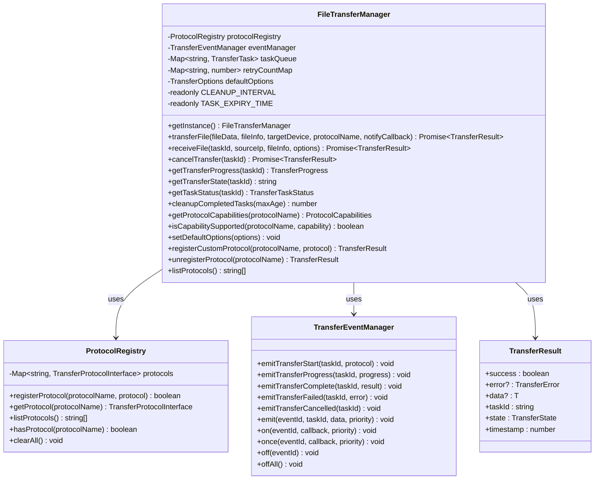
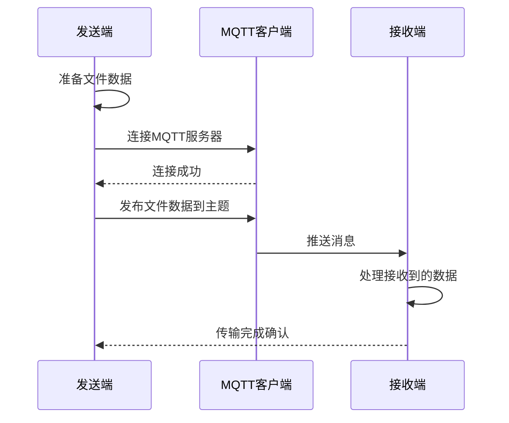
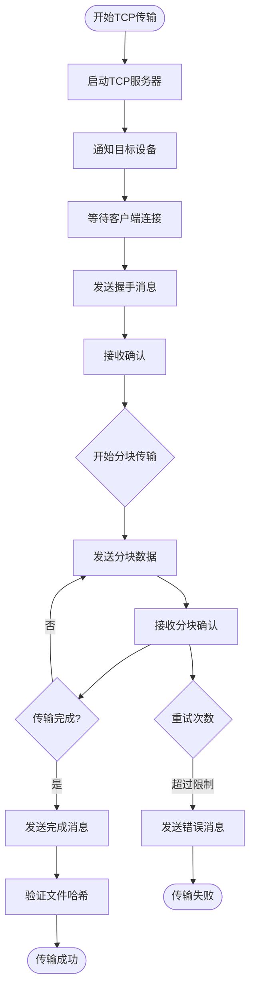
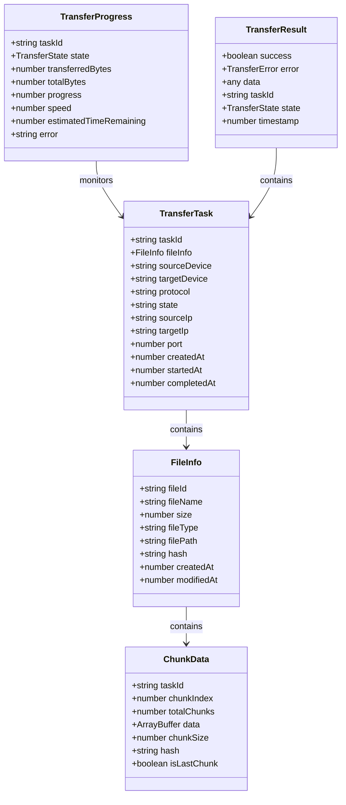
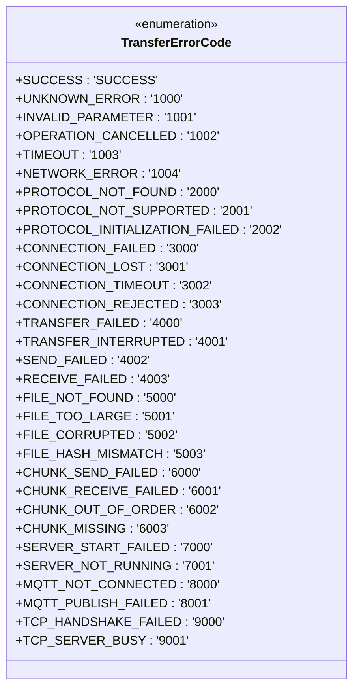
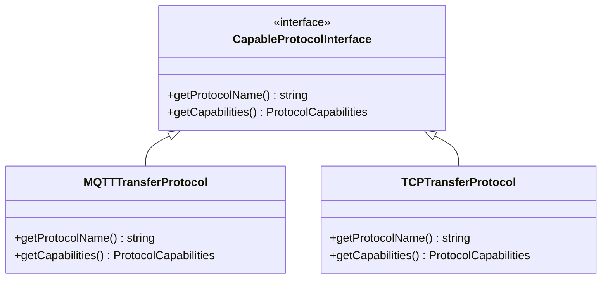
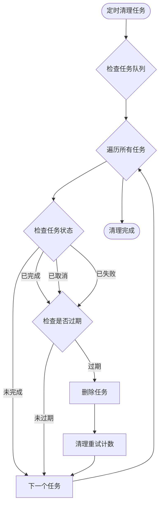
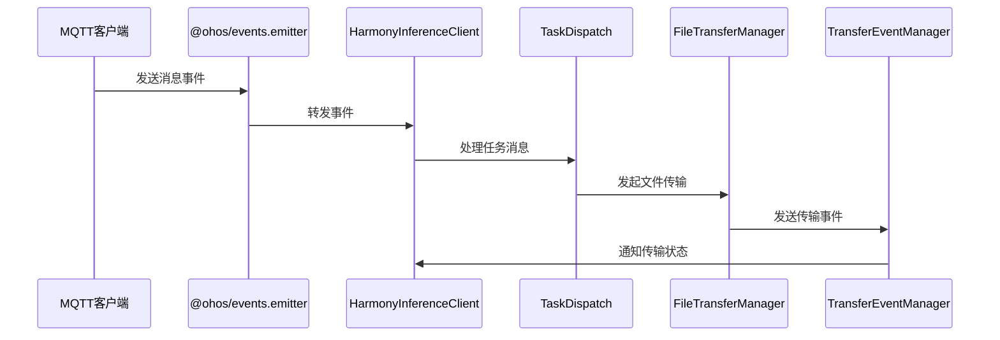

# 文件传输系统

<cite>
**本文档引用的文件**
- [entry\src\main\ets\manager\transfer\index.ets](file://entry\src\main\ets\manager\transfer\index.ets)
- [entry\src\main\ets\manager\transfer\FileTransferManager.ets](file://entry\src\main\ets\manager\transfer\FileTransferManager.ets)
- [entry\src\main\ets\manager\transfer\socket\FileTransferSocketManager.ets](file://entry\src\main\ets\manager\transfer\socket\FileTransferSocketManager.ets)
- [entry\src\main\ets\manager\transfer\model\TransferDataModels.ets](file://entry\src\main\ets\manager\transfer\model\TransferDataModels.ets)
- [entry\src\main\ets\manager\transfer\model\TransferResult.ets](file://entry\src\main\ets\manager\transfer\model\TransferResult.ets)
- [entry\src\main\ets\manager\transfer\protocol\TransferProtocolInterface.ets](file://entry\src\main\ets\manager\transfer\protocol\TransferProtocolInterface.ets)
- [entry\src\main\ets\manager\transfer\protocol\MQTTTransferProtocol.ets](file://entry\src\main\ets\manager\transfer\protocol\MQTTTransferProtocol.ets)
- [entry\src\main\ets\manager\transfer\protocol\TCPTransferProtocol.ets](file://entry\src\main\ets\manager\transfer\protocol\TCPTransferProtocol.ets)
- [entry\src\main\ets\manager\transfer\protocol\ProtocolRegistry.ets](file://entry\src\main\ets\manager\transfer\protocol\ProtocolRegistry.ets)
- [entry\src\main\ets\manager\transfer\event\TransferEvents.ets](file://entry\src\main\ets\manager\transfer\event\TransferEvents.ets)
- [entry\src\main\ets\manager\transfer\utils\FileUtils.ets](file://entry\src\main\ets\manager\transfer\utils\FileUtils.ets)
- [entry\src\main\ets\manager\transfer\utils\NetworkUtils.ets](file://entry\src\main\ets\manager\transfer\utils\NetworkUtils.ets)
- [entry\src\main\ets\manager\transfer\model\TCPModels.ets](file://entry\src\main\ets\manager\transfer\model\TCPModels.ets)
- [entry\src\main\ets\manager\transfer\utils\CommonUtils.ets](file://entry\src\main\ets\manager\transfer\utils\CommonUtils.ets)
- [entry\src\main\ets\manager\broker\task\TaskDispatch.ets](file://entry\src\main\ets\manager\broker\task\TaskDispatch.ets)
- [entry\src\main\ets\manager\broker\MQTTClient.ets](file://entry\src\main\ets\manager\broker\MQTTClient.ets)
- [entry\src\main\ets\manager\HarmonyInferenceClient.ets](file://entry\src\main\ets\manager\HarmonyInferenceClient.ets)
- [entry\src\main\ets\pages\tabs\BrokerScreen.ets](file://entry\src\main\ets\pages\tabs\BrokerScreen.ets)
- [entry\src\main\ets\pages\tabs\PerformanceScreen.ets](file://entry\src\main\ets\pages\tabs\PerformanceScreen.ets)
</cite>

## 更新摘要
**变更内容**
- 移除了旧的 IMPLEMENTATION_SUMMARY.md 文件引用
- 更新架构文档以反映新的事件驱动架构和性能优化
- 新增了基于 @ohos/events.emitter 的统一事件系统
- 增强了文件传输系统的事件驱动能力和性能监控
- 更新了任务调度与文件传输的集成架构

## 目录
1. [项目概述](#项目概述)
2. [项目结构](#项目结构)
3. [核心组件](#核心组件)
4. [架构概览](#架构概览)
5. [详细组件分析](#详细组件分析)
6. [统一结果类型系统](#统一结果类型系统)
7. [协议能力查询机制](#协议能力查询机制)
8. [自动任务清理机制](#自动任务清理机制)
9. [事件驱动架构](#事件驱动架构)
10. [性能监控与优化](#性能监控与优化)
11. [依赖关系分析](#依赖关系分析)
12. [故障排除指南](#故障排除指南)
13. [结论](#结论)

## 项目概述

文件传输系统是一个基于OpenHarmony平台开发的跨设备文件传输解决方案。该系统采用了全新的事件驱动架构，提供了多种传输协议支持，包括基于MQTT的小文件传输和基于TCP的大文件分块传输，能够满足不同场景下的文件传输需求。

### 主要特性

- **统一结果类型系统**：全新的TransferResult接口，提供一致的传输结果结构
- **协议能力查询**：支持动态查询协议功能特性和能力
- **自动任务清理**：定时清理已完成的传输任务，防止内存泄漏
- **多协议支持**：同时支持MQTT和TCP两种传输协议
- **智能协议选择**：根据文件大小自动选择合适的传输协议
- **分块传输**：支持大文件的分块传输和断点续传
- **事件驱动**：完整的事件系统用于传输状态监控
- **统一管理**：集中式的文件传输管理器
- **工具类支持**：提供文件处理、网络工具等辅助功能
- **动态协议注册**：支持运行时注册和注销自定义协议
- **增强连接管理**：完整的TCP连接生命周期管理
- **性能监控**：集成系统性能监控和优化
- **事件驱动架构**：基于 @ohos/events.emitter 的统一事件系统

## 项目结构

文件传输系统采用模块化的架构设计，主要分为以下几个核心模块：

```mermaid
graph TB
subgraph "传输管理模块"
A[FileTransferManager]
B[ProtocolRegistry]
C[TransferResult系统]
D[TransferEventManager]
end
subgraph "协议实现模块"
E[MQTTTransferProtocol]
F[TCPTransferProtocol]
G[CapableProtocolInterface]
end
subgraph "Socket管理模块"
H[FileTransferSocketManager]
end
subgraph "数据模型模块"
I[TransferDataModels]
J[TCPModels]
K[TransferResult]
L[ProtocolCapabilities]
end
subgraph "工具类模块"
M[FileUtils]
N[NetworkUtils]
O[CommonUtils]
end
subgraph "事件系统模块"
P[TransferEvents]
Q[@ohos/events.emitter]
end
subgraph "任务调度模块"
R[TaskDispatch]
S[HarmonyInferenceClient]
T[MQTTClient]
end
A --> B
A --> C
A --> D
A --> E
A --> F
E --> G
F --> G
F --> H
E --> M
F --> M
F --> N
A --> I
F --> J
A --> K
A --> L
A --> P
P --> Q
R --> A
S --> R
S --> T
```

**图表来源**
- [entry\src\main\ets\manager\transfer\index.ets:1-94](file://entry\src\main\ets\manager\transfer\index.ets#L1-L94)
- [entry\src\main\ets\manager\transfer\FileTransferManager.ets:40-685](file://entry\src\main\ets\manager\transfer\FileTransferManager.ets#L40-L685)
- [entry\src\main\ets\manager\transfer\model\TransferResult.ets:1-275](file://entry\src\main\ets\manager\transfer\model\TransferResult.ets#L1-L275)

**章节来源**
- [entry\src\main\ets\manager\transfer\index.ets:1-94](file://entry\src\main\ets\manager\transfer\index.ets#L1-L94)

## 核心组件

### 文件传输管理器

FileTransferManager是整个文件传输系统的核心控制器，负责统一管理所有文件传输任务。它提供了简洁的API接口，支持多种传输协议的统一管理，并集成了新的统一结果类型系统和事件驱动架构。

#### 主要功能

- **任务管理**：创建、跟踪和管理传输任务
- **协议路由**：根据任务需求选择合适的传输协议
- **状态监控**：实时监控传输进度和状态变化
- **配置管理**：提供灵活的传输配置选项
- **事件分发**：将传输状态变化通知给订阅者
- **自动清理**：定时清理已完成的传输任务
- **能力查询**：查询协议功能特性和支持能力
- **动态协议管理**：支持运行时注册和注销协议
- **事件驱动**：基于统一事件系统的异步处理

#### 关键接口



**图表来源**
- [entry\src\main\ets\manager\transfer\FileTransferManager.ets:40-685](file://entry\src\main\ets\manager\transfer\FileTransferManager.ets#L40-L685)
- [entry\src\main\ets\manager\transfer\protocol\ProtocolRegistry.ets:7-93](file://entry\src\main\ets\manager\transfer\protocol\ProtocolRegistry.ets#L7-L93)
- [entry\src\main\ets\manager\transfer\model\TransferResult.ets:86-137](file://entry\src\main\ets\manager\transfer\model\TransferResult.ets#L86-L137)

**章节来源**
- [entry\src\main\ets\manager\transfer\FileTransferManager.ets:1-685](file://entry\src\main\ets\manager\transfer\FileTransferManager.ets#L1-L685)

### 协议注册中心

ProtocolRegistry实现了传输协议的集中管理，支持协议的动态注册、查找和注销操作。

#### 协议管理功能

- **协议注册**：支持新协议的动态注册
- **协议查找**：根据协议名称快速定位协议实现
- **协议列表**：提供当前所有可用协议的列表
- **协议状态**：监控协议的注册状态和可用性
- **协议清理**：支持清空所有已注册协议

**章节来源**
- [entry\src\main\ets\manager\transfer\protocol\ProtocolRegistry.ets:1-93](file://entry\src\main\ets\manager\transfer\protocol\ProtocolRegistry.ets#L1-L93)

## 架构概览

文件传输系统采用分层架构设计，各层之间职责清晰，耦合度低，便于维护和扩展。新架构引入了统一结果类型系统、协议能力查询机制和基于 @ohos/events.emitter 的事件驱动架构。

```mermaid
graph TB
subgraph "应用层"
UI[用户界面]
API[API接口]
Performance[性能监控界面]
Broker[Broker界面]
end
subgraph "控制层"
FTM[FileTransferManager]
PR[ProtocolRegistry]
TEM[TransferEventManager]
TRS[TransferResult系统]
TD[TaskDispatch]
HIC[HarmonyInferenceClient]
end
subgraph "协议层"
MQTT[MQTTTransferProtocol]
TCP[TCPTransferProtocol]
CPI[CapableProtocolInterface]
end
subgraph "传输层"
FSM[FileTransferSocketManager]
TCPModels[TCPModels]
end
subgraph "工具层"
FU[FileUtils]
NU[NetworkUtils]
CU[CommonUtils]
end
subgraph "事件层"
TE[TransferEvents]
EM[@ohos/events.emitter]
MQTTClient[MQTTClient]
end
subgraph "数据层"
TDM[TransferDataModels]
TR[TransferResult]
PC[ProtocolCapabilities]
end
UI --> API
API --> FTM
FTM --> PR
FTM --> TEM
FTM --> TRS
PR --> MQTT
PR --> TCP
PR --> CPI
TCP --> FSM
MQTT --> FU
TCP --> FU
TCP --> NU
FTM --> TDM
FSM --> TCPModels
TRS --> TR
CPI --> PC
TD --> FTM
HIC --> TD
HIC --> MQTTClient
TEM --> EM
MQTTClient --> EM
Performance --> HIC
Broker --> HIC
```

**图表来源**
- [entry\src\main\ets\manager\transfer\FileTransferManager.ets:1-685](file://entry\src\main\ets\manager\transfer\FileTransferManager.ets#L1-L685)
- [entry\src\main\ets\manager\transfer\protocol\TransferProtocolInterface.ets:158-196](file://entry\src\main\ets\manager\transfer\protocol\TransferProtocolInterface.ets#L158-L196)

## 详细组件分析

### MQTT传输协议

MQTTTransferProtocol专门用于小文件的快速传输，基于现有的MQTT客户端实现，具有以下特点：

#### 设计特点

- **轻量级传输**：适合小文件（≤2MB）的快速传输
- **简单可靠**：利用MQTT的发布/订阅机制实现文件传输
- **低延迟**：相比TCP协议，MQTT传输具有更低的延迟
- **自动重连**：具备自动重连机制，提高传输可靠性
- **能力查询**：支持协议能力查询接口

#### 传输流程



**图表来源**
- [entry\src\main\ets\manager\transfer\protocol\MQTTTransferProtocol.ets:166-200](file://entry\src\main\ets\manager\transfer\protocol\MQTTTransferProtocol.ets#L166-L200)

**章节来源**
- [entry\src\main\ets\manager\transfer\protocol\MQTTTransferProtocol.ets:1-294](file://entry\src\main\ets\manager\transfer\protocol\MQTTTransferProtocol.ets#L1-L294)

### TCP传输协议

TCPTransferProtocol专为大文件传输设计，支持分块传输、断点续传和错误恢复。

#### 核心功能

- **分块传输**：将大文件分割为多个分块进行传输
- **握手协议**：建立可靠的连接和传输协商
- **错误处理**：完善的错误检测和恢复机制
- **进度监控**：实时监控传输进度和状态
- **能力查询**：支持协议能力查询接口
- **服务器模式**：支持作为服务器监听客户端连接
- **客户端模式**：支持作为客户端连接远程服务器

#### 传输协议设计



**图表来源**
- [entry\src\main\ets\manager\transfer\protocol\TCPTransferProtocol.ets:135-200](file://entry\src\main\ets\manager\transfer\protocol\TCPTransferProtocol.ets#L135-L200)

**章节来源**
- [entry\src\main\ets\manager\transfer\protocol\TCPTransferProtocol.ets:1-883](file://entry\src\main\ets\manager\transfer\protocol\TCPTransferProtocol.ets#L1-L883)

### Socket管理器

FileTransferSocketManager负责管理TCP连接的生命周期，提供统一的Socket操作接口。

#### 管理功能

- **连接管理**：创建、维护和销毁TCP连接
- **消息路由**：将接收到的消息路由到对应的处理函数
- **连接池管理**：维护活跃连接的状态和信息
- **监听管理**：管理TCP服务器的监听状态
- **消息回调**：支持按任务ID注册消息回调函数
- **服务器模式**：支持作为服务器监听客户端连接
- **客户端模式**：支持作为客户端连接远程服务器

**章节来源**
- [entry\src\main\ets\manager\transfer\socket\FileTransferSocketManager.ets:1-436](file://entry\src\main\ets\manager\transfer\socket\FileTransferSocketManager.ets#L1-L436)

### 数据模型

系统定义了完整的数据模型体系，用于描述文件传输过程中的各种数据结构。

#### 核心数据模型



**图表来源**
- [entry\src\main\ets\manager\transfer\model\TransferDataModels.ets:10-113](file://entry\src\main\ets\manager\transfer\model\TransferDataModels.ets#L10-L113)
- [entry\src\main\ets\manager\transfer\model\TransferResult.ets:86-137](file://entry\src\main\ets\manager\transfer\model\TransferResult.ets#L86-L137)

**章节来源**
- [entry\src\main\ets\manager\transfer\model\TransferDataModels.ets:1-113](file://entry\src\main\ets\manager\transfer\model\TransferDataModels.ets#L1-L113)

### 工具类

系统提供了丰富的工具类，用于处理文件操作、网络通信等常见任务。

#### 文件处理工具

FileUtils提供了文件相关的各种操作功能：

- **文件分块**：将大文件分割为指定大小的分块
- **文件重组**：将分块数据重新组合为完整文件
- **哈希计算**：计算文件的SHA-256哈希值
- **编码转换**：提供ArrayBuffer与Base64之间的相互转换

#### 网络工具

NetworkUtils提供了网络相关的辅助功能：

- **IP地址获取**：获取设备的IPv4地址
- **网络状态检测**：检测WiFi连接状态
- **网络参数获取**：获取子网掩码、网关等网络信息
- **IP格式验证**：验证IP地址格式的有效性
- **端口验证**：验证端口号的有效性

#### 通用工具

CommonUtils提供了通用的辅助功能：

- **延迟函数**：提供Promise形式的延迟功能
- **唯一ID生成**：生成唯一的任务ID
- **格式化工具**：字节大小和持续时间格式化
- **重试机制**：支持重试的异步操作执行
- **过期清理**：清理过期的Map条目
- **安全执行**：安全地执行异步操作并返回结果

**章节来源**
- [entry\src\main\ets\manager\transfer\utils\FileUtils.ets:1-196](file://entry\src\main\ets\manager\transfer\utils\FileUtils.ets#L1-L196)
- [entry\src\main\ets\manager\transfer\utils\NetworkUtils.ets:1-131](file://entry\src\main\ets\manager\transfer\utils\NetworkUtils.ets#L1-L131)
- [entry\src\main\ets\manager\transfer\utils\CommonUtils.ets:1-226](file://entry\src\main\ets\manager\transfer\utils\CommonUtils.ets#L1-L226)

## 统一结果类型系统

### TransferResult接口设计

新的TransferResult系统提供了统一的传输结果结构，确保所有传输操作都有标准化的返回格式。

#### 错误码体系

系统定义了完整的错误码枚举，涵盖所有可能的传输错误类型：



**图表来源**
- [entry\src\main\ets\manager\transfer\model\TransferResult.ets:13-64](file://entry\src\main\ets\manager\transfer\model\TransferResult.ets#L13-L64)

#### 核心接口

- **TransferResult<T>**：通用传输结果接口，支持泛型返回数据
- **TransferError**：统一错误信息接口，包含错误码、消息和时间戳
- **FileTransferCompleteResult**：文件传输完成结果，包含统计信息
- **TransferTaskStatus**：传输任务状态信息，用于查询任务详情

#### 工具函数

系统提供了多个工具函数来简化结果处理：

- **createSuccessResult**：创建成功的传输结果
- **createErrorResult**：创建失败的传输结果
- **createTransferError**：创建统一的传输错误对象
- **errorFromException**：从异常对象创建传输错误
- **getDefaultErrorMessage**：获取错误码对应的默认消息

**章节来源**
- [entry\src\main\ets\manager\transfer\model\TransferResult.ets:1-275](file://entry\src\main\ets\manager\transfer\model\TransferResult.ets#L1-L275)

## 协议能力查询机制

### CapableProtocolInterface接口

新的CapableProtocolInterface接口扩展了标准协议接口，增加了协议能力查询功能。

#### 能力定义

ProtocolCapabilities接口定义了协议支持的功能特性：

- **supportsLargeFiles**：是否支持大文件传输
- **maxFileSize**：最大支持文件大小（字节），0表示无限制
- **supportsChunking**：是否支持分块传输
- **defaultChunkSize**：默认分块大小（字节）
- **supportsResume**：是否支持断点续传
- **supportsProgress**：是否支持传输进度回调
- **supportsCancellation**：是否支持取消传输
- **requiresActiveConnection**：是否需要目标设备主动连接

#### 能力查询实现

FileTransferManager提供了两个关键方法来查询协议能力：

- **getProtocolCapabilities**：获取协议的完整能力信息
- **isCapabilitySupported**：检查协议是否支持特定功能

#### 协议实现示例



**图表来源**
- [entry\src\main\ets\manager\transfer\protocol\TransferProtocolInterface.ets:184-196](file://entry\src\main\ets\manager\transfer\protocol\TransferProtocolInterface.ets#L184-L196)
- [entry\src\main\ets\manager\transfer\protocol\MQTTTransferProtocol.ets:84-96](file://entry\src\main\ets\manager\transfer\protocol\MQTTTransferProtocol.ets#L84-L96)
- [entry\src\main\ets\manager\transfer\protocol\TCPTransferProtocol.ets:118-130](file://entry\src\main\ets\manager\transfer\protocol\TCPTransferProtocol.ets#L118-L130)

**章节来源**
- [entry\src\main\ets\manager\transfer\protocol\TransferProtocolInterface.ets:158-196](file://entry\src\main\ets\manager\transfer\protocol\TransferProtocolInterface.ets#L158-L196)
- [entry\src\main\ets\manager\transfer\protocol\MQTTTransferProtocol.ets:28-37](file://entry\src\main\ets\manager\transfer\protocol\MQTTTransferProtocol.ets#L28-L37)
- [entry\src\main\ets\manager\transfer\protocol\TCPTransferProtocol.ets:73-82](file://entry\src\main\ets\manager\transfer\protocol\TCPTransferProtocol.ets#L73-L82)

## 自动任务清理机制

### 定时清理功能

FileTransferManager实现了自动任务清理机制，防止已完成传输任务占用内存资源。

#### 清理策略

- **清理间隔**：每小时执行一次清理任务
- **过期时间**：任务在1小时后自动过期
- **清理条件**：仅清理已完成、已取消或已失败的任务
- **同步清理**：同时清理任务队列和重试计数映射

#### 清理实现



**图表来源**
- [entry\src\main\ets\manager\transfer\FileTransferManager.ets:560-584](file://entry\src\main\ets\manager\transfer\FileTransferManager.ets#L560-L584)

#### 清理方法

- **cleanupCompletedTasks**：清理指定过期时间内的已完成任务
- **startCleanupTask**：启动定时清理任务
- **CLEANUP_INTERVAL**：清理任务间隔（1小时）
- **TASK_EXPIRY_TIME**：任务过期时间（1小时）

**章节来源**
- [entry\src\main\ets\manager\transfer\FileTransferManager.ets:113-117](file://entry\src\main\ets\manager\transfer\FileTransferManager.ets#L113-L117)
- [entry\src\main\ets\manager\transfer\FileTransferManager.ets:560-584](file://entry\src\main\ets\manager\transfer\FileTransferManager.ets#L560-L584)

## 事件驱动架构

### TransferEvents事件系统

系统采用了基于 @ohos/events.emitter 的统一事件驱动架构，实现了模块间的解耦通信。

#### 事件类型定义

TransferEventId枚举定义了所有可用的传输事件：

- **TRANSFER_START**：传输开始事件
- **TRANSFER_PROGRESS**：传输进度更新事件
- **TRANSFER_COMPLETE**：传输完成事件
- **TRANSFER_FAILED**：传输失败事件
- **TRANSFER_CANCELLED**：传输取消事件
- **TCP_CONNECTED**：TCP连接建立事件
- **TCP_DISCONNECTED**：TCP连接断开事件
- **CHUNK_RECEIVED**：文件分块接收事件
- **FILE_REASSEMBLED**：文件重组完成事件
- **PROTOCOL_REGISTERED**：协议注册事件
- **PROTOCOL_UNREGISTERED**：协议注销事件

#### 事件管理器

TransferEventManager提供了完整的事件管理功能：

- **事件发送**：emit()方法发送指定类型的事件
- **事件监听**：on()和once()方法注册事件监听器
- **事件移除**：off()和offAll()方法移除事件监听
- **事件优先级**：支持不同优先级的事件处理

#### 事件数据结构

系统定义了多种事件数据接口：

- **TransferEventData**：通用事件数据结构
- **TransferStartEventData**：传输开始事件数据
- **TransferProgressEventData**：传输进度事件数据
- **TransferCompleteEventData**：传输完成事件数据
- **TransferFailedEventData**：传输失败事件数据
- **ProtocolEventData**：协议事件数据

**章节来源**
- [entry\src\main\ets\manager\transfer\event\TransferEvents.ets:1-308](file://entry\src\main\ets\manager\transfer\event\TransferEvents.ets#L1-L308)

### 任务调度与事件集成

TaskDispatch类集成了事件驱动架构，实现了任务的智能调度和传输协调。

#### 事件驱动的任务调度

- **事件监听**：监听MQTT推送的任务分配事件
- **智能决策**：根据文件大小选择合适的传输协议
- **事件通知**：通过事件系统通知传输状态变化
- **结果回传**：通过事件系统回传任务执行结果

#### 传输通知机制

- **TCP服务器就绪通知**：通过notifyCallback通知目标设备
- **事件转发**：将传输事件转发到上层应用
- **状态同步**：通过事件系统同步传输状态

**章节来源**
- [entry\src\main\ets\manager\broker\task\TaskDispatch.ets:1-319](file://entry\src\main\ets\manager\broker\task\TaskDispatch.ets#L1-L319)

### MQTT客户端事件集成

MQTTClient类通过事件系统实现了消息的异步处理。

#### 事件定义

- **EVENTID**：1001 - 通用消息事件
- **RESULT_EVENT_ID**：1002 - 任务结果事件

#### 事件处理流程



**图表来源**
- [entry\src\main\ets\manager\broker\MQTTClient.ets:12-223](file://entry\src\main\ets\manager\broker\MQTTClient.ets#L12-L223)
- [entry\src\main\ets\manager\HarmonyInferenceClient.ets:117-155](file://entry\src\main\ets\manager\HarmonyInferenceClient.ets#L117-L155)

**章节来源**
- [entry\src\main\ets\manager\broker\MQTTClient.ets:1-223](file://entry\src\main\ets\manager\broker\MQTTClient.ets#L1-L223)
- [entry\src\main\ets\manager\HarmonyInferenceClient.ets:110-309](file://entry\src\main\ets\manager\HarmonyInferenceClient.ets#L110-L309)

## 性能监控与优化

### 性能监控集成

系统集成了性能监控功能，通过PerformanceScreen界面提供实时的系统状态监控。

#### 监控指标

- **CPU占用率**：实时显示设备CPU使用情况
- **内存占用率**：监控内存使用状态
- **存储空间**：显示可用存储空间
- **电池状态**：监控设备电池电量

#### 性能优化策略

- **事件优先级管理**：通过事件优先级优化处理顺序
- **异步处理**：所有网络操作采用异步方式
- **连接池管理**：TCP连接采用连接池复用
- **内存管理**：合理的内存使用和清理机制

### 事件驱动的性能优化

基于事件驱动架构的性能优化：

- **解耦通信**：模块间通过事件解耦，提高响应性能
- **异步处理**：事件驱动的异步处理机制
- **资源复用**：事件监听器的统一管理
- **性能分析**：通过事件系统收集性能数据

**章节来源**
- [entry\src\main\ets\pages\tabs\PerformanceScreen.ets:1-204](file://entry\src\main\ets\pages\tabs\PerformanceScreen.ets#L1-L204)

## 依赖关系分析

文件传输系统的依赖关系清晰，遵循了单一职责原则和依赖倒置原则。

```mermaid
graph TB
subgraph "外部依赖"
OHOS[OpenHarmony系统API]
NetworkKit[NetworkKit]
BasicServicesKit[BasicServicesKit]
CryptoArchitectureKit[CryptoArchitectureKit]
EventsEmitter[Events Emitter]
MQTTKit[@ohos/mqtt]
PerformanceAnalysisKit[PerformanceAnalysisKit]
end
subgraph "内部模块依赖"
FileTransferManager --> ProtocolRegistry
FileTransferManager --> TransferEventManager
FileTransferManager --> TransferResult
FileTransferManager --> CommonUtils
FileTransferManager --> NetworkUtils
FileTransferManager --> FileUtils
MQTTTransferProtocol --> MQTTClient
MQTTTransferProtocol --> FileUtils
MQTTTransferProtocol --> TransferResult
MQTTTransferProtocol --> CapableProtocolInterface
TCPTransferProtocol --> FileTransferSocketManager
TCPTransferProtocol --> FileUtils
TCPTransferProtocol --> TransferEventManager
TCPTransferProtocol --> TransferResult
TCPTransferProtocol --> CapableProtocolInterface
FileTransferSocketManager --> NetworkUtils
FileTransferSocketManager --> socket
TransferEventManager --> emitter
TransferResult --> TransferErrorCode
TransferResult --> TransferState
TransferResult --> TransferProgress
CapableProtocolInterface --> ProtocolCapabilities
TaskDispatch --> FileTransferManager
TaskDispatch --> MQTTClient
HarmonyInferenceClient --> TaskDispatch
HarmonyInferenceClient --> MQTTClient
BrokerScreen --> MQTTClient
PerformanceScreen --> SystemProfiler
SystemProfiler --> PerformanceAnalysisKit
```

**图表来源**
- [entry\src\main\ets\manager\transfer\FileTransferManager.ets:5-29](file://entry\src\main\ets\manager\transfer\FileTransferManager.ets#L5-L29)
- [entry\src\main\ets\manager\transfer\socket\FileTransferSocketManager.ets:5-7](file://entry\src\main\ets\manager\transfer\socket\FileTransferSocketManager.ets#L5-L7)
- [entry\src\main\ets\manager\transfer\model\TransferResult.ets:6-7](file://entry\src\main\ets\manager\transfer\model\TransferResult.ets#L6-L7)

### 模块间耦合度分析

系统采用了松耦合的设计，主要体现在：

- **接口隔离**：通过TransferProtocolInterface定义协议接口，降低模块间的直接依赖
- **依赖注入**：通过ProtocolRegistry实现协议的动态注册和管理
- **事件驱动**：通过TransferEvents实现模块间的解耦通信
- **工具类独立**：FileUtils和NetworkUtils等工具类独立封装，便于复用
- **统一结果类型**：通过TransferResult统一所有传输操作的返回格式
- **能力查询接口**：通过CapableProtocolInterface提供协议能力查询功能
- **动态协议管理**：通过ProtocolRegistry支持运行时协议注册和注销
- **事件系统解耦**：通过 @ohos/events.emitter 实现模块间的事件通信

**章节来源**
- [entry\src\main\ets\manager\transfer\protocol\TransferProtocolInterface.ets:85-156](file://entry\src\main\ets\manager\transfer\protocol\TransferProtocolInterface.ets#L85-L156)
- [entry\src\main\ets\manager\transfer\protocol\ProtocolRegistry.ets:31-66](file://entry\src\main\ets\manager\transfer\protocol\ProtocolRegistry.ets#L31-L66)

## 故障排除指南

### 常见问题及解决方案

#### 传输失败问题

**问题现象**：文件传输过程中出现失败

**可能原因**：
- 网络连接不稳定
- 目标设备不可达
- 协议配置错误
- 文件大小超出限制
- 协议能力不匹配

**解决步骤**：
1. 检查网络连接状态
2. 验证目标设备IP地址
3. 确认协议配置正确
4. 检查文件大小限制
5. 使用协议能力查询确认支持性

#### 传输超时问题

**问题现象**：传输在规定时间内未完成

**可能原因**：
- 网络延迟过高
- 服务器负载过重
- 分块传输超时
- 协议能力不足

**解决步骤**：
1. 增加超时时间配置
2. 检查服务器性能
3. 优化网络环境
4. 使用能力查询确认协议支持

#### 内存不足问题

**问题现象**：大文件传输时出现内存不足

**可能原因**：
- 分块大小设置过大
- 内存泄漏
- 系统内存不足
- 任务清理不及时

**解决步骤**：
1. 调整分块大小配置
2. 检查内存泄漏点
3. 释放不必要的资源
4. 确认自动清理机制正常工作

#### 协议能力问题

**问题现象**：协议功能不按预期工作

**可能原因**：
- 协议能力查询结果不准确
- 协议实现不完整
- 能力检查逻辑错误

**解决步骤**：
1. 使用getProtocolCapabilities查询协议能力
2. 检查协议实现是否完整
3. 验证能力检查逻辑
4. 使用isCapabilitySupported进行功能验证

#### 动态协议注册问题

**问题现象**：自定义协议无法正常工作

**可能原因**：
- 协议未正确注册到ProtocolRegistry
- 协议实现不符合TransferProtocolInterface规范
- 协议初始化失败

**解决步骤**：
1. 使用listProtocols检查协议是否已注册
2. 验证协议实现是否符合接口规范
3. 检查协议初始化过程
4. 使用registerCustomProtocol重新注册

#### 事件驱动问题

**问题现象**：事件无法正常接收或处理

**可能原因**：
- 事件监听器未正确注册
- 事件ID冲突
- 事件优先级设置不当
- 事件系统初始化失败

**解决步骤**：
1. 检查事件监听器注册状态
2. 验证事件ID的唯一性
3. 调整事件优先级设置
4. 确认事件系统正常初始化

**章节来源**
- [entry\src\main\ets\manager\transfer\protocol\MQTTTransferProtocol.ets:173-183](file://entry\src\main\ets\manager\transfer\protocol\MQTTTransferProtocol.ets#L173-L183)
- [entry\src\main\ets\manager\transfer\protocol\TCPTransferProtocol.ets:135-162](file://entry\src\main\ets\manager\transfer\protocol\TCPTransferProtocol.ets#L135-L162)
- [entry\src\main\ets\manager\transfer\FileTransferManager.ets:605-685](file://entry\src\main\ets\manager\transfer\FileTransferManager.ets#L605-L685)

## 结论

文件传输系统是一个设计精良、功能完备的跨设备文件传输解决方案。系统采用模块化架构设计，支持多种传输协议，具有良好的扩展性和维护性。

### 系统优势

- **架构清晰**：层次分明，职责明确
- **功能完整**：支持多种传输协议和场景
- **统一结果类型**：提供一致的传输结果结构
- **协议能力查询**：支持动态查询协议功能特性
- **自动清理机制**：防止内存泄漏，提高系统稳定性
- **易于扩展**：插件化设计，便于添加新功能
- **性能优秀**：针对不同场景进行了性能优化
- **可靠性高**：完善的错误处理和恢复机制
- **动态协议管理**：支持运行时注册和注销协议
- **增强连接管理**：完整的TCP连接生命周期管理
- **事件驱动架构**：基于 @ohos/events.emitter 的统一事件系统
- **性能监控集成**：实时监控系统性能状态
- **解耦通信**：模块间通过事件实现松耦合

### 技术特色

- **智能协议选择**：根据文件特征自动选择最优传输方案
- **事件驱动架构**：基于事件的异步处理机制
- **工具类丰富**：提供完整的辅助功能支持
- **配置灵活**：支持多种传输参数的自定义配置
- **能力查询系统**：动态了解协议功能特性
- **统一错误处理**：标准化的错误码和错误信息
- **ProtocolRegistry**：集中管理协议注册和查找
- **FileTransferSocketManager**：完整的Socket生命周期管理
- **事件系统集成**：统一的事件处理和分发机制
- **性能监控**：实时系统状态监控和优化

### 架构改进价值

本次重大架构改进引入了统一结果类型系统、协议能力查询机制、自动任务清理机制、ProtocolRegistry协议注册中心和基于 @ohos/events.emitter 的事件驱动架构，显著提升了系统的：

- **一致性**：所有传输操作都有统一的结果格式
- **可维护性**：清晰的错误码体系和能力查询接口
- **稳定性**：自动清理机制防止内存泄漏
- **可扩展性**：能力查询机制支持动态协议功能检测
- **动态性**：ProtocolRegistry支持运行时协议注册和注销
- **连接管理**：FileTransferSocketManager提供完整的连接生命周期管理
- **事件驱动**：基于统一事件系统的模块解耦通信
- **性能监控**：集成系统性能状态监控和优化
- **异步处理**：事件驱动的异步处理机制提高响应性能

该系统为OpenHarmony平台上的文件传输需求提供了完整的解决方案，具有很高的实用价值和推广前景。新的事件驱动架构和性能优化使其在复杂应用场景中表现出色，为未来的系统演进奠定了坚实的基础。