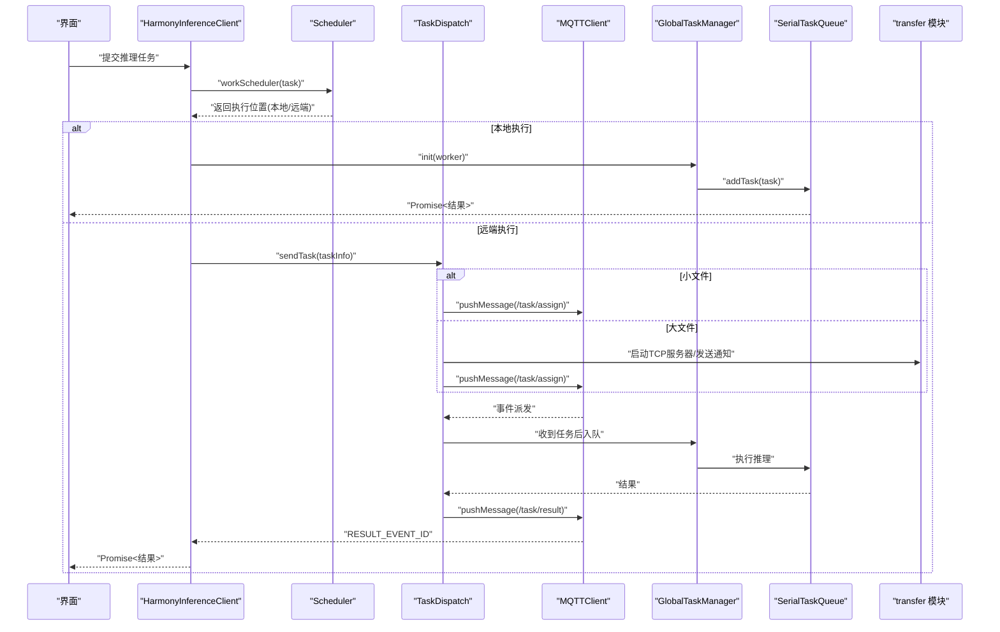
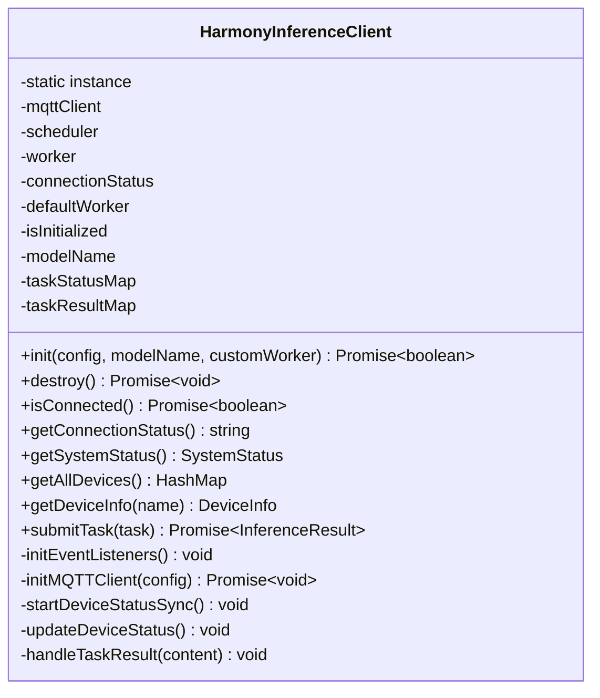
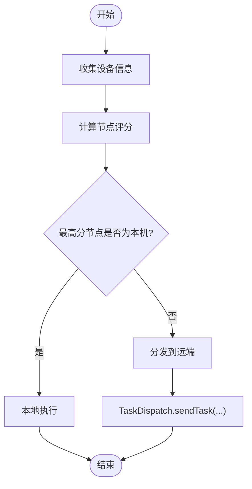
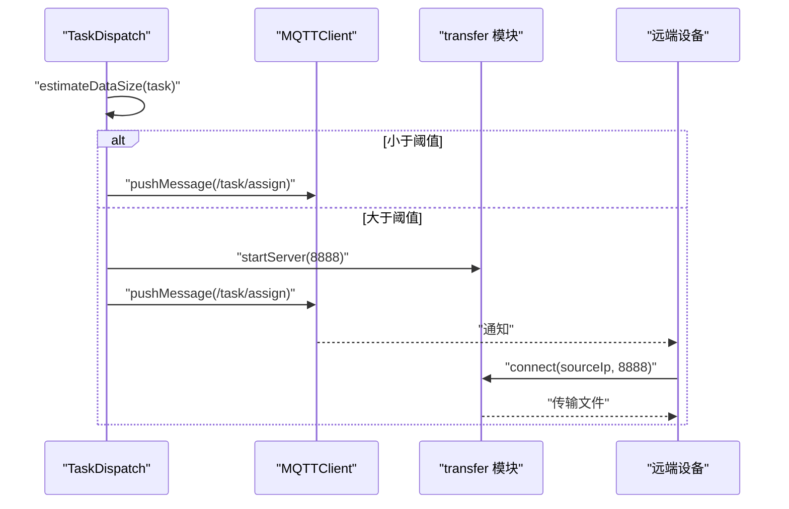
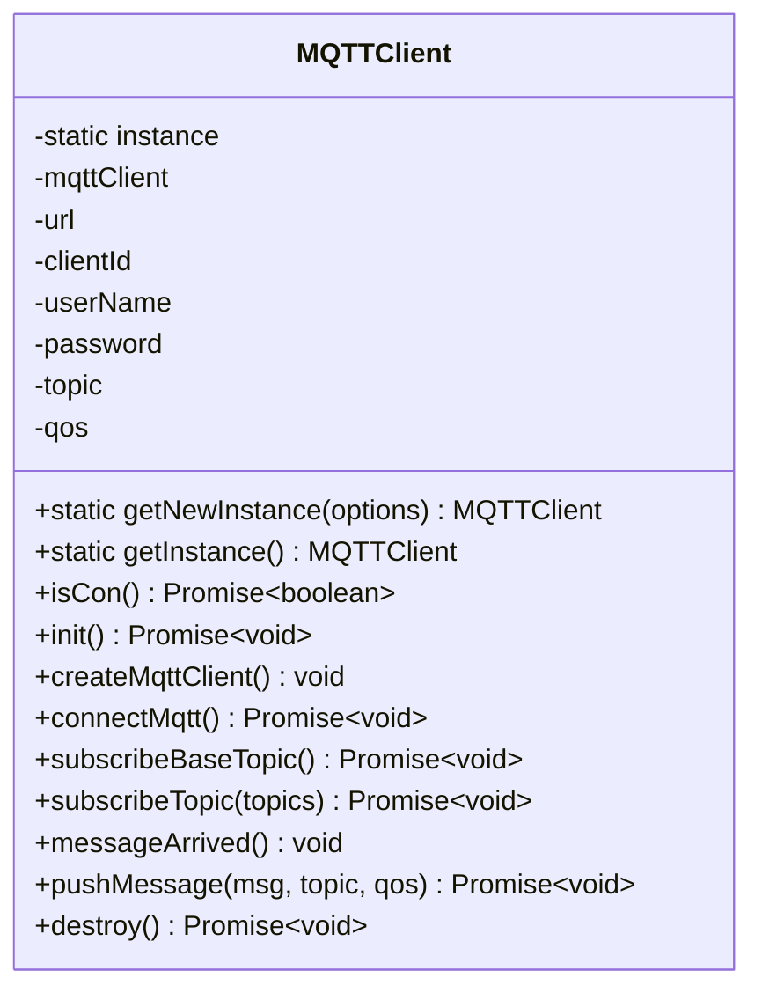
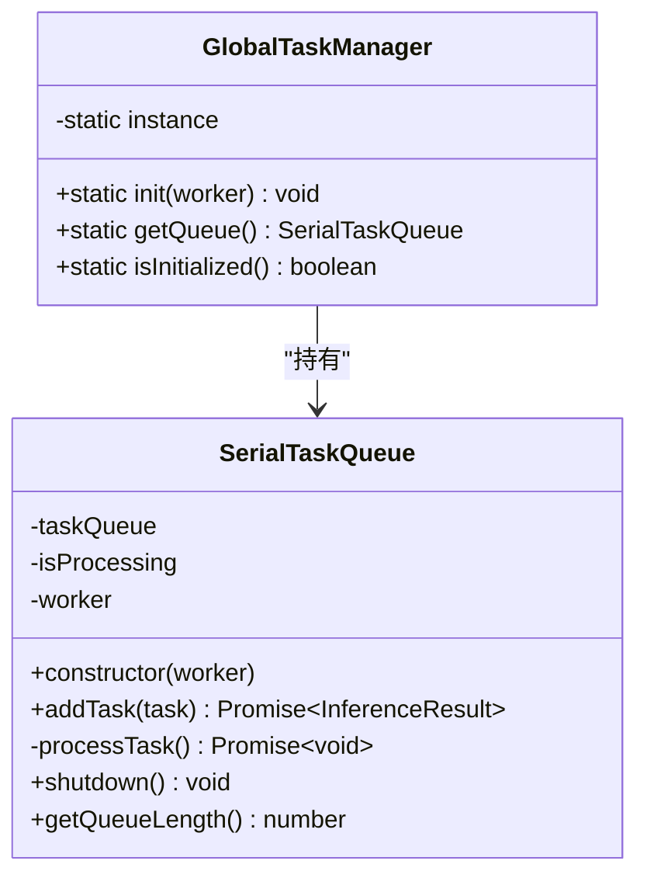
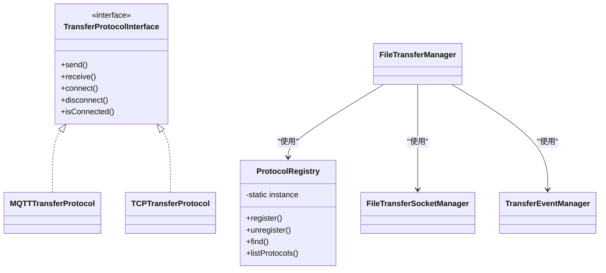
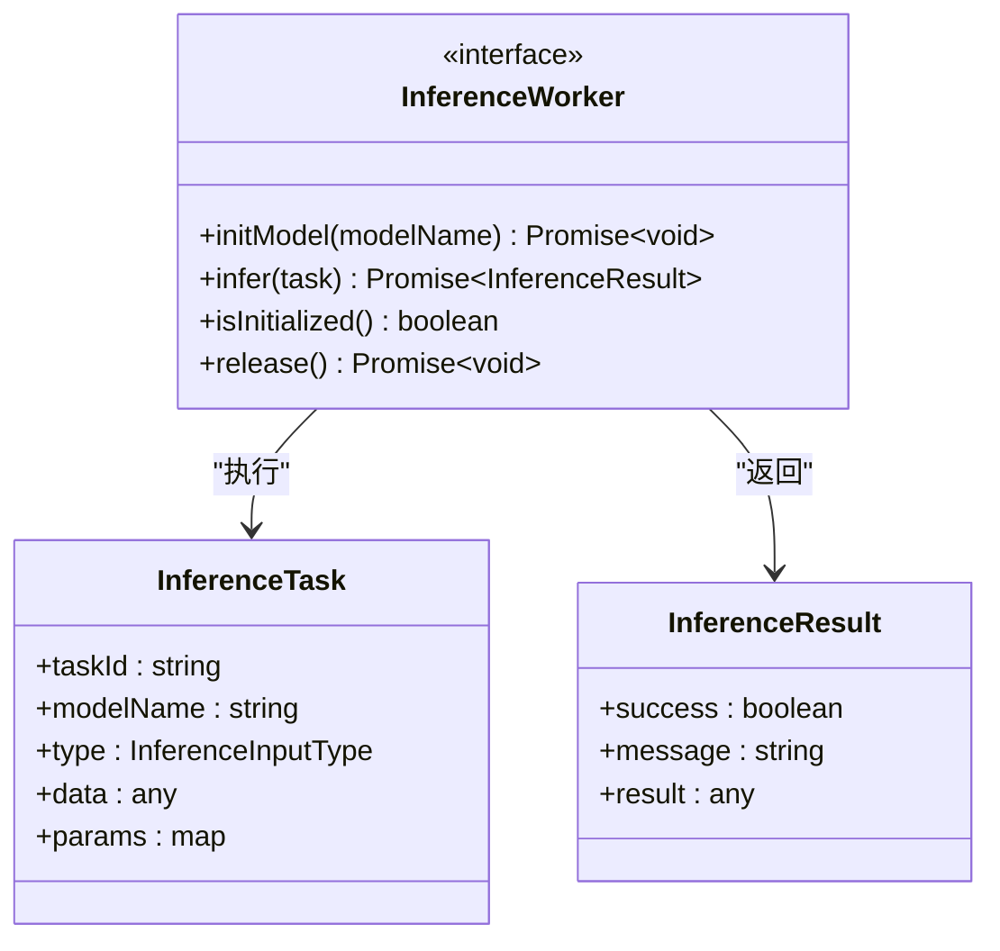
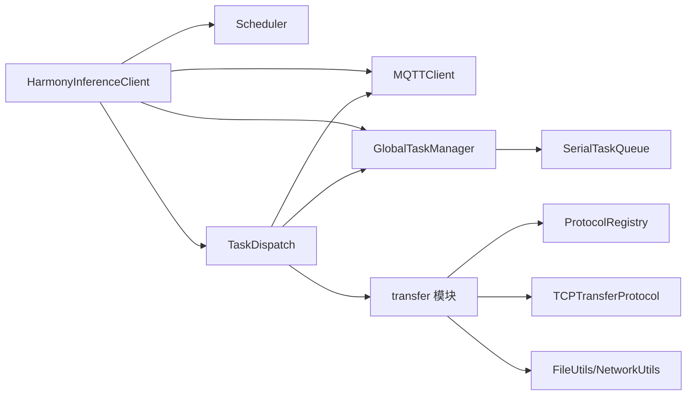

# 核心架构设计

<cite>
**本文引用的文件**
- [entry/src/main/module.json5](file://entry/src/main/module.json5)
- [entry/build-profile.json5](file://entry/build-profile.json5)
- [entry/src/main/cpp/CMakeLists.txt](file://entry/src/main/cpp/CMakeLists.txt)
- [entry/src/main/ets/manager/transfer/index.ets](file://entry/src/main/ets/manager/transfer/index.ets)
- [entry/src/main/ets/manager/transfer/IMPLEMENTATION_SUMMARY.md](file://entry/src/main/ets/manager/transfer/IMPLEMENTATION_SUMMARY.md)
- [entry/src/main/ets/manager/HarmonyInferenceClient.ets](file://entry/src/main/ets/manager/HarmonyInferenceClient.ets)
- [entry/src/main/ets/manager/scheduler/Scheduler.ets](file://entry/src/main/ets/manager/scheduler/Scheduler.ets)
- [entry/src/main/ets/manager/worker/GlobalTaskManager.ets](file://entry/src/main/ets/manager/worker/GlobalTaskManager.ets)
- [entry/src/main/ets/manager/broker/MQTTClient.ets](file://entry/src/main/ets/manager/broker/MQTTClient.ets)
- [entry/src/main/ets/manager/broker/MQTTConfig.ets](file://entry/src/main/ets/manager/broker/MQTTConfig.ets)
- [entry/src/main/ets/manager/broker/task/TaskDispatch.ets](file://entry/src/main/ets/manager/broker/task/TaskDispatch.ets)
- [entry/src/main/ets/manager/worker/InferenceWorker.ets](file://entry/src/main/ets/manager/worker/InferenceWorker.ets)
- [entry/src/main/ets/manager/worker/SerialTaskQueue.ets](file://entry/src/main/ets/manager/worker/SerialTaskQueue.ets)
</cite>

## 目录
1. [简介](#简介)
2. [项目结构](#项目结构)
3. [核心组件](#核心组件)
4. [架构总览](#架构总览)
5. [详细组件分析](#详细组件分析)
6. [依赖关系分析](#依赖关系分析)
7. [性能考量](#性能考量)
8. [故障排查指南](#故障排查指南)
9. [结论](#结论)
10. [附录](#附录)

## 简介
本架构文档面向 OH_Co3 的核心系统，聚焦于“分布式推理任务编排与文件传输”子系统。系统围绕单例模式、观察者模式、策略模式与工厂模式构建，形成高内聚、低耦合的模块化架构。系统边界以内核模块（HarmonyInferenceClient、Scheduler、TaskDispatch、MQTTClient、GlobalTaskManager、SerialTaskQueue、Transfer 模块）为核心，向外通过 MQTT 与 TCP 协议与外部设备交互，同时通过事件总线进行解耦。

## 项目结构
- 应用模块入口与权限声明位于模块配置文件，定义主 Ability、页面与权限。
- 构建配置定义了 ArkTS 编译选项、原生库外链与 ABI 过滤。
- 原生层通过 CMake 集成 NAPI 与系统日志库，支撑底层能力。
- 管理器层包含推理编排（HarmonyInferenceClient）、调度（Scheduler）、任务分发（TaskDispatch）、事件与 MQTT（MQTTClient）、任务队列（GlobalTaskManager/SerialTaskQueue）以及文件传输（transfer 模块）。

```mermaid
graph TB
subgraph "应用层"
UI["页面与组件"]
end
subgraph "管理器层"
HIC["HarmonyInferenceClient"]
SCH["Scheduler"]
GTM["GlobalTaskManager"]
STQ["SerialTaskQueue"]
TDIS["TaskDispatch"]
MQCC["MQTTClient"]
end
subgraph "传输层"
TRANS["transfer 模块<br/>协议/Socket/事件/工具/管理器"]
end
subgraph "外部系统"
MQTT["MQTT Broker"]
REMOTE["远端设备"]
end
UI --> HIC
HIC --> SCH
HIC --> GTM
HIC --> MQCC
HIC --> TRANS
SCH --> TDIS
GTM --> STQ
TDIS --> MQCC
TDIS --> TRANS
MQCC <- --> MQTT
TRANS --> REMOTE
```

图表来源
- [entry/src/main/module.json5](file://entry/src/main/module.json5#L1-L86)
- [entry/build-profile.json5](file://entry/build-profile.json5#L1-L39)
- [entry/src/main/cpp/CMakeLists.txt](file://entry/src/main/cpp/CMakeLists.txt#L1-L13)
- [entry/src/main/ets/manager/HarmonyInferenceClient.ets](file://entry/src/main/ets/manager/HarmonyInferenceClient.ets#L52-L357)
- [entry/src/main/ets/manager/scheduler/Scheduler.ets](file://entry/src/main/ets/manager/scheduler/Scheduler.ets#L14-L105)
- [entry/src/main/ets/manager/worker/GlobalTaskManager.ets](file://entry/src/main/ets/manager/worker/GlobalTaskManager.ets#L4-L27)
- [entry/src/main/ets/manager/worker/SerialTaskQueue.ets](file://entry/src/main/ets/manager/worker/SerialTaskQueue.ets#L13-L103)
- [entry/src/main/ets/manager/broker/task/TaskDispatch.ets](file://entry/src/main/ets/manager/broker/task/TaskDispatch.ets#L98-L302)
- [entry/src/main/ets/manager/broker/MQTTClient.ets](file://entry/src/main/ets/manager/broker/MQTTClient.ets#L24-L223)
- [entry/src/main/ets/manager/transfer/index.ets](file://entry/src/main/ets/manager/transfer/index.ets#L1-L45)

章节来源
- [entry/src/main/module.json5](file://entry/src/main/module.json5#L1-L86)
- [entry/build-profile.json5](file://entry/build-profile.json5#L1-L39)
- [entry/src/main/cpp/CMakeLists.txt](file://entry/src/main/cpp/CMakeLists.txt#L1-L13)

## 核心组件
- HarmonyInferenceClient：系统入口与协调者，负责 MQTT 初始化、事件监听、设备状态聚合、任务提交与结果回传。
- Scheduler：单例调度器，基于设备性能参数计算评分，决定任务本地或远端执行。
- TaskDispatch：任务分发与路由，结合 MQTT 与 TCP 传输策略，支持小文件直传与大文件 TCP 分块传输。
- MQTTClient：MQTT 客户端单例，封装连接、订阅、发布与事件派发。
- GlobalTaskManager/SerialTaskQueue：全局串行任务队列，保证推理任务顺序执行与并发安全。
- transfer 模块：协议抽象与实现（MQTT/TCP）、Socket 管理、事件系统、工具类与统一导出。

章节来源
- [entry/src/main/ets/manager/HarmonyInferenceClient.ets](file://entry/src/main/ets/manager/HarmonyInferenceClient.ets#L52-L357)
- [entry/src/main/ets/manager/scheduler/Scheduler.ets](file://entry/src/main/ets/manager/scheduler/Scheduler.ets#L14-L105)
- [entry/src/main/ets/manager/broker/task/TaskDispatch.ets](file://entry/src/main/ets/manager/broker/task/TaskDispatch.ets#L98-L302)
- [entry/src/main/ets/manager/broker/MQTTClient.ets](file://entry/src/main/ets/manager/broker/MQTTClient.ets#L24-L223)
- [entry/src/main/ets/manager/worker/GlobalTaskManager.ets](file://entry/src/main/ets/manager/worker/GlobalTaskManager.ets#L4-L27)
- [entry/src/main/ets/manager/worker/SerialTaskQueue.ets](file://entry/src/main/ets/manager/worker/SerialTaskQueue.ets#L13-L103)
- [entry/src/main/ets/manager/transfer/index.ets](file://entry/src/main/ets/manager/transfer/index.ets#L1-L45)

## 架构总览
系统采用“事件驱动 + 协议自适应”的混合架构：
- 事件驱动：MQTT 消息经事件总线派发到各业务模块，实现松耦合。
- 协议自适应：小文件通过 MQTT 直传，大文件通过 TCP 分块传输，自动选择最优路径。
- 单例治理：MQTTClient、Scheduler、TransferEventManager、FileTransferManager 等关键组件采用单例，保障全局一致性。
- 观察者模式：事件系统支持订阅/发布，便于横向扩展。



图表来源
- [entry/src/main/ets/manager/HarmonyInferenceClient.ets](file://entry/src/main/ets/manager/HarmonyInferenceClient.ets#L309-L353)
- [entry/src/main/ets/manager/scheduler/Scheduler.ets](file://entry/src/main/ets/manager/scheduler/Scheduler.ets#L30-L57)
- [entry/src/main/ets/manager/broker/task/TaskDispatch.ets](file://entry/src/main/ets/manager/broker/task/TaskDispatch.ets#L107-L126)
- [entry/src/main/ets/manager/broker/MQTTClient.ets](file://entry/src/main/ets/manager/broker/MQTTClient.ets#L189-L203)
- [entry/src/main/ets/manager/worker/GlobalTaskManager.ets](file://entry/src/main/ets/manager/worker/GlobalTaskManager.ets#L8-L21)
- [entry/src/main/ets/manager/worker/SerialTaskQueue.ets](file://entry/src/main/ets/manager/worker/SerialTaskQueue.ets#L24-L48)
- [entry/src/main/ets/manager/transfer/index.ets](file://entry/src/main/ets/manager/transfer/index.ets#L1-L45)

## 详细组件分析

### HarmonyInferenceClient（单例协调者）
- 职责：初始化 MQTT、事件监听、设备状态聚合、任务提交与结果回传。
- 设计要点：
  - 单例模式：getInstance 提供全局访问点。
  - 观察者模式：通过事件总线监听多主题消息，派发到相应模块。
  - 生命周期：init/destroy 管理资源，连接状态轮询与更新。
- 关键交互：与 Scheduler、GlobalTaskManager、MQTTClient、SystemProfiler、NodeInfoSyn、ParamSyn、TaskDispatch 等协作。



图表来源
- [entry/src/main/ets/manager/HarmonyInferenceClient.ets](file://entry/src/main/ets/manager/HarmonyInferenceClient.ets#L52-L357)

章节来源
- [entry/src/main/ets/manager/HarmonyInferenceClient.ets](file://entry/src/main/ets/manager/HarmonyInferenceClient.ets#L52-L357)

### Scheduler（单例调度器）
- 职责：收集设备信息，计算评分，决策任务执行位置（本地或远端）。
- 设计要点：
  - 单例模式：getInstance 全局唯一。
  - 策略模式：评分函数可配置，参数来自参数同步模块。
  - 事件/消息：通过 TaskDispatch 发送任务。



图表来源
- [entry/src/main/ets/manager/scheduler/Scheduler.ets](file://entry/src/main/ets/manager/scheduler/Scheduler.ets#L30-L57)
- [entry/src/main/ets/manager/broker/task/TaskDispatch.ets](file://entry/src/main/ets/manager/broker/task/TaskDispatch.ets#L98-L126)

章节来源
- [entry/src/main/ets/manager/scheduler/Scheduler.ets](file://entry/src/main/ets/manager/scheduler/Scheduler.ets#L14-L105)

### TaskDispatch（任务分发与路由）
- 职责：根据数据大小选择传输协议（MQTT/TCP），封装任务消息，处理结果回传。
- 设计要点：
  - 协议策略：小文件直传，大文件 TCP 分块传输。
  - 事件/消息：通过 MQTTClient 发布/订阅。
  - 文件传输：与 transfer 模块协同，TCP 服务器/客户端配合。



图表来源
- [entry/src/main/ets/manager/broker/task/TaskDispatch.ets](file://entry/src/main/ets/manager/broker/task/TaskDispatch.ets#L107-L165)
- [entry/src/main/ets/manager/broker/MQTTClient.ets](file://entry/src/main/ets/manager/broker/MQTTClient.ets#L189-L203)
- [entry/src/main/ets/manager/transfer/index.ets](file://entry/src/main/ets/manager/transfer/index.ets#L1-L45)

章节来源
- [entry/src/main/ets/manager/broker/task/TaskDispatch.ets](file://entry/src/main/ets/manager/broker/task/TaskDispatch.ets#L98-L302)

### MQTTClient（单例 MQTT 客户端）
- 职责：连接、订阅、发布、消息派发。
- 设计要点：
  - 单例模式：全局唯一实例。
  - 事件派发：将不同主题消息通过事件总线派发，RESULT 事件单独处理。
  - 自动重连与连接状态轮询。



图表来源
- [entry/src/main/ets/manager/broker/MQTTClient.ets](file://entry/src/main/ets/manager/broker/MQTTClient.ets#L24-L223)

章节来源
- [entry/src/main/ets/manager/broker/MQTTClient.ets](file://entry/src/main/ets/manager/broker/MQTTClient.ets#L24-L223)
- [entry/src/main/ets/manager/broker/MQTTConfig.ets](file://entry/src/main/ets/manager/broker/MQTTConfig.ets#L1-L7)

### GlobalTaskManager / SerialTaskQueue（串行任务队列）
- 职责：全局串行队列，保证任务顺序执行与并发安全。
- 设计要点：
  - GlobalTaskManager：单例初始化与获取。
  - SerialTaskQueue：LinkedList 实现，Promise 包裹结果，支持 shutdown。



图表来源
- [entry/src/main/ets/manager/worker/GlobalTaskManager.ets](file://entry/src/main/ets/manager/worker/GlobalTaskManager.ets#L4-L27)
- [entry/src/main/ets/manager/worker/SerialTaskQueue.ets](file://entry/src/main/ets/manager/worker/SerialTaskQueue.ets#L13-L103)

章节来源
- [entry/src/main/ets/manager/worker/GlobalTaskManager.ets](file://entry/src/main/ets/manager/worker/GlobalTaskManager.ets#L4-L27)
- [entry/src/main/ets/manager/worker/SerialTaskQueue.ets](file://entry/src/main/ets/manager/worker/SerialTaskQueue.ets#L13-L103)

### transfer 模块（协议抽象与实现）
- 职责：协议接口与注册、MQTT/TCP 适配器、Socket 管理、事件系统、工具类、统一导出。
- 设计要点：
  - 单例：ProtocolRegistry、TransferEventManager、FileTransferManager。
  - 策略模式：TransferProtocolInterface + 多种协议实现。
  - 工厂模式：协议实例创建与注册。
  - 观察者模式：事件系统支持监听与派发。



图表来源
- [entry/src/main/ets/manager/transfer/index.ets](file://entry/src/main/ets/manager/transfer/index.ets#L1-L45)
- [entry/src/main/ets/manager/transfer/IMPLEMENTATION_SUMMARY.md](file://entry/src/main/ets/manager/transfer/IMPLEMENTATION_SUMMARY.md#L1-L320)

章节来源
- [entry/src/main/ets/manager/transfer/index.ets](file://entry/src/main/ets/manager/transfer/index.ets#L1-L45)
- [entry/src/main/ets/manager/transfer/IMPLEMENTATION_SUMMARY.md](file://entry/src/main/ets/manager/transfer/IMPLEMENTATION_SUMMARY.md#L1-L320)

### 推理任务与结果模型
- InferenceWorker 接口定义任务输入类型、结果结构与生命周期方法。
- 任务类型涵盖图像、文本、音频、视频与自定义类型，结果类型与之对应。



图表来源
- [entry/src/main/ets/manager/worker/InferenceWorker.ets](file://entry/src/main/ets/manager/worker/InferenceWorker.ets#L76-L90)

章节来源
- [entry/src/main/ets/manager/worker/InferenceWorker.ets](file://entry/src/main/ets/manager/worker/InferenceWorker.ets#L1-L90)

## 依赖关系分析
- 模块耦合：
  - HarmonyInferenceClient 对 Scheduler、MQTTClient、GlobalTaskManager、SystemProfiler、NodeInfoSyn、ParamSyn、TaskDispatch 存在直接依赖。
  - TaskDispatch 依赖 MQTTClient、GlobalTaskManager、SerialTaskQueue、NetworkUtils、FileUtils、TCPTransferProtocol。
  - transfer 模块通过 ProtocolRegistry 与具体协议实现解耦。
- 外部依赖：
  - OpenHarmony MQTT Kit、事件总线、BasicServicesKit、ArkTS Deque/LinkedList。
- 构建与原生：
  - CMake 链接 hilog 与 ace_napi，启用 arm64-v8a ABI。



图表来源
- [entry/src/main/ets/manager/HarmonyInferenceClient.ets](file://entry/src/main/ets/manager/HarmonyInferenceClient.ets#L1-L357)
- [entry/src/main/ets/manager/broker/task/TaskDispatch.ets](file://entry/src/main/ets/manager/broker/task/TaskDispatch.ets#L1-L302)
- [entry/src/main/ets/manager/worker/GlobalTaskManager.ets](file://entry/src/main/ets/manager/worker/GlobalTaskManager.ets#L1-L27)
- [entry/src/main/ets/manager/worker/SerialTaskQueue.ets](file://entry/src/main/ets/manager/worker/SerialTaskQueue.ets#L1-L103)
- [entry/src/main/ets/manager/transfer/index.ets](file://entry/src/main/ets/manager/transfer/index.ets#L1-L45)

章节来源
- [entry/src/main/ets/manager/HarmonyInferenceClient.ets](file://entry/src/main/ets/manager/HarmonyInferenceClient.ets#L1-L357)
- [entry/src/main/ets/manager/broker/task/TaskDispatch.ets](file://entry/src/main/ets/manager/broker/task/TaskDispatch.ets#L1-L302)
- [entry/src/main/ets/manager/worker/GlobalTaskManager.ets](file://entry/src/main/ets/manager/worker/GlobalTaskManager.ets#L1-L27)
- [entry/src/main/ets/manager/worker/SerialTaskQueue.ets](file://entry/src/main/ets/manager/worker/SerialTaskQueue.ets#L1-L103)
- [entry/src/main/ets/manager/transfer/index.ets](file://entry/src/main/ets/manager/transfer/index.ets#L1-L45)

## 性能考量
- 分块传输：TCP 分块大小与阈值可配置，降低内存峰值与网络拥塞风险。
- 异步与串行：串行队列避免并发冲突，异步操作避免阻塞主线程。
- 连接复用：TCP Socket 管理器统一管理连接，减少握手开销。
- 自动清理：任务完成后清理过期任务，降低内存压力。
- 重试与超时：MQTT 重连与连接超时配置，提升鲁棒性。

## 故障排查指南
- MQTT 连接失败
  - 检查 URL、clientId、用户名/密码与主题配置。
  - 查看连接状态轮询与事件派发是否正常。
- 任务未执行
  - 确认 Scheduler 是否选择远端执行，检查 TaskDispatch 的 sendTask 流程。
  - 核对任务消息序列化/反序列化与主题匹配。
- 大文件传输异常
  - 确认 TCP 服务器启动与端口可达，校验文件哈希与分块逻辑。
- 事件未触发
  - 检查事件 ID 与订阅主题，确认事件总线派发优先级。

章节来源
- [entry/src/main/ets/manager/broker/MQTTClient.ets](file://entry/src/main/ets/manager/broker/MQTTClient.ets#L84-L104)
- [entry/src/main/ets/manager/broker/task/TaskDispatch.ets](file://entry/src/main/ets/manager/broker/task/TaskDispatch.ets#L133-L165)
- [entry/src/main/ets/manager/HarmonyInferenceClient.ets](file://entry/src/main/ets/manager/HarmonyInferenceClient.ets#L116-L154)

## 结论
OH_Co3 的核心架构以单例与事件驱动为基础，结合策略与工厂模式实现协议自适应与任务路由，辅以串行队列保障执行一致性。系统在性能、可扩展性与可维护性之间取得平衡，既满足当前需求，又为未来演进预留空间。

## 附录
- 基础设施要求
  - OpenHarmony API 20 及以上。
  - DevEco Studio 6.0.0。
  - ARM64-v8a 设备或模拟器。
- 部署拓扑
  - 多设备通过 MQTT Broker 协同，设备间通过 MQTT 传递控制消息，大文件通过 TCP 直连传输。
- 安全性
  - 建议启用 TLS/SSL 与服务端证书认证（可在 MQTT 客户端配置中扩展）。
- 监控与可观测性
  - 建议增加传输速率、剩余时间与网络质量评估指标。
- 灾难恢复
  - 建议实现断点续传、指数退避重试与任务状态持久化。