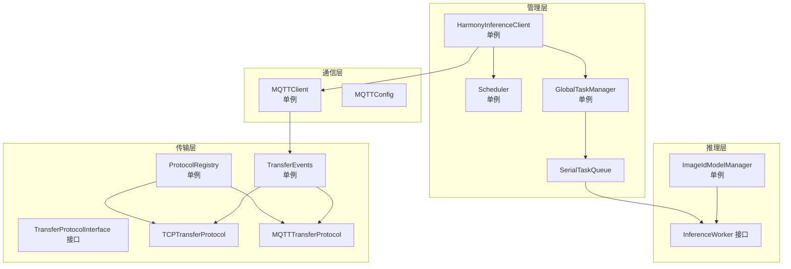
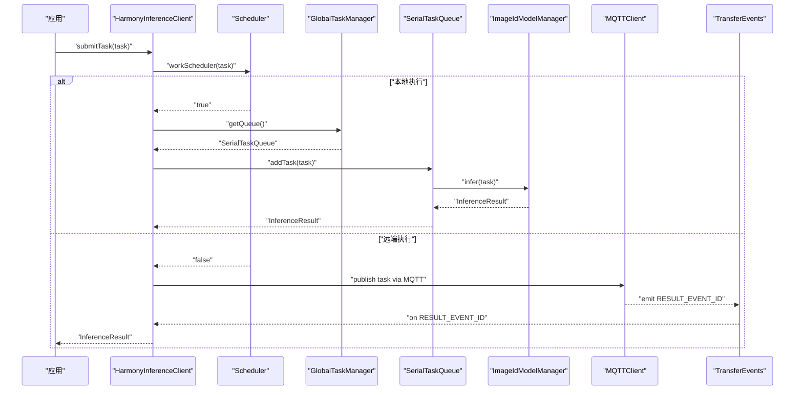
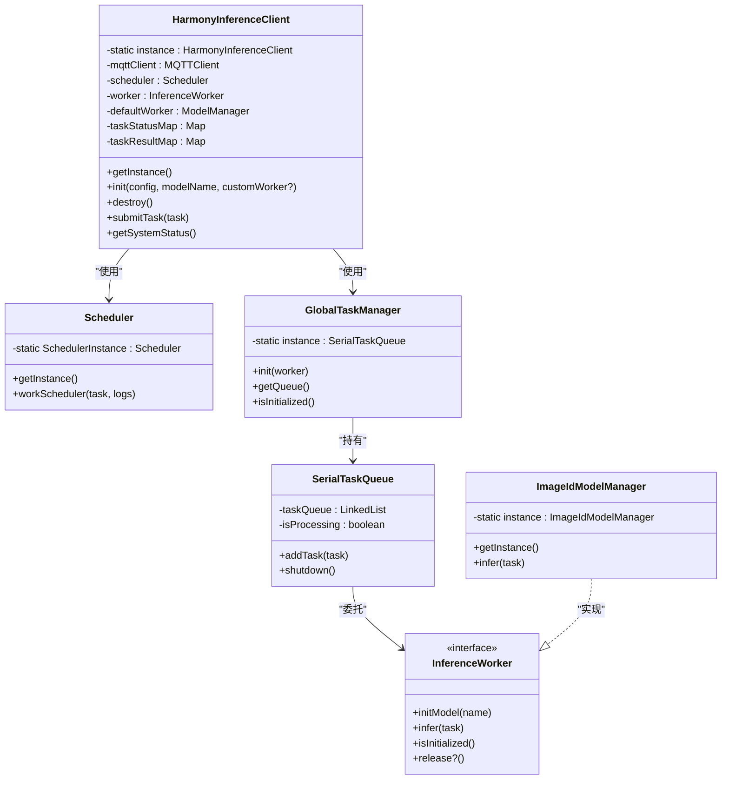
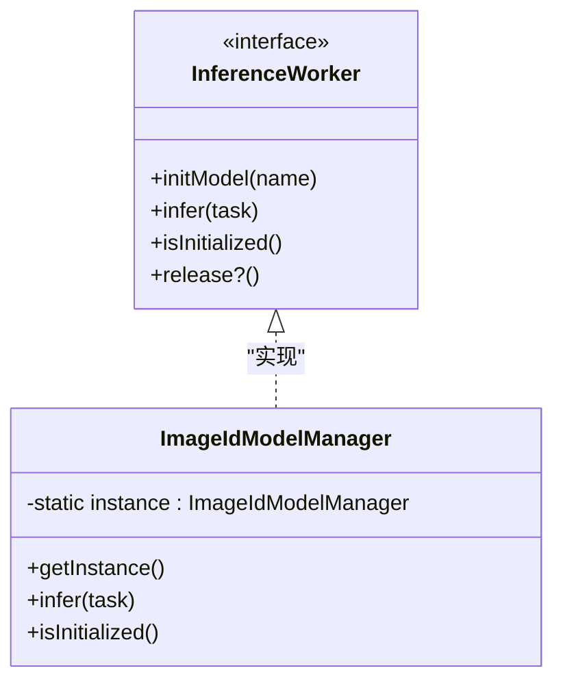
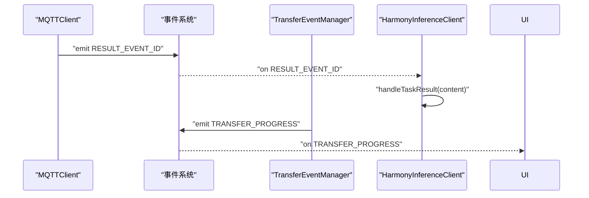
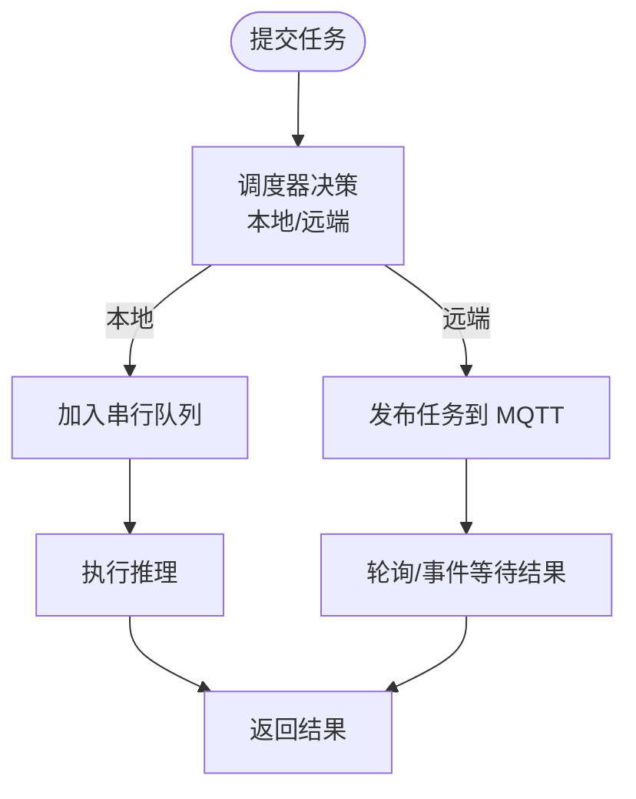
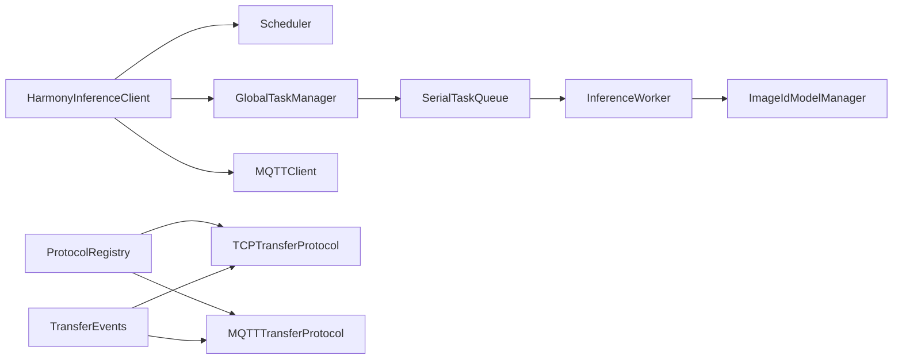

# 设计模式应用

<cite>
**本文引用的文件**
- [HarmonyInferenceClient.ets](file://entry/src/main/ets/manager/HarmonyInferenceClient.ets)
- [InferenceWorker.ets](file://entry/src/main/ets/manager/worker/InferenceWorker.ets)
- [GlobalTaskManager.ets](file://entry/src/main/ets/manager/worker/GlobalTaskManager.ets)
- [SerialTaskQueue.ets](file://entry/src/main/ets/manager/worker/SerialTaskQueue.ets)
- [Scheduler.ets](file://entry/src/main/ets/manager/scheduler/Scheduler.ets)
- [MQTTClient.ets](file://entry/src/main/ets/manager/broker/MQTTClient.ets)
- [MQTTConfig.ets](file://entry/src/main/ets/manager/broker/MQTTConfig.ets)
- [ImageIdModelManager.ets](file://entry/src/main/ets/TestImageTask/ImageIdModelManager.ets)
- [TransferEvents.ets](file://entry/src/main/ets/manager/transfer/event/TransferEvents.ets)
- [TransferProtocolInterface.ets](file://entry/src/main/ets/manager/transfer/protocol/TransferProtocolInterface.ets)
- [ProtocolRegistry.ets](file://entry/src/main/ets/manager/transfer/protocol/ProtocolRegistry.ets)
- [TCPTransferProtocol.ets](file://entry/src/main/ets/manager/transfer/protocol/TCPTransferProtocol.ets)
- [MQTTTransferProtocol.ets](file://entry/src/main/ets/manager/transfer/protocol/MQTTTransferProtocol.ets)
</cite>

## 目录
1. [简介](#简介)
2. [项目结构](#项目结构)
3. [核心组件](#核心组件)
4. [架构总览](#架构总览)
5. [详细组件分析](#详细组件分析)
6. [依赖关系分析](#依赖关系分析)
7. [性能考量](#性能考量)
8. [故障排查指南](#故障排查指南)
9. [结论](#结论)
10. [附录](#附录)

## 简介
本文件围绕 OH_Co3 项目中的设计模式应用进行系统化梳理，重点覆盖以下模式与组合：
- 单例模式：HarmonyInferenceClient、Scheduler、MQTTClient、GlobalTaskManager、TransferEventManager、ProtocolRegistry 等
- 观察者/事件驱动：基于事件总线的事件发布/订阅，贯穿 MQTT 消息、任务结果、文件传输进度等
- 工厂/注册中心：协议注册中心 ProtocolRegistry 对传输协议的统一管理
- 策略模式：不同传输协议（TCP、MQTT）在运行时按需选择
- 职责链/流水线：任务提交经调度器决策后，进入串行任务队列执行

文档将结合具体代码片段路径，解释每种模式的应用场景、实现方式、技术权衡、性能影响与维护成本，并给出模式组合效果、潜在问题与优化建议。

## 项目结构
项目采用按职责分层的组织方式：
- manager 层：核心业务编排（调度、任务队列、推理客户端）
- broker 层：通信与事件桥接（MQTT 客户端、配置、任务分发）
- worker 层：推理执行与任务抽象（InferenceWorker 接口、具体模型管理器）
- transfer 层：文件传输协议族（接口、注册中心、TCP/MQTT 实现、事件管理）

图表来源
- [HarmonyInferenceClient.ets](file://entry/src/main/ets/manager/HarmonyInferenceClient.ets#L52-L80)
- [Scheduler.ets](file://entry/src/main/ets/manager/scheduler/Scheduler.ets#L14-L81)
- [GlobalTaskManager.ets](file://entry/src/main/ets/manager/worker/GlobalTaskManager.ets#L4-L21)
- [SerialTaskQueue.ets](file://entry/src/main/ets/manager/worker/SerialTaskQueue.ets#L13-L21)
- [InferenceWorker.ets](file://entry/src/main/ets/manager/worker/InferenceWorker.ets#L75-L89)
- [ImageIdModelManager.ets](file://entry/src/main/ets/TestImageTask/ImageIdModelManager.ets#L31-L43)
- [MQTTClient.ets](file://entry/src/main/ets/manager/broker/MQTTClient.ets#L24-L58)
- [TransferProtocolInterface.ets](file://entry/src/main/ets/manager/transfer/protocol/TransferProtocolInterface.ets#L63-L119)
- [ProtocolRegistry.ets](file://entry/src/main/ets/manager/transfer/protocol/ProtocolRegistry.ets#L7-L23)
- [TCPTransferProtocol.ets](file://entry/src/main/ets/manager/transfer/protocol/TCPTransferProtocol.ets#L23-L38)
- [MQTTTransferProtocol.ets](file://entry/src/main/ets/manager/transfer/protocol/MQTTTransferProtocol.ets#L10-L18)
- [TransferEvents.ets](file://entry/src/main/ets/manager/transfer/event/TransferEvents.ets#L62-L75)

章节来源
- [HarmonyInferenceClient.ets](file://entry/src/main/ets/manager/HarmonyInferenceClient.ets#L1-L357)
- [Scheduler.ets](file://entry/src/main/ets/manager/scheduler/Scheduler.ets#L1-L105)
- [GlobalTaskManager.ets](file://entry/src/main/ets/manager/worker/GlobalTaskManager.ets#L1-L27)
- [SerialTaskQueue.ets](file://entry/src/main/ets/manager/worker/SerialTaskQueue.ets#L1-L104)
- [InferenceWorker.ets](file://entry/src/main/ets/manager/worker/InferenceWorker.ets#L1-L90)
- [ImageIdModelManager.ets](file://entry/src/main/ets/TestImageTask/ImageIdModelManager.ets#L1-L258)
- [MQTTClient.ets](file://entry/src/main/ets/manager/broker/MQTTClient.ets#L1-L223)
- [MQTTConfig.ets](file://entry/src/main/ets/manager/broker/MQTTConfig.ets#L1-L7)
- [TransferProtocolInterface.ets](file://entry/src/main/ets/manager/transfer/protocol/TransferProtocolInterface.ets#L1-L120)
- [ProtocolRegistry.ets](file://entry/src/main/ets/manager/transfer/protocol/ProtocolRegistry.ets#L1-L93)
- [TCPTransferProtocol.ets](file://entry/src/main/ets/manager/transfer/protocol/TCPTransferProtocol.ets#L1-L351)
- [MQTTTransferProtocol.ets](file://entry/src/main/ets/manager/transfer/protocol/MQTTTransferProtocol.ets#L1-L185)
- [TransferEvents.ets](file://entry/src/main/ets/manager/transfer/event/TransferEvents.ets#L1-L206)

## 核心组件
- 单例组件
  - HarmonyInferenceClient：全局推理客户端，负责初始化、任务提交、状态查询、资源释放
  - Scheduler：全局任务调度器，负责节点评分与任务分发
  - MQTTClient：全局 MQTT 客户端，负责连接、订阅、消息转发与事件派发
  - GlobalTaskManager：全局任务队列管理器，持有串行队列单例
  - TransferEventManager：传输事件管理器，统一事件发布/订阅
  - ProtocolRegistry：协议注册中心，集中管理传输协议实现
- 事件驱动
  - 基于事件总线的发布/订阅，贯穿 MQTT 消息、任务结果、传输进度等
- 工厂/注册中心
  - ProtocolRegistry 提供协议注册与查找，支持运行时切换传输策略
- 职责链/流水线
  - 任务提交 → 调度器决策 → 本地队列执行/远端分发 → 结果回传

章节来源
- [HarmonyInferenceClient.ets](file://entry/src/main/ets/manager/HarmonyInferenceClient.ets#L52-L80)
- [Scheduler.ets](file://entry/src/main/ets/manager/scheduler/Scheduler.ets#L14-L81)
- [MQTTClient.ets](file://entry/src/main/ets/manager/broker/MQTTClient.ets#L24-L58)
- [GlobalTaskManager.ets](file://entry/src/main/ets/manager/worker/GlobalTaskManager.ets#L4-L21)
- [TransferEvents.ets](file://entry/src/main/ets/manager/transfer/event/TransferEvents.ets#L62-L75)
- [ProtocolRegistry.ets](file://entry/src/main/ets/manager/transfer/protocol/ProtocolRegistry.ets#L7-L23)

## 架构总览
下图展示了从“任务提交”到“结果返回”的端到端流程，体现单例、事件驱动与职责链的协同：

图表来源
- [HarmonyInferenceClient.ets](file://entry/src/main/ets/manager/HarmonyInferenceClient.ets#L309-L353)
- [Scheduler.ets](file://entry/src/main/ets/manager/scheduler/Scheduler.ets#L30-L57)
- [GlobalTaskManager.ets](file://entry/src/main/ets/manager/worker/GlobalTaskManager.ets#L16-L21)
- [SerialTaskQueue.ets](file://entry/src/main/ets/manager/worker/SerialTaskQueue.ets#L24-L83)
- [ImageIdModelManager.ets](file://entry/src/main/ets/TestImageTask/ImageIdModelManager.ets#L205-L237)
- [MQTTClient.ets](file://entry/src/main/ets/manager/broker/MQTTClient.ets#L153-L182)
- [TransferEvents.ets](file://entry/src/main/ets/manager/transfer/event/TransferEvents.ets#L84-L107)

## 详细组件分析

### 单例模式：HarmonyInferenceClient
- 应用场景
  - 全局推理客户端，统一管理 MQTT 连接、调度器、默认 Worker、全局任务队列与系统状态
- 实现要点
  - 私有构造函数 + 静态 getInstance
  - 内部持有 Scheduler、ModelManager 单例与 InferenceWorker 实例
  - 初始化时可注入自定义 Worker，否则使用默认 ModelManager
- 技术权衡
  - 优点：全局状态一致、资源集中管理、避免重复初始化
  - 风险：全局状态耦合度高，测试隔离困难；需谨慎处理 destroy 与资源回收
- 维护成本
  - 单例初始化顺序与依赖关系复杂，需清晰的生命周期管理

图表来源
- [HarmonyInferenceClient.ets](file://entry/src/main/ets/manager/HarmonyInferenceClient.ets#L52-L80)
- [Scheduler.ets](file://entry/src/main/ets/manager/scheduler/Scheduler.ets#L14-L81)
- [GlobalTaskManager.ets](file://entry/src/main/ets/manager/worker/GlobalTaskManager.ets#L4-L21)
- [SerialTaskQueue.ets](file://entry/src/main/ets/manager/worker/SerialTaskQueue.ets#L13-L21)
- [InferenceWorker.ets](file://entry/src/main/ets/manager/worker/InferenceWorker.ets#L75-L89)
- [ImageIdModelManager.ets](file://entry/src/main/ets/TestImageTask/ImageIdModelManager.ets#L31-L43)

章节来源
- [HarmonyInferenceClient.ets](file://entry/src/main/ets/manager/HarmonyInferenceClient.ets#L52-L80)
- [HarmonyInferenceClient.ets](file://entry/src/main/ets/manager/HarmonyInferenceClient.ets#L163-L196)
- [HarmonyInferenceClient.ets](file://entry/src/main/ets/manager/HarmonyInferenceClient.ets#L198-L225)
- [HarmonyInferenceClient.ets](file://entry/src/main/ets/manager/HarmonyInferenceClient.ets#L309-L353)

### 单例模式：Scheduler（任务调度器）
- 应用场景
  - 全局任务调度，收集设备信息、计算评分、决定本地或远端执行
- 实现要点
  - 单例 + 静态 getInstance
  - 评分函数结合 CPU、内存、电量、存储、延迟等指标
- 性能影响
  - 评分遍历设备集合，复杂度 O(N)，N 为在线设备数
- 维护成本
  - 评分权重参数来自参数同步模块，需保证参数一致性

章节来源
- [Scheduler.ets](file://entry/src/main/ets/manager/scheduler/Scheduler.ets#L14-L81)
- [Scheduler.ets](file://entry/src/main/ets/manager/scheduler/Scheduler.ets#L30-L57)
- [Scheduler.ets](file://entry/src/main/ets/manager/scheduler/Scheduler.ets#L66-L70)

### 单例模式：MQTTClient（通信桥）
- 应用场景
  - 统一 MQTT 连接、订阅、消息派发，向事件系统转发任务结果与控制消息
- 实现要点
  - 单例 + 静态 getNewInstance / getInstance
  - 订阅多个主题，区分任务结果与其他控制消息，分别通过事件总线派发
- 性能影响
  - 高频消息处理与事件派发，需注意事件优先级与去抖
- 维护成本
  - 主题命名与消息格式需保持稳定，避免破坏事件监听

章节来源
- [MQTTClient.ets](file://entry/src/main/ets/manager/broker/MQTTClient.ets#L24-L58)
- [MQTTClient.ets](file://entry/src/main/ets/manager/broker/MQTTClient.ets#L107-L145)
- [MQTTClient.ets](file://entry/src/main/ets/manager/broker/MQTTClient.ets#L148-L182)
- [MQTTConfig.ets](file://entry/src/main/ets/manager/broker/MQTTConfig.ets#L4-L6)

### 单例模式：TransferEventManager（事件管理）
- 应用场景
  - 统一文件传输事件的发布/订阅，屏蔽底层事件系统差异
- 实现要点
  - 单例 + emit/on/off/offAll
  - 事件 ID 枚举化，事件数据结构标准化
- 性能影响
  - 事件派发为轻量级操作，但需避免过多监听导致回调堆积
- 维护成本
  - 事件生命周期管理（注册/注销）、优先级控制

章节来源
- [TransferEvents.ets](file://entry/src/main/ets/manager/transfer/event/TransferEvents.ets#L62-L75)
- [TransferEvents.ets](file://entry/src/main/ets/manager/transfer/event/TransferEvents.ets#L84-L107)
- [TransferEvents.ets](file://entry/src/main/ets/manager/transfer/event/TransferEvents.ets#L115-L130)
- [TransferEvents.ets](file://entry/src/main/ets/manager/transfer/event/TransferEvents.ets#L136-L154)

### 单例模式：ProtocolRegistry（协议注册中心）
- 应用场景
  - 动态注册/查找传输协议，支持运行时切换策略
- 实现要点
  - 单例 + Map 存储协议实例
  - 提供注册、注销、列举、校验存在性等能力
- 性能影响
  - 查找为 O(1)，注册/注销为 O(1)，整体开销低
- 维护成本
  - 协议命名规范与生命周期管理，避免泄漏

章节来源
- [ProtocolRegistry.ets](file://entry/src/main/ets/manager/transfer/protocol/ProtocolRegistry.ets#L7-L23)
- [ProtocolRegistry.ets](file://entry/src/main/ets/manager/transfer/protocol/ProtocolRegistry.ets#L31-L38)
- [ProtocolRegistry.ets](file://entry/src/main/ets/manager/transfer/protocol/ProtocolRegistry.ets#L45-L53)
- [ProtocolRegistry.ets](file://entry/src/main/ets/manager/transfer/protocol/ProtocolRegistry.ets#L60-L66)

### 工厂/策略模式：InferenceWorker 与 ImageIdModelManager
- 应用场景
  - InferenceWorker 抽象推理执行；ImageIdModelManager 实现具体推理逻辑
- 实现要点
  - InferenceWorker 定义统一接口（initModel/infer/isInitialized/release?）
  - ImageIdModelManager 作为单例实现，内部持有模型与预处理逻辑
- 性能影响
  - 模型加载与预处理为 CPU 密集型，需注意初始化时机与缓存
- 维护成本
  - 不同模型/任务类型需新增实现类，遵循接口契约

图表来源
- [InferenceWorker.ets](file://entry/src/main/ets/manager/worker/InferenceWorker.ets#L75-L89)
- [ImageIdModelManager.ets](file://entry/src/main/ets/TestImageTask/ImageIdModelManager.ets#L31-L43)
- [ImageIdModelManager.ets](file://entry/src/main/ets/TestImageTask/ImageIdModelManager.ets#L205-L237)

章节来源
- [InferenceWorker.ets](file://entry/src/main/ets/manager/worker/InferenceWorker.ets#L1-L90)
- [ImageIdModelManager.ets](file://entry/src/main/ets/TestImageTask/ImageIdModelManager.ets#L31-L43)
- [ImageIdModelManager.ets](file://entry/src/main/ets/TestImageTask/ImageIdModelManager.ets#L205-L237)

### 观察者/事件驱动：任务结果与传输进度
- 应用场景
  - 任务结果通过 MQTT 推送到本地，经事件系统派发给 HarmonyInferenceClient
  - 文件传输进度通过 TransferEventManager 发布，供 UI 或上层消费
- 实现要点
  - MQTTClient 在 messageArrived 中根据主题派发不同事件
  - TransferEventManager 提供 emit/on/off 等统一接口
- 性能影响
  - 事件回调链路短，但需避免高频事件导致 UI 卡顿
- 维护成本
  - 事件命名、数据结构与优先级需规范化

图表来源
- [MQTTClient.ets](file://entry/src/main/ets/manager/broker/MQTTClient.ets#L153-L182)
- [TransferEvents.ets](file://entry/src/main/ets/manager/transfer/event/TransferEvents.ets#L84-L107)
- [HarmonyInferenceClient.ets](file://entry/src/main/ets/manager/HarmonyInferenceClient.ets#L141-L152)

章节来源
- [MQTTClient.ets](file://entry/src/main/ets/manager/broker/MQTTClient.ets#L153-L182)
- [TransferEvents.ets](file://entry/src/main/ets/manager/transfer/event/TransferEvents.ets#L84-L107)
- [HarmonyInferenceClient.ets](file://entry/src/main/ets/manager/HarmonyInferenceClient.ets#L141-L152)

### 流水线与职责链：任务提交与执行
- 应用场景
  - submitTask → Scheduler 决策 → 本地队列执行或远端分发 → 结果回传
- 实现要点
  - 本地执行：通过 GlobalTaskManager.getQueue().addTask(task)
  - 远端执行：通过 MQTT 分发任务，等待 RESULT_EVENT_ID 回传
- 性能影响
  - 串行队列保障执行有序，但吞吐受限；可通过并发队列或多队列优化
- 维护成本
  - 需要完善的超时与重试策略，以及结果缓存与清理

图表来源
- [HarmonyInferenceClient.ets](file://entry/src/main/ets/manager/HarmonyInferenceClient.ets#L317-L353)
- [Scheduler.ets](file://entry/src/main/ets/manager/scheduler/Scheduler.ets#L30-L57)
- [GlobalTaskManager.ets](file://entry/src/main/ets/manager/worker/GlobalTaskManager.ets#L16-L21)
- [SerialTaskQueue.ets](file://entry/src/main/ets/manager/worker/SerialTaskQueue.ets#L24-L83)

章节来源
- [HarmonyInferenceClient.ets](file://entry/src/main/ets/manager/HarmonyInferenceClient.ets#L309-L353)
- [SerialTaskQueue.ets](file://entry/src/main/ets/manager/worker/SerialTaskQueue.ets#L24-L83)

### 协议策略：TCP 与 MQTT 传输
- 应用场景
  - 大文件使用 TCP 分块传输，小文件使用 MQTT 直传
- 实现要点
  - ProtocolRegistry 注册协议，运行时按需选择
  - TCPTransferProtocol：分块、重试、进度事件
  - MQTTTransferProtocol：重试、进度模拟
- 性能影响
  - TCP 更适合大文件，MQTT 适合小文件；需根据文件大小策略选择
- 维护成本
  - 协议接口统一，便于扩展新协议

章节来源
- [ProtocolRegistry.ets](file://entry/src/main/ets/manager/transfer/protocol/ProtocolRegistry.ets#L31-L38)
- [TCPTransferProtocol.ets](file://entry/src/main/ets/manager/transfer/protocol/TCPTransferProtocol.ets#L123-L205)
- [MQTTTransferProtocol.ets](file://entry/src/main/ets/manager/transfer/protocol/MQTTTransferProtocol.ets#L70-L109)

## 依赖关系分析
- 组件内聚与耦合
  - HarmonyInferenceClient 与 Scheduler、GlobalTaskManager、MQTTClient 高度耦合，承担编排职责
  - InferenceWorker 与 ImageIdModelManager 解耦良好，便于替换模型实现
  - 传输层通过 ProtocolRegistry 与事件系统解耦
- 外部依赖
  - 事件系统、MQTT SDK、文件工具库等
- 潜在循环依赖
  - 事件系统与通信层相互作用，需通过事件 ID 与数据结构解耦

图表来源
- [HarmonyInferenceClient.ets](file://entry/src/main/ets/manager/HarmonyInferenceClient.ets#L52-L80)
- [Scheduler.ets](file://entry/src/main/ets/manager/scheduler/Scheduler.ets#L14-L81)
- [GlobalTaskManager.ets](file://entry/src/main/ets/manager/worker/GlobalTaskManager.ets#L4-L21)
- [SerialTaskQueue.ets](file://entry/src/main/ets/manager/worker/SerialTaskQueue.ets#L13-L21)
- [InferenceWorker.ets](file://entry/src/main/ets/manager/worker/InferenceWorker.ets#L75-L89)
- [ImageIdModelManager.ets](file://entry/src/main/ets/TestImageTask/ImageIdModelManager.ets#L31-L43)
- [ProtocolRegistry.ets](file://entry/src/main/ets/manager/transfer/protocol/ProtocolRegistry.ets#L7-L23)
- [TCPTransferProtocol.ets](file://entry/src/main/ets/manager/transfer/protocol/TCPTransferProtocol.ets#L23-L38)
- [MQTTTransferProtocol.ets](file://entry/src/main/ets/manager/transfer/protocol/MQTTTransferProtocol.ets#L10-L18)
- [TransferEvents.ets](file://entry/src/main/ets/manager/transfer/event/TransferEvents.ets#L62-L75)

## 性能考量
- 单例带来的收益
  - 减少重复初始化与上下文切换，降低内存占用
- 事件驱动的代价
  - 高频事件可能导致回调堆积，需合理设置优先级与节流
- 串行队列的限制
  - 本地执行吞吐受限，可考虑引入并发队列或按任务类型分队列
- 传输策略的选择
  - 大文件走 TCP，小文件走 MQTT，减少带宽浪费与协议开销
- 超时与重试
  - 远端任务与 MQTT 传输应具备合理的超时与重试策略，避免阻塞

## 故障排查指南
- MQTT 连接异常
  - 检查 MQTTClient 的连接状态与订阅主题列表
  - 确认事件 ID 与主题映射正确
- 任务结果未返回
  - 检查 RESULT_EVENT_ID 事件监听是否注册
  - 校验任务 ID 与结果缓存键一致
- 传输进度不更新
  - 确认 TransferEventManager 的 emit 调用与 on 注册
  - 检查协议实现的进度更新逻辑
- 单例未初始化
  - 确保在使用前调用相应 getInstance 或 init 方法
  - 避免在 destroy 后继续使用已失效实例

章节来源
- [MQTTClient.ets](file://entry/src/main/ets/manager/broker/MQTTClient.ets#L59-L65)
- [MQTTClient.ets](file://entry/src/main/ets/manager/broker/MQTTClient.ets#L153-L182)
- [TransferEvents.ets](file://entry/src/main/ets/manager/transfer/event/TransferEvents.ets#L84-L107)
- [HarmonyInferenceClient.ets](file://entry/src/main/ets/manager/HarmonyInferenceClient.ets#L141-L152)

## 结论
OH_Co3 项目通过单例、事件驱动、工厂/注册中心与策略模式的组合，实现了推理任务的统一编排与灵活扩展。单例确保全局状态一致与资源复用；事件驱动解耦通信与业务；工厂/注册中心与策略模式使传输协议可插拔；职责链/流水线保障任务执行有序。建议在后续迭代中：
- 引入并发队列与任务分片，提升本地执行吞吐
- 完善超时与重试策略，增强远端执行鲁棒性
- 规范事件命名与数据结构，降低维护成本
- 对关键路径增加可观测性与性能埋点

## 附录
- 模式选择的技术考量
  - 单例：全局一致性与资源复用，代价是测试隔离难度增加
  - 观察者：松耦合与可扩展，代价是事件风暴与优先级管理
  - 工厂/注册中心：运行时可插拔，代价是注册与生命周期管理
  - 策略：按条件切换实现，代价是协议接口一致性要求
- 维护建议
  - 明确各单例的初始化顺序与销毁流程
  - 为事件与协议实现提供单元测试与集成测试
  - 对高频路径进行性能基准测试与回归验证