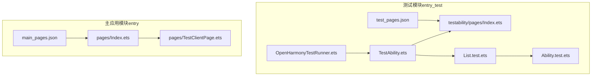
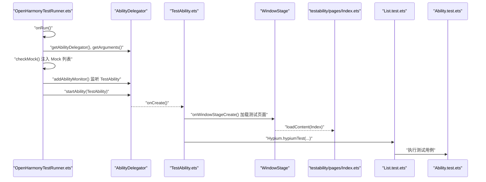
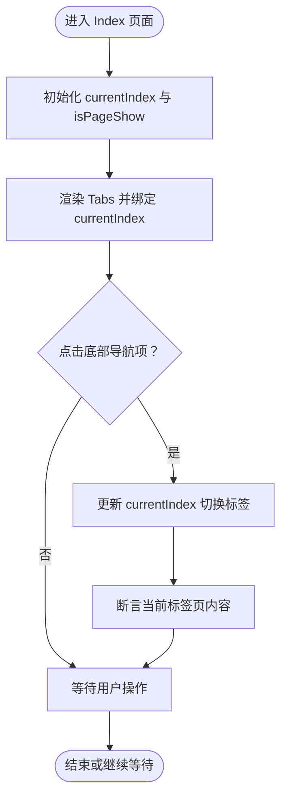
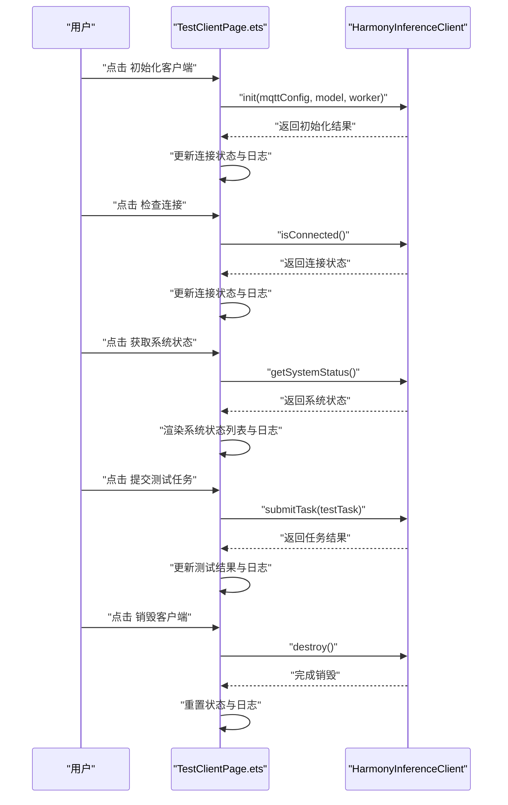
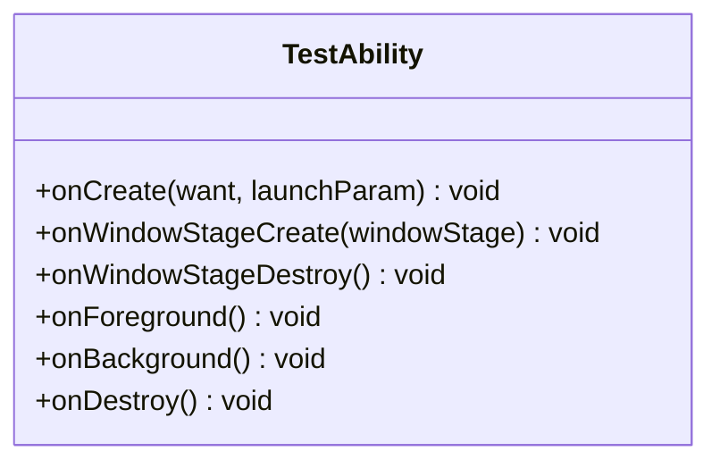
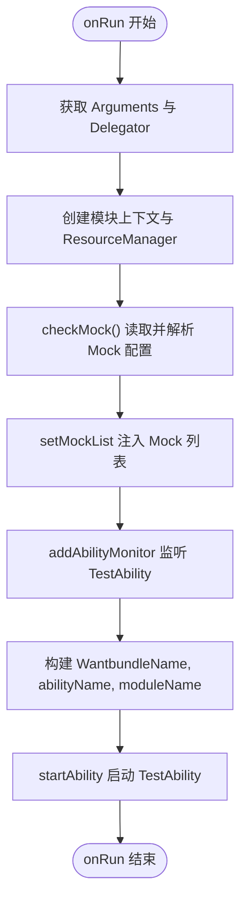
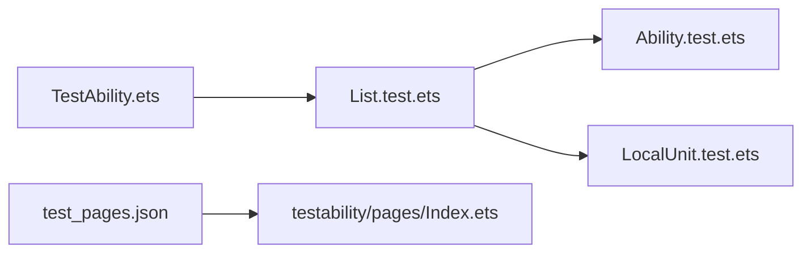
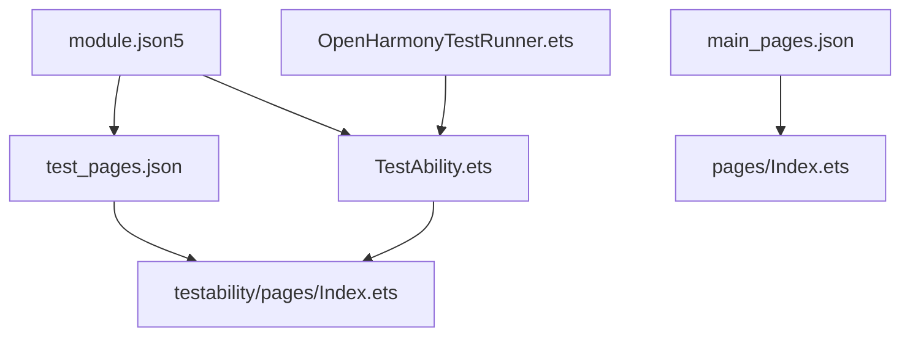

# UI 测试

<cite>
**本文引用的文件**
- [Index.ets（主应用页面）](file://entry/src/main/ets/pages/Index.ets)
- [TestClientPage.ets（测试客户端页面）](file://entry/src/main/ets/pages/TestClientPage.ets)
- [TestAbility.ets（测试能力）](file://entry/src/ohosTest/ets/testability/TestAbility.ets)
- [OpenHarmonyTestRunner.ets（测试运行器）](file://entry/src/ohosTest/ets/testrunner/OpenHarmonyTestRunner.ets)
- [Index.ets（测试可访问性页面）](file://entry/src/ohosTest/ets/testability/pages/Index.ets)
- [module.json5（测试模块配置）](file://entry/src/ohosTest/module.json5)
- [test_pages.json（测试页面配置）](file://entry/src/ohosTest/resources/base/profile/test_pages.json)
- [main_pages.json（主页面配置）](file://entry/build/default/intermediates/res/default/resources/base/profile/main_pages.json)
- [List.test.ets（测试套件入口）](file://entry/src/ohosTest/ets/test/List.test.ets)
- [Ability.test.ets（能力测试示例）](file://entry/src/ohosTest/ets/test/Ability.test.ets)
- [LocalUnit.test.ets（本地单元测试示例）](file://entry/src/test/LocalUnit.test.ets)
</cite>

## 目录
1. [简介](#简介)
2. [项目结构](#项目结构)
3. [核心组件](#核心组件)
4. [架构总览](#架构总览)
5. [详细组件分析](#详细组件分析)
6. [依赖关系分析](#依赖关系分析)
7. [性能考虑](#性能考虑)
8. [故障排查指南](#故障排查指南)
9. [结论](#结论)
10. [附录](#附录)

## 简介
本文件面向 OpenHarmony 应用的 UI 自动化测试，围绕以下目标展开：
- 页面元素识别策略与用户交互模拟
- 界面状态验证与断言方法
- Index.ets 页面在测试环境中的实现与验证
- TestAbility.ets 的测试能力配置与生命周期管理
- OpenHarmonyTestRunner.ets 测试运行器的使用与配置选项
- 界面响应性测试、用户体验测试与跨设备兼容性测试
- UI 测试最佳实践、测试数据管理与测试结果分析方法
- 确保界面功能正确性与用户体验一致性

## 项目结构
测试相关代码主要分布在 entry/src/ohosTest 目录中，包含测试运行器、测试能力、测试页面与测试套件；同时主应用页面 Index.ets 通过 TestClientPage.ets 集成测试客户端功能。

**图表来源**
- [OpenHarmonyTestRunner.ets](file://entry/src/ohosTest/ets/testrunner/OpenHarmonyTestRunner.ets#L31-L58)
- [TestAbility.ets](file://entry/src/ohosTest/ets/testability/TestAbility.ets#L27-L36)
- [test_pages.json](file://entry/src/ohosTest/resources/base/profile/test_pages.json#L1-L6)
- [main_pages.json](file://entry/build/default/intermediates/res/default/resources/base/profile/main_pages.json#L1-L6)
- [Index.ets（测试可访问性页面）](file://entry/src/ohosTest/ets/testability/pages/Index.ets#L1-L17)
- [List.test.ets](file://entry/src/ohosTest/ets/test/List.test.ets#L1-L5)
- [Ability.test.ets](file://entry/src/ohosTest/ets/test/Ability.test.ets#L1-L35)
- [Index.ets（主应用页面）](file://entry/src/main/ets/pages/Index.ets#L50-L72)
- [TestClientPage.ets](file://entry/src/main/ets/pages/TestClientPage.ets#L45-L141)

**章节来源**
- [module.json5（测试模块配置）](file://entry/src/ohosTest/module.json5#L1-L38)
- [test_pages.json](file://entry/src/ohosTest/resources/base/profile/test_pages.json#L1-L6)
- [main_pages.json](file://entry/build/default/intermediates/res/default/resources/base/profile/main_pages.json#L1-L6)

## 核心组件
- 测试运行器：负责启动测试能力、加载测试页面、注入 Mock 数据并触发测试执行。
- 测试能力：作为测试入口 Ability，承载窗口生命周期与测试框架集成。
- 测试页面：用于承载测试 UI 或最小化演示页面，便于自动化脚本进行元素识别与交互。
- 测试套件与用例：组织测试逻辑，定义断言与期望行为。
- 主应用页面与测试客户端：在主应用中集成测试客户端页面，用于端到端 UI 行为验证。

**章节来源**
- [OpenHarmonyTestRunner.ets](file://entry/src/ohosTest/ets/testrunner/OpenHarmonyTestRunner.ets#L23-L58)
- [TestAbility.ets](file://entry/src/ohosTest/ets/testability/TestAbility.ets#L10-L21)
- [Index.ets（测试可访问性页面）](file://entry/src/ohosTest/ets/testability/pages/Index.ets#L1-L17)
- [List.test.ets](file://entry/src/ohosTest/ets/test/List.test.ets#L1-L5)
- [Ability.test.ets](file://entry/src/ohosTest/ets/test/Ability.test.ets#L1-L35)
- [Index.ets（主应用页面）](file://entry/src/main/ets/pages/Index.ets#L50-L72)
- [TestClientPage.ets](file://entry/src/main/ets/pages/TestClientPage.ets#L45-L141)

## 架构总览
测试体系从测试运行器开始，通过 AbilityDelegator 启动 TestAbility，加载测试页面，随后由测试框架驱动测试用例执行。主应用页面通过 Tabs 结构将测试客户端页面作为当前标签页，便于 UI 自动化覆盖。

**图表来源**
- [OpenHarmonyTestRunner.ets](file://entry/src/ohosTest/ets/testrunner/OpenHarmonyTestRunner.ets#L31-L58)
- [TestAbility.ets](file://entry/src/ohosTest/ets/testability/TestAbility.ets#L11-L21)
- [TestAbility.ets](file://entry/src/ohosTest/ets/testability/TestAbility.ets#L27-L36)
- [List.test.ets](file://entry/src/ohosTest/ets/test/List.test.ets#L3-L5)
- [Ability.test.ets](file://entry/src/ohosTest/ets/test/Ability.test.ets#L1-L35)

## 详细组件分析

### Index.ets 页面（主应用）
- 角色：作为应用入口页面，使用 Tabs 组件承载多个标签页；当前标签页为测试客户端页面。
- 关键点：
  - 使用 @Provide 管理当前选中索引与页面显示状态。
  - 通过自定义 TabBuilder 渲染底部导航项，点击切换 currentIndex。
  - 在 build 中设置 Tabs 的滚动属性与底部安全区间距。
- UI 自动化要点：
  - 元素识别：通过 TabBuilder 内部的 Image 与 Text 定位导航项；通过 Button 与 Text 定位操作与状态展示区域。
  - 交互模拟：点击导航项切换标签；点击初始化、检查连接、提交任务、销毁等按钮。
  - 状态验证：断言连接状态文本、系统状态列表、测试结果文本与日志区域。

**图表来源**
- [Index.ets（主应用页面）](file://entry/src/main/ets/pages/Index.ets#L19-L28)
- [Index.ets（主应用页面）](file://entry/src/main/ets/pages/Index.ets#L30-L48)
- [Index.ets（主应用页面）](file://entry/src/main/ets/pages/Index.ets#L50-L72)

**章节来源**
- [Index.ets（主应用页面）](file://entry/src/main/ets/pages/Index.ets#L1-L75)

### TestClientPage.ets（测试客户端页面）
- 角色：在主应用中提供完整的推理客户端 UI，包含初始化、连接检查、系统状态查询、任务提交与销毁等操作。
- 关键点：
  - 状态字段：连接状态、测试结果、日志消息、系统状态。
  - 交互按钮：初始化客户端、检查连接、获取系统状态、提交测试任务、销毁客户端。
  - UI 结构：使用 Scroll、Column、Text、Button、ForEach 等组件组合。
- UI 自动化要点：
  - 元素识别：通过按钮文本与状态文本定位操作控件与展示区域。
  - 交互模拟：依次点击各按钮，观察状态变化与日志输出。
  - 状态验证：断言连接状态、系统状态列表项、测试结果文本与日志条目数量。

**图表来源**
- [TestClientPage.ets](file://entry/src/main/ets/pages/TestClientPage.ets#L45-L141)

**章节来源**
- [TestClientPage.ets](file://entry/src/main/ets/pages/TestClientPage.ets#L1-L151)

### TestAbility.ets（测试能力）
- 角色：测试入口 Ability，负责注册 AbilityDelegator、接收测试参数、加载测试页面并在窗口创建时注入测试框架。
- 关键点：
  - 生命周期：onCreate 中获取 Delegator 与 Arguments，调用 Hypium.hypiumTest 执行测试套件。
  - 窗口加载：onWindowStageCreate 中通过 loadContent 加载测试页面路径。
- UI 自动化要点：
  - 通过 Delegator 与 Arguments 传递测试参数与上下文。
  - 确保测试页面正确加载，以便后续自动化脚本进行元素识别与交互。

**图表来源**
- [TestAbility.ets](file://entry/src/ohosTest/ets/testability/TestAbility.ets#L10-L48)

**章节来源**
- [TestAbility.ets](file://entry/src/ohosTest/ets/testability/TestAbility.ets#L1-L49)

### OpenHarmonyTestRunner.ets（测试运行器）
- 角色：实现 TestRunner 接口，负责准备测试环境、注入 Mock 数据、启动测试能力并触发测试执行。
- 关键点：
  - onPrepare：记录准备阶段日志。
  - onRun：获取 Delegator 与 Arguments，创建模块上下文与 ResourceManager，校验并注入 Mock 列表；添加 Ability 监听器；构造 Want 并启动 TestAbility。
  - checkMock：读取 mock-config.json，解析为 Mock 列表并调用 setMockList 注入。
- UI 自动化要点：
  - 通过命令行参数 -m 指定模块名，确保正确加载测试页面。
  - 通过 Ability 监听器跟踪 TestAbility 生命周期，保证测试页面加载成功。

**图表来源**
- [OpenHarmonyTestRunner.ets](file://entry/src/ohosTest/ets/testrunner/OpenHarmonyTestRunner.ets#L31-L58)
- [OpenHarmonyTestRunner.ets](file://entry/src/ohosTest/ets/testrunner/OpenHarmonyTestRunner.ets#L61-L80)
- [OpenHarmonyTestRunner.ets](file://entry/src/ohosTest/ets/testrunner/OpenHarmonyTestRunner.ets#L82-L92)

**章节来源**
- [OpenHarmonyTestRunner.ets](file://entry/src/ohosTest/ets/testrunner/OpenHarmonyTestRunner.ets#L1-L92)

### 测试页面与测试套件
- 测试页面：testability/pages/Index.ets 提供一个简单的测试页面，便于基础 UI 自动化验证。
- 测试套件：List.test.ets 导入 Ability.test.ets 并作为测试入口；Ability.test.ets 展示了测试框架的基本用法与断言方法。
- 本地单元测试：LocalUnit.test.ets 提供本地测试示例，展示测试生命周期钩子与断言。

**图表来源**
- [List.test.ets](file://entry/src/ohosTest/ets/test/List.test.ets#L1-L5)
- [Ability.test.ets](file://entry/src/ohosTest/ets/test/Ability.test.ets#L1-L35)
- [LocalUnit.test.ets](file://entry/src/test/LocalUnit.test.ets#L1-L33)
- [TestAbility.ets](file://entry/src/ohosTest/ets/testability/TestAbility.ets#L10-L21)
- [test_pages.json](file://entry/src/ohosTest/resources/base/profile/test_pages.json#L1-L6)
- [Index.ets（测试可访问性页面）](file://entry/src/ohosTest/ets/testability/pages/Index.ets#L1-L17)

**章节来源**
- [List.test.ets](file://entry/src/ohosTest/ets/test/List.test.ets#L1-L5)
- [Ability.test.ets](file://entry/src/ohosTest/ets/test/Ability.test.ets#L1-L35)
- [LocalUnit.test.ets](file://entry/src/test/LocalUnit.test.ets#L1-L33)

## 依赖关系分析
- 模块配置：测试模块 entry_test 通过 module.json5 声明 TestAbility 为主入口，支持多种设备类型，并通过 test_pages.json 指定测试页面。
- 页面映射：main_pages.json 将主应用页面映射到 pages/Index，测试页面映射到 testability/pages/Index。
- 运行链路：OpenHarmonyTestRunner 通过 AbilityDelegator 启动 TestAbility，TestAbility 加载测试页面并执行测试套件。

**图表来源**
- [module.json5（测试模块配置）](file://entry/src/ohosTest/module.json5#L1-L38)
- [test_pages.json](file://entry/src/ohosTest/resources/base/profile/test_pages.json#L1-L6)
- [main_pages.json](file://entry/build/default/intermediates/res/default/resources/base/profile/main_pages.json#L1-L6)
- [OpenHarmonyTestRunner.ets](file://entry/src/ohosTest/ets/testrunner/OpenHarmonyTestRunner.ets#L31-L58)
- [TestAbility.ets](file://entry/src/ohosTest/ets/testability/TestAbility.ets#L27-L36)

**章节来源**
- [module.json5（测试模块配置）](file://entry/src/ohosTest/module.json5#L1-L38)
- [test_pages.json](file://entry/src/ohosTest/resources/base/profile/test_pages.json#L1-L6)
- [main_pages.json](file://entry/build/default/intermediates/res/default/resources/base/profile/main_pages.json#L1-L6)

## 性能考虑
- 启动性能：通过 AbilityDelegator 监听与异步启动能力，避免阻塞主线程；合理设置窗口加载回调，减少首屏渲染时间。
- 测试执行：在测试套件中使用 beforeEach/afterEach 控制测试前置与清理，避免状态污染；对耗时操作（如网络请求）使用 Mock 替代。
- UI 响应性：在 UI 自动化中尽量批量操作，减少频繁的页面刷新；对长列表渲染使用虚拟化或分页策略。
- 资源管理：及时释放日志缓冲与临时对象，避免内存泄漏；在销毁流程中确保客户端与资源正确释放。

## 故障排查指南
- 测试页面无法加载：
  - 检查 TestAbility 的窗口生命周期回调是否正确执行。
  - 确认 loadContent 的页面路径与 test_pages.json 配置一致。
- 测试用例失败：
  - 查看测试框架日志与断言输出，确认断言条件与预期一致。
  - 使用 Hypium 的调试能力查看中间状态。
- Mock 数据注入失败：
  - 检查 mock-config.json 是否存在且格式正确。
  - 确认 ResourceManager 能够读取到 RawFile，必要时调整资源路径。
- 跨设备兼容性问题：
  - 在 module.json5 中声明支持的设备类型，针对不同屏幕尺寸与密度进行适配。
  - 在 UI 自动化中使用相对布局与约束，避免硬编码尺寸。

**章节来源**
- [TestAbility.ets](file://entry/src/ohosTest/ets/testability/TestAbility.ets#L27-L36)
- [OpenHarmonyTestRunner.ets](file://entry/src/ohosTest/ets/testrunner/OpenHarmonyTestRunner.ets#L61-L80)
- [module.json5（测试模块配置）](file://entry/src/ohosTest/module.json5#L7-L10)

## 结论
本测试体系以 OpenHarmonyTestRunner 为起点，结合 TestAbility 的窗口生命周期与测试页面加载机制，配合测试套件与断言框架，实现了从环境准备、页面加载到测试执行的完整链路。主应用的 Index.ets 与 TestClientPage.ets 提供了丰富的 UI 场景，便于进行界面状态验证与交互模拟。通过合理的 Mock 注入与设备配置，能够有效支撑界面响应性、用户体验与跨设备兼容性的测试需求。

## 附录
- 最佳实践清单：
  - 使用稳定的元素标识符（如文本、图标资源 ID）进行元素识别。
  - 将断言集中在状态验证步骤，避免在 UI 自动化中混入业务逻辑。
  - 对网络与外部服务使用 Mock，确保测试稳定性与可重复性。
  - 在多设备上运行测试，关注布局与交互差异。
- 测试数据管理建议：
  - 将测试数据集中管理于 mock-config.json，按场景拆分配置文件。
  - 对日志与截图进行归档，便于回归分析。
- 测试结果分析方法：
  - 使用测试框架提供的统计与报告功能，关注失败率与耗时分布。
  - 建立基线数据，对比版本间的变化趋势。