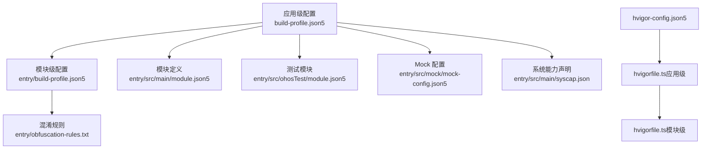
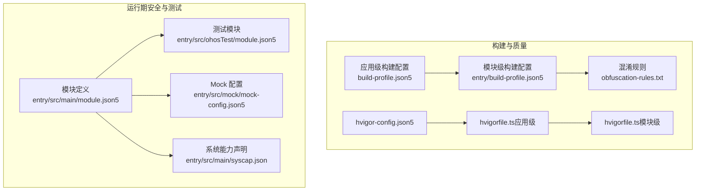
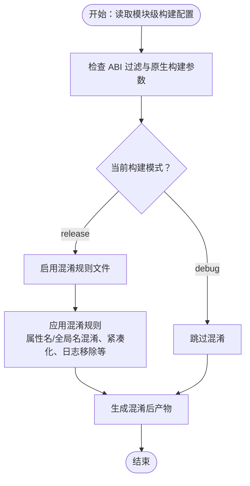
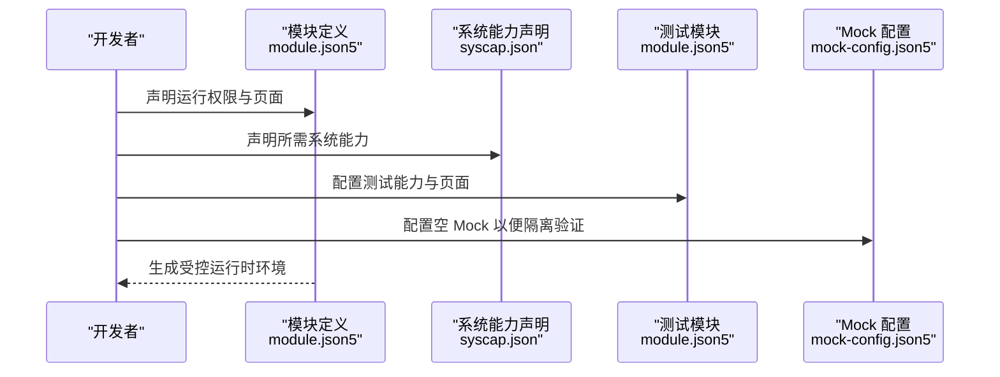
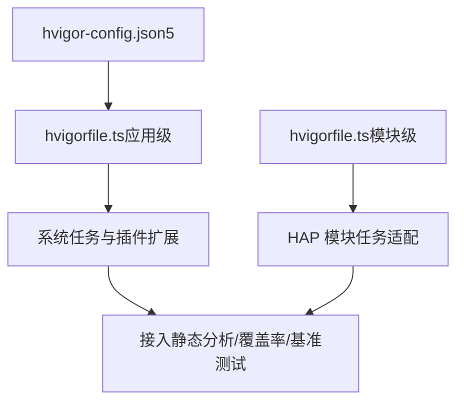
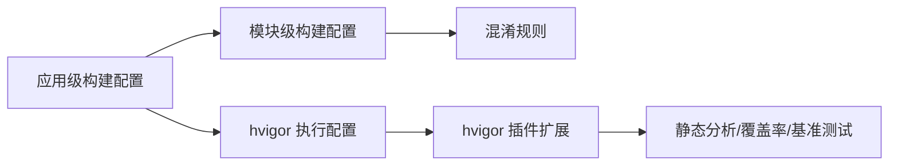

# 代码质量保证

<cite>
**本文引用的文件**
- [entry/build-profile.json5](file://entry/build-profile.json5)
- [build-profile.json5](file://build-profile.json5)
- [obfuscation-rules.txt](file://entry/obfuscation-rules.txt)
- [hvigorfile.ts（应用级）](file://hvigorfile.ts)
- [hvigorfile.ts（模块级）](file://entry/hvigorfile.ts)
- [hvigor-config.json5](file://hvigor/hvigor-config.json5)
- [entry/src/main/module.json5](file://entry/src/main/module.json5)
- [entry/src/ohosTest/module.json5](file://entry/src/ohosTest/module.json5)
- [entry/src/mock/mock-config.json5](file://entry/src/mock/mock-config.json5)
- [entry/src/main/syscap.json](file://entry/src/main/syscap.json)
</cite>

## 目录
1. [简介](#简介)
2. [项目结构](#项目结构)
3. [核心组件](#核心组件)
4. [架构总览](#架构总览)
5. [详细组件分析](#详细组件分析)
6. [依赖分析](#依赖分析)
7. [性能考虑](#性能考虑)
8. [故障排查指南](#故障排查指南)
9. [结论](#结论)
10. [附录](#附录)

## 简介
本文件面向代码质量保证，系统化梳理本项目的质量标准、工具配置与流程实践，覆盖静态代码分析、代码风格检查、安全漏洞扫描、代码混淆、构建优化、覆盖率与性能基准测试、内存泄漏检测、代码审查流程、质量门禁与持续集成配置等主题。同时结合仓库中的构建配置与混淆规则文件，明确可落地的质量保障措施与实施路径。

## 项目结构
本项目采用多模块结构，核心入口模块为 entry，应用级与模块级分别提供构建与打包配置；hvigor 提供统一的构建编排能力；测试模块与模拟配置支持质量验证与回归。

**图表来源**
- [build-profile.json5](file://build-profile.json5#L1-L51)
- [entry/build-profile.json5](file://entry/build-profile.json5#L1-L39)
- [obfuscation-rules.txt](file://entry/obfuscation-rules.txt#L1-L18)
- [entry/src/main/module.json5](file://entry/src/main/module.json5#L1-L86)
- [entry/src/ohosTest/module.json5](file://entry/src/ohosTest/module.json5#L1-L38)
- [entry/src/mock/mock-config.json5](file://entry/src/mock/mock-config.json5#L1-L2)
- [entry/src/main/syscap.json](file://entry/src/main/syscap.json#L1-L13)
- [hvigorfile.ts（应用级）](file://hvigorfile.ts#L1-L7)
- [hvigorfile.ts（模块级）](file://entry/hvigorfile.ts#L1-L7)
- [hvigor-config.json5](file://hvigor/hvigor-config.json5#L1-L21)

**章节来源**
- [build-profile.json5](file://build-profile.json5#L1-L51)
- [entry/build-profile.json5](file://entry/build-profile.json5#L1-L39)
- [hvigorfile.ts（应用级）](file://hvigorfile.ts#L1-L7)
- [hvigorfile.ts（模块级）](file://entry/hvigorfile.ts#L1-L7)
- [hvigor-config.json5](file://hvigor/hvigor-config.json5#L1-L21)

## 核心组件
- 构建与质量配置
  - 应用级构建配置：定义签名、产品线、SDK 版本、构建模式集合等，支撑质量门禁与发布策略。
  - 模块级构建配置：启用 ArkTS 编译、外部原生构建参数、ABI 过滤、以及在 release 模式下启用混淆规则。
  - hvigor 构建脚本：提供系统任务与扩展插件入口，便于接入静态分析、覆盖率、基准测试等工具链。
  - hvigor 执行配置：控制并行、增量编译、类型检查等执行参数，影响构建稳定性与速度。
- 安全与合规
  - 权限声明与系统能力：集中管理运行期权限与系统能力，降低安全风险与兼容性问题。
  - 测试模块与 Mock：通过独立测试模块与空配置，隔离验证环境，减少对主流程的影响。
- 代码混淆
  - 混淆规则文件：提供可选的混淆开关、保留策略与日志清理等能力，配合模块级配置在 release 下启用。

**章节来源**
- [build-profile.json5](file://build-profile.json5#L1-L51)
- [entry/build-profile.json5](file://entry/build-profile.json5#L1-L39)
- [hvigorfile.ts（应用级）](file://hvigorfile.ts#L1-L7)
- [hvigorfile.ts（模块级）](file://entry/hvigorfile.ts#L1-L7)
- [hvigor-config.json5](file://hvigor/hvigor-config.json5#L1-L21)
- [entry/src/main/module.json5](file://entry/src/main/module.json5#L1-L86)
- [entry/src/ohosTest/module.json5](file://entry/src/ohosTest/module.json5#L1-L38)
- [entry/src/mock/mock-config.json5](file://entry/src/mock/mock-config.json5#L1-L2)
- [entry/src/main/syscap.json](file://entry/src/main/syscap.json#L1-L13)
- [obfuscation-rules.txt](file://entry/obfuscation-rules.txt#L1-L18)

## 架构总览
下图展示从源码到产物的关键质量保障路径：构建配置驱动编译与混淆，hvigor 统一编排，测试模块与权限/能力声明保障运行期安全与稳定性。

**图表来源**
- [build-profile.json5](file://build-profile.json5#L1-L51)
- [entry/build-profile.json5](file://entry/build-profile.json5#L1-L39)
- [hvigorfile.ts（应用级）](file://hvigorfile.ts#L1-L7)
- [hvigorfile.ts（模块级）](file://entry/hvigorfile.ts#L1-L7)
- [hvigor-config.json5](file://hvigor/hvigor-config.json5#L1-L21)
- [obfuscation-rules.txt](file://entry/obfuscation-rules.txt#L1-L18)
- [entry/src/main/module.json5](file://entry/src/main/module.json5#L1-L86)
- [entry/src/ohosTest/module.json5](file://entry/src/ohosTest/module.json5#L1-L38)
- [entry/src/mock/mock-config.json5](file://entry/src/mock/mock-config.json5#L1-L2)
- [entry/src/main/syscap.json](file://entry/src/main/syscap.json#L1-L13)

## 详细组件分析

### 构建与混淆配置
- 模块级构建配置要点
  - 外部原生构建：指定 CMakeLists 路径与 ABI 过滤，确保跨平台一致性与产物可控。
  - 发布模式下的混淆：在 release 构建中启用混淆规则文件，提升代码安全性与反编译难度。
- 混淆规则文件要点
  - 提供多种混淆开关与保留策略，支持属性名混淆、全局作用域名混淆、紧凑化、日志移除、名称缓存打印与复用等。
  - 支持保留特定属性名与全局名，便于与外部接口或序列化需求保持兼容。
- hvigor 执行配置
  - 可按需开启并行、增量编译、类型检查等，平衡构建速度与质量；建议在 CI 中启用类型检查以提前发现潜在问题。

**图表来源**
- [entry/build-profile.json5](file://entry/build-profile.json5#L1-L39)
- [obfuscation-rules.txt](file://entry/obfuscation-rules.txt#L1-L18)

**章节来源**
- [entry/build-profile.json5](file://entry/build-profile.json5#L1-L39)
- [obfuscation-rules.txt](file://entry/obfuscation-rules.txt#L1-L18)
- [hvigor-config.json5](file://hvigor/hvigor-config.json5#L1-L21)

### 测试与运行期安全
- 权限与系统能力
  - 权限声明集中在模块定义中，明确用途与使用场景，降低越权与隐私风险。
  - 系统能力声明限定 AI 推理等能力范围，避免不必要的能力暴露。
- 测试模块与 Mock
  - 测试模块独立打包，隔离验证环境；Mock 配置为空，便于在 CI 中快速切换不同测试场景。

**图表来源**
- [entry/src/main/module.json5](file://entry/src/main/module.json5#L1-L86)
- [entry/src/main/syscap.json](file://entry/src/main/syscap.json#L1-L13)
- [entry/src/ohosTest/module.json5](file://entry/src/ohosTest/module.json5#L1-L38)
- [entry/src/mock/mock-config.json5](file://entry/src/mock/mock-config.json5#L1-L2)

**章节来源**
- [entry/src/main/module.json5](file://entry/src/main/module.json5#L1-L86)
- [entry/src/main/syscap.json](file://entry/src/main/syscap.json#L1-L13)
- [entry/src/ohosTest/module.json5](file://entry/src/ohosTest/module.json5#L1-L38)
- [entry/src/mock/mock-config.json5](file://entry/src/mock/mock-config.json5#L1-L2)

### hvigor 构建与扩展
- 应用级与模块级 hvigorfile
  - 应用级：提供系统任务与插件扩展点，便于接入静态分析、覆盖率、基准测试等工具。
  - 模块级：针对 HAP 模块的任务进行适配，确保模块内构建流程一致。
- hvigor 执行配置
  - 可通过执行配置项控制并行、增量编译、类型检查等，建议在 CI 中启用类型检查以提升质量门禁效果。

**图表来源**
- [hvigorfile.ts（应用级）](file://hvigorfile.ts#L1-L7)
- [hvigorfile.ts（模块级）](file://entry/hvigorfile.ts#L1-L7)
- [hvigor-config.json5](file://hvigor/hvigor-config.json5#L1-L21)

**章节来源**
- [hvigorfile.ts（应用级）](file://hvigorfile.ts#L1-L7)
- [hvigorfile.ts（模块级）](file://entry/hvigorfile.ts#L1-L7)
- [hvigor-config.json5](file://hvigor/hvigor-config.json5#L1-L21)

## 依赖分析
- 配置耦合关系
  - 应用级构建配置决定产品线与 SDK 版本，模块级配置在此基础上细化 ArkTS 与原生构建参数，并在 release 下启用混淆。
  - hvigor 执行配置影响构建稳定性与速度，应与质量门禁策略协同。
- 外部依赖与集成点
  - hvigor 插件用于扩展静态分析、覆盖率与基准测试能力；建议在 CI 中统一接入这些工具，形成闭环。

**图表来源**
- [build-profile.json5](file://build-profile.json5#L1-L51)
- [entry/build-profile.json5](file://entry/build-profile.json5#L1-L39)
- [hvigor-config.json5](file://hvigor/hvigor-config.json5#L1-L21)

**章节来源**
- [build-profile.json5](file://build-profile.json5#L1-L51)
- [entry/build-profile.json5](file://entry/build-profile.json5#L1-L39)
- [hvigor-config.json5](file://hvigor/hvigor-config.json5#L1-L21)

## 性能考虑
- 构建性能
  - 启用并行与增量编译可显著缩短构建时间；在 CI 中建议固定并行度，避免资源争用。
  - 类型检查可在本地开发时关闭以提升速度，在 CI 中开启以保证质量。
- 运行性能
  - 在 release 下启用混淆可提升代码安全性；如需进一步优化，可结合 PGO（配置中已预留占位）进行性能定向优化。
  - 外部原生构建参数与 ABI 过滤确保产物体积与兼容性可控。

**章节来源**
- [hvigor-config.json5](file://hvigor/hvigor-config.json5#L1-L21)
- [entry/build-profile.json5](file://entry/build-profile.json5#L1-L39)

## 故障排查指南
- 构建失败
  - 检查 hvigor 执行配置是否与本地 Node 版本匹配；必要时调整堆大小参数。
  - 确认模块级构建配置中的原生构建路径与 ABI 设置正确。
- 混淆相关问题
  - 若运行异常，优先检查混淆规则保留项是否覆盖到必要的属性名或全局名。
  - 使用名称缓存功能进行映射追踪，定位异常原因。
- 测试与权限
  - 若测试模块无法加载，确认测试模块配置与页面路径一致。
  - 若出现权限或能力相关错误，核对模块定义中的权限声明与系统能力声明。

**章节来源**
- [hvigor-config.json5](file://hvigor/hvigor-config.json5#L1-L21)
- [entry/build-profile.json5](file://entry/build-profile.json5#L1-L39)
- [obfuscation-rules.txt](file://entry/obfuscation-rules.txt#L1-L18)
- [entry/src/ohosTest/module.json5](file://entry/src/ohosTest/module.json5#L1-L38)
- [entry/src/main/module.json5](file://entry/src/main/module.json5#L1-L86)

## 结论
本项目已具备完善的构建与混淆基础配置，结合 hvigor 的扩展能力与测试模块，可形成从构建到运行的全链路质量保障体系。建议在现有基础上补充静态分析、覆盖率与基准测试工具的 CI 集成，并完善代码审查流程与质量门禁标准，持续提升代码质量与软件可靠性。

## 附录
- 代码质量检查清单（建议）
  - 静态代码分析：接入 ESLint/Prettier/ArkTS 规则，CI 强制校验。
  - 代码风格检查：统一缩进、命名规范、注释规范。
  - 安全漏洞扫描：定期扫描依赖与权限声明，识别高危风险。
  - 代码覆盖率：要求单元测试覆盖率不低于阈值，分支覆盖率达标。
  - 性能基准测试：对关键路径进行基准测试，建立回归基线。
  - 内存泄漏检测：在测试模块中引入内存检测工具，定期回归。
  - 代码审查流程：双人审查、变更评审、自动化门禁。
  - 质量门禁标准：构建失败、静态检查失败、覆盖率不足、基准回归不通过均阻断发布。
  - 持续集成配置：在 CI 中统一执行上述流程，输出报告与制品。