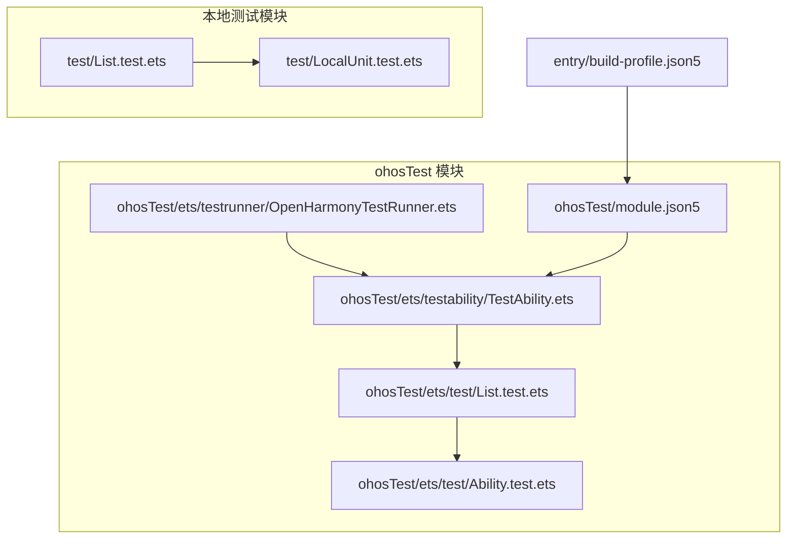
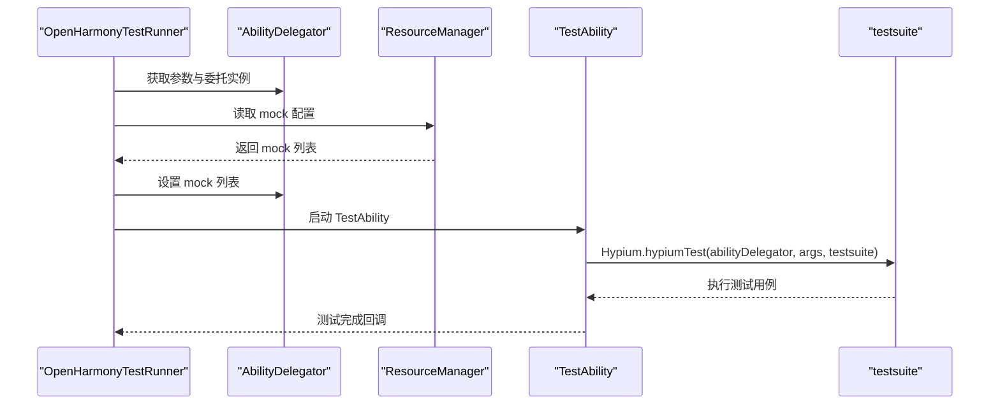
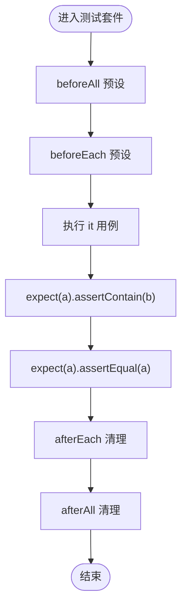
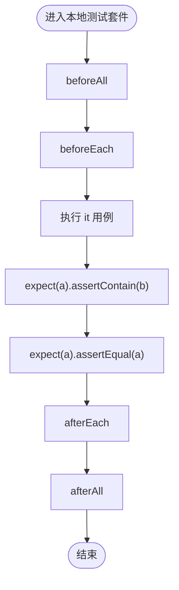
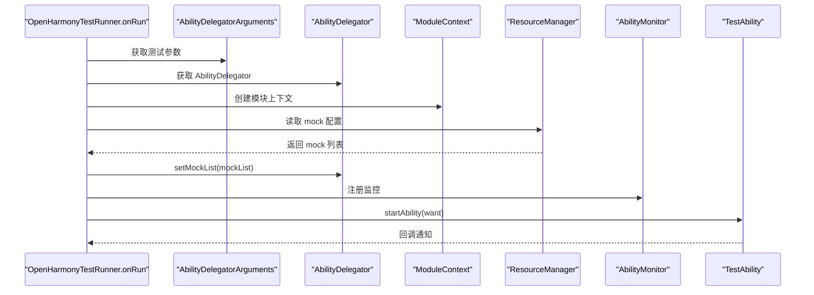
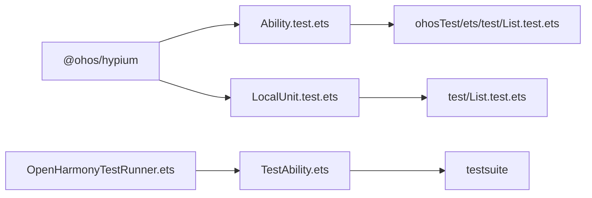

# 单元测试

<cite>
**本文引用的文件**
- [entry/src/ohosTest/ets/test/List.test.ets](file://entry/src/ohosTest/ets/test/List.test.ets)
- [entry/src/ohosTest/ets/test/Ability.test.ets](file://entry/src/ohosTest/ets/test/Ability.test.ets)
- [entry/src/test/List.test.ets](file://entry/src/test/List.test.ets)
- [entry/src/test/LocalUnit.test.ets](file://entry/src/test/LocalUnit.test.ets)
- [entry/src/ohosTest/ets/testability/TestAbility.ets](file://entry/src/ohosTest/ets/testability/TestAbility.ets)
- [entry/src/ohosTest/ets/testrunner/OpenHarmonyTestRunner.ets](file://entry/src/ohosTest/ets/testrunner/OpenHarmonyTestRunner.ets)
- [entry/src/ohosTest/module.json5](file://entry/src/ohosTest/module.json5)
- [entry/build-profile.json5](file://entry/build-profile.json5)
</cite>

## 目录
1. [简介](#简介)
2. [项目结构](#项目结构)
3. [核心组件](#核心组件)
4. [架构总览](#架构总览)
5. [详细组件分析](#详细组件分析)
6. [依赖关系分析](#依赖关系分析)
7. [性能与覆盖率](#性能与覆盖率)
8. [故障排查指南](#故障排查指南)
9. [结论](#结论)
10. [附录：最佳实践与设计原则](#附录最佳实践与设计原则)

## 简介
本文件面向 OpenHarmony 项目中的单元测试体系，系统性梳理测试框架配置、测试用例编写规范、断言方法、测试数据准备与模拟对象使用、应用能力测试（Ability）实现方式、测试覆盖率分析、测试执行流程与结果验证方法，并总结可维护测试代码与测试用例设计原则。重点覆盖以下文件：
- 应用能力测试：entry/src/ohosTest/ets/test/Ability.test.ets
- 本地单元测试：entry/src/test/LocalUnit.test.ets
- 测试套件入口（ohosTest）：entry/src/ohosTest/ets/test/List.test.ets
- 测试套件入口（本地）：entry/src/test/List.test.ets
- 能力测试承载与运行器：entry/src/ohosTest/ets/testability/TestAbility.ets、entry/src/ohosTest/ets/testrunner/OpenHarmonyTestRunner.ets
- 模块与构建配置：entry/src/ohosTest/module.json5、entry/build-profile.json5

## 项目结构
测试相关目录与文件组织如下：
- ohosTest 测试模块
  - 测试套件入口：entry/src/ohosTest/ets/test/List.test.ets
  - 能力测试示例：entry/src/ohosTest/ets/test/Ability.test.ets
  - 能力测试承载：entry/src/ohosTest/ets/testability/TestAbility.ets
  - 测试运行器：entry/src/ohosTest/ets/testrunner/OpenHarmonyTestRunner.ets
  - 模块配置：entry/src/ohosTest/module.json5
- 本地测试模块
  - 测试套件入口：entry/src/test/List.test.ets
  - 本地单元测试：entry/src/test/LocalUnit.test.ets
- 构建配置
  - entry/build-profile.json5

图表来源
- [entry/src/ohosTest/ets/test/List.test.ets](file://entry/src/ohosTest/ets/test/List.test.ets#L1-L5)
- [entry/src/ohosTest/ets/test/Ability.test.ets](file://entry/src/ohosTest/ets/test/Ability.test.ets#L1-L35)
- [entry/src/ohosTest/ets/testability/TestAbility.ets](file://entry/src/ohosTest/ets/testability/TestAbility.ets#L1-L25)
- [entry/src/ohosTest/ets/testrunner/OpenHarmonyTestRunner.ets](file://entry/src/ohosTest/ets/testrunner/OpenHarmonyTestRunner.ets#L1-L92)
- [entry/src/ohosTest/module.json5](file://entry/src/ohosTest/module.json5#L1-L38)
- [entry/src/test/List.test.ets](file://entry/src/test/List.test.ets#L1-L5)
- [entry/src/test/LocalUnit.test.ets](file://entry/src/test/LocalUnit.test.ets#L1-L33)
- [entry/build-profile.json5](file://entry/build-profile.json5#L1-L39)

章节来源
- [entry/src/ohosTest/ets/test/List.test.ets](file://entry/src/ohosTest/ets/test/List.test.ets#L1-L5)
- [entry/src/test/List.test.ets](file://entry/src/test/List.test.ets#L1-L5)
- [entry/src/ohosTest/module.json5](file://entry/src/ohosTest/module.json5#L1-L38)
- [entry/build-profile.json5](file://entry/build-profile.json5#L1-L39)

## 核心组件
- 测试框架与断言
  - 使用 @ohos/hypium 提供的 describe、beforeAll、beforeEach、afterEach、afterAll、it、expect 等 API 组织测试套件与用例。
  - 断言示例：expect(a).assertContain(b)、expect(a).assertEqual(a)。
- 测试套件入口
  - ohosTest 套件入口：导入并调用能力测试函数。
  - 本地套件入口：导入并调用本地单元测试函数。
- 能力测试承载与运行
  - TestAbility 在 onCreate 中通过 Hypium.hypiumTest 启动测试套件。
  - OpenHarmonyTestRunner 在 onRun 中初始化 AbilityDelegator、注册监控、启动 TestAbility，并加载 mock 配置。
- 模块与构建
  - ohosTest/module.json5 定义测试模块、测试能力与页面。
  - build-profile.json5 的 targets 包含 ohosTest 目标，确保测试模块被构建。

章节来源
- [entry/src/ohosTest/ets/test/Ability.test.ets](file://entry/src/ohosTest/ets/test/Ability.test.ets#L1-L35)
- [entry/src/test/LocalUnit.test.ets](file://entry/src/test/LocalUnit.test.ets#L1-L33)
- [entry/src/ohosTest/ets/testability/TestAbility.ets](file://entry/src/ohosTest/ets/testability/TestAbility.ets#L1-L25)
- [entry/src/ohosTest/ets/testrunner/OpenHarmonyTestRunner.ets](file://entry/src/ohosTest/ets/testrunner/OpenHarmonyTestRunner.ets#L1-L92)
- [entry/src/ohosTest/module.json5](file://entry/src/ohosTest/module.json5#L1-L38)
- [entry/build-profile.json5](file://entry/build-profile.json5#L1-L39)

## 架构总览
下图展示从测试运行器到测试承载能力再到具体测试套件的执行链路。

图表来源
- [entry/src/ohosTest/ets/testrunner/OpenHarmonyTestRunner.ets](file://entry/src/ohosTest/ets/testrunner/OpenHarmonyTestRunner.ets#L31-L58)
- [entry/src/ohosTest/ets/testability/TestAbility.ets](file://entry/src/ohosTest/ets/testability/TestAbility.ets#L10-L21)

## 详细组件分析

### 能力测试（Ability.test.ets）
- 测试组织
  - 使用 describe 定义测试套件名称“ActsAbilityTest”。
  - 使用 beforeAll/beforeEach/afterEach/afterAll 进行全局与每条用例的预处理与清理。
- 测试用例
  - it('assertContain', ...) 定义单个测试用例，内部通过 hilog 输出日志标记开始。
  - 使用 expect 对变量进行断言，如 assertContain、assertEqual。
- 数据与模拟
  - 示例中直接构造字符串变量 a、b 并断言，未见外部 mock 注入逻辑；若需模拟外部依赖，可在运行器阶段通过 mock 配置注入。

图表来源
- [entry/src/ohosTest/ets/test/Ability.test.ets](file://entry/src/ohosTest/ets/test/Ability.test.ets#L4-L35)

章节来源
- [entry/src/ohosTest/ets/test/Ability.test.ets](file://entry/src/ohosTest/ets/test/Ability.test.ets#L1-L35)

### 本地单元测试（LocalUnit.test.ets）
- 结构与能力测试一致，均基于 @ohos/hypium。
- 测试套件名称为“localUnitTest”，包含生命周期钩子与一条断言用例。
- 断言方法同上，用于验证本地逻辑正确性。

图表来源
- [entry/src/test/LocalUnit.test.ets](file://entry/src/test/LocalUnit.test.ets#L3-L33)

章节来源
- [entry/src/test/LocalUnit.test.ets](file://entry/src/test/LocalUnit.test.ets#L1-L33)

### 测试套件入口（ohosTest 与本地）
- ohosTest 套件入口（List.test.ets）
  - 导入能力测试函数并执行，作为 ohosTest 模块的统一入口。
- 本地套件入口（List.test.ets）
  - 导入本地单元测试函数并执行，作为本地测试的统一入口。

章节来源
- [entry/src/ohosTest/ets/test/List.test.ets](file://entry/src/ohosTest/ets/test/List.test.ets#L1-L5)
- [entry/src/test/List.test.ets](file://entry/src/test/List.test.ets#L1-L5)

### 能力测试承载与运行（TestAbility 与 OpenHarmonyTestRunner）
- TestAbility
  - 在 onCreate 中获取 AbilityDelegator 与参数，调用 Hypium.hypiumTest 传入 testsuite，从而在真实或模拟环境中执行测试。
- OpenHarmonyTestRunner
  - onRun 中获取 AbilityDelegator 与参数，创建模块上下文与资源管理器。
  - 读取 mock 配置（默认路径 mock/mock-config.json），解析为 mock 列表并设置到 AbilityDelegator。
  - 注册 AbilityMonitor 并启动 TestAbility，随后输出日志标记执行结束。

图表来源
- [entry/src/ohosTest/ets/testrunner/OpenHarmonyTestRunner.ets](file://entry/src/ohosTest/ets/testrunner/OpenHarmonyTestRunner.ets#L31-L58)
- [entry/src/ohosTest/ets/testability/TestAbility.ets](file://entry/src/ohosTest/ets/testability/TestAbility.ets#L10-L21)

章节来源
- [entry/src/ohosTest/ets/testability/TestAbility.ets](file://entry/src/ohosTest/ets/testability/TestAbility.ets#L1-L25)
- [entry/src/ohosTest/ets/testrunner/OpenHarmonyTestRunner.ets](file://entry/src/ohosTest/ets/testrunner/OpenHarmonyTestRunner.ets#L1-L92)

### 模块与构建配置
- ohosTest/module.json5
  - 定义测试模块名、类型、主入口能力 TestAbility、页面与设备类型等。
- build-profile.json5
  - targets 中包含 ohosTest 目标，确保测试模块参与构建。

章节来源
- [entry/src/ohosTest/module.json5](file://entry/src/ohosTest/module.json5#L1-L38)
- [entry/build-profile.json5](file://entry/build-profile.json5#L31-L38)

## 依赖关系分析
- 框架依赖
  - @ohos/hypium：提供测试组织与断言 API。
  - @ohos/application.testRunner：测试运行器接口。
  - @ohos.app.ability.*：UIAbility、AbilityDelegator、AbilityDelegatorRegistry、Want 等。
  - @ohos.resourceManager、@ohos.util：资源读取与文本解码。
- 文件间依赖
  - ohosTest 套件入口依赖能力测试函数。
  - 本地套件入口依赖本地单元测试函数。
  - TestAbility 依赖 Hypium 并接收 testsuite。
  - OpenHarmonyTestRunner 依赖 AbilityDelegator 与 ResourceManager。

图表来源
- [entry/src/ohosTest/ets/test/Ability.test.ets](file://entry/src/ohosTest/ets/test/Ability.test.ets#L1-L35)
- [entry/src/test/LocalUnit.test.ets](file://entry/src/test/LocalUnit.test.ets#L1-L33)
- [entry/src/ohosTest/ets/test/List.test.ets](file://entry/src/ohosTest/ets/test/List.test.ets#L1-L5)
- [entry/src/test/List.test.ets](file://entry/src/test/List.test.ets#L1-L5)
- [entry/src/ohosTest/ets/testability/TestAbility.ets](file://entry/src/ohosTest/ets/testability/TestAbility.ets#L1-L25)
- [entry/src/ohosTest/ets/testrunner/OpenHarmonyTestRunner.ets](file://entry/src/ohosTest/ets/testrunner/OpenHarmonyTestRunner.ets#L1-L92)

章节来源
- [entry/src/ohosTest/ets/test/Ability.test.ets](file://entry/src/ohosTest/ets/test/Ability.test.ets#L1-L35)
- [entry/src/test/LocalUnit.test.ets](file://entry/src/test/LocalUnit.test.ets#L1-L33)
- [entry/src/ohosTest/ets/testability/TestAbility.ets](file://entry/src/ohosTest/ets/testability/TestAbility.ets#L1-L25)
- [entry/src/ohosTest/ets/testrunner/OpenHarmonyTestRunner.ets](file://entry/src/ohosTest/ets/testrunner/OpenHarmonyTestRunner.ets#L1-L92)

## 性能与覆盖率
- 性能特征
  - 测试运行器在 onRun 中进行资源读取与 AbilityDelegator 初始化，建议避免在测试中进行重型 IO 或网络请求，必要时使用 mock。
  - 生命周期钩子（beforeAll/beforeEach/afterEach/afterAll）可用于复用昂贵资源，减少重复初始化成本。
- 覆盖率分析
  - 当前仓库未提供覆盖率统计配置与报告生成脚本。建议在构建配置中引入覆盖率工具链，并结合测试运行器输出结果进行统计与可视化。

[本节为通用指导，不直接分析具体文件，故无章节来源]

## 故障排查指南
- 日志定位
  - 能力测试中使用 hilog 输出“it begin”等关键节点日志，便于定位用例执行状态。
  - 运行器与承载能力均输出详细日志，包括参数、错误信息与回调结果。
- 常见问题
  - mock 配置加载失败：检查 mock/mock-config.json 是否存在且格式正确；确认 ResourceManager 路径与权限。
  - Ability 启动失败：检查 TestAbility 的声明与 module.json5 中 abilities 配置是否匹配。
  - 断言失败：核对 expect 的断言方法与期望值，确保输入数据与边界条件覆盖完整。
- 排查步骤
  - 在 OpenHarmonyTestRunner.checkMock 中捕获异常并输出错误码与消息。
  - 在 TestAbility.onCreate 中确认 Hypium.hypiumTest 调用成功。
  - 在用例中增加更细粒度的日志输出以辅助定位。

章节来源
- [entry/src/ohosTest/ets/test/Ability.test.ets](file://entry/src/ohosTest/ets/test/Ability.test.ets#L25-L33)
- [entry/src/ohosTest/ets/testrunner/OpenHarmonyTestRunner.ets](file://entry/src/ohosTest/ets/testrunner/OpenHarmonyTestRunner.ets#L61-L80)
- [entry/src/ohosTest/ets/testability/TestAbility.ets](file://entry/src/ohosTest/ets/testability/TestAbility.ets#L10-L21)

## 结论
本测试体系以 @ohos/hypium 为核心，结合 OpenHarmony 的 AbilityDelegator 与 TestRunner 机制，实现了从运行器到承载能力再到具体测试套件的完整闭环。ohosTest 与本地测试分别覆盖应用能力与纯本地逻辑场景，具备清晰的入口组织与生命周期管理。建议后续完善 mock 配置、覆盖率统计与持续集成流程，以提升测试效率与质量。

[本节为总结性内容，不直接分析具体文件，故无章节来源]

## 附录：最佳实践与设计原则
- 测试用例设计
  - 单一职责：每个用例聚焦一个行为或边界条件。
  - 可重复性：用例之间相互独立，避免共享可变状态。
  - 可读性：命名清晰、断言明确、日志充分。
- 断言与数据
  - 使用 expect 的断言方法表达预期，优先覆盖正常、异常与边界场景。
  - 尽量使用简单易变的数据结构，避免复杂对象导致断言难以维护。
- 模拟与隔离
  - 外部依赖通过 AbilityDelegator 的 mock 列表注入，避免真实系统调用。
  - 对于 IO、网络与时间敏感逻辑，优先使用 mock 或替身对象。
- 生命周期与资源
  - 在 beforeAll/beforeEach 中准备最小化资源，在 afterEach/afterAll 中清理，防止泄漏。
- 可维护性
  - 将相似用例抽象为参数化测试或共享辅助函数。
  - 保持测试套件入口稳定，新增用例仅在对应测试文件中扩展。
- 执行与结果
  - 通过运行器日志与断言结果判断测试通过与否；必要时导出测试报告以便持续集成。

[本节为通用指导，不直接分析具体文件，故无章节来源]