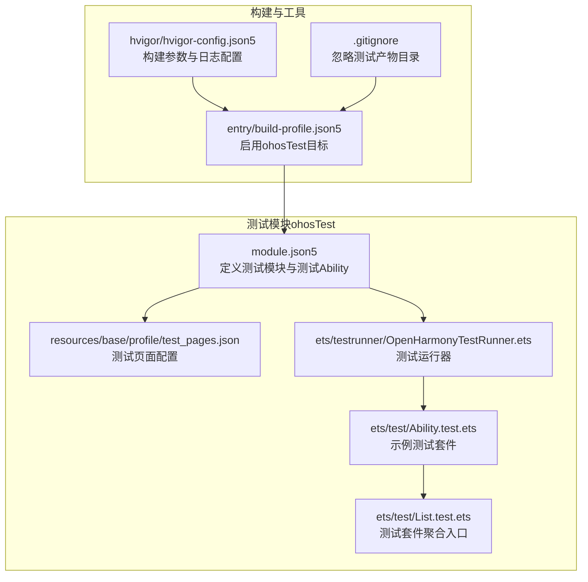
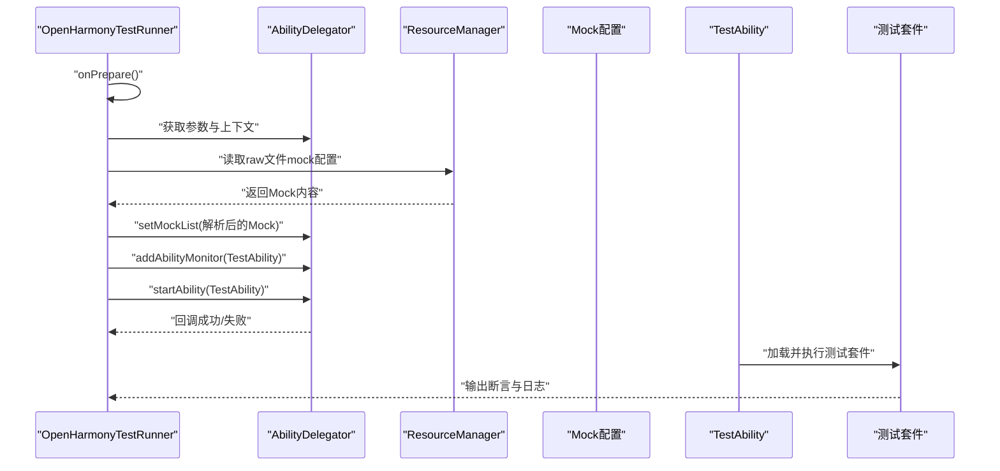
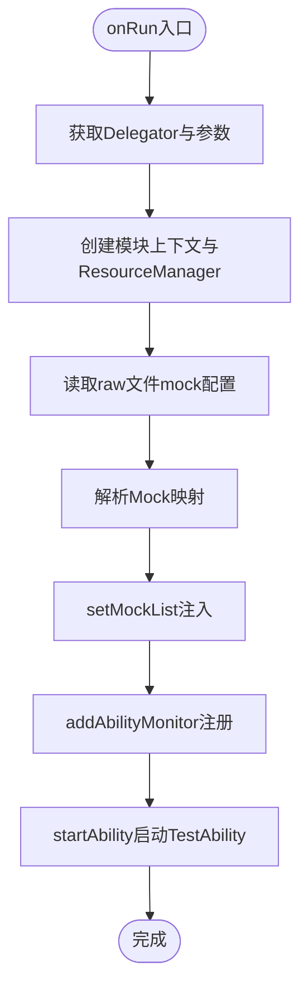
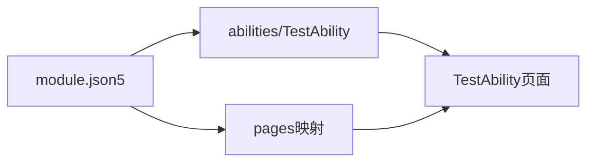
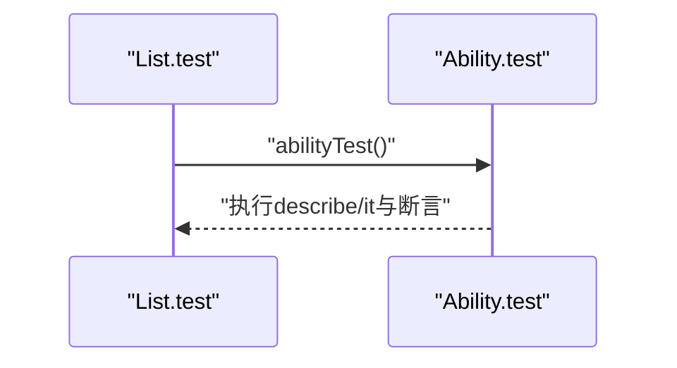
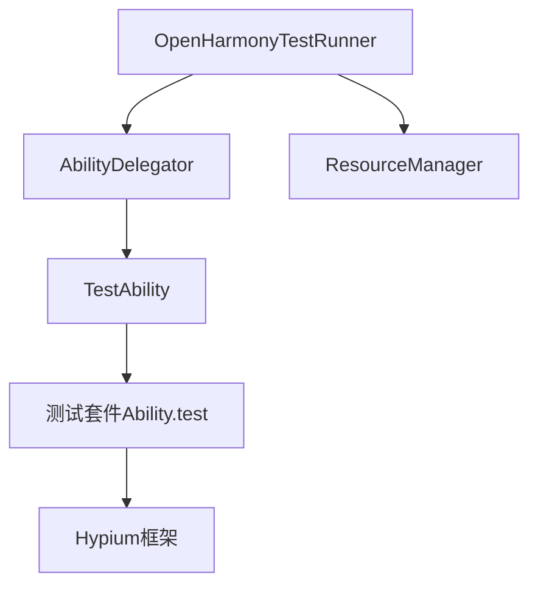

# 测试和质量保证

<cite>
**本文引用的文件**
- [entry/build-profile.json5](file://entry/build-profile.json5)
- [entry/src/ohosTest/module.json5](file://entry/src/ohosTest/module.json5)
- [entry/src/ohosTest/resources/base/profile/test_pages.json](file://entry/src/ohosTest/resources/base/profile/test_pages.json)
- [entry/src/ohosTest/ets/testrunner/OpenHarmonyTestRunner.ets](file://entry/src/ohosTest/ets/testrunner/OpenHarmonyTestRunner.ets)
- [entry/src/ohosTest/ets/test/Ability.test.ets](file://entry/src/ohosTest/ets/test/Ability.test.ets)
- [entry/src/ohosTest/ets/test/List.test.ets](file://entry/src/ohosTest/ets/test/List.test.ets)
- [entry/.gitignore](file://entry/.gitignore)
- [hvigor/hvigor-config.json5](file://hvigor/hvigor-config.json5)
</cite>

## 目录
1. [简介](#简介)
2. [项目结构](#项目结构)
3. [核心组件](#核心组件)
4. [架构总览](#架构总览)
5. [详细组件分析](#详细组件分析)
6. [依赖关系分析](#依赖关系分析)
7. [性能与稳定性测试](#性能与稳定性测试)
8. [兼容性测试指南](#兼容性测试指南)
9. [质量保障与静态分析](#质量保障与静态分析)
10. [持续集成与自动化](#持续集成与自动化)
11. [故障排除指南](#故障排除指南)
12. [结论](#结论)

## 简介
本文件面向OpenHarmony应用“测试和质量保证”的实施与维护，聚焦于单元测试、集成测试与端到端测试的组织方式、测试框架配置、测试用例设计、覆盖率分析、性能与压力测试、兼容性测试、代码质量检查与静态分析、以及持续集成与自动化流水线。文档基于仓库中现有的测试模块与配置进行系统化梳理，并提供可操作的实践建议与排障指引。

## 项目结构
测试相关能力主要位于 entry 模块下的 ohosTest 子模块，包含测试运行器、测试页面与测试套件入口等。构建配置中启用了 ohosTest 目标，便于在设备或模拟器上执行测试。

**图表来源**
- [entry/src/ohosTest/module.json5](file://entry/src/ohosTest/module.json5#L1-L38)
- [entry/src/ohosTest/resources/base/profile/test_pages.json](file://entry/src/ohosTest/resources/base/profile/test_pages.json#L1-L6)
- [entry/src/ohosTest/ets/testrunner/OpenHarmonyTestRunner.ets](file://entry/src/ohosTest/ets/testrunner/OpenHarmonyTestRunner.ets#L1-L92)
- [entry/src/ohosTest/ets/test/Ability.test.ets](file://entry/src/ohosTest/ets/test/Ability.test.ets#L1-L35)
- [entry/src/ohosTest/ets/test/List.test.ets](file://entry/src/ohosTest/ets/test/List.test.ets#L1-L5)
- [entry/build-profile.json5](file://entry/build-profile.json5#L1-L39)
- [entry/.gitignore](file://entry/.gitignore#L1-L6)
- [hvigor/hvigor-config.json5](file://hvigor/hvigor-config.json5#L1-L21)

**章节来源**
- [entry/build-profile.json5](file://entry/build-profile.json5#L1-L39)
- [entry/src/ohosTest/module.json5](file://entry/src/ohosTest/module.json5#L1-L38)
- [entry/src/ohosTest/resources/base/profile/test_pages.json](file://entry/src/ohosTest/resources/base/profile/test_pages.json#L1-L6)
- [entry/src/ohosTest/ets/testrunner/OpenHarmonyTestRunner.ets](file://entry/src/ohosTest/ets/testrunner/OpenHarmonyTestRunner.ets#L1-L92)
- [entry/src/ohosTest/ets/test/Ability.test.ets](file://entry/src/ohosTest/ets/test/Ability.test.ets#L1-L35)
- [entry/src/ohosTest/ets/test/List.test.ets](file://entry/src/ohosTest/ets/test/List.test.ets#L1-L5)
- [entry/.gitignore](file://entry/.gitignore#L1-L6)
- [hvigor/hvigor-config.json5](file://hvigor/hvigor-config.json5#L1-L21)

## 核心组件
- 测试运行器：负责在测试环境中启动测试Ability、注册监控、加载Mock配置并驱动测试执行。
- 测试模块与页面：通过 module.json5 声明测试模块、测试Ability与页面映射；test_pages.json 指定测试页面集合。
- 测试套件：以 Hypium 测试框架为基础，提供 describe/it/test 生命周期钩子与断言方法。
- 构建与工具：build-profile.json5 启用 ohosTest 目标；hvigor-config.json5 提供构建与日志级别控制；.gitignore 忽略测试产物目录。

**章节来源**
- [entry/src/ohosTest/ets/testrunner/OpenHarmonyTestRunner.ets](file://entry/src/ohosTest/ets/testrunner/OpenHarmonyTestRunner.ets#L23-L58)
- [entry/src/ohosTest/module.json5](file://entry/src/ohosTest/module.json5#L1-L38)
- [entry/src/ohosTest/resources/base/profile/test_pages.json](file://entry/src/ohosTest/resources/base/profile/test_pages.json#L1-L6)
- [entry/src/ohosTest/ets/test/Ability.test.ets](file://entry/src/ohosTest/ets/test/Ability.test.ets#L1-L35)
- [entry/build-profile.json5](file://entry/build-profile.json5#L30-L38)
- [hvigor/hvigor-config.json5](file://hvigor/hvigor-config.json5#L12-L20)
- [entry/.gitignore](file://entry/.gitignore#L4-L6)

## 架构总览
下图展示了从测试运行器到测试页面与测试套件的整体调用链路，以及Mock配置注入与日志输出的关键节点。

**图表来源**
- [entry/src/ohosTest/ets/testrunner/OpenHarmonyTestRunner.ets](file://entry/src/ohosTest/ets/testrunner/OpenHarmonyTestRunner.ets#L31-L58)
- [entry/src/ohosTest/ets/testrunner/OpenHarmonyTestRunner.ets](file://entry/src/ohosTest/ets/testrunner/OpenHarmonyTestRunner.ets#L61-L92)
- [entry/src/ohosTest/module.json5](file://entry/src/ohosTest/module.json5#L14-L35)
- [entry/src/ohosTest/ets/test/Ability.test.ets](file://entry/src/ohosTest/ets/test/Ability.test.ets#L25-L34)

**章节来源**
- [entry/src/ohosTest/ets/testrunner/OpenHarmonyTestRunner.ets](file://entry/src/ohosTest/ets/testrunner/OpenHarmonyTestRunner.ets#L27-L58)
- [entry/src/ohosTest/ets/testrunner/OpenHarmonyTestRunner.ets](file://entry/src/ohosTest/ets/testrunner/OpenHarmonyTestRunner.ets#L61-L92)
- [entry/src/ohosTest/module.json5](file://entry/src/ohosTest/module.json5#L14-L35)
- [entry/src/ohosTest/ets/test/Ability.test.ets](file://entry/src/ohosTest/ets/test/Ability.test.ets#L25-L34)

## 详细组件分析

### 测试运行器（OpenHarmonyTestRunner）
- 职责：初始化测试环境、加载Mock配置、注册Ability监控、启动测试Ability并驱动测试执行。
- 关键流程：
  - onPrepare：测试前准备。
  - onRun：获取Delegator与参数，创建模块上下文与ResourceManager；读取raw文件中的Mock配置并注入；注册监控；启动TestAbility。
  - checkMock：读取raw文件内容，解析为Mock映射后注入到Delegator。
- 日志：统一使用hilog输出关键信息与错误码/消息，便于定位问题。

**图表来源**
- [entry/src/ohosTest/ets/testrunner/OpenHarmonyTestRunner.ets](file://entry/src/ohosTest/ets/testrunner/OpenHarmonyTestRunner.ets#L31-L58)
- [entry/src/ohosTest/ets/testrunner/OpenHarmonyTestRunner.ets](file://entry/src/ohosTest/ets/testrunner/OpenHarmonyTestRunner.ets#L61-L92)

**章节来源**
- [entry/src/ohosTest/ets/testrunner/OpenHarmonyTestRunner.ets](file://entry/src/ohosTest/ets/testrunner/OpenHarmonyTestRunner.ets#L23-L58)
- [entry/src/ohosTest/ets/testrunner/OpenHarmonyTestRunner.ets](file://entry/src/ohosTest/ets/testrunner/OpenHarmonyTestRunner.ets#L61-L92)

### 测试模块与页面（module.json5 与 test_pages.json）
- module.json5：
  - 定义测试模块名称、类型、设备类型、页面与abilities。
  - 声明TestAbility及其导出属性、技能（如home入口）、页面资源映射。
- test_pages.json：
  - 指定测试页面集合，用于测试运行时加载。

**图表来源**
- [entry/src/ohosTest/module.json5](file://entry/src/ohosTest/module.json5#L14-L35)
- [entry/src/ohosTest/resources/base/profile/test_pages.json](file://entry/src/ohosTest/resources/base/profile/test_pages.json#L1-L6)

**章节来源**
- [entry/src/ohosTest/module.json5](file://entry/src/ohosTest/module.json5#L1-L38)
- [entry/src/ohosTest/resources/base/profile/test_pages.json](file://entry/src/ohosTest/resources/base/profile/test_pages.json#L1-L6)

### 测试套件（Ability.test 与 List.test）
- Ability.test：
  - 使用Hypium框架的describe/it组织测试套件，提供beforeAll/beforeEach/afterEach/afterAll生命周期钩子。
  - 示例断言：包含字符串断言与相等断言，展示基本断言方法。
- List.test：
  - 作为测试套件聚合入口，导入并执行abilityTest套件。

**图表来源**
- [entry/src/ohosTest/ets/test/List.test.ets](file://entry/src/ohosTest/ets/test/List.test.ets#L3-L5)
- [entry/src/ohosTest/ets/test/Ability.test.ets](file://entry/src/ohosTest/ets/test/Ability.test.ets#L4-L34)

**章节来源**
- [entry/src/ohosTest/ets/test/Ability.test.ets](file://entry/src/ohosTest/ets/test/Ability.test.ets#L1-L35)
- [entry/src/ohosTest/ets/test/List.test.ets](file://entry/src/ohosTest/ets/test/List.test.ets#L1-L5)

### 构建与工具配置
- build-profile.json5：
  - 启用ohosTest目标，确保测试模块参与构建。
  - 外部原生构建配置（CMake）与ABI过滤（arm64-v8a）已设置。
- hvigor-config.json5：
  - 提供构建执行、日志级别、调试选项等配置项，便于在CI或本地调试时调整。
- .gitignore：
  - 忽略构建产物与测试产物目录，避免污染版本库。

**章节来源**
- [entry/build-profile.json5](file://entry/build-profile.json5#L30-L38)
- [hvigor/hvigor-config.json5](file://hvigor/hvigor-config.json5#L5-L20)
- [entry/.gitignore](file://entry/.gitignore#L4-L6)

## 依赖关系分析
- 组件耦合：
  - 测试运行器依赖AbilityDelegator与ResourceManager，用于启动测试Ability与加载Mock配置。
  - 测试模块与页面通过module.json5声明，TestAbility作为测试入口。
  - 测试套件通过List.test聚合，形成统一的测试入口。
- 外部依赖：
  - Hypium测试框架（describe/it/expect等）。
  - OpenHarmony系统能力（UIAbility、TestRunner接口、AbilityDelegatorRegistry等）。

**图表来源**
- [entry/src/ohosTest/ets/testrunner/OpenHarmonyTestRunner.ets](file://entry/src/ohosTest/ets/testrunner/OpenHarmonyTestRunner.ets#L34-L56)
- [entry/src/ohosTest/module.json5](file://entry/src/ohosTest/module.json5#L14-L35)
- [entry/src/ohosTest/ets/test/Ability.test.ets](file://entry/src/ohosTest/ets/test/Ability.test.ets#L1-L35)

**章节来源**
- [entry/src/ohosTest/ets/testrunner/OpenHarmonyTestRunner.ets](file://entry/src/ohosTest/ets/testrunner/OpenHarmonyTestRunner.ets#L34-L56)
- [entry/src/ohosTest/module.json5](file://entry/src/ohosTest/module.json5#L14-L35)
- [entry/src/ohosTest/ets/test/Ability.test.ets](file://entry/src/ohosTest/ets/test/Ability.test.ets#L1-L35)

## 性能与稳定性测试
- 单元测试：
  - 在Ability.test中使用Hypium的生命周期钩子组织用例，建议针对关键函数与边界条件编写断言。
  - 将耗时逻辑拆分为独立函数并通过Mock替换外部依赖，提升可测性与执行速度。
- 集成测试：
  - 利用TestAbility承载页面级交互，验证组件间协作与数据流。
  - 通过Mock配置注入，隔离网络或系统服务，稳定测试结果。
- 端到端测试：
  - 以TestAbility为入口，结合页面导航与事件触发，覆盖用户场景主路径。
- 性能与压力：
  - 在现有测试框架基础上，可扩展对关键路径的计时与统计（如多次循环执行与平均耗时），但需注意测试运行器与设备性能差异。
- 覆盖率分析：
  - 结合构建配置与IDE/CI工具，开启覆盖率收集与报告生成，重点关注核心业务分支与异常路径。

[本节为通用指导，不直接分析具体文件，故无“章节来源”]

## 兼容性测试指南
- 设备类型：
  - 测试模块声明支持多种设备类型，可在不同设备形态上验证功能一致性。
- ABI与系统版本：
  - 构建配置中指定ABI为arm64-v8a，建议在多版本OpenHarmony系统上验证兼容性。
- 页面适配：
  - 通过TestAbility与test_pages.json加载测试页面，验证不同分辨率与主题下的显示与交互。

**章节来源**
- [entry/src/ohosTest/module.json5](file://entry/src/ohosTest/module.json5#L7-L13)
- [entry/build-profile.json5](file://entry/build-profile.json5#L11-L14)

## 质量保障与静态分析
- 代码规范：
  - 使用统一的日志标签与格式，便于问题定位与审计。
- 静态分析：
  - 在CI中集成静态分析工具（如ESLint/Harmony Lint），对测试代码与被测代码进行规则校验。
- 错误处理：
  - 测试运行器对ResourceManager与Delegator操作捕获异常并输出错误码/消息，建议在断言失败时也输出明确上下文信息。

**章节来源**
- [entry/src/ohosTest/ets/testrunner/OpenHarmonyTestRunner.ets](file://entry/src/ohosTest/ets/testrunner/OpenHarmonyTestRunner.ets#L61-L92)

## 持续集成与自动化
- 构建目标：
  - build-profile.json5中启用ohosTest目标，确保CI可构建并运行测试模块。
- 执行流程：
  - 在CI中先执行构建，再通过测试运行器启动TestAbility并执行测试套件。
- 日志与产物：
  - hvigor-config.json5可调整日志级别，便于CI输出更详尽的诊断信息。
  - .gitignore确保测试产物不进入版本库。

**章节来源**
- [entry/build-profile.json5](file://entry/build-profile.json5#L30-L38)
- [hvigor/hvigor-config.json5](file://hvigor/hvigor-config.json5#L12-L20)
- [entry/.gitignore](file://entry/.gitignore#L4-L6)

## 故障排除指南
- 测试无法启动或页面未加载：
  - 检查TestAbility是否正确声明与导出，确认module.json5中的abilities与pages配置。
  - 验证TestAbility是否在监控列表中注册，确保startAbility调用成功。
- Mock配置未生效：
  - 确认mock配置文件路径与名称一致，且已放置在raw文件目录。
  - 查看ResourceManager读取与解析过程的日志，关注错误码与消息。
- 断言失败：
  - 在断言前后输出关键变量与状态，便于定位期望值与实际值差异。
  - 对异常路径补充断言与日志，确保失败场景可追溯。

**章节来源**
- [entry/src/ohosTest/module.json5](file://entry/src/ohosTest/module.json5#L14-L35)
- [entry/src/ohosTest/ets/testrunner/OpenHarmonyTestRunner.ets](file://entry/src/ohosTest/ets/testrunner/OpenHarmonyTestRunner.ets#L48-L56)
- [entry/src/ohosTest/ets/testrunner/OpenHarmonyTestRunner.ets](file://entry/src/ohosTest/ets/testrunner/OpenHarmonyTestRunner.ets#L61-L92)

## 结论
本测试体系以ohosTest模块为核心，结合测试运行器、测试页面与测试套件，形成从单元到端到端的测试闭环。通过Mock配置与生命周期钩子，能够稳定地验证功能与边界行为。建议在现有基础上完善覆盖率统计、性能与压力指标采集，并在CI中固化测试流程与质量门禁，持续提升交付质量与稳定性。