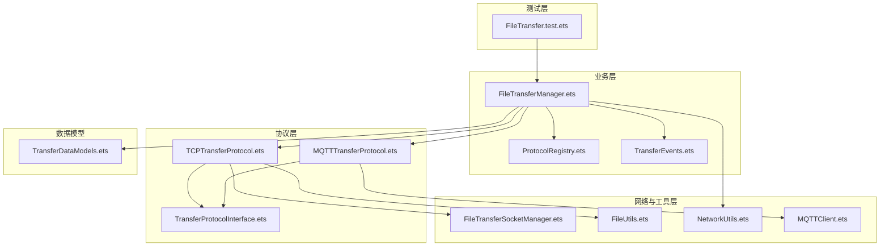
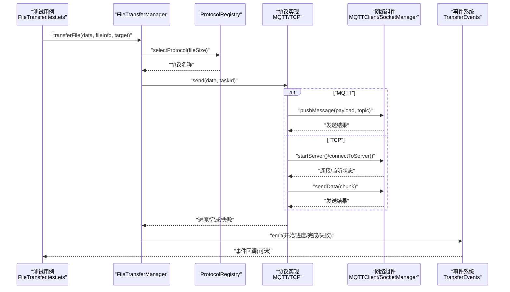
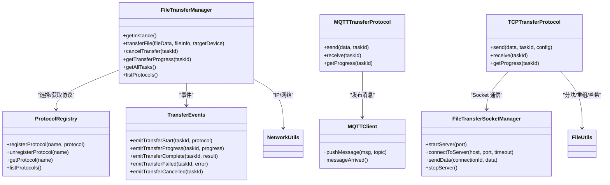

# 集成测试

<cite>
**本文引用的文件**
- [FileTransfer.test.ets](file://entry/src/test/transfer/FileTransfer.test.ets)
- [FileTransferManager.ets](file://entry/src/main/ets/manager/transfer/FileTransferManager.ets)
- [TCPTransferProtocol.ets](file://entry/src/main/ets/manager/transfer/protocol/TCPTransferProtocol.ets)
- [MQTTTransferProtocol.ets](file://entry/src/main/ets/manager/transfer/protocol/MQTTTransferProtocol.ets)
- [FileTransferSocketManager.ets](file://entry/src/main/ets/manager/transfer/socket/FileTransferSocketManager.ets)
- [TransferDataModels.ets](file://entry/src/main/ets/manager/transfer/model/TransferDataModels.ets)
- [TransferEvents.ets](file://entry/src/main/ets/manager/transfer/event/TransferEvents.ets)
- [FileUtils.ets](file://entry/src/main/ets/manager/transfer/utils/FileUtils.ets)
- [NetworkUtils.ets](file://entry/src/main/ets/manager/transfer/utils/NetworkUtils.ets)
- [TransferProtocolInterface.ets](file://entry/src/main/ets/manager/transfer/protocol/TransferProtocolInterface.ets)
- [ProtocolRegistry.ets](file://entry/src/main/ets/manager/transfer/protocol/ProtocolRegistry.ets)
- [MQTTClient.ets](file://entry/src/main/ets/manager/broker/MQTTClient.ets)
</cite>

## 目录
1. [简介](#简介)
2. [项目结构](#项目结构)
3. [核心组件](#核心组件)
4. [架构总览](#架构总览)
5. [详细组件分析](#详细组件分析)
6. [依赖关系分析](#依赖关系分析)
7. [性能考虑](#性能考虑)
8. [故障排除指南](#故障排除指南)
9. [结论](#结论)
10. [附录](#附录)

## 简介
本文件面向集成测试，围绕文件传输模块的集成测试实现展开，重点覆盖：
- 传输协议测试（MQTT 与 TCP）
- 网络通信测试（Socket 与 MQTT）
- 数据完整性验证（分块、重组、哈希）
- 多模块协作测试方法与策略
- 测试环境搭建与依赖管理
- 端到端测试流程、测试数据准备与场景设计
- 性能测试、压力测试与兼容性测试方法
- 调试技巧与故障排除

## 项目结构
文件传输模块采用“管理器 + 协议 + Socket/网络 + 工具 + 事件”的分层架构，测试文件位于测试目录，覆盖协议注册、工具函数、网络工具、管理器行为与集成场景。

图表来源
- [FileTransfer.test.ets](file://entry/src/test/transfer/FileTransfer.test.ets#L1-L205)
- [FileTransferManager.ets](file://entry/src/main/ets/manager/transfer/FileTransferManager.ets#L1-L375)
- [ProtocolRegistry.ets](file://entry/src/main/ets/manager/transfer/protocol/ProtocolRegistry.ets#L1-L93)
- [TransferEvents.ets](file://entry/src/main/ets/manager/transfer/event/TransferEvents.ets#L1-L206)
- [MQTTTransferProtocol.ets](file://entry/src/main/ets/manager/transfer/protocol/MQTTTransferProtocol.ets#L1-L185)
- [TCPTransferProtocol.ets](file://entry/src/main/ets/manager/transfer/protocol/TCPTransferProtocol.ets#L1-L351)
- [FileTransferSocketManager.ets](file://entry/src/main/ets/manager/transfer/socket/FileTransferSocketManager.ets#L1-L354)
- [FileUtils.ets](file://entry/src/main/ets/manager/transfer/utils/FileUtils.ets#L1-L193)
- [NetworkUtils.ets](file://entry/src/main/ets/manager/transfer/utils/NetworkUtils.ets#L1-L131)
- [TransferProtocolInterface.ets](file://entry/src/main/ets/manager/transfer/protocol/TransferProtocolInterface.ets#L1-L120)
- [MQTTClient.ets](file://entry/src/main/ets/manager/broker/MQTTClient.ets#L1-L223)
- [TransferDataModels.ets](file://entry/src/main/ets/manager/transfer/model/TransferDataModels.ets#L1-L113)

章节来源
- [FileTransfer.test.ets](file://entry/src/test/transfer/FileTransfer.test.ets#L1-L205)
- [FileTransferManager.ets](file://entry/src/main/ets/manager/transfer/FileTransferManager.ets#L1-L375)

## 核心组件
- FileTransferManager：统一入口，负责协议选择、任务调度、事件触发与状态管理。
- ProtocolRegistry：协议注册与发现中心。
- MQTTTransferProtocol/TCPTransferProtocol：两种传输协议实现，分别适配小文件（MQTT）与大文件（TCP）。
- FileTransferSocketManager：TCP Socket 生命周期与数据收发管理。
- MQTTClient：MQTT 客户端封装与消息发布/订阅。
- TransferEvents：传输事件的发布与监听。
- FileUtils/NetworkUtils：数据处理与网络工具。
- TransferDataModels：传输相关的数据结构。

章节来源
- [FileTransferManager.ets](file://entry/src/main/ets/manager/transfer/FileTransferManager.ets#L17-L375)
- [ProtocolRegistry.ets](file://entry/src/main/ets/manager/transfer/protocol/ProtocolRegistry.ets#L7-L93)
- [MQTTTransferProtocol.ets](file://entry/src/main/ets/manager/transfer/protocol/MQTTTransferProtocol.ets#L10-L185)
- [TCPTransferProtocol.ets](file://entry/src/main/ets/manager/transfer/protocol/TCPTransferProtocol.ets#L23-L351)
- [FileTransferSocketManager.ets](file://entry/src/main/ets/manager/transfer/socket/FileTransferSocketManager.ets#L31-L354)
- [TransferEvents.ets](file://entry/src/main/ets/manager/transfer/event/TransferEvents.ets#L62-L206)
- [FileUtils.ets](file://entry/src/main/ets/manager/transfer/utils/FileUtils.ets#L8-L193)
- [NetworkUtils.ets](file://entry/src/main/ets/manager/transfer/utils/NetworkUtils.ets#L7-L131)
- [TransferDataModels.ets](file://entry/src/main/ets/manager/transfer/model/TransferDataModels.ets#L10-L113)

## 架构总览
下图展示从测试到业务层、协议层与网络层的调用链路，以及事件驱动的反馈机制。

图表来源
- [FileTransfer.test.ets](file://entry/src/test/transfer/FileTransfer.test.ets#L177-L203)
- [FileTransferManager.ets](file://entry/src/main/ets/manager/transfer/FileTransferManager.ets#L105-L187)
- [ProtocolRegistry.ets](file://entry/src/main/ets/manager/transfer/protocol/ProtocolRegistry.ets#L55-L66)
- [MQTTTransferProtocol.ets](file://entry/src/main/ets/manager/transfer/protocol/MQTTTransferProtocol.ets#L70-L109)
- [TCPTransferProtocol.ets](file://entry/src/main/ets/manager/transfer/protocol/TCPTransferProtocol.ets#L123-L205)
- [FileTransferSocketManager.ets](file://entry/src/main/ets/manager/transfer/socket/FileTransferSocketManager.ets#L63-L228)
- [TransferEvents.ets](file://entry/src/main/ets/manager/transfer/event/TransferEvents.ets#L161-L204)

## 详细组件分析

### 测试文件：FileTransfer.test.ets
- 覆盖范围
  - 协议注册中心：注册/获取/列出协议。
  - 工具函数：分块、重组、哈希、Base64 转换、字符串与 ArrayBuffer 转换。
  - 网络工具：IP 获取、IP/端口校验。
  - 管理器：单例、配置、任务列表、协议列表、集成场景（模拟传输）。
- 测试策略
  - 单元测试：针对工具与注册中心的纯函数行为。
  - 集成测试：通过管理器发起传输，验证流程与错误处理。
- 关键断言
  - 协议注册与发现。
  - 分块数量与最后一块标记。
  - 哈希计算与校验。
  - IP/端口有效性。
  - 任务状态与进度查询。

章节来源
- [FileTransfer.test.ets](file://entry/src/test/transfer/FileTransfer.test.ets#L15-L37)
- [FileTransfer.test.ets](file://entry/src/test/transfer/FileTransfer.test.ets#L39-L93)
- [FileTransfer.test.ets](file://entry/src/test/transfer/FileTransfer.test.ets#L95-L116)
- [FileTransfer.test.ets](file://entry/src/test/transfer/FileTransfer.test.ets#L118-L175)
- [FileTransfer.test.ets](file://entry/src/test/transfer/FileTransfer.test.ets#L177-L203)

### FileTransferManager：统一传输入口
- 功能要点
  - 协议选择：依据文件大小阈值自动选择 MQTT 或 TCP。
  - 任务管理：任务队列、状态维护、进度查询、取消与清理。
  - 事件驱动：传输开始、进度、完成、失败、取消事件。
  - 配置管理：默认阈值、分块大小、重试次数、超时、端口。
- 关键流程
  - 生成任务 ID → 选择协议 → 创建任务 → 触发开始事件 → 执行传输 → 更新状态 → 触发完成/失败事件。
- 并发与清理
  - 任务完成后定时清理，避免内存泄漏。

章节来源
- [FileTransferManager.ets](file://entry/src/main/ets/manager/transfer/FileTransferManager.ets#L17-L375)

### 协议层：MQTT 与 TCP
- MQTTTransferProtocol
  - 适用场景：小文件（≤阈值）。
  - 实现要点：Base64 编码、MQTT 发布、重试机制、进度上报。
- TCPTransferProtocol
  - 适用场景：大文件（>阈值）。
  - 实现要点：分块、握手（预留）、逐块发送、进度上报、完成消息（预留）。
  - 依赖：FileTransferSocketManager、FileUtils、TransferEvents。

章节来源
- [MQTTTransferProtocol.ets](file://entry/src/main/ets/manager/transfer/protocol/MQTTTransferProtocol.ets#L10-L185)
- [TCPTransferProtocol.ets](file://entry/src/main/ets/manager/transfer/protocol/TCPTransferProtocol.ets#L23-L351)

### 网络层：Socket 与 MQTT 客户端
- FileTransferSocketManager
  - 服务端监听、客户端连接、消息发送、连接关闭、活动连接统计。
- MQTTClient
  - 客户端创建、连接、订阅、消息到达事件转发、消息发布、销毁。

章节来源
- [FileTransferSocketManager.ets](file://entry/src/main/ets/manager/transfer/socket/FileTransferSocketManager.ets#L31-L354)
- [MQTTClient.ets](file://entry/src/main/ets/manager/broker/MQTTClient.ets#L24-L223)

### 数据与事件：模型与事件系统
- TransferDataModels：FileInfo、ChunkData、TransferTask、TCPHandshakeMessage、TransferOptions。
- TransferEvents：事件 ID、事件数据、事件发射与监听、传输开始/进度/完成/失败/取消等专用发射器。

章节来源
- [TransferDataModels.ets](file://entry/src/main/ets/manager/transfer/model/TransferDataModels.ets#L10-L113)
- [TransferEvents.ets](file://entry/src/main/ets/manager/transfer/event/TransferEvents.ets#L62-L206)

### 工具与网络：FileUtils 与 NetworkUtils
- FileUtils：分块/重组、SHA-256 哈希、Base64 转换、字符串与 ArrayBuffer 转换、文件信息生成。
- NetworkUtils：IP 获取、WiFi 状态、子网掩码、网关、IP/端口校验。

章节来源
- [FileUtils.ets](file://entry/src/main/ets/manager/transfer/utils/FileUtils.ets#L8-L193)
- [NetworkUtils.ets](file://entry/src/main/ets/manager/transfer/utils/NetworkUtils.ets#L7-L131)

### 协议接口与注册中心
- TransferProtocolInterface：协议标准接口与状态/进度/配置定义。
- ProtocolRegistry：协议注册、注销、查找、列举。

章节来源
- [TransferProtocolInterface.ets](file://entry/src/main/ets/manager/transfer/protocol/TransferProtocolInterface.ets#L63-L120)
- [ProtocolRegistry.ets](file://entry/src/main/ets/manager/transfer/protocol/ProtocolRegistry.ets#L7-L93)

## 依赖关系分析
- 管理器依赖注册中心与事件系统；协议实现依赖工具与网络组件；Socket 与 MQTT 客户端分别服务于 TCP 与 MQTT。
- 事件系统贯穿传输生命周期，便于测试阶段对进度与结果进行观测。

图表来源
- [FileTransferManager.ets](file://entry/src/main/ets/manager/transfer/FileTransferManager.ets#L17-L375)
- [ProtocolRegistry.ets](file://entry/src/main/ets/manager/transfer/protocol/ProtocolRegistry.ets#L7-L93)
- [MQTTTransferProtocol.ets](file://entry/src/main/ets/manager/transfer/protocol/MQTTTransferProtocol.ets#L10-L185)
- [TCPTransferProtocol.ets](file://entry/src/main/ets/manager/transfer/protocol/TCPTransferProtocol.ets#L23-L351)
- [FileTransferSocketManager.ets](file://entry/src/main/ets/manager/transfer/socket/FileTransferSocketManager.ets#L31-L354)
- [MQTTClient.ets](file://entry/src/main/ets/manager/broker/MQTTClient.ets#L24-L223)
- [TransferEvents.ets](file://entry/src/main/ets/manager/transfer/event/TransferEvents.ets#L62-L206)
- [FileUtils.ets](file://entry/src/main/ets/manager/transfer/utils/FileUtils.ets#L8-L193)
- [NetworkUtils.ets](file://entry/src/main/ets/manager/transfer/utils/NetworkUtils.ets#L7-L131)

## 性能考虑
- 分块大小与吞吐
  - TCP 分块大小影响带宽利用率与重传成本；建议在不同网络条件下调整阈值。
- 重试与超时
  - MQTT/TCP 均有重试与超时配置，应结合网络波动与设备性能设定。
- 事件频率
  - 进度事件过于频繁可能带来 UI 卡顿，建议合并或限频。
- 内存占用
  - 大文件分块传输与哈希计算需注意内存峰值；及时清理已完成任务。
- 并发连接
  - TCP 服务器与客户端连接数限制，避免资源耗尽。

[本节为通用指导，无需具体文件引用]

## 故障排除指南
- 协议未注册
  - 现象：选择协议时报错或返回空。
  - 排查：确认默认协议注册与自定义协议注册流程。
  - 参考
    - [FileTransferManager.ets](file://entry/src/main/ets/manager/transfer/FileTransferManager.ets#L59-L73)
    - [ProtocolRegistry.ets](file://entry/src/main/ets/manager/transfer/protocol/ProtocolRegistry.ets#L31-L66)
- MQTT 发送失败
  - 现象：MQTT 发布失败或连接异常。
  - 排查：检查 MQTT 客户端初始化、连接状态、订阅主题与消息负载。
  - 参考
    - [MQTTTransferProtocol.ets](file://entry/src/main/ets/manager/transfer/protocol/MQTTTransferProtocol.ets#L70-L109)
    - [MQTTClient.ets](file://entry/src/main/ets/manager/broker/MQTTClient.ets#L84-L104)
- TCP 连接失败
  - 现象：服务器启动失败、客户端连接超时。
  - 排查：确认本机 IP、端口占用、防火墙与网络连通性。
  - 参考
    - [FileTransferSocketManager.ets](file://entry/src/main/ets/manager/transfer/socket/FileTransferSocketManager.ets#L63-L101)
    - [FileTransferSocketManager.ets](file://entry/src/main/ets/manager/transfer/socket/FileTransferSocketManager.ets#L167-L228)
- 数据完整性问题
  - 现象：重组后文件大小不一致或哈希不匹配。
  - 排查：检查分块索引顺序、最后一块标记、哈希计算与校验。
  - 参考
    - [FileUtils.ets](file://entry/src/main/ets/manager/transfer/utils/FileUtils.ets#L46-L70)
    - [FileUtils.ets](file://entry/src/main/ets/manager/transfer/utils/FileUtils.ets#L77-L99)
    - [FileUtils.ets](file://entry/src/main/ets/manager/transfer/utils/FileUtils.ets#L107-L115)
- 事件未触发
  - 现象：进度/完成事件未到达。
  - 排查：确认事件发射器与监听器注册、事件 ID 一致性。
  - 参考
    - [TransferEvents.ets](file://entry/src/main/ets/manager/transfer/event/TransferEvents.ets#L84-L130)
    - [TransferEvents.ets](file://entry/src/main/ets/manager/transfer/event/TransferEvents.ets#L161-L204)

章节来源
- [FileTransferManager.ets](file://entry/src/main/ets/manager/transfer/FileTransferManager.ets#L59-L73)
- [ProtocolRegistry.ets](file://entry/src/main/ets/manager/transfer/protocol/ProtocolRegistry.ets#L31-L66)
- [MQTTTransferProtocol.ets](file://entry/src/main/ets/manager/transfer/protocol/MQTTTransferProtocol.ets#L70-L109)
- [MQTTClient.ets](file://entry/src/main/ets/manager/broker/MQTTClient.ets#L84-L104)
- [FileTransferSocketManager.ets](file://entry/src/main/ets/manager/transfer/socket/FileTransferSocketManager.ets#L63-L101)
- [FileTransferSocketManager.ets](file://entry/src/main/ets/manager/transfer/socket/FileTransferSocketManager.ets#L167-L228)
- [FileUtils.ets](file://entry/src/main/ets/manager/transfer/utils/FileUtils.ets#L46-L70)
- [FileUtils.ets](file://entry/src/main/ets/manager/transfer/utils/FileUtils.ets#L77-L99)
- [FileUtils.ets](file://entry/src/main/ets/manager/transfer/utils/FileUtils.ets#L107-L115)
- [TransferEvents.ets](file://entry/src/main/ets/manager/transfer/event/TransferEvents.ets#L84-L130)
- [TransferEvents.ets](file://entry/src/main/ets/manager/transfer/event/TransferEvents.ets#L161-L204)

## 结论
- 本测试文档梳理了文件传输模块的集成测试实现，明确了协议测试、网络通信测试与数据完整性验证的关键点。
- 通过管理器、协议、Socket/MQTT 客户端与事件系统的协同，实现了从数据准备到传输完成的端到端流程。
- 建议在持续集成中加入性能与压力测试，结合兼容性测试覆盖不同设备与网络环境。

[本节为总结，无需具体文件引用]

## 附录

### 测试环境搭建与依赖管理
- 测试框架
  - 使用测试套件提供的 describe/it/expect/beforeEach/afterEach。
- 依赖注入与隔离
  - 通过单例获取组件实例，必要时在测试前注入 Mock 或替换实现。
- 网络与 MQTT
  - 在测试环境中确保 MQTT 服务器可达或使用本地模拟；TCP 测试可在同一设备上模拟服务端与客户端。
- 日志与断言
  - 利用组件内部日志定位问题；使用断言验证状态、进度与事件。

章节来源
- [FileTransfer.test.ets](file://entry/src/test/transfer/FileTransfer.test.ets#L5-L12)

### 端到端测试流程与场景设计
- 场景一：小文件（MQTT）
  - 准备：小文件数据、FileInfo、目标设备标识。
  - 步骤：调用管理器发起传输 → 观察进度事件 → 验证完成事件与状态。
  - 断言：协议选择为 MQTT、进度达到 100%、事件触发顺序正确。
- 场景二：大文件（TCP）
  - 准备：大文件数据、FileInfo、目标设备标识。
  - 步骤：管理器选择 TCP → 协议启动服务器/客户端 → 分块发送 → 重组校验。
  - 断言：分块数量、最后一块标记、哈希一致、进度逐步推进。
- 场景三：错误处理（模拟）
  - 准备：目标设备不可达或网络异常。
  - 步骤：发起传输 → 观察失败事件 → 状态更新。
  - 断言：失败事件触发、状态为 failed、错误信息非空。

章节来源
- [FileTransfer.test.ets](file://entry/src/test/transfer/FileTransfer.test.ets#L177-L203)
- [FileTransferManager.ets](file://entry/src/main/ets/manager/transfer/FileTransferManager.ets#L105-L187)
- [TCPTransferProtocol.ets](file://entry/src/main/ets/manager/transfer/protocol/TCPTransferProtocol.ets#L123-L205)
- [MQTTTransferProtocol.ets](file://entry/src/main/ets/manager/transfer/protocol/MQTTTransferProtocol.ets#L70-L109)

### 性能测试、压力测试与兼容性测试
- 性能测试
  - 指标：吞吐量、延迟、CPU/内存占用、事件响应时间。
  - 方法：固定数据大小与并发度，测量多次运行的均值与方差。
- 压力测试
  - 场景：高并发任务、大文件分块、网络抖动、断线重连。
  - 方法：逐步提升负载，观察失败率、重试次数与恢复时间。
- 兼容性测试
  - 设备：不同型号与系统版本的设备。
  - 网络：WiFi、移动网络、弱网环境。
  - 方法：在多种环境下重复执行端到端流程，记录成功率与异常类型。

[本节为通用指导，无需具体文件引用]

### 调试技巧
- 事件追踪
  - 在事件发射处打印 taskId 与事件类型，核对监听器是否注册。
- 状态核对
  - 使用管理器查询任务状态与进度，结合协议实现的进度映射进行交叉验证。
- 日志定位
  - 利用组件内部日志输出（如协议、Socket、MQTT、工具类）快速定位失败节点。
- 分段测试
  - 将流程拆分为：协议选择、连接/监听、数据发送、重组校验、事件上报，逐段验证。

章节来源
- [TransferEvents.ets](file://entry/src/main/ets/manager/transfer/event/TransferEvents.ets#L84-L130)
- [FileTransferManager.ets](file://entry/src/main/ets/manager/transfer/FileTransferManager.ets#L280-L294)
- [TCPTransferProtocol.ets](file://entry/src/main/ets/manager/transfer/protocol/TCPTransferProtocol.ets#L144-L199)
- [MQTTTransferProtocol.ets](file://entry/src/main/ets/manager/transfer/protocol/MQTTTransferProtocol.ets#L76-L93)