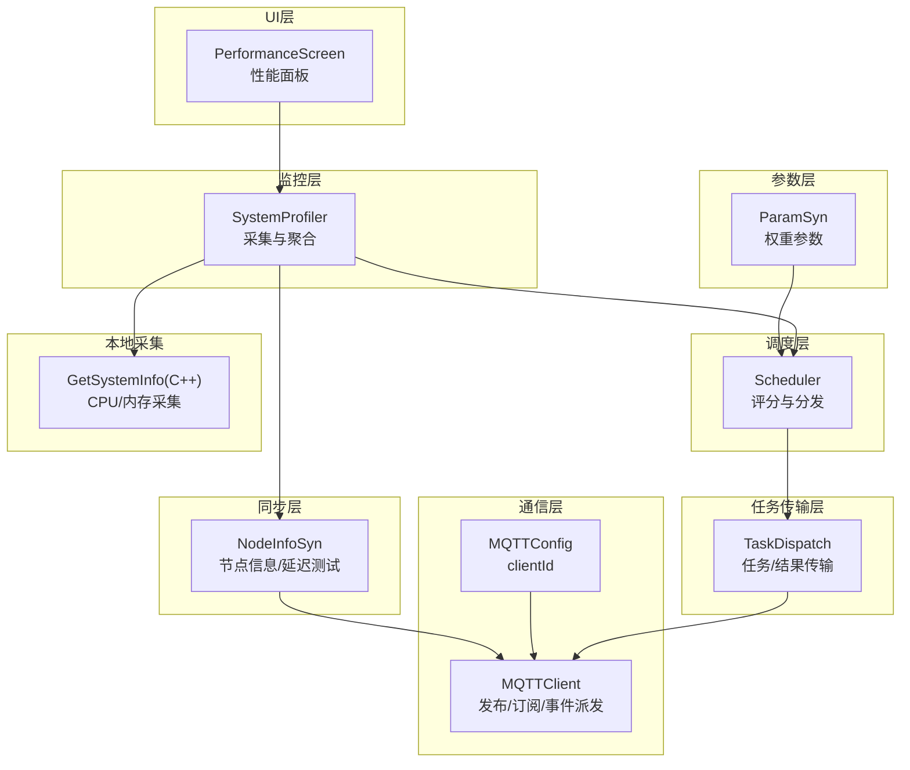
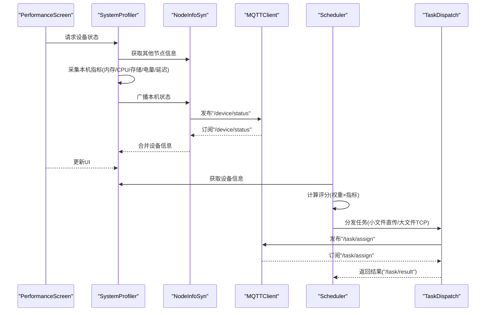
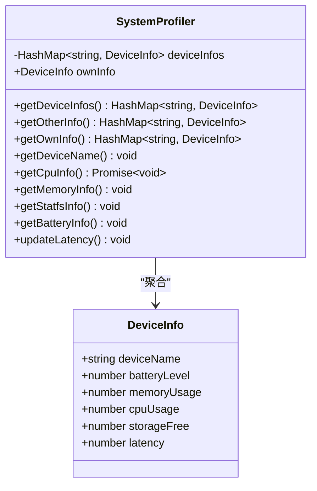
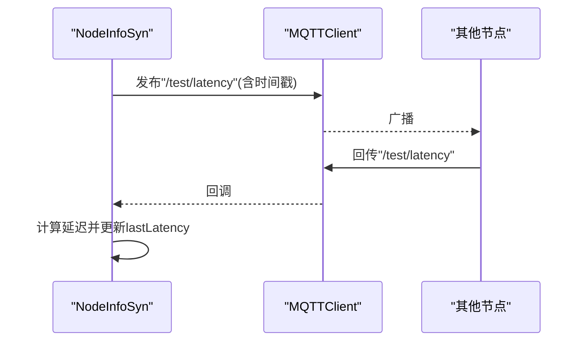
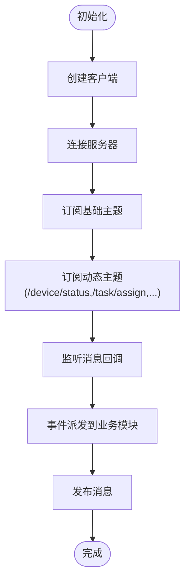
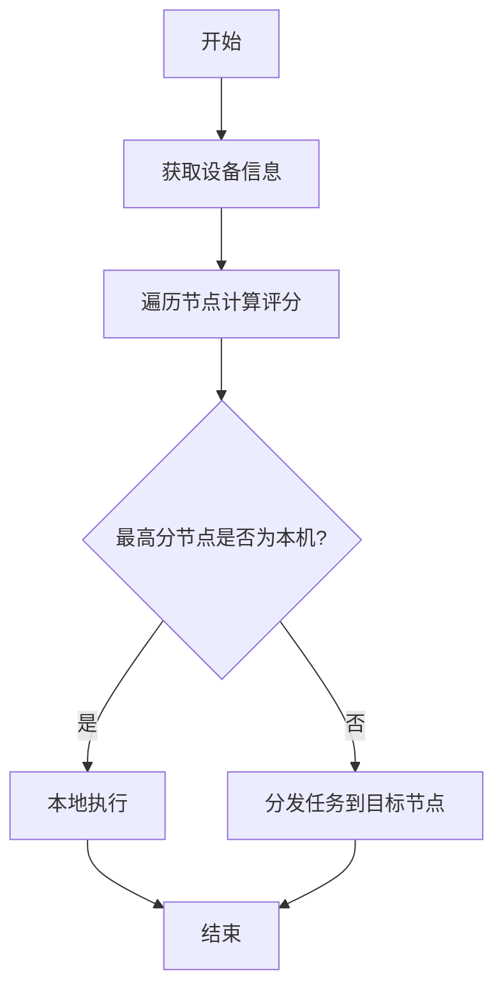
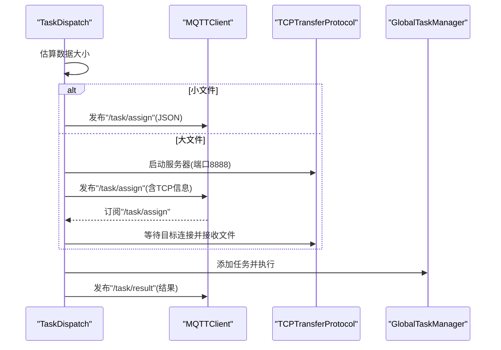
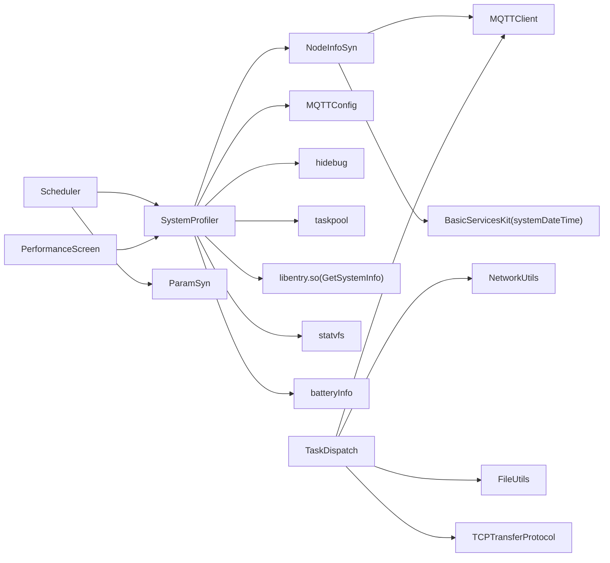

# 监控系统

<cite>
**本文引用的文件**
- [SystemProfiler.ets](file://entry/src/main/ets/manager/monitor/SystemProfiler.ets)
- [NodeInfoSyn.ets](file://entry/src/main/ets/manager/broker/monitor/NodeInfoSyn.ets)
- [MQTTClient.ets](file://entry/src/main/ets/manager/broker/MQTTClient.ets)
- [MQTTConfig.ets](file://entry/src/main/ets/manager/broker/MQTTConfig.ets)
- [ParamSyn.ets](file://entry/src/main/ets/manager/broker/paramOpt/ParamSyn.ets)
- [Scheduler.ets](file://entry/src/main/ets/manager/scheduler/Scheduler.ets)
- [PerformanceScreen.ets](file://entry/src/main/ets/pages/tabs/PerformanceScreen.ets)
- [TaskDispatch.ets](file://entry/src/main/ets/manager/broker/task/TaskDispatch.ets)
- [InferenceWorker.ets](file://entry/src/main/ets/manager/worker/InferenceWorker.ets)
- [GetSystemInfo.cpp](file://entry/src/main/cpp/GetSystemInfo.cpp)
- [GetSystemInfo.h](file://entry/src/main/cpp/GetSystemInfo.h)
</cite>

## 目录
1. [简介](#简介)
2. [项目结构](#项目结构)
3. [核心组件](#核心组件)
4. [架构总览](#架构总览)
5. [详细组件分析](#详细组件分析)
6. [依赖关系分析](#依赖关系分析)
7. [性能考量](#性能考量)
8. [故障排查指南](#故障排查指南)
9. [结论](#结论)
10. [附录](#附录)

## 简介
本文件面向监控系统子功能，聚焦以下能力：
- SystemProfiler 的性能指标采集流程与设备状态管理
- 节点信息同步与网络延迟测试机制
- 性能评分计算与任务调度策略
- 与 MQTT 通信、任务分发、UI 展示的集成方式
- 常见问题与优化建议

该系统通过本地采集 CPU、内存、存储、电量等指标，结合网络延迟，形成设备状态快照，并通过 MQTT 广播与拉取，供调度器进行节点评分与任务分发决策。UI 层提供实时展示与交互。

## 项目结构
监控系统主要由以下层次构成：
- 监控层：SystemProfiler 负责采集与聚合设备状态
- 通信层：MQTTClient 提供消息发布/订阅与事件派发
- 同步层：NodeInfoSyn 负责节点信息广播、接收与延迟测试
- 调度层：Scheduler 基于评分选择最优节点
- 任务传输层：TaskDispatch 负责任务与结果的跨设备传输
- 参数层：ParamSyn 维护评分权重参数
- UI 层：PerformanceScreen 展示设备状态与电池信息

图示来源
- [SystemProfiler.ets](file://entry/src/main/ets/manager/monitor/SystemProfiler.ets#L43-L118)
- [NodeInfoSyn.ets](file://entry/src/main/ets/manager/broker/monitor/NodeInfoSyn.ets#L40-L171)
- [MQTTClient.ets](file://entry/src/main/ets/manager/broker/MQTTClient.ets#L24-L222)
- [MQTTConfig.ets](file://entry/src/main/ets/manager/broker/MQTTConfig.ets#L4-L6)
- [ParamSyn.ets](file://entry/src/main/ets/manager/broker/paramOpt/ParamSyn.ets#L13-L39)
- [Scheduler.ets](file://entry/src/main/ets/manager/scheduler/Scheduler.ets#L14-L104)
- [TaskDispatch.ets](file://entry/src/main/ets/manager/broker/task/TaskDispatch.ets#L98-L299)
- [PerformanceScreen.ets](file://entry/src/main/ets/pages/tabs/PerformanceScreen.ets#L14-L203)
- [GetSystemInfo.cpp](file://entry/src/main/cpp/GetSystemInfo.cpp#L72-L115)

章节来源
- [SystemProfiler.ets](file://entry/src/main/ets/manager/monitor/SystemProfiler.ets#L1-L120)
- [NodeInfoSyn.ets](file://entry/src/main/ets/manager/broker/monitor/NodeInfoSyn.ets#L1-L173)
- [MQTTClient.ets](file://entry/src/main/ets/manager/broker/MQTTClient.ets#L1-L223)
- [MQTTConfig.ets](file://entry/src/main/ets/manager/broker/MQTTConfig.ets#L1-L7)
- [ParamSyn.ets](file://entry/src/main/ets/manager/broker/paramOpt/ParamSyn.ets#L1-L40)
- [Scheduler.ets](file://entry/src/main/ets/manager/scheduler/Scheduler.ets#L1-L105)
- [TaskDispatch.ets](file://entry/src/main/ets/manager/broker/task/TaskDispatch.ets#L1-L302)
- [PerformanceScreen.ets](file://entry/src/main/ets/pages/tabs/PerformanceScreen.ets#L1-L204)
- [GetSystemInfo.cpp](file://entry/src/main/cpp/GetSystemInfo.cpp#L1-L115)

## 核心组件
- SystemProfiler：负责采集 CPU、内存、存储、电量、延迟等指标，构建本机 DeviceInfo，并与其它节点信息合并输出
- NodeInfoSyn：负责节点信息广播/接收、延迟测试消息的发送与计算
- MQTTClient：统一的 MQTT 客户端，负责连接、订阅、发布、事件派发
- Scheduler：基于评分选择最优节点，决定本地执行还是远程分发
- TaskDispatch：负责任务与结果的跨设备传输，支持小文件 MQTT 直传与大文件 TCP 传输
- ParamSyn：维护评分权重参数，供 Scheduler 使用
- PerformanceScreen：UI 展示设备状态与电池信息

章节来源
- [SystemProfiler.ets](file://entry/src/main/ets/manager/monitor/SystemProfiler.ets#L10-L118)
- [NodeInfoSyn.ets](file://entry/src/main/ets/manager/broker/monitor/NodeInfoSyn.ets#L40-L171)
- [MQTTClient.ets](file://entry/src/main/ets/manager/broker/MQTTClient.ets#L24-L222)
- [Scheduler.ets](file://entry/src/main/ets/manager/scheduler/Scheduler.ets#L14-L104)
- [TaskDispatch.ets](file://entry/src/main/ets/manager/broker/task/TaskDispatch.ets#L98-L299)
- [ParamSyn.ets](file://entry/src/main/ets/manager/broker/paramOpt/ParamSyn.ets#L13-L39)
- [PerformanceScreen.ets](file://entry/src/main/ets/pages/tabs/PerformanceScreen.ets#L14-L203)

## 架构总览
系统采用“本地采集 + MQTT 广播 + 评分调度 + 任务传输”的架构。SystemProfiler 采集本机指标并通过 NodeInfoSyn 广播；MQTTClient 订阅多个主题，将消息分发到相应模块；Scheduler 基于 ParamSyn 的权重与各节点指标计算评分，决定任务执行位置；TaskDispatch 负责任务与结果的跨设备传输。

图示来源
- [PerformanceScreen.ets](file://entry/src/main/ets/pages/tabs/PerformanceScreen.ets#L42-L60)
- [SystemProfiler.ets](file://entry/src/main/ets/manager/monitor/SystemProfiler.ets#L47-L81)
- [NodeInfoSyn.ets](file://entry/src/main/ets/manager/broker/monitor/NodeInfoSyn.ets#L63-L80)
- [MQTTClient.ets](file://entry/src/main/ets/manager/broker/MQTTClient.ets#L107-L145)
- [Scheduler.ets](file://entry/src/main/ets/manager/scheduler/Scheduler.ets#L30-L57)
- [TaskDispatch.ets](file://entry/src/main/ets/manager/broker/task/TaskDispatch.ets#L107-L126)

## 详细组件分析

### SystemProfiler：性能指标采集与设备状态管理
- 职责
  - 采集本机指标：CPU、内存、存储、电量、延迟
  - 构建 DeviceInfo 对象
  - 与 NodeInfoSyn 合并其他节点信息
  - 通过 MQTT 广播本机状态
- 关键实现要点
  - CPU 采集：使用并发函数与 ArkTS 任务池异步获取系统 CPU 使用率
  - 内存采集：通过 C++ NAPI 模块获取内存使用率
  - 存储采集：通过 statvfs 获取应用目录可用空间与总空间比值
  - 电量采集：通过电池信息模块获取电池电量
  - 延迟计算：基于 NodeInfoSyn 的 lastLatency 进行归一化
  - 设备名：来源于 MQTT 客户端 ID（设备市场名）

图示来源
- [SystemProfiler.ets](file://entry/src/main/ets/manager/monitor/SystemProfiler.ets#L10-L118)

章节来源
- [SystemProfiler.ets](file://entry/src/main/ets/manager/monitor/SystemProfiler.ets#L34-L118)
- [GetSystemInfo.cpp](file://entry/src/main/cpp/GetSystemInfo.cpp#L72-L115)
- [GetSystemInfo.h](file://entry/src/main/cpp/GetSystemInfo.h#L11-L22)

### NodeInfoSyn：节点信息同步与延迟测试
- 职责
  - 将本机 DeviceInfo 通过 MQTT 广播到 "/device/status"
  - 接收其他节点的状态消息，维护其他节点信息列表
  - 发送/接收延迟测试消息，计算网络延迟
- 关键实现要点
  - 发布消息：构造 JSON，包含设备名与参数
  - 接收消息：解析 JSON，过滤自身设备，更新列表
  - 延迟测试：发送包含时间戳的消息，接收后计算差值

图示来源
- [NodeInfoSyn.ets](file://entry/src/main/ets/manager/broker/monitor/NodeInfoSyn.ets#L131-L170)
- [MQTTClient.ets](file://entry/src/main/ets/manager/broker/MQTTClient.ets#L147-L182)

章节来源
- [NodeInfoSyn.ets](file://entry/src/main/ets/manager/broker/monitor/NodeInfoSyn.ets#L40-L171)
- [MQTTClient.ets](file://entry/src/main/ets/manager/broker/MQTTClient.ets#L107-L182)

### MQTTClient：统一通信入口
- 职责
  - 创建/连接 MQTT 客户端
  - 订阅基础主题与动态主题
  - 发布消息
  - 将消息通过事件派发到业务模块
- 关键实现要点
  - 单例模式，getInstance 前需确保已初始化
  - 订阅多个主题：设备状态、任务分配、结果、参数优化、延迟测试
  - 通过事件发射器将消息分发到不同模块

图示来源
- [MQTTClient.ets](file://entry/src/main/ets/manager/broker/MQTTClient.ets#L68-L182)

章节来源
- [MQTTClient.ets](file://entry/src/main/ets/manager/broker/MQTTClient.ets#L24-L222)
- [MQTTConfig.ets](file://entry/src/main/ets/manager/broker/MQTTConfig.ets#L4-L6)

### Scheduler：性能评分与任务调度
- 职责
  - 收集设备信息，计算节点评分
  - 选择最优节点执行任务（本地或远端）
  - 分发任务到目标节点
- 评分公式
  - score = w1*(1-cpuUsage) + w2*(1-memoryUsage) + w3*batteryLevel + w4*storageFree + w5*(1-latency)
  - 权重由 ParamSyn 提供，范围通常为正数
- 关键实现要点
  - 遍历设备信息，计算最高分节点
  - 若非本机则分发任务，否则本地执行
  - 通过 TaskDispatch 发送任务

图示来源
- [Scheduler.ets](file://entry/src/main/ets/manager/scheduler/Scheduler.ets#L30-L70)
- [ParamSyn.ets](file://entry/src/main/ets/manager/broker/paramOpt/ParamSyn.ets#L13-L39)

章节来源
- [Scheduler.ets](file://entry/src/main/ets/manager/scheduler/Scheduler.ets#L14-L104)
- [ParamSyn.ets](file://entry/src/main/ets/manager/broker/paramOpt/ParamSyn.ets#L13-L39)

### TaskDispatch：任务与结果传输
- 职责
  - 小文件：直接通过 MQTT 发布到 "/task/assign"
  - 大文件：启动 TCP 服务器，通过 MQTT 通知目标节点发起 TCP 连接
  - 接收任务：若为 TCP 大文件则建立连接接收，否则直接本地执行
  - 结果回传：通过 "/task/result" 回传结果
- 关键实现要点
  - 估算数据大小，超过阈值触发 TCP 传输
  - 使用 NetworkUtils 获取本机 IP，TCPTransferProtocol 发起/接收
  - 通过 GlobalTaskManager 执行推理任务

图示来源
- [TaskDispatch.ets](file://entry/src/main/ets/manager/broker/task/TaskDispatch.ets#L107-L165)
- [TaskDispatch.ets](file://entry/src/main/ets/manager/broker/task/TaskDispatch.ets#L187-L212)
- [TaskDispatch.ets](file://entry/src/main/ets/manager/broker/task/TaskDispatch.ets#L272-L281)

章节来源
- [TaskDispatch.ets](file://entry/src/main/ets/manager/broker/task/TaskDispatch.ets#L98-L299)

### PerformanceScreen：性能面板 UI
- 职责
  - 定时刷新设备列表与状态
  - 展示 CPU、内存、存储、电池信息
  - 支持选择设备查看详细指标
- 关键实现要点
  - 每 10 秒轮询更新
  - 从 SystemProfiler 获取设备信息并渲染

章节来源
- [PerformanceScreen.ets](file://entry/src/main/ets/pages/tabs/PerformanceScreen.ets#L14-L203)

## 依赖关系分析
- SystemProfiler 依赖 NodeInfoSyn 与 MQTTConfig，使用 hidebug 与 taskpool 获取 CPU，使用 libentry 获取内存，使用 statvfs 获取存储，使用 batteryInfo 获取电量
- NodeInfoSyn 依赖 MQTTClient 与 BasicServicesKit 的时间戳
- Scheduler 依赖 SystemProfiler 与 ParamSyn
- TaskDispatch 依赖 MQTTClient、NetworkUtils、FileUtils、TCPTransferProtocol
- PerformanceScreen 依赖 SystemProfiler

图示来源
- [SystemProfiler.ets](file://entry/src/main/ets/manager/monitor/SystemProfiler.ets#L1-L10)
- [NodeInfoSyn.ets](file://entry/src/main/ets/manager/broker/monitor/NodeInfoSyn.ets#L5-L9)
- [Scheduler.ets](file://entry/src/main/ets/manager/scheduler/Scheduler.ets#L1-L7)
- [TaskDispatch.ets](file://entry/src/main/ets/manager/broker/task/TaskDispatch.ets#L1-L9)
- [PerformanceScreen.ets](file://entry/src/main/ets/pages/tabs/PerformanceScreen.ets#L1-L4)

章节来源
- [SystemProfiler.ets](file://entry/src/main/ets/manager/monitor/SystemProfiler.ets#L1-L10)
- [NodeInfoSyn.ets](file://entry/src/main/ets/manager/broker/monitor/NodeInfoSyn.ets#L5-L9)
- [Scheduler.ets](file://entry/src/main/ets/manager/scheduler/Scheduler.ets#L1-L7)
- [TaskDispatch.ets](file://entry/src/main/ets/manager/broker/task/TaskDispatch.ets#L1-L9)
- [PerformanceScreen.ets](file://entry/src/main/ets/pages/tabs/PerformanceScreen.ets#L1-L4)

## 性能考量
- CPU 采集
  - 使用并发函数与任务池异步获取，避免阻塞主线程
  - 本地 CPU 采集通过 C++ 实现，减少 JS 层开销
- 内存与存储
  - 内存使用率通过 NDK 获取，避免频繁系统调用
  - 存储使用率基于应用目录统计，避免跨分区访问
- 网络延迟
  - 延迟测试通过时间戳差值计算，建议在网络稳定时进行
  - 延迟值在 SystemProfiler 中进行归一化处理
- 任务传输
  - 小文件直接 MQTT 传输，延迟低
  - 大文件采用 TCP 传输，降低 MQTT 压力
- UI 刷新
  - 性能面板每 10 秒刷新一次，兼顾实时性与性能

[本节为通用性能讨论，无需列出具体文件来源]

## 故障排查指南
- MQTT 未初始化
  - 现象：调用 MQTTClient.getInstance() 抛出异常
  - 处理：确保先调用 getNewInstance 并完成初始化
  - 参考：[MQTTClient.ets](file://entry/src/main/ets/manager/broker/MQTTClient.ets#L52-L58)
- 无法获取设备信息
  - 现象：SystemProfiler.getDeviceInfos() 返回空或异常
  - 处理：检查 NodeInfoSyn 是否正确广播/接收，确认 MQTT 订阅成功
  - 参考：[SystemProfiler.ets](file://entry/src/main/ets/manager/monitor/SystemProfiler.ets#L47-L65)、[NodeInfoSyn.ets](file://entry/src/main/ets/manager/broker/monitor/NodeInfoSyn.ets#L50-L56)
- 任务未分发或未执行
  - 现象：Scheduler 选择本机但未执行，或未收到结果
  - 处理：检查 TaskDispatch 的发送/接收逻辑，确认 TCP 服务器启动与连接
  - 参考：[Scheduler.ets](file://entry/src/main/ets/manager/scheduler/Scheduler.ets#L89-L103)、[TaskDispatch.ets](file://entry/src/main/ets/manager/broker/task/TaskDispatch.ets#L107-L165)
- 评分异常
  - 现象：评分计算结果不合理
  - 处理：检查 ParamSyn 的权重参数是否合理，确认指标范围在 0-1 之间
  - 参考：[Scheduler.ets](file://entry/src/main/ets/manager/scheduler/Scheduler.ets#L66-L70)、[ParamSyn.ets](file://entry/src/main/ets/manager/broker/paramOpt/ParamSyn.ets#L13-L39)
- UI 不更新
  - 现象：性能面板不刷新
  - 处理：确认 PerformanceScreen 的定时刷新逻辑与 SystemProfiler 的数据更新
  - 参考：[PerformanceScreen.ets](file://entry/src/main/ets/pages/tabs/PerformanceScreen.ets#L29-L51)

章节来源
- [MQTTClient.ets](file://entry/src/main/ets/manager/broker/MQTTClient.ets#L52-L58)
- [SystemProfiler.ets](file://entry/src/main/ets/manager/monitor/SystemProfiler.ets#L47-L65)
- [NodeInfoSyn.ets](file://entry/src/main/ets/manager/broker/monitor/NodeInfoSyn.ets#L50-L56)
- [Scheduler.ets](file://entry/src/main/ets/manager/scheduler/Scheduler.ets#L89-L103)
- [TaskDispatch.ets](file://entry/src/main/ets/manager/broker/task/TaskDispatch.ets#L107-L165)
- [ParamSyn.ets](file://entry/src/main/ets/manager/broker/paramOpt/ParamSyn.ets#L13-L39)
- [PerformanceScreen.ets](file://entry/src/main/ets/pages/tabs/PerformanceScreen.ets#L29-L51)

## 结论
本监控系统通过 SystemProfiler 采集本地指标并与 NodeInfoSyn 的广播/接收机制结合，形成完整的设备状态视图；Scheduler 基于 ParamSyn 的权重与指标计算评分，实现任务的智能分发；TaskDispatch 支持小文件直传与大文件 TCP 传输，保证高吞吐与低延迟；UI 层提供直观的性能面板。整体设计清晰、职责明确，具备良好的扩展性与可维护性。

[本节为总结性内容，无需列出具体文件来源]

## 附录

### 配置选项与参数
- MQTT 客户端配置
  - URL、客户端 ID、用户名、密码、主题、QoS
  - 参考：[MQTTConfig.ets](file://entry/src/main/ets/manager/broker/MQTTConfig.ets#L4-L6)、[MQTTClient.ets](file://entry/src/main/ets/manager/broker/MQTTClient.ets#L15-L44)
- 评分权重参数
  - w1-w5：分别对应 CPU、内存、电量、存储、延迟的权重
  - 参考：[ParamSyn.ets](file://entry/src/main/ets/manager/broker/paramOpt/ParamSyn.ets#L13-L39)、[Scheduler.ets](file://entry/src/main/ets/manager/scheduler/Scheduler.ets#L66-L70)
- 任务传输阈值
  - 大文件阈值：2MB
  - 参考：[TaskDispatch.ets](file://entry/src/main/ets/manager/broker/task/TaskDispatch.ets#L99-L100)

### 返回值与接口摘要
- SystemProfiler.getDeviceInfos()
  - 返回：设备名到 DeviceInfo 的 HashMap
  - 参考：[SystemProfiler.ets](file://entry/src/main/ets/manager/monitor/SystemProfiler.ets#L47-L65)
- NodeInfoSyn.getOtherNodeInfo()
  - 返回：其他节点信息的 HashMap
  - 参考：[NodeInfoSyn.ets](file://entry/src/main/ets/manager/broker/monitor/NodeInfoSyn.ets#L50-L56)
- Scheduler.workScheduler()
  - 返回：是否本地执行（布尔）
  - 参考：[Scheduler.ets](file://entry/src/main/ets/manager/scheduler/Scheduler.ets#L30-L57)
- TaskDispatch.sendTask()
  - 返回：发送是否成功（布尔）
  - 参考：[TaskDispatch.ets](file://entry/src/main/ets/manager/broker/task/TaskDispatch.ets#L107-L126)

### 使用模式
- 本地采集与广播
  - SystemProfiler 采集本机指标，NodeInfoSyn 广播到 "/device/status"
  - 参考：[SystemProfiler.ets](file://entry/src/main/ets/manager/monitor/SystemProfiler.ets#L71-L81)、[NodeInfoSyn.ets](file://entry/src/main/ets/manager/broker/monitor/NodeInfoSyn.ets#L63-L80)
- 任务分发
  - Scheduler 选择最优节点，TaskDispatch 发送任务
  - 参考：[Scheduler.ets](file://entry/src/main/ets/manager/scheduler/Scheduler.ets#L30-L57)、[TaskDispatch.ets](file://entry/src/main/ets/manager/broker/task/TaskDispatch.ets#L107-L126)
- 结果回传
  - TaskDispatch 将结果通过 "/task/result" 回传
  - 参考：[TaskDispatch.ets](file://entry/src/main/ets/manager/broker/task/TaskDispatch.ets#L272-L281)

章节来源
- [SystemProfiler.ets](file://entry/src/main/ets/manager/monitor/SystemProfiler.ets#L47-L81)
- [NodeInfoSyn.ets](file://entry/src/main/ets/manager/broker/monitor/NodeInfoSyn.ets#L50-L80)
- [Scheduler.ets](file://entry/src/main/ets/manager/scheduler/Scheduler.ets#L30-L57)
- [TaskDispatch.ets](file://entry/src/main/ets/manager/broker/task/TaskDispatch.ets#L107-L126)
- [TaskDispatch.ets](file://entry/src/main/ets/manager/broker/task/TaskDispatch.ets#L272-L281)
- [ParamSyn.ets](file://entry/src/main/ets/manager/broker/paramOpt/ParamSyn.ets#L13-L39)
- [MQTTConfig.ets](file://entry/src/main/ets/manager/broker/MQTTConfig.ets#L4-L6)