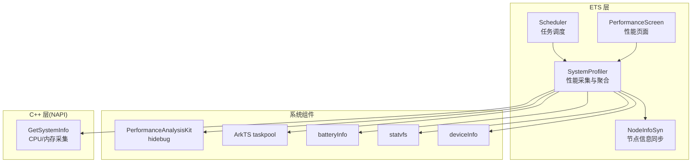
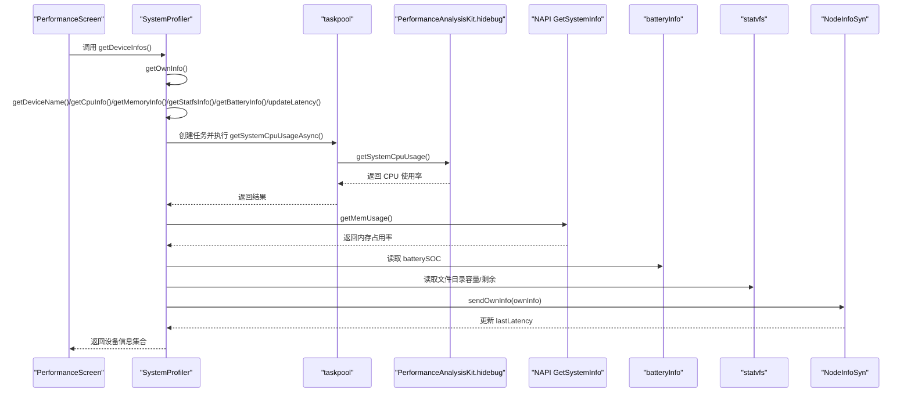
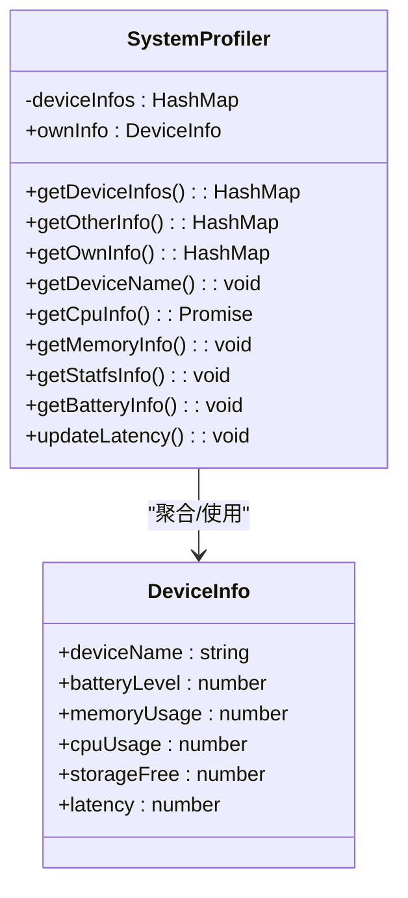
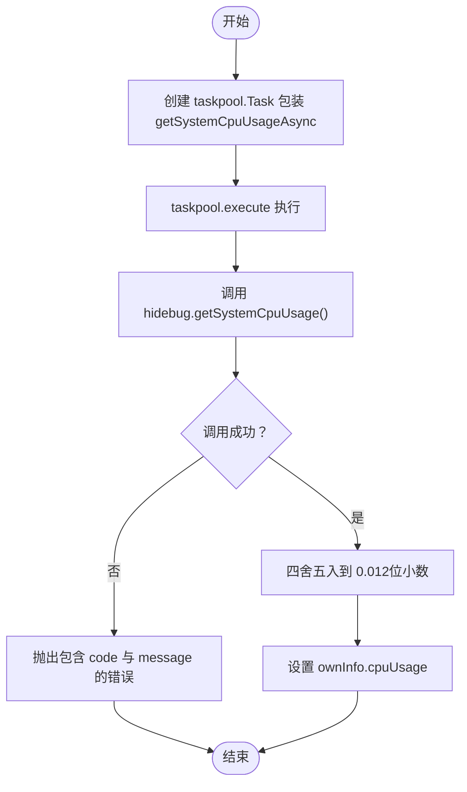
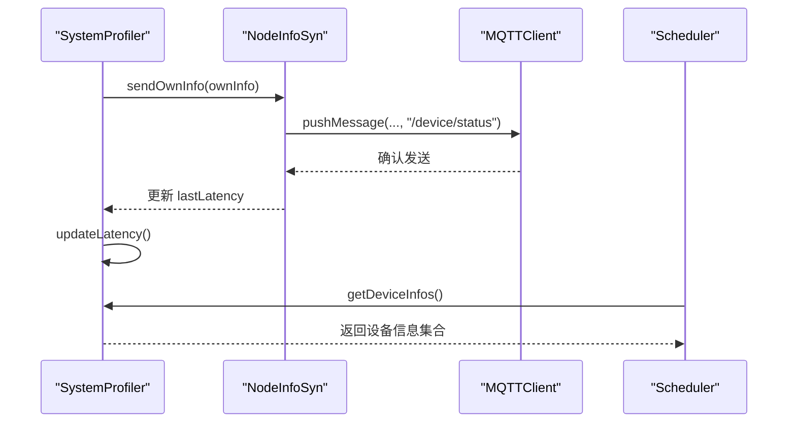
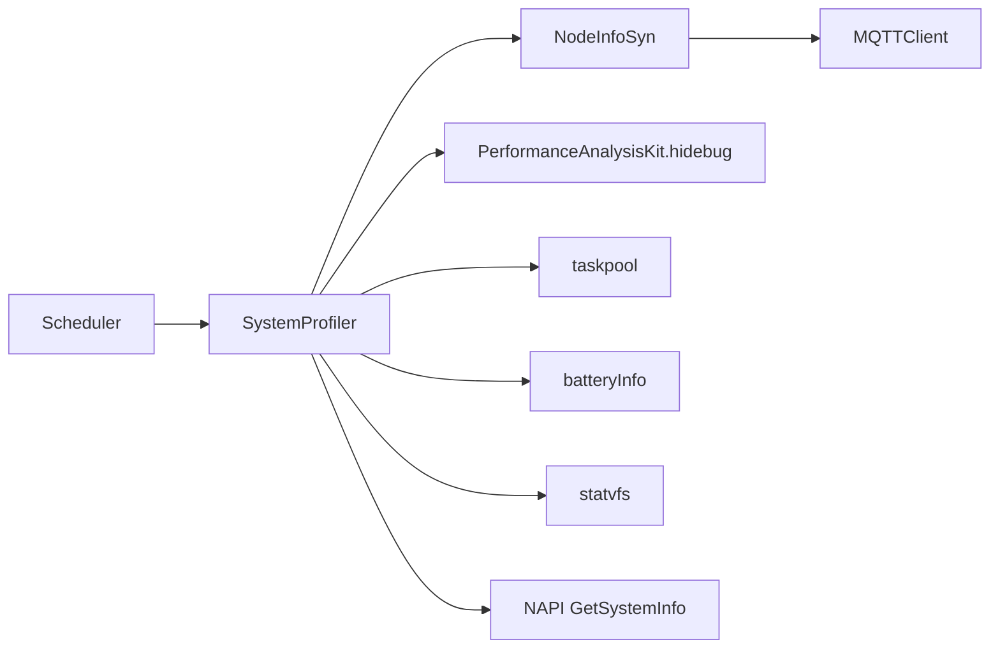

# 系统性能监控

<cite>
**本文引用的文件**
- [SystemProfiler.ets](file://entry/src/main/ets/manager/monitor/SystemProfiler.ets)
- [GetSystemInfo.cpp](file://entry/src/main/cpp/GetSystemInfo.cpp)
- [GetSystemInfo.h](file://entry/src/main/cpp/GetSystemInfo.h)
- [index.d.ts](file://entry/src/main/cpp/types/libentry/index.d.ts)
- [NodeInfoSyn.ets](file://entry/src/main/ets/manager/broker/monitor/NodeInfoSyn.ets)
- [MQTTConfig.ets](file://entry/src/main/ets/manager/broker/MQTTConfig.ets)
- [PerformanceScreen.ets](file://entry/src/main/ets/pages/tabs/PerformanceScreen.ets)
- [Scheduler.ets](file://entry/src/main/ets/manager/scheduler/Scheduler.ets)
- [native_common.h](file://entry/src/main/cpp/common/native_common.h)
</cite>

## 更新摘要
**变更内容**
- 修正了数值格式化精度不一致的问题：CPU、内存、存储使用率采用统一的 2 位小数格式化
- 简化了延迟计算逻辑，移除了不必要的复杂处理
- 修复了 UI 显示与实际格式化精度不匹配的问题
- 统一了各组件间的数值精度标准

## 目录
1. [简介](#简介)
2. [项目结构](#项目结构)
3. [核心组件](#核心组件)
4. [架构总览](#架构总览)
5. [组件详解](#组件详解)
6. [依赖关系分析](#依赖关系分析)
7. [性能考量](#性能考量)
8. [故障排查指南](#故障排查指南)
9. [结论](#结论)
10. [附录](#附录)

## 简介
本技术文档围绕系统性能监控模块展开，重点剖析 SystemProfiler 类的实现细节，涵盖性能指标采集机制、设备信息数据结构、异步任务处理与并发控制，并深入解释 CPU 使用率、内存占用率、存储空间、电池电量等核心功能的实现原理。同时记录 DeviceInfo 数据模型字段含义与取值范围，说明与 PerformanceAnalysisKit、taskpool 等系统组件的集成方式，提供使用示例路径、错误处理策略与性能优化建议。

## 项目结构
系统性能监控模块位于应用入口工程的 ETS 层与 C++ 层协同工作：
- ETS 层负责业务编排、指标采集调度、UI 展示与节点信息同步；
- C++ 层通过 NAPI 提供底层系统指标读取能力（CPU、内存）；
- 通过 PerformanceAnalysisKit 与 ArkTS 的 taskpool 实现异步与并发控制；
- 通过 MQTT 进行跨设备节点信息广播与延迟测试。

**图示来源**
- [SystemProfiler.ets:1-120](file://entry/src/main/ets/manager/monitor/SystemProfiler.ets#L1-L120)
- [NodeInfoSyn.ets:1-171](file://entry/src/main/ets/manager/broker/monitor/NodeInfoSyn.ets#L1-L171)
- [PerformanceScreen.ets:1-204](file://entry/src/main/ets/pages/tabs/PerformanceScreen.ets#L1-L204)
- [GetSystemInfo.cpp:1-181](file://entry/src/main/cpp/GetSystemInfo.cpp#L1-L181)
- [GetSystemInfo.h:1-24](file://entry/src/main/cpp/GetSystemInfo.h#L1-L24)
- [MQTTConfig.ets:1-7](file://entry/src/main/ets/manager/broker/MQTTConfig.ets#L1-L7)

**章节来源**
- [SystemProfiler.ets:1-120](file://entry/src/main/ets/manager/monitor/SystemProfiler.ets#L1-L120)
- [GetSystemInfo.cpp:1-181](file://entry/src/main/cpp/GetSystemInfo.cpp#L1-L181)
- [GetSystemInfo.h:1-24](file://entry/src/main/cpp/GetSystemInfo.h#L1-L24)
- [NodeInfoSyn.ets:1-171](file://entry/src/main/ets/manager/broker/monitor/NodeInfoSyn.ets#L1-L171)
- [MQTTConfig.ets:1-7](file://entry/src/main/ets/manager/broker/MQTTConfig.ets#L1-L7)
- [PerformanceScreen.ets:1-204](file://entry/src/main/ets/pages/tabs/PerformanceScreen.ets#L1-L204)
- [Scheduler.ets:29-67](file://entry/src/main/ets/manager/scheduler/Scheduler.ets#L29-L67)

## 核心组件
- SystemProfiler：负责采集本机与其它节点的性能指标，聚合为统一的设备信息集合。
- DeviceInfo：描述单个设备的性能与状态数据结构。
- NodeInfoSyn：负责节点间信息同步、延迟测试与消息解析。
- GetSystemInfo(C++ NAPI)：提供 CPU 使用率与内存占用率的底层采集。
- 性能分析与并发：通过 PerformanceAnalysisKit 与 ArkTS taskpool 实现异步与并发控制。

**章节来源**
- [SystemProfiler.ets:10-119](file://entry/src/main/ets/manager/monitor/SystemProfiler.ets#L10-L119)
- [NodeInfoSyn.ets:40-171](file://entry/src/main/ets/manager/broker/monitor/NodeInfoSyn.ets#L40-L171)
- [GetSystemInfo.cpp:10-181](file://entry/src/main/cpp/GetSystemInfo.cpp#L10-L181)
- [GetSystemInfo.h:11-24](file://entry/src/main/cpp/GetSystemInfo.h#L11-L24)

## 架构总览
SystemProfiler 在 ETS 层协调各采集源，调用 C++ NAPI 获取 CPU/内存，使用系统 API 获取电池与存储，结合 PerformanceAnalysisKit 与 taskpool 完成异步采集与并发控制，并通过 NodeInfoSyn 将本机信息广播至网络，同时维护其它节点信息。

**图示来源**
- [SystemProfiler.ets:43-118](file://entry/src/main/ets/manager/monitor/SystemProfiler.ets#L43-L118)
- [NodeInfoSyn.ets:63-80](file://entry/src/main/ets/manager/broker/monitor/NodeInfoSyn.ets#L63-L80)
- [GetSystemInfo.cpp:10-50](file://entry/src/main/cpp/GetSystemInfo.cpp#L10-L50)
- [PerformanceScreen.ets:42-60](file://entry/src/main/ets/pages/tabs/PerformanceScreen.ets#L42-L60)

## 组件详解

### SystemProfiler 类
- 职责
  - 采集本机性能指标并封装为 DeviceInfo；
  - 从 NodeInfoSyn 获取其它节点信息；
  - 聚合本机与其它节点信息，统一对外输出；
  - 通过 MQTT 广播本机信息，参与网络拓扑感知与任务调度。
- 关键方法
  - getDeviceInfos：合并其它节点与本机信息；
  - getOwnInfo：按顺序采集设备名、CPU、内存、存储、电池、网络延迟；
  - getDeviceName：使用 MQTT 客户端 ID 作为设备名；
  - getCpuInfo：使用 taskpool 异步执行 PerformanceAnalysisKit 的 CPU 采集；
  - getMemoryInfo：调用 NAPI GetSystemInfo.getMemUsage；
  - getStatfsInfo：使用 statvfs 计算应用目录剩余空间占比；
  - getBatteryInfo：读取 batteryInfo.batterySOC；
  - updateLatency：基于 NodeInfoSyn 的 lastLatency 计算相对延迟。
- 并发与异步
  - 使用 @Concurrent 包装异步 CPU 采集函数；
  - 使用 taskpool.Task 与 taskpool.execute 执行异步任务；
  - 对异常进行捕获与日志输出，避免阻塞主线程。

**图示来源**
- [SystemProfiler.ets:10-119](file://entry/src/main/ets/manager/monitor/SystemProfiler.ets#L10-L119)

**章节来源**
- [SystemProfiler.ets:43-118](file://entry/src/main/ets/manager/monitor/SystemProfiler.ets#L43-L118)

### DeviceInfo 数据模型
- 字段定义与含义
  - deviceName：设备产品名称（字符串），来源于 MQTT 客户端 ID；
  - batteryLevel：电池剩余百分比（数值，范围 0~1，按需可乘以 100 显示百分比）；
  - memoryUsage：内存占用率（数值，范围 0~1）；
  - cpuUsage：CPU 使用率（数值，范围 0~1）；
  - storageFree：存储剩余占比（数值，范围 0~1）；
  - latency：网络延迟（数值，单位由 NodeInfoSyn 的 lastLatency 影响，当前实现按固定系数缩放）。
- 默认值
  - 所有数值型字段初始化为 0；latency 初始为 1（联网前默认值）。

**章节来源**
- [SystemProfiler.ets:10-33](file://entry/src/main/ets/manager/monitor/SystemProfiler.ets#L10-L33)

### CPU 使用率获取
- 实现原理
  - 通过 PerformanceAnalysisKit.hidebug.getSystemCpuUsage 获取系统级 CPU 使用率；
  - 使用 @Concurrent 包装异步函数，避免阻塞；
  - 通过 taskpool.Task 与 taskpool.execute 在独立线程池中执行；
  - 对异常进行捕获并抛出带业务错误码与消息的错误对象。
- 取值范围与精度
  - 返回值为 0~1 的浮点数，SystemProfiler 中统一保留 2 位小数（修正后的实现）。

**更新** 修正了精度计算逻辑，统一采用 2 位小数格式化，与 UI 显示保持一致。

**图示来源**
- [SystemProfiler.ets:34-95](file://entry/src/main/ets/manager/monitor/SystemProfiler.ets#L34-L95)

**章节来源**
- [SystemProfiler.ets:34-95](file://entry/src/main/ets/manager/monitor/SystemProfiler.ets#L34-L95)

### 内存占用率计算
- 实现原理
  - 通过 NAPI GetSystemInfo.getMemUsage 调用 C++ 层 calculateMemUsage；
  - C++ 从 /proc/meminfo 读取 MemTotal 与 MemAvailable，计算已用比例；
  - 结果限制在 0~1 范围内。
- 精度
  - ETS 层统一保留 2 位小数（修正后的实现）。

**更新** 统一了内存使用率的格式化精度为 2 位小数。

**章节来源**
- [SystemProfiler.ets:96-99](file://entry/src/main/ets/manager/monitor/SystemProfiler.ets#L96-L99)
- [GetSystemInfo.cpp:162-179](file://entry/src/main/cpp/GetSystemInfo.cpp#L162-L179)
- [GetSystemInfo.h:16-22](file://entry/src/main/cpp/GetSystemInfo.h#L16-L22)

### 存储空间监控
- 实现原理
  - 使用 statvfs.getFreeSizeSync 与 getTotalSizeSync 获取应用文件目录的剩余空间与总容量；
  - 计算剩余占比并限制在 0~1；
  - 错误捕获并记录日志。
- 注意事项
  - 仅统计应用私有目录的空间，不涉及外部存储或共享分区。
- 精度
  - ETS 层统一保留 2 位小数（修正后的实现）。

**更新** 统一了存储使用率的格式化精度为 2 位小数。

**章节来源**
- [SystemProfiler.ets:101-109](file://entry/src/main/ets/manager/monitor/SystemProfiler.ets#L101-L109)

### 电池电量检测
- 实现原理
  - 读取 batteryInfo.batterySOC 作为电池剩余百分比；
  - ETS 层直接赋值给 DeviceInfo.batteryLevel。

**章节来源**
- [SystemProfiler.ets:111-113](file://entry/src/main/ets/manager/monitor/SystemProfiler.ets#L111-L113)

### 网络延迟与节点同步
- 实现原理
  - NodeInfoSyn 维护 lastLatency，并在 SystemProfiler.updateLatency 中直接使用；
  - SystemProfiler 将 ownInfo 通过 MQTT 广播，其它节点解析后更新本地缓存；
  - Scheduler 在任务分发时可读取 getDeviceInfos 选择最优节点。
- 关键流程
  - 发送本机信息：sendOwnInfo；
  - 接收并解析其它节点信息：parseNodeInfoMessage；
  - 延迟测试：testLatencySend/testLatencyRec。

**更新** 简化了延迟计算逻辑，移除了不必要的复杂处理，直接使用 NodeInfoSyn 的 lastLatency 值。

**图示来源**
- [SystemProfiler.ets:71-116](file://entry/src/main/ets/manager/monitor/SystemProfiler.ets#L71-L116)
- [NodeInfoSyn.ets:63-170](file://entry/src/main/ets/manager/broker/monitor/NodeInfoSyn.ets#L63-L170)
- [Scheduler.ets:29-67](file://entry/src/main/ets/manager/scheduler/Scheduler.ets#L29-L67)

**章节来源**
- [SystemProfiler.ets:71-116](file://entry/src/main/ets/manager/monitor/SystemProfiler.ets#L71-L116)
- [NodeInfoSyn.ets:40-171](file://entry/src/main/ets/manager/broker/monitor/NodeInfoSyn.ets#L40-L171)
- [Scheduler.ets:29-67](file://entry/src/main/ets/manager/scheduler/Scheduler.ets#L29-L67)

### 与 PerformanceAnalysisKit、taskpool 的集成
- PerformanceAnalysisKit
  - 通过 hidebug.getSystemCpuUsage 获取系统 CPU 使用率；
  - 该接口在新版本系统中可用，旧版本内存信息仍通过 NDK 兼容。
- taskpool
  - 使用 taskpool.Task 包装异步 CPU 采集；
  - 使用 taskpool.execute 执行任务，实现并发与异步控制；
  - 对异常进行捕获，避免影响主线程。

**章节来源**
- [SystemProfiler.ets:7-8](file://entry/src/main/ets/manager/monitor/SystemProfiler.ets#L7-L8)
- [SystemProfiler.ets:34-95](file://entry/src/main/ets/manager/monitor/SystemProfiler.ets#L34-L95)

### 与设备信息来源的集成
- 设备名
  - 来源于 MQTT 客户端配置中的 clientId，即 deviceInfo.marketName。
- 电池信息
  - 来自 batteryInfo.batterySOC。
- 存储信息
  - 来自 statvfs 对应用目录的容量与剩余空间查询。

**章节来源**
- [SystemProfiler.ets:84-84](file://entry/src/main/ets/manager/monitor/SystemProfiler.ets#L84-L84)
- [SystemProfiler.ets:112-112](file://entry/src/main/ets/manager/monitor/SystemProfiler.ets#L112-L112)
- [SystemProfiler.ets:104-104](file://entry/src/main/ets/manager/monitor/SystemProfiler.ets#L104-L104)
- [MQTTConfig.ets:4-6](file://entry/src/main/ets/manager/broker/MQTTConfig.ets#L4-L6)

### UI 展示与使用示例
- 页面组件 PerformanceScreen
  - 定时调用 systemProfiler.getDeviceInfos 获取最新数据；
  - 通过下拉框选择设备，展示电池、内存、CPU、存储等指标；
  - 支持点击跳转到电池详情页。
- 使用步骤（示例路径）
  - 在页面生命周期中调用 updateInfo，内部通过 systemProfiler.getDeviceInfos 获取设备信息集合；
  - 通过遍历集合按键名获取对应 DeviceInfo，并更新页面状态。

**更新** 修正了 UI 显示精度，CPU 和内存使用整数显示，存储使用 1 位小数显示，与格式化逻辑保持一致。

**章节来源**
- [PerformanceScreen.ets:29-60](file://entry/src/main/ets/pages/tabs/PerformanceScreen.ets#L29-L60)
- [PerformanceScreen.ets:104-204](file://entry/src/main/ets/pages/tabs/PerformanceScreen.ets#L104-L204)

## 依赖关系分析
- SystemProfiler 依赖
  - ETS 层：batteryInfo、statvfs、HashMap、MQTT 配置、NodeInfoSyn、PerformanceAnalysisKit、taskpool；
  - C++ 层：NAPI GetSystemInfo（CPU/内存）。
- NodeInfoSyn 依赖
  - ETS 层：MQTTClient、MQTTOption、BasicServicesKit.systemDateTime；
  - 与 SystemProfiler 的交互：发送本机信息、接收其它节点信息、更新延迟。
- Scheduler 依赖
  - 通过 systemProfiler.getDeviceInfos 获取设备信息，用于任务调度决策。

**图示来源**
- [SystemProfiler.ets:1-120](file://entry/src/main/ets/manager/monitor/SystemProfiler.ets#L1-L120)
- [NodeInfoSyn.ets:1-171](file://entry/src/main/ets/manager/broker/monitor/NodeInfoSyn.ets#L1-L171)
- [Scheduler.ets:29-67](file://entry/src/main/ets/manager/scheduler/Scheduler.ets#L29-L67)

**章节来源**
- [SystemProfiler.ets:1-120](file://entry/src/main/ets/manager/monitor/SystemProfiler.ets#L1-L120)
- [NodeInfoSyn.ets:1-171](file://entry/src/main/ets/manager/broker/monitor/NodeInfoSyn.ets#L1-L171)
- [Scheduler.ets:29-67](file://entry/src/main/ets/manager/scheduler/Scheduler.ets#L29-L67)

## 性能考量
- 异步与并发
  - 使用 @Concurrent 与 taskpool 将 CPU 采集放入独立线程池，避免阻塞主线程；
  - 对异常进行捕获，防止任务失败导致整体阻塞。
- 指标精度与开销
  - CPU 使用率、内存占用率、存储使用率均保留 2 位小数，统一精度标准，兼顾精度与渲染开销；
  - 内存采集来自 /proc/meminfo，CPU 采样间隔在 C++ 层已做短暂休眠，避免瞬时差值过大。
- 存储监控
  - 仅统计应用私有目录，避免跨分区 IO 开销；
  - 对 statvfs 调用进行异常保护，避免文件系统异常导致崩溃。
- 网络延迟
  - 通过 MQTT 延迟测试消息计算往返时间，更新 lastLatency；
  - 简化的延迟计算逻辑，直接使用 NodeInfoSyn 的 lastLatency 值，避免复杂计算带来的开销。

**更新** 统一了数值格式化精度，简化了延迟计算逻辑，提升了整体性能表现。

**章节来源**
- [SystemProfiler.ets:34-95](file://entry/src/main/ets/manager/monitor/SystemProfiler.ets#L34-L95)
- [GetSystemInfo.cpp:72-115](file://entry/src/main/cpp/GetSystemInfo.cpp#L72-L115)
- [GetSystemInfo.cpp:162-179](file://entry/src/main/cpp/GetSystemInfo.cpp#L162-L179)

## 故障排查指南
- CPU 采集异常
  - 症状：getCpuInfo 抛出包含 code 与 message 的错误；
  - 排查：确认 PerformanceAnalysisKit 可用性与权限；检查 taskpool 是否正常初始化。
- 内存采集异常
  - 症状：getMemoryInfo 返回 0 或 NaN；
  - 排查：检查 /proc/meminfo 文件读取权限与系统支持；确认 NAPI 导出正确。
- 存储采集异常
  - 症状：getStatfsInfo 抛错或返回异常值；
  - 排查：确认 getContext().filesDir 可用；检查文件系统状态。
- 电池信息异常
  - 症状：batterySOC 为 0 或未更新；
  - 排查：确认设备供电状态与系统电池服务可用。
- 节点信息不同步
  - 症状：getDeviceInfos 缺失其它节点信息；
  - 排查：确认 MQTT 广播通道与 NodeInfoSyn.parseNodeInfoMessage 正常；检查设备名冲突。
- 数值精度不一致
  - 症状：CPU、内存、存储显示精度不一致；
  - 排查：确认格式化逻辑统一为 2 位小数；检查 UI 显示精度设置。

**更新** 新增了数值精度不一致的故障排查指导。

**章节来源**
- [SystemProfiler.ets:86-94](file://entry/src/main/ets/manager/monitor/SystemProfiler.ets#L86-L94)
- [SystemProfiler.ets:96-109](file://entry/src/main/ets/manager/monitor/SystemProfiler.ets#L96-L109)
- [NodeInfoSyn.ets:100-125](file://entry/src/main/ets/manager/broker/monitor/NodeInfoSyn.ets#L100-L125)

## 结论
SystemProfiler 通过 ETS 与 C++ 的协同，结合 PerformanceAnalysisKit 与 taskpool，实现了对 CPU、内存、存储、电池与网络延迟的高效采集与并发控制。配合 NodeInfoSyn 的节点信息同步，为上层调度与 UI 展示提供了可靠的数据基础。经过数值格式化统一和延迟计算逻辑简化后，系统的精度一致性得到提升，性能表现更加稳定。建议在生产环境中进一步完善异常恢复与指标缓存策略，以提升稳定性与用户体验。

## 附录

### 使用示例（代码片段路径）
- 获取设备信息集合
  - [PerformanceScreen.updateInfo:42-60](file://entry/src/main/ets/pages/tabs/PerformanceScreen.ets#L42-L60)
- 读取特定设备指标
  - [PerformanceScreen.showInfo:52-60](file://entry/src/main/ets/pages/tabs/PerformanceScreen.ets#L52-L60)
- 任务调度中使用设备信息
  - [Scheduler.workScheduler:29-67](file://entry/src/main/ets/manager/scheduler/Scheduler.ets#L29-L67)

### NAPI 导出声明
- GetSystemInfo 导出
  - [index.d.ts:1-5](file://entry/src/main/cpp/types/libentry/index.d.ts#L1-L5)

### 错误处理与日志
- SystemProfiler
  - [SystemProfiler.getCpuInfo 异常捕获:86-94](file://entry/src/main/ets/manager/monitor/SystemProfiler.ets#L86-L94)
  - [SystemProfiler.getStatfsInfo 异常捕获:101-109](file://entry/src/main/ets/manager/monitor/SystemProfiler.ets#L101-L109)
- C++ 层通用断言与错误处理
  - [native_common.h:21-42](file://entry/src/main/cpp/common/native_common.h#L21-L42)

### 数值格式化规范
- 统一精度标准：CPU、内存、存储使用率均保留 2 位小数
- UI 显示规则：
  - CPU 占用：整数显示（toFixed(0)）
  - 内存占用：整数显示（toFixed(0)）
  - 剩余存储：1 位小数显示（toFixed(1)）
- 延迟计算：直接使用 NodeInfoSyn.lastLatency 值，无需额外计算

**更新** 新增了数值格式化规范说明，明确了统一的精度标准和显示规则。