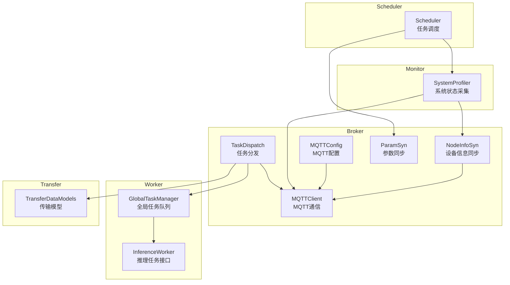
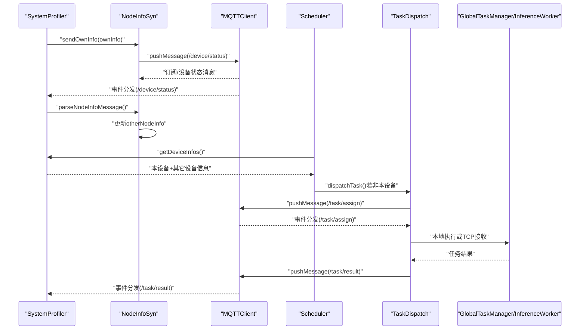
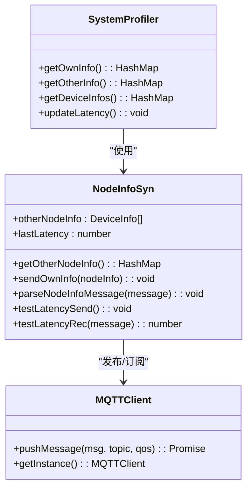
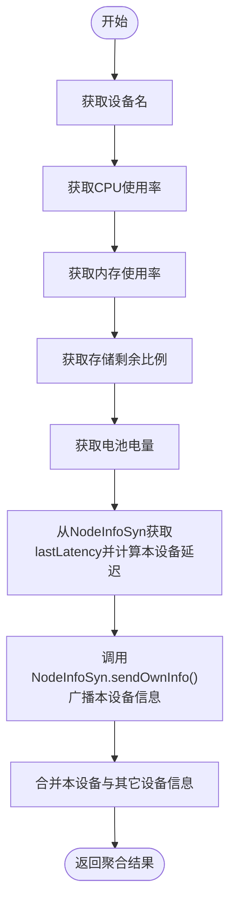
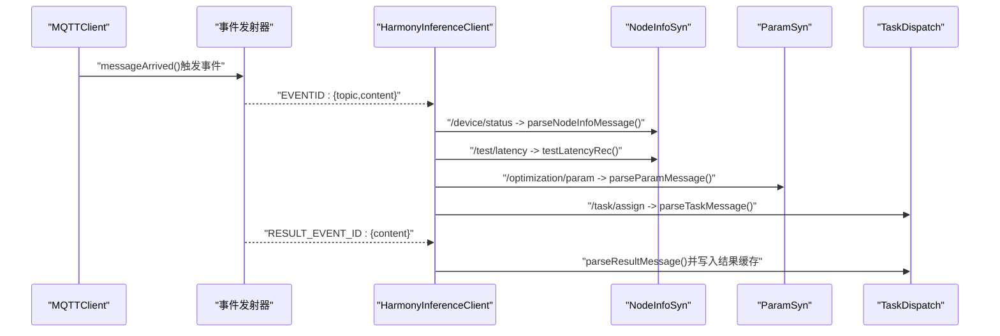
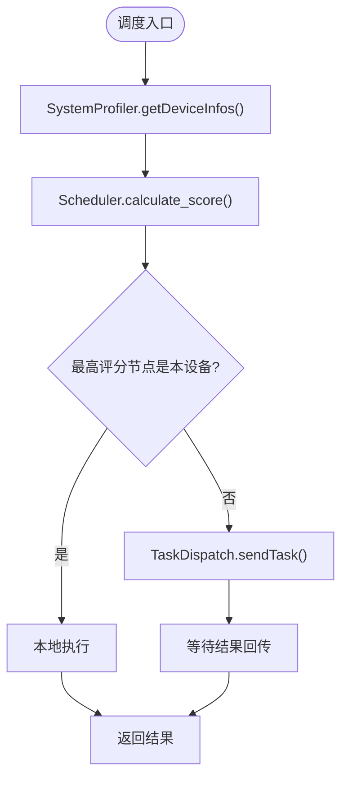
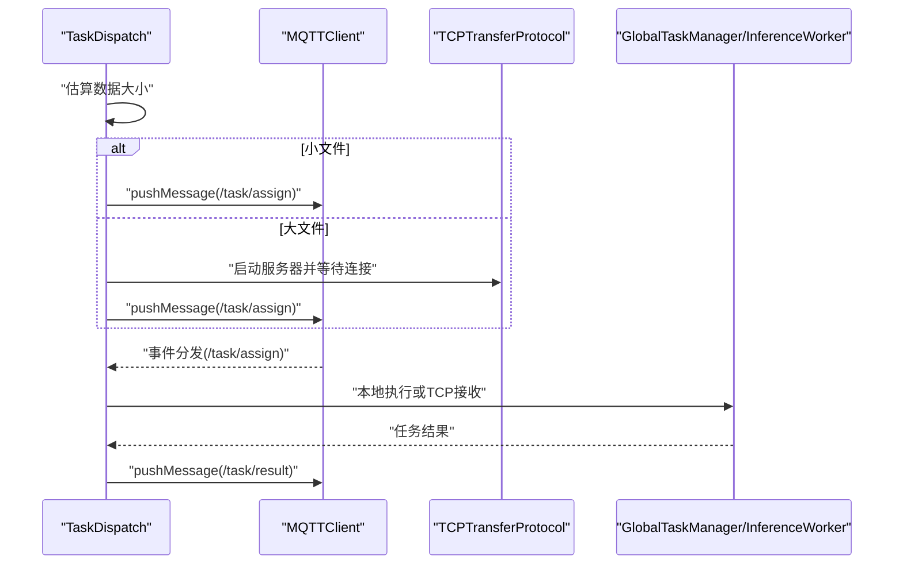
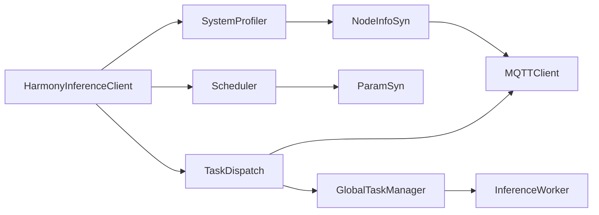

# 设备信息同步

<cite>
**本文引用的文件**
- [NodeInfoSyn.ets](file://entry/src/main/ets/manager/broker/monitor/NodeInfoSyn.ets)
- [SystemProfiler.ets](file://entry/src/main/ets/manager/monitor/SystemProfiler.ets)
- [MQTTClient.ets](file://entry/src/main/ets/manager/broker/MQTTClient.ets)
- [MQTTConfig.ets](file://entry/src/main/ets/manager/broker/MQTTConfig.ets)
- [Scheduler.ets](file://entry/src/main/ets/manager/scheduler/Scheduler.ets)
- [TaskDispatch.ets](file://entry/src/main/ets/manager/broker/task/TaskDispatch.ets)
- [ParamSyn.ets](file://entry/src/main/ets/manager/broker/paramOpt/ParamSyn.ets)
- [HarmonyInferenceClient.ets](file://entry/src/main/ets/manager/HarmonyInferenceClient.ets)
- [GlobalTaskManager.ets](file://entry/src/main/ets/manager/worker/GlobalTaskManager.ets)
- [InferenceWorker.ets](file://entry/src/main/ets/manager/worker/InferenceWorker.ets)
- [TransferDataModels.ets](file://entry/src/main/ets/manager/transfer/model/TransferDataModels.ets)
</cite>

## 更新摘要
**所做更改**
- 移除了 NodeInfoSyn 模块中的调试语句，包括设备添加、设备自检和错误处理的日志输出
- 清理了 TaskDispatch 模块中的调试信息，包括数据大小估算、任务接收和结果处理的日志
- 移除了 ParamSyn 模块中的参数更新日志输出
- 保持了关键错误处理和异常捕获机制，确保系统稳定性

## 目录
1. [简介](#简介)
2. [项目结构](#项目结构)
3. [核心组件](#核心组件)
4. [架构总览](#架构总览)
5. [详细组件分析](#详细组件分析)
6. [依赖关系分析](#依赖关系分析)
7. [性能考虑](#性能考虑)
8. [故障排除指南](#故障排除指南)
9. [结论](#结论)
10. [附录](#附录)

## 简介
本技术文档围绕设备信息同步模块展开，重点阐述 NodeInfoSyn 类的设计理念与实现机制，涵盖设备状态信息的采集、缓存与同步策略；设备信息的数据结构、更新频率控制、状态传播机制与冲突解决策略；以及与 MQTT 通信、任务调度的交互方式。文档还解释了设备发现、状态变更通知与信息聚合的完整流程，并提供配置与使用示例、故障排除与性能调优建议，以及与系统 Profiler 的协作关系与数据流转过程。

**更新** 本次更新反映了模块的代码优化，移除了调试语句和冗余控制台输出，提升了代码的简洁性和生产环境的稳定性。

## 项目结构
设备信息同步模块位于入口工程的 ETS 层，主要分布在以下子目录：
- broker/monitor：设备信息同步与系统状态采集
- broker：MQTT 通信与任务分发
- scheduler：任务调度与节点评分
- worker：推理任务执行与队列管理
- transfer/model：传输数据模型定义

**图表来源**
- [NodeInfoSyn.ets:40-171](file://entry/src/main/ets/manager/broker/monitor/NodeInfoSyn.ets#L40-L171)
- [SystemProfiler.ets:43-120](file://entry/src/main/ets/manager/monitor/SystemProfiler.ets#L43-L120)
- [MQTTClient.ets:24-223](file://entry/src/main/ets/manager/broker/MQTTClient.ets#L24-L223)
- [MQTTConfig.ets:4-6](file://entry/src/main/ets/manager/broker/MQTTConfig.ets#L4-L6)
- [TaskDispatch.ets:98-320](file://entry/src/main/ets/manager/broker/task/TaskDispatch.ets#L98-L320)
- [ParamSyn.ets:13-40](file://entry/src/main/ets/manager/broker/paramOpt/ParamSyn.ets#L13-L40)
- [Scheduler.ets:14-105](file://entry/src/main/ets/manager/scheduler/Scheduler.ets#L14-L105)
- [GlobalTaskManager.ets:4-27](file://entry/src/main/ets/manager/worker/GlobalTaskManager.ets#L4-L27)
- [InferenceWorker.ets:1-90](file://entry/src/main/ets/manager/worker/InferenceWorker.ets#L1-L90)
- [TransferDataModels.ets:1-170](file://entry/src/main/ets/manager/transfer/model/TransferDataModels.ets#L1-L170)

**章节来源**
- [NodeInfoSyn.ets:1-171](file://entry/src/main/ets/manager/broker/monitor/NodeInfoSyn.ets#L1-L171)
- [SystemProfiler.ets:1-120](file://entry/src/main/ets/manager/monitor/SystemProfiler.ets#L1-L120)
- [MQTTClient.ets:1-223](file://entry/src/main/ets/manager/broker/MQTTClient.ets#L1-L223)
- [MQTTConfig.ets:1-7](file://entry/src/main/ets/manager/broker/MQTTConfig.ets#L1-L7)
- [TaskDispatch.ets:1-320](file://entry/src/main/ets/manager/broker/task/TaskDispatch.ets#L1-L320)
- [ParamSyn.ets:1-40](file://entry/src/main/ets/manager/broker/paramOpt/ParamSyn.ets#L1-L40)
- [Scheduler.ets:1-105](file://entry/src/main/ets/manager/scheduler/Scheduler.ets#L1-L105)
- [GlobalTaskManager.ets:1-27](file://entry/src/main/ets/manager/worker/GlobalTaskManager.ets#L1-L27)
- [InferenceWorker.ets:1-90](file://entry/src/main/ets/manager/worker/InferenceWorker.ets#L1-L90)
- [TransferDataModels.ets:1-170](file://entry/src/main/ets/manager/transfer/model/TransferDataModels.ets#L1-L170)

## 核心组件
- NodeInfoSyn：负责设备节点信息的发送、接收与管理，以及网络延迟测试。
- SystemProfiler：负责采集本设备系统信息，聚合本设备与其它设备信息，并驱动 NodeInfoSyn 发送本设备信息。
- MQTTClient：负责 MQTT 连接、订阅、发布与消息事件分发。
- Scheduler：负责收集设备节点信息，计算节点评分，决策任务执行位置。
- TaskDispatch：负责任务在设备间的传输与结果回传，支持小文件直接传输与大文件 TCP 传输。
- ParamSyn：负责参数更新的接收与提供，影响调度评分。
- HarmonyInferenceClient：对外暴露统一的推理客户端接口，协调 MQTT、调度、任务执行与状态查询。
- GlobalTaskManager/InferenceWorker：全局任务队列与推理任务接口，支撑本地任务执行。

**章节来源**
- [NodeInfoSyn.ets:40-171](file://entry/src/main/ets/manager/broker/monitor/NodeInfoSyn.ets#L40-L171)
- [SystemProfiler.ets:43-120](file://entry/src/main/ets/manager/monitor/SystemProfiler.ets#L43-L120)
- [MQTTClient.ets:24-223](file://entry/src/main/ets/manager/broker/MQTTClient.ets#L24-L223)
- [Scheduler.ets:14-105](file://entry/src/main/ets/manager/scheduler/Scheduler.ets#L14-L105)
- [TaskDispatch.ets:98-320](file://entry/src/main/ets/manager/broker/task/TaskDispatch.ets#L98-L320)
- [ParamSyn.ets:13-40](file://entry/src/main/ets/manager/broker/paramOpt/ParamSyn.ets#L13-L40)
- [HarmonyInferenceClient.ets:52-374](file://entry/src/main/ets/manager/HarmonyInferenceClient.ets#L52-L374)
- [GlobalTaskManager.ets:4-27](file://entry/src/main/ets/manager/worker/GlobalTaskManager.ets#L4-L27)
- [InferenceWorker.ets:1-90](file://entry/src/main/ets/manager/worker/InferenceWorker.ets#L1-L90)

## 架构总览
设备信息同步的整体流程如下：
- SystemProfiler 采集本设备信息，调用 NodeInfoSyn 发送本设备信息到 /device/status。
- MQTTClient 订阅 /device/status、/test/latency、/task/assign、/task/result、/optimization/param 等主题，将消息通过事件发射器分发给 NodeInfoSyn、ParamSyn、TaskDispatch。
- NodeInfoSyn 解析 /device/status 消息，更新其它设备信息列表；解析 /test/latency 消息，计算并缓存网络延迟。
- Scheduler 基于 SystemProfiler 聚合的设备信息与 ParamSyn 的参数，计算节点评分，决定任务本地执行或分发到其它节点。
- TaskDispatch 根据任务大小选择 MQTT 直接传输或 TCP 大文件传输，并负责结果回传。

**图表来源**
- [SystemProfiler.ets:71-81](file://entry/src/main/ets/manager/monitor/SystemProfiler.ets#L71-L81)
- [NodeInfoSyn.ets:63-80](file://entry/src/main/ets/manager/broker/monitor/NodeInfoSyn.ets#L63-L80)
- [MQTTClient.ets:107-182](file://entry/src/main/ets/manager/broker/MQTTClient.ets#L107-L182)
- [Scheduler.ets:30-57](file://entry/src/main/ets/manager/scheduler/Scheduler.ets#L30-L57)
- [TaskDispatch.ets:107-126](file://entry/src/main/ets/manager/broker/task/TaskDispatch.ets#L107-L126)
- [GlobalTaskManager.ets:15-21](file://entry/src/main/ets/manager/worker/GlobalTaskManager.ets#L15-L21)
- [InferenceWorker.ets:76-90](file://entry/src/main/ets/manager/worker/InferenceWorker.ets#L76-L90)

## 详细组件分析

### NodeInfoSyn 组件分析
- 设计理念
  - 以设备为中心，负责本设备信息的采集与广播，以及对网络中其它设备信息的接收与缓存。
  - 通过延迟测试消息实现网络延迟的测量与缓存，供 SystemProfiler 在计算本设备延迟时使用。
- 实现机制
  - 设备信息发送：将本设备信息序列化为 JSON 并发布到 /device/status。
  - 设备信息接收与更新：解析 /device/status 消息，过滤自身设备，更新其它设备信息列表。
  - 延迟测试：发送包含时间戳的消息，接收后计算往返时间并缓存。
- 数据结构
  - 其它设备信息列表：DeviceInfo[]，用于存储其它设备的状态。
  - lastLatency：最近一次延迟测量结果。
- 冲突解决策略
  - 对于同名设备，先过滤再插入，保证同一设备名只保留最新一次状态。
- 与 MQTT 的交互
  - 通过 MQTTClient.getInstance() 获取实例并调用 pushMessage 发布消息。
  - 通过事件分发接收 /device/status 与 /test/latency 消息。
- 与 SystemProfiler 的协作
  - SystemProfiler 在采集本设备信息后调用 NodeInfoSyn.sendOwnInfo 广播本设备状态。
  - SystemProfiler 读取 NodeInfoSyn.lastLatency 计算本设备延迟。

**更新** 移除了设备添加、设备自检和错误处理的调试日志输出，保持代码简洁性。

**图表来源**
- [NodeInfoSyn.ets:40-171](file://entry/src/main/ets/manager/broker/monitor/NodeInfoSyn.ets#L40-L171)
- [SystemProfiler.ets:43-120](file://entry/src/main/ets/manager/monitor/SystemProfiler.ets#L43-L120)
- [MQTTClient.ets:24-223](file://entry/src/main/ets/manager/broker/MQTTClient.ets#L24-L223)

**章节来源**
- [NodeInfoSyn.ets:40-171](file://entry/src/main/ets/manager/broker/monitor/NodeInfoSyn.ets#L40-L171)
- [SystemProfiler.ets:43-120](file://entry/src/main/ets/manager/monitor/SystemProfiler.ets#L43-L120)
- [MQTTClient.ets:24-223](file://entry/src/main/ets/manager/broker/MQTTClient.ets#L24-L223)

### SystemProfiler 组件分析
- 设计理念
  - 作为系统状态采集中心，统一采集本设备的 CPU、内存、存储、电量与延迟等信息，并聚合本设备与其它设备信息。
- 实现机制
  - 采集流程：依次获取设备名、CPU、内存、存储、电量、延迟，然后调用 NodeInfoSyn.sendOwnInfo 广播。
  - 聚合流程：合并本设备与其它设备信息，返回统一的 HashMap。
  - 延迟更新：从 NodeInfoSyn.lastLatency 计算本设备延迟。
- 数据结构
  - DeviceInfo：包含设备名、CPU 使用率、内存使用率、存储剩余比例、电池电量、网络延迟。
  - deviceInfos：聚合后的设备信息缓存。
- 与 NodeInfoSyn 的协作
  - 通过 NodeInfoSyn.getOtherNodeInfo() 获取其它设备信息。
  - 通过 NodeInfoSyn.sendOwnInfo() 发布本设备信息。
  - 通过 NodeInfoSyn.lastLatency 更新本设备延迟。

**图表来源**
- [SystemProfiler.ets:71-116](file://entry/src/main/ets/manager/monitor/SystemProfiler.ets#L71-L116)
- [NodeInfoSyn.ets:63-80](file://entry/src/main/ets/manager/broker/monitor/NodeInfoSyn.ets#L63-L80)

**章节来源**
- [SystemProfiler.ets:43-120](file://entry/src/main/ets/manager/monitor/SystemProfiler.ets#L43-L120)
- [NodeInfoSyn.ets:40-171](file://entry/src/main/ets/manager/broker/monitor/NodeInfoSyn.ets#L40-L171)

### MQTT 通信与事件分发
- MQTTClient
  - 单例模式，负责连接、订阅、发布与消息事件分发。
  - 订阅主题：/device/status、/test/latency、/task/assign、/task/result、/optimization/param。
  - 事件分发：通过事件发射器将消息按主题分发到不同模块。
- 事件监听与处理
  - HarmonyInferenceClient 在初始化时注册事件监听器，分别处理设备状态、延迟测试、参数优化、任务分配与结果回传。
  - NodeInfoSyn、ParamSyn、TaskDispatch 分别解析对应主题的消息并更新内部状态。

**图表来源**
- [MQTTClient.ets:148-182](file://entry/src/main/ets/manager/broker/MQTTClient.ets#L148-L182)
- [HarmonyInferenceClient.ets:116-154](file://entry/src/main/ets/manager/HarmonyInferenceClient.ets#L116-L154)
- [NodeInfoSyn.ets:100-125](file://entry/src/main/ets/manager/broker/monitor/NodeInfoSyn.ets#L100-L125)
- [ParamSyn.ets:25-29](file://entry/src/main/ets/manager/broker/paramOpt/ParamSyn.ets#L25-L29)
- [TaskDispatch.ets:187-316](file://entry/src/main/ets/manager/broker/task/TaskDispatch.ets#L187-L316)

**章节来源**
- [MQTTClient.ets:24-223](file://entry/src/main/ets/manager/broker/MQTTClient.ets#L24-L223)
- [HarmonyInferenceClient.ets:83-154](file://entry/src/main/ets/manager/HarmonyInferenceClient.ets#L83-L154)
- [NodeInfoSyn.ets:100-171](file://entry/src/main/ets/manager/broker/monitor/NodeInfoSyn.ets#L100-L171)
- [ParamSyn.ets:13-40](file://entry/src/main/ets/manager/broker/paramOpt/ParamSyn.ets#L13-L40)
- [TaskDispatch.ets:187-316](file://entry/src/main/ets/manager/broker/task/TaskDispatch.ets#L187-L316)

### 任务调度与状态传播
- 调度流程
  - Scheduler 从 SystemProfiler 获取所有设备信息，计算每个节点的评分，选择最高评分节点执行任务。
  - 若最高评分节点不是本设备，则通过 TaskDispatch 将任务分发到目标设备。
- 状态传播
  - 设备状态通过 /device/status 主题传播，NodeInfoSyn 解析并更新其它设备信息。
  - 延迟通过 /test/latency 主题进行双向测试，NodeInfoSyn 计算并缓存延迟。
- 冲突解决
  - 设备信息更新时，先移除同名设备条目再插入新条目，避免重复与过期状态。

**更新** 移除了任务调度中的调试日志输出，保持代码简洁性。

**图表来源**
- [Scheduler.ets:30-103](file://entry/src/main/ets/manager/scheduler/Scheduler.ets#L30-L103)
- [SystemProfiler.ets:47-81](file://entry/src/main/ets/manager/monitor/SystemProfiler.ets#L47-L81)
- [TaskDispatch.ets:107-126](file://entry/src/main/ets/manager/broker/task/TaskDispatch.ets#L107-L126)

**章节来源**
- [Scheduler.ets:14-105](file://entry/src/main/ets/manager/scheduler/Scheduler.ets#L14-L105)
- [SystemProfiler.ets:43-120](file://entry/src/main/ets/manager/monitor/SystemProfiler.ets#L43-L120)
- [TaskDispatch.ets:98-320](file://entry/src/main/ets/manager/broker/task/TaskDispatch.ets#L98-L320)

### 传输与结果回传
- 传输策略
  - 小文件：直接通过 MQTT 的 /task/assign 主题传输任务数据。
  - 大文件：通过 TCP 协议传输，TaskDispatch 启动 TCP 服务器并通知目标设备发起连接。
- 结果回传
  - 本地执行完成后，TaskDispatch 将结果通过 /task/result 主题回传。
  - HarmonyInferenceClient 监听结果事件，解析并写入任务结果缓存，供提交任务的调用方异步获取。

**更新** 移除了 TaskDispatch 模块中的大量调试日志输出，包括数据大小估算、任务接收、文件传输和结果处理等各个环节的日志。

**图表来源**
- [TaskDispatch.ets:107-165](file://entry/src/main/ets/manager/broker/task/TaskDispatch.ets#L107-L165)
- [MQTTClient.ets:190-203](file://entry/src/main/ets/manager/broker/MQTTClient.ets#L190-L203)
- [TransferDataModels.ets:101-112](file://entry/src/main/ets/manager/transfer/model/TransferDataModels.ets#L101-L112)

**章节来源**
- [TaskDispatch.ets:98-320](file://entry/src/main/ets/manager/broker/task/TaskDispatch.ets#L98-L320)
- [MQTTClient.ets:190-203](file://entry/src/main/ets/manager/broker/MQTTClient.ets#L190-L203)
- [TransferDataModels.ets:1-170](file://entry/src/main/ets/manager/transfer/model/TransferDataModels.ets#L1-L170)

## 依赖关系分析
- 组件耦合
  - NodeInfoSyn 依赖 MQTTClient 与 SystemProfiler 的 DeviceInfo。
  - SystemProfiler 依赖 NodeInfoSyn 的其它设备信息与延迟缓存。
  - Scheduler 依赖 SystemProfiler 与 ParamSyn。
  - TaskDispatch 依赖 MQTTClient、GlobalTaskManager 与 TCPTransferProtocol。
  - HarmonyInferenceClient 统一协调上述模块。
- 外部依赖
  - MQTT 客户端库、事件发射器、系统服务（电池、文件系统、性能分析工具）。
- 潜在循环依赖
  - 通过模块导出与事件分发避免直接循环依赖，保持松耦合。

**图表来源**
- [HarmonyInferenceClient.ets:52-374](file://entry/src/main/ets/manager/HarmonyInferenceClient.ets#L52-L374)
- [SystemProfiler.ets:43-120](file://entry/src/main/ets/manager/monitor/SystemProfiler.ets#L43-L120)
- [NodeInfoSyn.ets:40-171](file://entry/src/main/ets/manager/broker/monitor/NodeInfoSyn.ets#L40-L171)
- [MQTTClient.ets:24-223](file://entry/src/main/ets/manager/broker/MQTTClient.ets#L24-L223)
- [Scheduler.ets:14-105](file://entry/src/main/ets/manager/scheduler/Scheduler.ets#L14-L105)
- [ParamSyn.ets:13-40](file://entry/src/main/ets/manager/broker/paramOpt/ParamSyn.ets#L13-L40)
- [TaskDispatch.ets:98-320](file://entry/src/main/ets/manager/broker/task/TaskDispatch.ets#L98-L320)
- [GlobalTaskManager.ets:4-27](file://entry/src/main/ets/manager/worker/GlobalTaskManager.ets#L4-L27)
- [InferenceWorker.ets:76-90](file://entry/src/main/ets/manager/worker/InferenceWorker.ets#L76-L90)

**章节来源**
- [HarmonyInferenceClient.ets:52-374](file://entry/src/main/ets/manager/HarmonyInferenceClient.ets#L52-L374)
- [SystemProfiler.ets:43-120](file://entry/src/main/ets/manager/monitor/SystemProfiler.ets#L43-L120)
- [NodeInfoSyn.ets:40-171](file://entry/src/main/ets/manager/broker/monitor/NodeInfoSyn.ets#L40-L171)
- [MQTTClient.ets:24-223](file://entry/src/main/ets/manager/broker/MQTTClient.ets#L24-L223)
- [Scheduler.ets:14-105](file://entry/src/main/ets/manager/scheduler/Scheduler.ets#L14-L105)
- [ParamSyn.ets:13-40](file://entry/src/main/ets/manager/broker/paramOpt/ParamSyn.ets#L13-L40)
- [TaskDispatch.ets:98-320](file://entry/src/main/ets/manager/broker/task/TaskDispatch.ets#L98-L320)
- [GlobalTaskManager.ets:4-27](file://entry/src/main/ets/manager/worker/GlobalTaskManager.ets#L4-L27)
- [InferenceWorker.ets:76-90](file://entry/src/main/ets/manager/worker/InferenceWorker.ets#L76-L90)

## 性能考虑
- 更新频率控制
  - 设备状态同步每 10 秒执行一次，避免频繁采集造成性能开销。
  - 延迟测试周期性发送，结合系统时间戳计算往返时间。
- 数据结构与复杂度
  - 其它设备信息列表为数组，查找与更新操作为 O(n)；可通过 HashMap 加速查找。
  - 聚合设备信息时遍历 HashMap，整体复杂度与设备数量线性相关。
- 传输优化
  - 小文件直接通过 MQTT 传输，减少协议开销。
  - 大文件采用 TCP 传输，降低 MQTT 负载。
- 资源管理
  - MQTTClient 单例模式避免重复连接与资源浪费。
  - 事件监听器在销毁时及时移除，防止内存泄漏。
- **更新** 移除了调试日志输出，减少了控制台 I/O 操作，提升了系统运行效率。

## 故障排除指南
- MQTT 连接失败
  - 检查 MQTT 配置（URL、clientId、用户名、密码、QoS）是否正确。
  - 查看连接状态轮询逻辑与错误日志输出。
- 消息解析异常
  - NodeInfoSyn、ParamSyn、TaskDispatch 在解析消息时均包含 try-catch，查看错误日志定位问题。
- 延迟测试无效
  - 确认 /test/latency 主题订阅与消息发送逻辑正常，检查时间戳计算与系统时间获取。
- 任务分发失败
  - 检查 TaskDispatch 的传输策略与 TCP 服务器启动逻辑，确认目标设备可达。
- 任务结果未返回
  - 确认 /task/result 主题订阅与事件监听器注册，检查结果解析与缓存写入逻辑。
- **更新** 由于移除了调试日志，故障排查可能需要依赖更精确的错误处理和异常捕获机制。

**章节来源**
- [MQTTClient.ets:84-104](file://entry/src/main/ets/manager/broker/MQTTClient.ets#L84-L104)
- [HarmonyInferenceClient.ets:116-154](file://entry/src/main/ets/manager/HarmonyInferenceClient.ets#L116-L154)
- [NodeInfoSyn.ets:100-171](file://entry/src/main/ets/manager/broker/monitor/NodeInfoSyn.ets#L100-L171)
- [TaskDispatch.ets:187-316](file://entry/src/main/ets/manager/broker/task/TaskDispatch.ets#L187-L316)

## 结论
设备信息同步模块通过 NodeInfoSyn 与 SystemProfiler 实现设备状态的采集、广播与聚合，借助 MQTTClient 的事件分发机制实现模块解耦。Scheduler 基于系统状态与参数进行任务调度，TaskDispatch 支持多种传输策略并负责结果回传。整体设计具备良好的可扩展性与可维护性，适用于分布式设备协同推理场景。

**更新** 本次优化移除了冗余的调试语句，提升了代码质量和生产环境的稳定性，同时保持了完整的功能实现和错误处理机制。

## 附录

### 设备信息数据结构定义
- DeviceInfo：设备基本信息与性能指标，包含设备名、CPU 使用率、内存使用率、存储剩余比例、电池电量、网络延迟。

**章节来源**
- [SystemProfiler.ets:10-33](file://entry/src/main/ets/manager/monitor/SystemProfiler.ets#L10-L33)

### 配置与使用示例（路径）
- MQTT 配置：通过 MQTTOption.clientId 设置设备标识，HarmonyInferenceClient.init 中传入 MQTTConfig 完成初始化。
- 设备状态同步：HarmonyInferenceClient.startDeviceStatusSync() 启动定时同步，SystemProfiler.getDeviceInfos() 获取聚合状态。
- 任务提交：HarmonyInferenceClient.submitTask(task) 触发调度与执行，支持本地或远程执行。

**章节来源**
- [MQTTConfig.ets:4-6](file://entry/src/main/ets/manager/broker/MQTTConfig.ets#L4-L6)
- [HarmonyInferenceClient.ets:163-196](file://entry/src/main/ets/manager/HarmonyInferenceClient.ets#L163-L196)
- [SystemProfiler.ets:47-81](file://entry/src/main/ets/manager/monitor/SystemProfiler.ets#L47-L81)
- [Scheduler.ets:30-57](file://entry/src/main/ets/manager/scheduler/Scheduler.ets#L30-L57)
- [TaskDispatch.ets:107-126](file://entry/src/main/ets/manager/broker/task/TaskDispatch.ets#L107-L126)