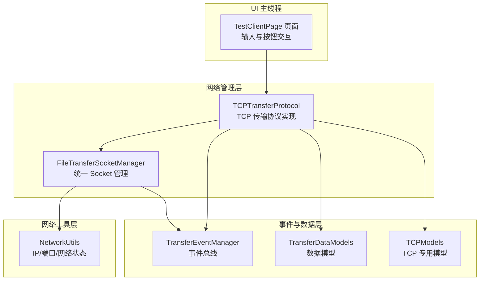
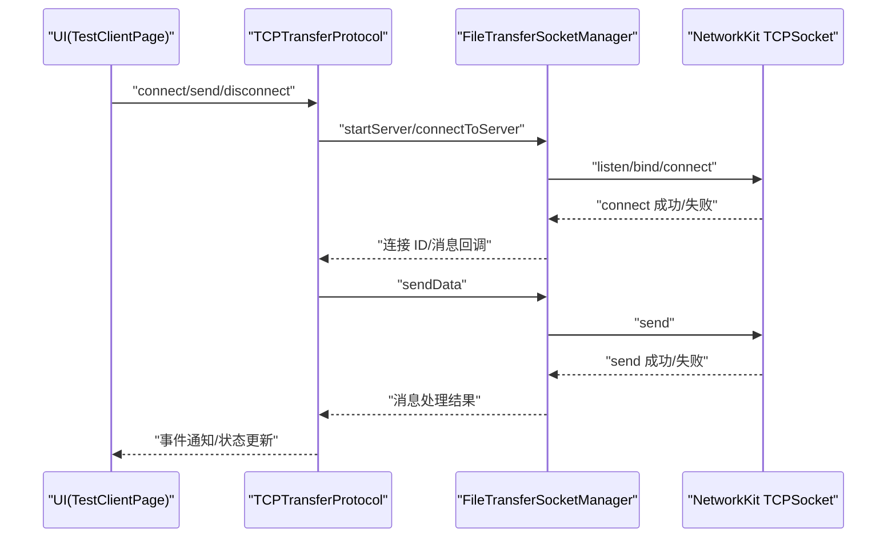
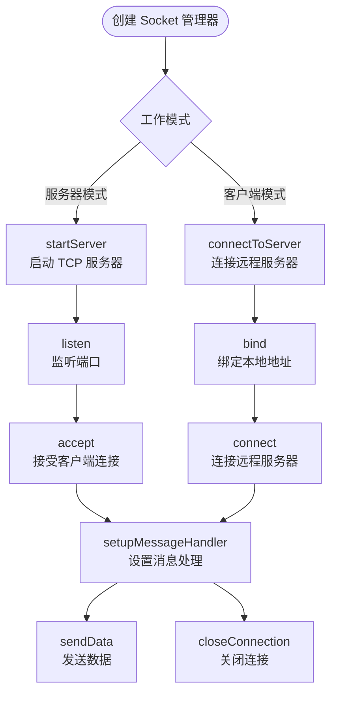
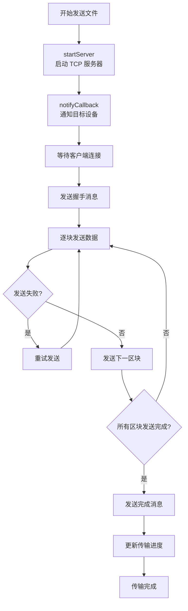
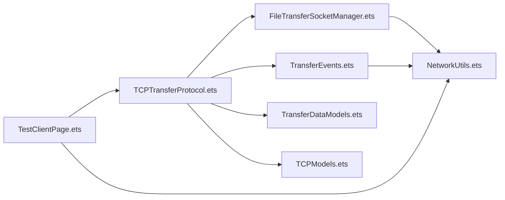

# TCP 客户端

<cite>
**本文引用的文件**
- [FileTransferSocketManager.ets](file://entry/src/main/ets/manager/transfer/socket/FileTransferSocketManager.ets)
- [TCPTransferProtocol.ets](file://entry/src/main/ets/manager/transfer/protocol/TCPTransferProtocol.ets)
- [TransferEvents.ets](file://entry/src/main/ets/manager/transfer/event/TransferEvents.ets)
- [TransferDataModels.ets](file://entry/src/main/ets/manager/transfer/model/TransferDataModels.ets)
- [TCPModels.ets](file://entry/src/main/ets/manager/transfer/model/TCPModels.ets)
- [NetworkUtils.ets](file://entry/src/main/ets/manager/transfer/utils/NetworkUtils.ets)
- [TestClientPage.ets](file://entry/src/main/ets/pages/TestClientPage.ets)
</cite>

## 目录
1. [简介](#简介)
2. [项目结构](#项目结构)
3. [核心组件](#核心组件)
4. [架构总览](#架构总览)
5. [详细组件分析](#详细组件分析)
6. [依赖关系分析](#依赖关系分析)
7. [性能考虑](#性能考虑)
8. [故障排除指南](#故障排除指南)
9. [结论](#结论)
10. [附录](#附录)

## 简介
本文件面向 TCP 客户端功能，围绕新的 TCP 通信实现方式，重点介绍 FileTransferSocketManager 和 TCPTransferProtocol 的连接管理、数据传输与错误处理机制。文档覆盖以下关键主题：
- 初始化流程：IP 地址获取、端口配置与连接建立
- TCP 消息接口的数据结构与字段含义
- 与 FileTransferSocketManager 的线程通信机制：消息传递、事件处理与状态同步
- 完整使用示例：连接建立、消息发送、连接关闭
- UI 组件实现细节：输入验证、用户交互与状态显示
- 常见网络连接问题与故障排除方法

## 项目结构
该项目采用 ArkTS + 网络套接字的架构设计，UI 侧通过主线程负责界面与用户交互，网络通信由 FileTransferSocketManager 统一管理，TCPTransferProtocol 负责具体的传输协议实现，二者通过事件总线进行解耦。

**图表来源**
- [FileTransferSocketManager.ets](file://entry/src/main/ets/manager/transfer/socket/FileTransferSocketManager.ets#L37-L65)
- [TCPTransferProtocol.ets](file://entry/src/main/ets/manager/transfer/protocol/TCPTransferProtocol.ets#L39-L56)
- [TransferEvents.ets](file://entry/src/main/ets/manager/transfer/event/TransferEvents.ets#L62-L75)
- [NetworkUtils.ets](file://entry/src/main/ets/manager/transfer/utils/NetworkUtils.ets#L7-L29)

**章节来源**
- [FileTransferSocketManager.ets](file://entry/src/main/ets/manager/transfer/socket/FileTransferSocketManager.ets#L1-L436)
- [TCPTransferProtocol.ets](file://entry/src/main/ets/manager/transfer/protocol/TCPTransferProtocol.ets#L1-L687)
- [TransferEvents.ets](file://entry/src/main/ets/manager/transfer/event/TransferEvents.ets#L1-L206)
- [NetworkUtils.ets](file://entry/src/main/ets/manager/transfer/utils/NetworkUtils.ets#L1-L131)

## 核心组件
- FileTransferSocketManager：统一的 TCP Socket 管理器，负责管理所有 TCP 连接的生命周期，包括服务器启动、客户端连接、消息处理与连接关闭。
- TCPTransferProtocol：基于 TCP 的文件传输协议实现，演示连接、发送、接收与事件管理，支持分块传输和错误处理。
- TransferEventManager：传输事件管理类，提供事件的发送和监听功能，支持多种传输事件类型。
- TransferDataModels：传输相关的数据模型，包含文件信息、分块数据、传输任务等核心数据结构。
- TCPModels：TCP 传输专用数据模型，定义 TCP 协议特有的消息类型和数据结构。
- NetworkUtils：网络工具类，提供 IP 地址获取、端口校验、网络状态检查等通用能力。
- TestClientPage：推理客户端测试页面，展示 TCP 客户端的使用示例和界面交互。

**章节来源**
- [FileTransferSocketManager.ets](file://entry/src/main/ets/manager/transfer/socket/FileTransferSocketManager.ets#L37-L436)
- [TCPTransferProtocol.ets](file://entry/src/main/ets/manager/transfer/protocol/TCPTransferProtocol.ets#L39-L687)
- [TransferEvents.ets](file://entry/src/main/ets/manager/transfer/event/TransferEvents.ets#L62-L206)
- [TransferDataModels.ets](file://entry/src/main/ets/manager/transfer/model/TransferDataModels.ets#L1-L96)
- [TCPModels.ets](file://entry/src/main/ets/manager/transfer/model/TCPModels.ets#L1-L118)
- [NetworkUtils.ets](file://entry/src/main/ets/manager/transfer/utils/NetworkUtils.ets#L7-L131)
- [TestClientPage.ets](file://entry/src/main/ets/pages/TestClientPage.ets#L1-L162)

## 架构总览
下图展示了新的 TCP 客户端架构，UI 与网络层通过 FileTransferSocketManager 和 TCPTransferProtocol 进行解耦，事件总线实现松耦合通信。

**图表来源**
- [TCPTransferProtocol.ets](file://entry/src/main/ets/manager/transfer/protocol/TCPTransferProtocol.ets#L71-L90)
- [FileTransferSocketManager.ets](file://entry/src/main/ets/manager/transfer/socket/FileTransferSocketManager.ets#L240-L310)
- [FileTransferSocketManager.ets](file://entry/src/main/ets/manager/transfer/socket/FileTransferSocketManager.ets#L318-L345)

## 详细组件分析

### FileTransferSocketManager（Socket 管理器）
- 单例模式设计，统一管理所有 TCP 连接
- 支持服务器模式和客户端模式两种工作方式
- 提供连接池管理、消息回调注册、连接状态监控等功能
- 实现了完整的生命周期管理：启动、连接、发送、关闭

**图表来源**
- [FileTransferSocketManager.ets](file://entry/src/main/ets/manager/transfer/socket/FileTransferSocketManager.ets#L72-L110)
- [FileTransferSocketManager.ets](file://entry/src/main/ets/manager/transfer/socket/FileTransferSocketManager.ets#L240-L310)
- [FileTransferSocketManager.ets](file://entry/src/main/ets/manager/transfer/socket/FileTransferSocketManager.ets#L318-L376)

**章节来源**
- [FileTransferSocketManager.ets](file://entry/src/main/ets/manager/transfer/socket/FileTransferSocketManager.ets#L37-L436)

### TCPTransferProtocol（TCP 传输协议）
- 实现 TransferProtocolInterface 接口，提供标准的传输协议能力
- 支持分块传输，适用于大文件传输场景
- 集成事件管理，提供完整的传输状态跟踪
- 实现了握手、分块传输、完成确认等完整的 TCP 传输流程

**图表来源**
- [TCPTransferProtocol.ets](file://entry/src/main/ets/manager/transfer/protocol/TCPTransferProtocol.ets#L142-L284)
- [TCPTransferProtocol.ets](file://entry/src/main/ets/manager/transfer/protocol/TCPTransferProtocol.ets#L286-L343)

**章节来源**
- [TCPTransferProtocol.ets](file://entry/src/main/ets/manager/transfer/protocol/TCPTransferProtocol.ets#L39-L687)

### TransferEventManager（事件管理器）
- 单例模式设计，提供全局事件管理
- 支持多种传输事件类型：开始、进度、完成、失败、取消等
- 实现事件的发送、监听、移除功能
- 提供便捷的方法来触发各种传输事件

**章节来源**
- [TransferEvents.ets](file://entry/src/main/ets/manager/transfer/event/TransferEvents.ets#L62-L206)

### 数据模型与消息结构
- FileInfo：文件元数据信息，包含文件标识、名称、大小、哈希等属性
- ChunkData：分块数据信息，用于大文件分块传输时的数据组织
- TCPNotifyInfo：TCP 传输通知信息，用于通知目标设备发起连接
- TCPMessage：TCP 消息通用接口，支持握手、分块、确认、完成、错误等消息类型

**章节来源**
- [TransferDataModels.ets](file://entry/src/main/ets/manager/transfer/model/TransferDataModels.ets#L10-L96)
- [TCPModels.ets](file://entry/src/main/ets/manager/transfer/model/TCPModels.ets#L25-L118)

### 网络工具与 IP 地址获取
- NetworkUtils 提供 IP 地址获取、端口校验、网络状态检查等通用能力
- 通过 wifiManager 获取本机 IP 地址并转换为点分十进制格式
- 实现端口范围校验，非法时回退到默认端口
- 提供网络连接状态检测功能

**章节来源**
- [NetworkUtils.ets](file://entry/src/main/ets/manager/transfer/utils/NetworkUtils.ets#L7-L131)

### UI 组件实现（TestClientPage）
- 展示 TCP 客户端的使用示例和界面交互
- 集成 HarmonyInferenceClient 和 MQTT 配置
- 提供测试任务管理和系统状态监控
- 展示推理客户端的完整实现

**章节来源**
- [TestClientPage.ets](file://entry/src/main/ets/pages/TestClientPage.ets#L1-L162)

## 依赖关系分析
- FileTransferSocketManager 依赖 NetworkKit TCPSocket、BusinessError、NetworkUtils
- TCPTransferProtocol 依赖 FileTransferSocketManager、TransferEventManager、TransferDataModels
- TransferEventManager 依赖 @ohos.events.emitter 和 TransferProtocolInterface
- 所有组件都依赖 NetworkUtils 进行网络状态检查
- UI 组件依赖测试页面和推理客户端

**图表来源**
- [TestClientPage.ets](file://entry/src/main/ets/pages/TestClientPage.ets#L1-L162)
- [TCPTransferProtocol.ets](file://entry/src/main/ets/manager/transfer/protocol/TCPTransferProtocol.ets#L5-L21)
- [FileTransferSocketManager.ets](file://entry/src/main/ets/manager/transfer/socket/FileTransferSocketManager.ets#L5-L7)
- [TransferEvents.ets](file://entry/src/main/ets/manager/transfer/event/TransferEvents.ets#L5-L6)

**章节来源**
- [TestClientPage.ets](file://entry/src/main/ets/pages/TestClientPage.ets#L1-L162)
- [TCPTransferProtocol.ets](file://entry/src/main/ets/manager/transfer/protocol/TCPTransferProtocol.ets#L1-L687)
- [FileTransferSocketManager.ets](file://entry/src/main/ets/manager/transfer/socket/FileTransferSocketManager.ets#L1-L436)
- [TransferEvents.ets](file://entry/src/main/ets/manager/transfer/event/TransferEvents.ets#L1-L206)
- [NetworkUtils.ets](file://entry/src/main/ets/manager/transfer/utils/NetworkUtils.ets#L1-L131)

## 性能考虑
- 连接池管理：FileTransferSocketManager 使用 Map 管理连接，支持多连接并发处理
- 分块传输：TCPTransferProtocol 支持分块传输，避免大文件一次性传输导致的内存压力
- 事件驱动：通过 TransferEventManager 实现松耦合通信，减少组件间直接依赖
- 超时控制：支持连接超时、传输超时等超时机制，防止长时间阻塞
- 内存管理：及时清理连接和消息回调，避免内存泄漏

**章节来源**
- [FileTransferSocketManager.ets](file://entry/src/main/ets/manager/transfer/socket/FileTransferSocketManager.ets#L43-L44)
- [TCPTransferProtocol.ets](file://entry/src/main/ets/manager/transfer/protocol/TCPTransferProtocol.ets#L47-L51)
- [TCPTransferProtocol.ets](file://entry/src/main/ets/manager/transfer/protocol/TCPTransferProtocol.ets#L652-L678)

## 故障排除指南
- 连接失败
  - 现象：connectToServer 返回 null 或连接超时
  - 原因：网络不可用、端口被占用、防火墙拦截
  - 处理：检查网络状态、更换端口、确认防火墙设置
- 服务器启动失败
  - 现象：startServer 返回 false
  - 原因：IP 地址获取失败、端口冲突、权限不足
  - 处理：检查 IP 地址、释放端口、确认应用权限
- 消息发送失败
  - 现象：sendData 返回 false
  - 原因：连接断开、数据格式异常、目标设备离线
  - 处理：重新建立连接、检查数据格式、确认目标设备状态
- 传输超时
  - 现象：传输进度长时间不变或超时
  - 原因：网络延迟、目标设备处理慢、分块传输失败
  - 处理：增加超时时间、检查网络质量、重试传输
- 内存泄漏
  - 现象：应用内存持续增长
  - 原因：连接未正确关闭、消息回调未注销
  - 处理：确保调用 closeConnection、unregisterMessageCallback

**章节来源**
- [FileTransferSocketManager.ets](file://entry/src/main/ets/manager/transfer/socket/FileTransferSocketManager.ets#L72-L110)
- [FileTransferSocketManager.ets](file://entry/src/main/ets/manager/transfer/socket/FileTransferSocketManager.ets#L240-L310)
- [FileTransferSocketManager.ets](file://entry/src/main/ets/manager/transfer/socket/FileTransferSocketManager.ets#L318-L376)
- [TCPTransferProtocol.ets](file://entry/src/main/ets/manager/transfer/protocol/TCPTransferProtocol.ets#L142-L284)

## 结论
新的 TCP 客户端实现通过 FileTransferSocketManager 和 TCPTransferProtocol 提供了更加完善的 TCP 通信能力。FileTransferSocketManager 作为统一的 Socket 管理器，提供了连接池管理、消息处理、生命周期控制等核心功能；TCPTransferProtocol 则专注于传输协议实现，支持分块传输、事件管理、错误处理等高级特性。结合 TransferEventManager 的事件机制和 TransferDataModels 的数据结构，整个系统具备了良好的可扩展性和可维护性。相比之前的实现，新的架构更加模块化，功能更加完善，适合复杂的文件传输场景。

## 附录

### 使用示例（步骤说明）
- 连接建立
  - 调用 TCPTransferProtocol.connect 方法建立 TCP 连接
  - 服务器模式下调用 startServer 启动服务器监听
  - 客户端模式下调用 connectToServer 连接远程服务器
- 发送消息
  - 调用 TCPTransferProtocol.send 发送文件数据
  - 系统自动进行分块传输和重试机制
  - 通过事件管理器监听传输进度和状态
- 关闭连接
  - 调用 TCPTransferProtocol.disconnect 断开所有连接
  - 通过 FileTransferSocketManager.closeConnection 关闭特定连接

**章节来源**
- [TCPTransferProtocol.ets](file://entry/src/main/ets/manager/transfer/protocol/TCPTransferProtocol.ets#L71-L90)
- [TCPTransferProtocol.ets](file://entry/src/main/ets/manager/transfer/protocol/TCPTransferProtocol.ets#L142-L284)
- [FileTransferSocketManager.ets](file://entry/src/main/ets/manager/transfer/socket/FileTransferSocketManager.ets#L360-L376)

### 数据传输与错误处理
- 分块传输机制：支持 128KB 默认分块大小，可配置调整
- 重试机制：最大重试 3 次，指数退避策略
- 错误处理：完整的错误消息返回和状态更新
- 进度跟踪：实时传输进度更新和事件通知

**章节来源**
- [TCPTransferProtocol.ets](file://entry/src/main/ets/manager/transfer/protocol/TCPTransferProtocol.ets#L47-L49)
- [TCPTransferProtocol.ets](file://entry/src/main/ets/manager/transfer/protocol/TCPTransferProtocol.ets#L240-L247)
- [TCPTransferProtocol.ets](file://entry/src/main/ets/manager/transfer/protocol/TCPTransferProtocol.ets#L278-L283)
- [TCPTransferProtocol.ets](file://entry/src/main/ets/manager/transfer/protocol/TCPTransferProtocol.ets#L652-L678)

### UI 组件实现要点
- 测试页面集成：TestClientPage 展示完整的 TCP 客户端使用示例
- 事件监听：通过 TransferEventManager 监听传输事件
- 状态显示：实时显示连接状态、传输进度、错误信息
- 用户交互：提供连接、发送、断开等操作按钮

**章节来源**
- [TestClientPage.ets](file://entry/src/main/ets/pages/TestClientPage.ets#L1-L162)
- [TransferEvents.ets](file://entry/src/main/ets/manager/transfer/event/TransferEvents.ets#L115-L130)
- [TransferEvents.ets](file://entry/src/main/ets/manager/transfer/event/TransferEvents.ets#L161-L169)