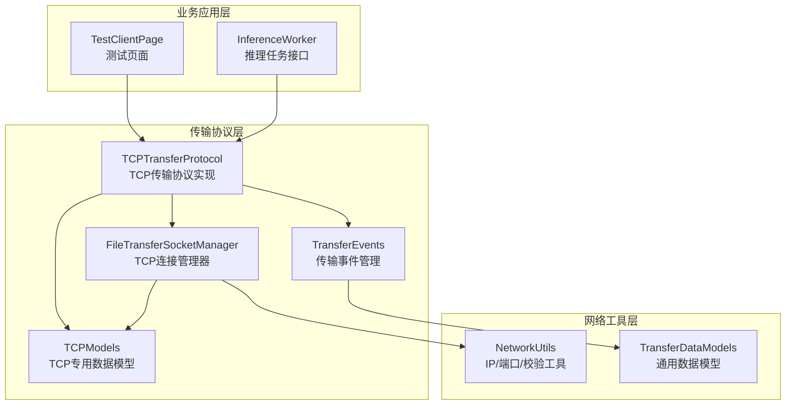
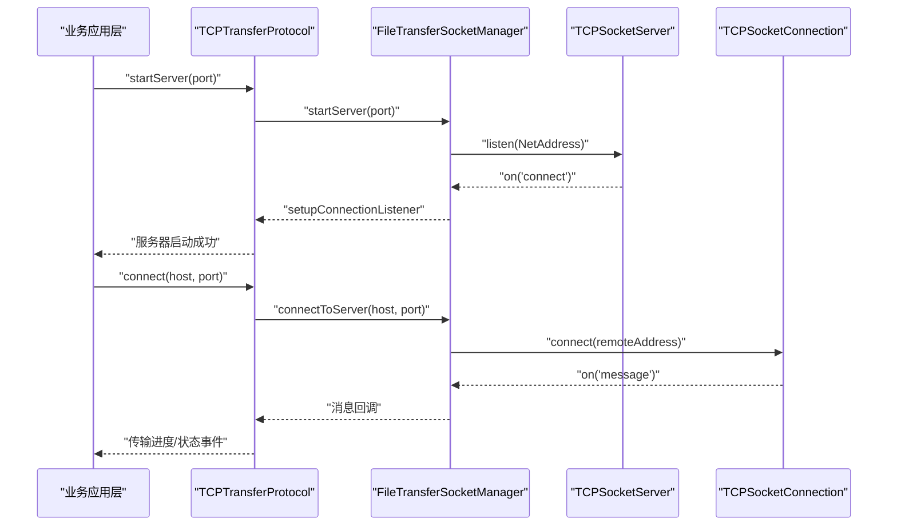
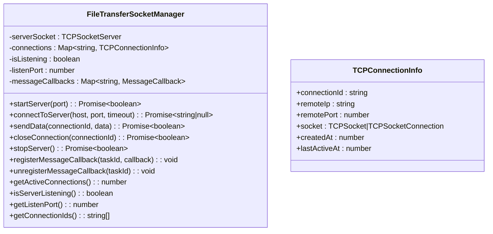
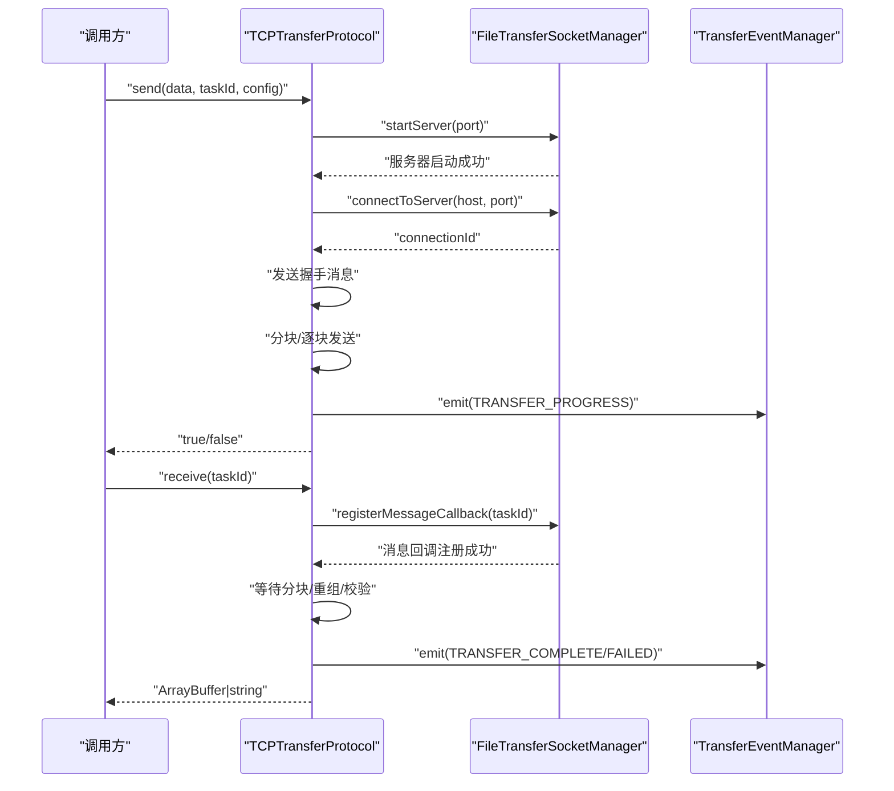
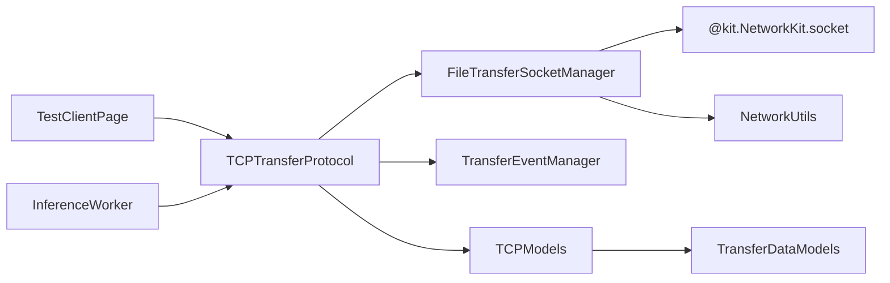

# TCP 服务器

<cite>
**本文引用的文件**
- [FileTransferSocketManager.ets](file://entry/src/main/ets/manager/transfer/socket/FileTransferSocketManager.ets)
- [TCPTransferProtocol.ets](file://entry/src/main/ets/manager/transfer/protocol/TCPTransferProtocol.ets)
- [TCPModels.ets](file://entry/src/main/ets/manager/transfer/model/TCPModels.ets)
- [TransferEvents.ets](file://entry/src/main/ets/manager/transfer/event/TransferEvents.ets)
- [NetworkUtils.ets](file://entry/src/main/ets/manager/transfer/utils/NetworkUtils.ets)
- [TransferDataModels.ets](file://entry/src/main/ets/manager/transfer/model/TransferDataModels.ets)
- [InferenceWorker.ets](file://entry/src/main/ets/manager/worker/InferenceWorker.ets)
- [TestClientPage.ets](file://entry/src/main/ets/pages/TestClientPage.ets)
</cite>

## 更新摘要
**所做更改**
- 移除了对已删除的TcpServer.ets和TcpServerWorker.ets的引用
- 更新了架构概述以反映新的基于协议层的实现方式
- 添加了FileTransferSocketManager和TCPTransferProtocol的核心组件分析
- 更新了依赖关系图以显示新的组件结构
- 修订了使用示例以反映新的API接口

## 目录
1. [简介](#简介)
2. [项目结构](#项目结构)
3. [核心组件](#核心组件)
4. [架构总览](#架构总览)
5. [详细组件分析](#详细组件分析)
6. [依赖关系分析](#依赖关系分析)
7. [性能考虑](#性能考虑)
8. [故障排查指南](#故障排查指南)
9. [结论](#结论)
10. [附录](#附录)

## 简介
本文件面向 TCP 服务器功能，系统性阐述基于 FileTransferSocketManager 和 TCPTransferProtocol 的现代 TCP 通信实现。重点覆盖：
- 服务器启动流程、监听端口配置、客户端连接接受与连接池管理
- 基于协议层的传输机制：分块传输、握手协议、进度管理与事件驱动
- 服务器端消息处理流程、数据转发与状态维护
- 部署与配置指南：网络配置、防火墙设置、性能优化建议
- 监控与日志：事件驱动的状态上报与调试信息
- 实际使用示例与最佳实践

## 项目结构
本项目采用"传输协议层 + 网络工具层 + 业务应用层"的分层设计：
- 传输协议层提供统一的 TCP 传输接口，封装连接管理、分块传输、握手协议
- 网络工具层提供 IP 获取、端口校验、网络状态检查等通用能力
- 业务应用层（如测试页面）通过协议接口实现具体的传输需求



**图表来源**
- [FileTransferSocketManager.ets](file://entry/src/main/ets/manager/transfer/socket/FileTransferSocketManager.ets#L37-L435)
- [TCPTransferProtocol.ets](file://entry/src/main/ets/manager/transfer/protocol/TCPTransferProtocol.ets#L39-L686)
- [TCPModels.ets](file://entry/src/main/ets/manager/transfer/model/TCPModels.ets#L1-L118)
- [TransferEvents.ets](file://entry/src/main/ets/manager/transfer/event/TransferEvents.ets#L62-L205)

**章节来源**
- [FileTransferSocketManager.ets](file://entry/src/main/ets/manager/transfer/socket/FileTransferSocketManager.ets#L1-L436)
- [TCPTransferProtocol.ets](file://entry/src/main/ets/manager/transfer/protocol/TCPTransferProtocol.ets#L1-L687)
- [TCPModels.ets](file://entry/src/main/ets/manager/transfer/model/TCPModels.ets#L1-L118)
- [TransferEvents.ets](file://entry/src/main/ets/manager/transfer/event/TransferEvents.ets#L1-L206)
- [NetworkUtils.ets](file://entry/src/main/ets/manager/transfer/utils/NetworkUtils.ets#L1-L131)
- [TransferDataModels.ets](file://entry/src/main/ets/manager/transfer/model/TransferDataModels.ets#L1-L96)
- [TestClientPage.ets](file://entry/src/main/ets/pages/TestClientPage.ets#L1-L162)
- [InferenceWorker.ets](file://entry/src/main/ets/manager/worker/InferenceWorker.ets#L1-L90)

## 核心组件
- **FileTransferSocketManager**：统一管理 TCP 连接的单例管理器，提供服务器启动、客户端连接、消息发送、连接关闭等核心功能
- **TCPTransferProtocol**：基于 FileTransferSocketManager 实现的 TCP 传输协议，提供分块传输、握手协议、进度管理、事件驱动
- **TCPModels**：定义 TCP 传输专用的数据结构，包括消息类型、传输配置、握手消息、分块消息等
- **TransferEvents**：传输事件管理器，提供事件的发布、订阅、监听功能
- **NetworkUtils**：网络工具类，提供 IP 地址获取、端口校验、网络状态检查等
- **TransferDataModels**：通用传输数据模型，定义文件信息、分块数据、传输任务等基础数据结构

**章节来源**
- [FileTransferSocketManager.ets](file://entry/src/main/ets/manager/transfer/socket/FileTransferSocketManager.ets#L37-L435)
- [TCPTransferProtocol.ets](file://entry/src/main/ets/manager/transfer/protocol/TCPTransferProtocol.ets#L39-L686)
- [TCPModels.ets](file://entry/src/main/ets/manager/transfer/model/TCPModels.ets#L9-L118)
- [TransferEvents.ets](file://entry/src/main/ets/manager/transfer/event/TransferEvents.ets#L62-L205)
- [NetworkUtils.ets](file://entry/src/main/ets/manager/transfer/utils/NetworkUtils.ets#L7-L131)
- [TransferDataModels.ets](file://entry/src/main/ets/manager/transfer/model/TransferDataModels.ets#L6-L96)

## 架构总览
下图展示了新的 TCP 服务器架构，基于协议层的设计模式：



**图表来源**
- [TCPTransferProtocol.ets](file://entry/src/main/ets/manager/transfer/protocol/TCPTransferProtocol.ets#L98-L114)
- [FileTransferSocketManager.ets](file://entry/src/main/ets/manager/transfer/socket/FileTransferSocketManager.ets#L72-L110)
- [FileTransferSocketManager.ets](file://entry/src/main/ets/manager/transfer/socket/FileTransferSocketManager.ets#L115-L145)

## 详细组件分析

### FileTransferSocketManager（连接管理器）
- **功能职责**
  - 单例管理 TCP 服务器与客户端连接
  - 提供 startServer/connectToServer/sendData/closeConnection/stopServer 等核心方法
  - 维护连接池 Map，记录连接 ID、远端地址、活跃时间
  - 支持消息回调注册与注销，实现事件驱动的消息处理
- **关键实现要点**
  - startServer：获取本机 IP，创建 TCPSocketServer 并监听指定端口
  - setupConnectionListener：监听客户端连接，生成连接 ID，设置消息处理回调
  - connectToServer：bind 本地地址，connect 远程地址，返回 connectionId
  - registerMessageCallback/unregisterMessageCallback：实现按任务 ID 的消息路由
  - stopServer：关闭所有连接并关闭服务器



**图表来源**
- [FileTransferSocketManager.ets](file://entry/src/main/ets/manager/transfer/socket/FileTransferSocketManager.ets#L37-L435)

**章节来源**
- [FileTransferSocketManager.ets](file://entry/src/main/ets/manager/transfer/socket/FileTransferSocketManager.ets#L37-L435)

### TCPTransferProtocol（传输协议）
- **功能职责**
  - 实现 TransferProtocolInterface，提供 connect/startServer/send/receive/getProgress/cancel
  - 基于 FileTransferSocketManager 实现 TCP 传输
  - 事件驱动：通过 TransferEventManager 上报进度与状态
  - 支持分块传输、握手协议、错误处理、超时控制
- **关键实现要点**
  - startServer：委托 FileTransferSocketManager.startServer，启动 TCP 服务器监听
  - connect：委托 FileTransferSocketManager.connectToServer，建立客户端连接
  - send：分块传输、握手、逐块发送、完成消息；更新进度并触发事件
  - receive：等待分块、重组、校验哈希；更新进度并返回数据
  - 进度管理：使用 progressMap 管理传输进度，支持超时清理
  - 消息处理：解析 TCP 消息，支持握手、分块、完成、错误等消息类型



**图表来源**
- [TCPTransferProtocol.ets](file://entry/src/main/ets/manager/transfer/protocol/TCPTransferProtocol.ets#L142-L284)
- [FileTransferSocketManager.ets](file://entry/src/main/ets/manager/transfer/socket/FileTransferSocketManager.ets#L209-L221)
- [TransferEvents.ets](file://entry/src/main/ets/manager/transfer/event/TransferEvents.ets#L161-L178)

**章节来源**
- [TCPTransferProtocol.ets](file://entry/src/main/ets/manager/transfer/protocol/TCPTransferProtocol.ets#L39-L686)
- [TCPModels.ets](file://entry/src/main/ets/manager/transfer/model/TCPModels.ets#L45-L118)
- [TransferEvents.ets](file://entry/src/main/ets/manager/transfer/event/TransferEvents.ets#L62-L205)

### TCP 消息模型与协议
- **消息类型定义**：HANDSHAKE、CHUNK、CHUNK_ACK、COMPLETE、ERROR 等消息类型
- **传输配置**：支持分块大小、超时时间、最大重试次数等配置参数
- **握手协议**：传输开始前的握手消息，包含文件信息、总块数、分块大小、文件哈希
- **分块传输**：支持 Base64 编码的分块数据传输，确保二进制数据的可靠传输
- **进度管理**：实时更新传输进度，支持百分比计算和字节统计

**章节来源**
- [TCPModels.ets](file://entry/src/main/ets/manager/transfer/model/TCPModels.ets#L9-L118)
- [TCPTransferProtocol.ets](file://entry/src/main/ets/manager/transfer/protocol/TCPTransferProtocol.ets#L446-L522)

### 传输事件与进度管理
- **事件类型**：TRANSFER_START/PROGRESS/COMPLETE/FAILED/CANCELLED、TCP_CONNECTED/DISCONNECTED、CHUNK_RECEIVED、FILE_REASSEMBLED
- **事件管理**：TransferEventManager 提供 emit/on/off/offAll，统一事件分发
- **进度模型**：TransferProgress 包含状态、已传/总字节、百分比、错误信息等
- **超时处理**：接收超时 5 分钟，自动清理进度记录

**章节来源**
- [TransferEvents.ets](file://entry/src/main/ets/manager/transfer/event/TransferEvents.ets#L11-L30)
- [TransferEvents.ets](file://entry/src/main/ets/manager/transfer/event/TransferEvents.ets#L62-L205)
- [TCPTransferProtocol.ets](file://entry/src/main/ets/manager/transfer/protocol/TCPTransferProtocol.ets#L624-L686)

### 网络工具与 IP 获取
- **NetworkUtils**：提供 getIpAddress/isNetworkConnected/getSubnetMask/getGateway/isValidIpAddress/validatePort
- **IP 获取**：通过 wifiManager.getIpInfo 获取设备 IP 地址
- **端口校验**：validatePort 方法确保端口号在有效范围内（1-65535）

**章节来源**
- [NetworkUtils.ets](file://entry/src/main/ets/manager/transfer/utils/NetworkUtils.ets#L7-L131)

## 依赖关系分析
- **FileTransferSocketManager** 依赖 NetworkKit socket 与 NetworkUtils
- **TCPTransferProtocol** 依赖 FileTransferSocketManager 与 TransferEventManager
- **TCPModels** 依赖 TransferDataModels 和 TransferProtocolInterface
- **TransferEvents** 提供事件管理服务
- **业务应用层** 通过 TCPTransferProtocol 接口访问传输功能



**图表来源**
- [FileTransferSocketManager.ets](file://entry/src/main/ets/manager/transfer/socket/FileTransferSocketManager.ets#L5-L7)
- [TCPTransferProtocol.ets](file://entry/src/main/ets/manager/transfer/protocol/TCPTransferProtocol.ets#L5-L21)
- [TestClientPage.ets](file://entry/src/main/ets/pages/TestClientPage.ets#L1-L7)

**章节来源**
- [FileTransferSocketManager.ets](file://entry/src/main/ets/manager/transfer/socket/FileTransferSocketManager.ets#L5-L7)
- [TCPTransferProtocol.ets](file://entry/src/main/ets/manager/transfer/protocol/TCPTransferProtocol.ets#L5-L21)
- [TestClientPage.ets](file://entry/src/main/ets/pages/TestClientPage.ets#L1-L7)

## 性能考虑
- **分块传输**：默认分块大小 128KB，可配置；减少内存峰值与拥塞风险
- **重试机制**：每块最多重试 3 次，指数退避可按需扩展
- **超时控制**：连接/发送/接收均支持超时，避免阻塞
- **进度上报**：高频事件需谨慎，建议合并或节流
- **连接池**：FileTransferSocketManager 支持多连接，注意资源释放与心跳维护
- **消息路由**：按任务 ID 注册消息回调，支持动态路由和清理

## 故障排查指南
- **服务器启动失败**
  - 检查端口占用与权限；确认 NetworkUtils.validatePort 与端口范围
  - 查看 FileTransferSocketManager 的启动日志与错误信息
- **客户端连接失败**
  - 确认服务器 IP 地址正确；检查防火墙与局域网连通性
  - 验证端口是否开放，连接超时时间设置是否合理
- **传输中断**
  - 检查网络稳定性；关注分块重试机制
  - 确认文件哈希一致性；关注 TCPTransferProtocol 的 FAILED 状态
- **事件未触发**
  - 确认 TransferEventManager 的监听注册与事件 ID 对应
  - 检查消息回调是否正确注册与注销

**章节来源**
- [FileTransferSocketManager.ets](file://entry/src/main/ets/manager/transfer/socket/FileTransferSocketManager.ets#L72-L110)
- [TCPTransferProtocol.ets](file://entry/src/main/ets/manager/transfer/protocol/TCPTransferProtocol.ets#L142-L284)
- [TransferEvents.ets](file://entry/src/main/ets/manager/transfer/event/TransferEvents.ets#L161-L178)

## 结论
本项目通过基于协议层的 TCP 通信实现，提供了更加灵活和可扩展的传输解决方案。FileTransferSocketManager 作为连接管理器，提供了统一的连接生命周期管理；TCPTransferProtocol 作为传输协议实现，封装了复杂的传输逻辑。配合 TransferEvents 的事件驱动机制，具备良好的可观测性与可维护性。相比传统的 UI 页面 + Worker 线程模式，新的架构更加模块化，便于业务应用层的集成与扩展。

## 附录

### 部署与配置指南
- **网络配置**
  - 获取本机 IP：使用 NetworkUtils.getIpAddress；确保设备在同一局域网
  - 端口配置：默认 8888；可通过 validatePort 校验与替换
- **防火墙设置**
  - 开放服务器监听端口；确保入站规则允许来自目标设备的连接
- **性能优化建议**
  - 根据带宽与延迟调整分块大小（默认 128KB）
  - 合理设置超时与重试次数，避免长时间阻塞
  - 使用事件驱动机制，减少不必要的轮询操作

**章节来源**
- [NetworkUtils.ets](file://entry/src/main/ets/manager/transfer/utils/NetworkUtils.ets#L118-L129)
- [TCPTransferProtocol.ets](file://entry/src/main/ets/manager/transfer/protocol/TCPTransferProtocol.ets#L47-L51)

### 使用示例与最佳实践
- **服务器启动示例**
  ```typescript
  const tcpProtocol = new TCPTransferProtocol();
  const result = await tcpProtocol.startServer(8888);
  if (result) {
      console.log('服务器启动成功');
  }
  ```
- **客户端连接示例**
  ```typescript
  const tcpProtocol = new TCPTransferProtocol();
  const result = await tcpProtocol.connect('192.168.1.100', 8888);
  if (result) {
      console.log('连接成功');
  }
  ```
- **文件传输示例**
  ```typescript
  const tcpProtocol = new TCPTransferProtocol();
  const notifyCallback = async (notifyInfo) => {
      // 通知目标设备发起连接
      console.log('通知目标设备连接:', notifyInfo);
  };
  
  const result = await tcpProtocol.send(fileData, taskId, { 
      notifyCallback, 
      chunkSize: 256 * 1024 
  });
  ```
- **最佳实践**
  - 使用单例模式管理 TCPTransferProtocol 实例
  - 通过 TransferEventManager 监听传输进度和状态
  - 合理设置分块大小，平衡传输效率与内存使用
  - 实现完善的错误处理和重试机制

**章节来源**
- [TCPTransferProtocol.ets](file://entry/src/main/ets/manager/transfer/protocol/TCPTransferProtocol.ets#L98-L114)
- [TCPTransferProtocol.ets](file://entry/src/main/ets/manager/transfer/protocol/TCPTransferProtocol.ets#L71-L90)
- [TCPTransferProtocol.ets](file://entry/src/main/ets/manager/transfer/protocol/TCPTransferProtocol.ets#L142-L284)
- [TestClientPage.ets](file://entry/src/main/ets/pages/TestClientPage.ets#L11-L30)