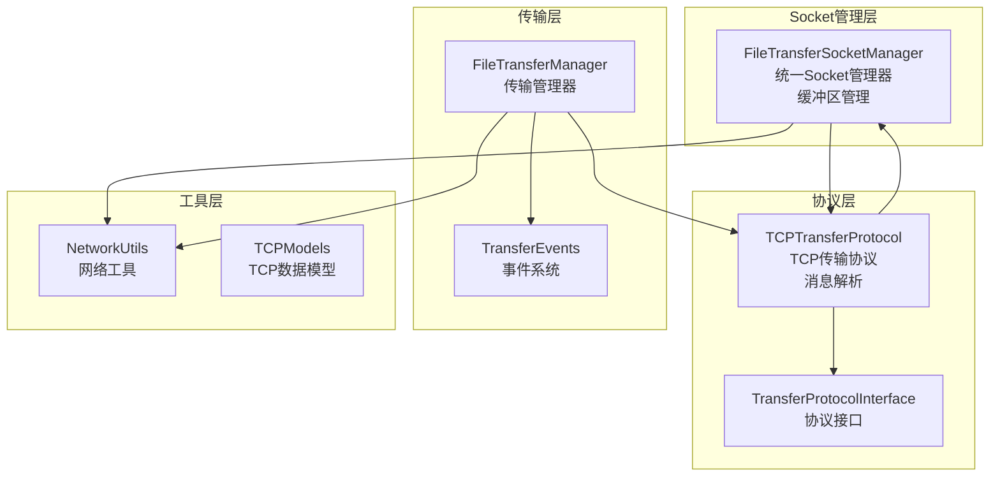
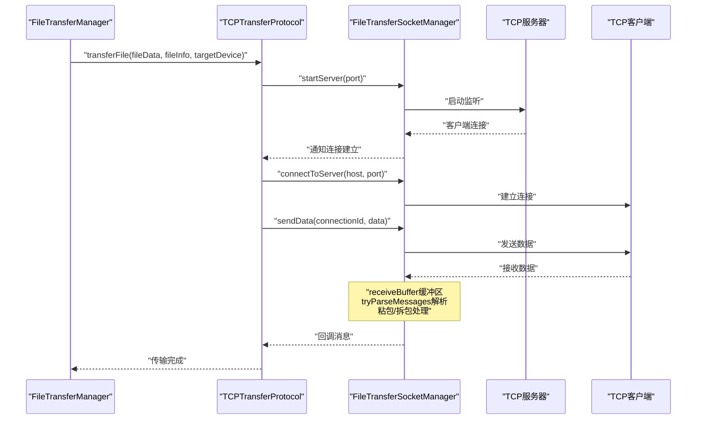
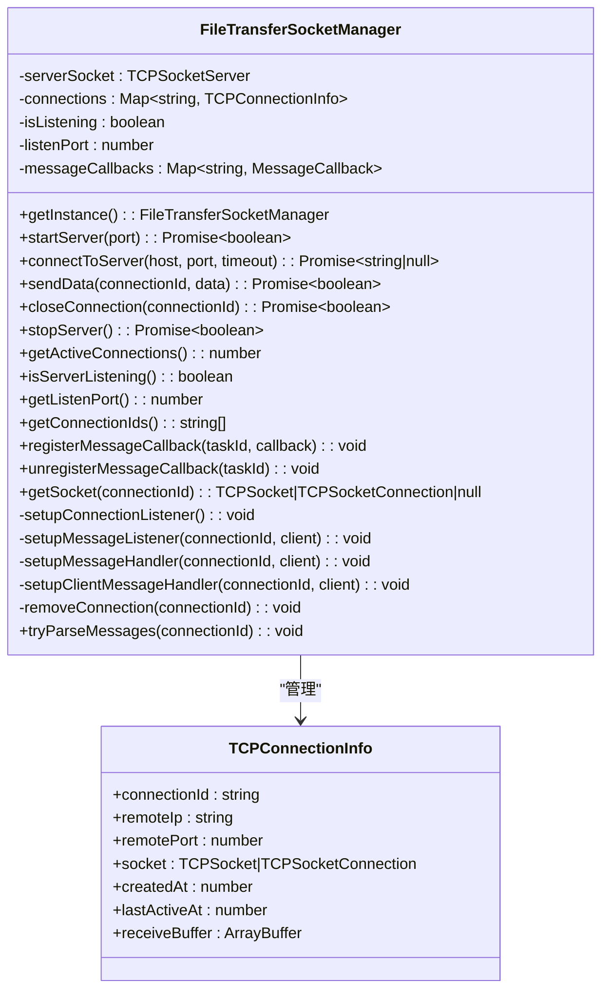
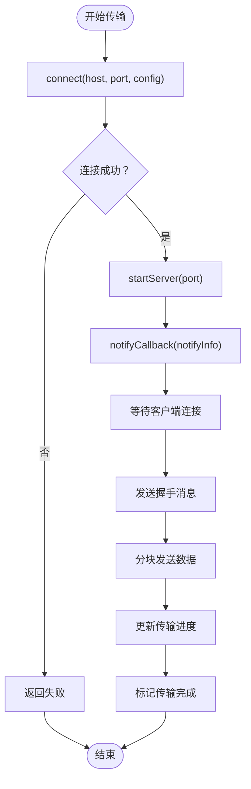
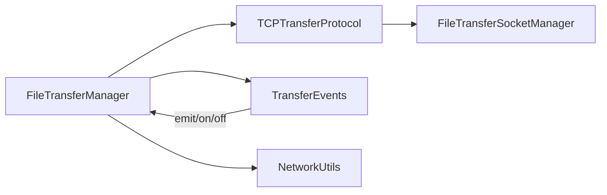
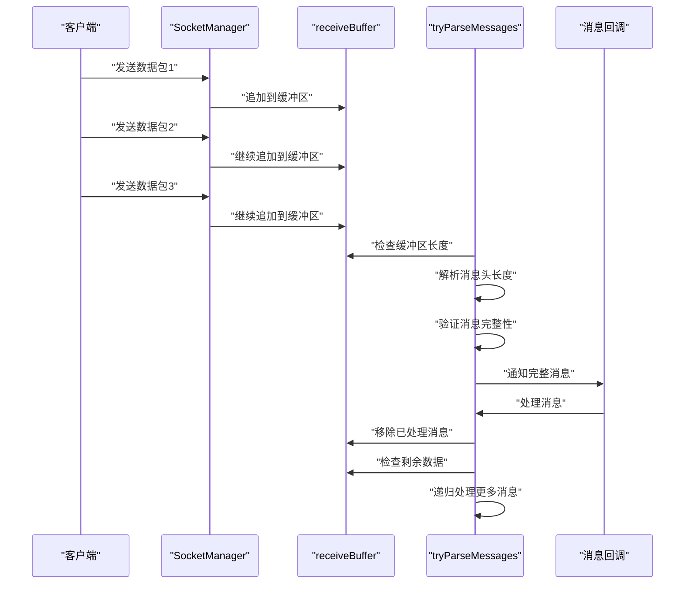
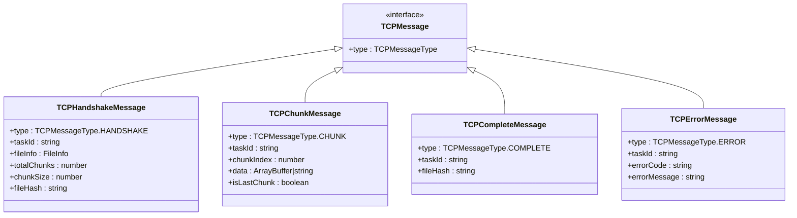
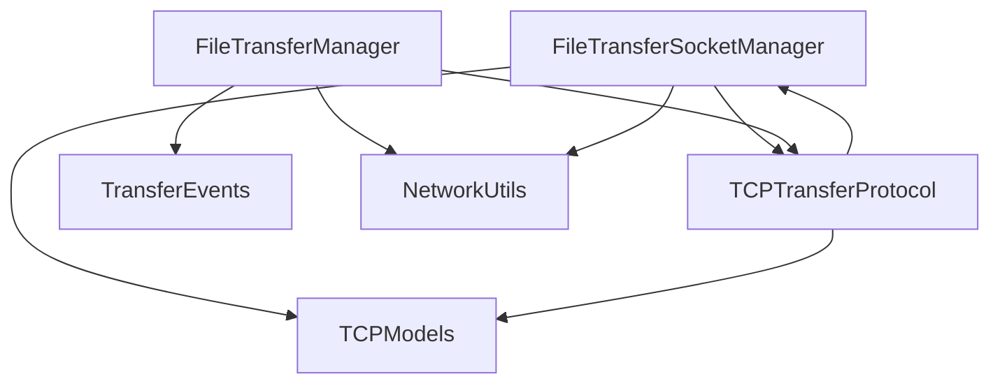

# 网络通信模块

<cite>
**本文档引用的文件**
- [FileTransferSocketManager.ets](file://entry/src/main/ets/manager/transfer/socket/FileTransferSocketManager.ets)
- [TCPTransferProtocol.ets](file://entry/src/main/ets/manager/transfer/protocol/TCPTransferProtocol.ets)
- [TransferProtocolInterface.ets](file://entry/src/main/ets/manager/transfer/protocol/TransferProtocolInterface.ets)
- [TransferDataModels.ets](file://entry/src/main/ets/manager/transfer/model/TransferDataModels.ets)
- [TransferEvents.ets](file://entry/src/main/ets/manager/transfer/event/TransferEvents.ets)
- [NetworkUtils.ets](file://entry/src/main/ets/manager/transfer/utils/NetworkUtils.ets)
- [FileTransferManager.ets](file://entry/src/main/ets/manager/transfer/FileTransferManager.ets)
- [TCPModels.ets](file://entry/src/main/ets/manager/transfer/model/TCPModels.ets)
- [TestClientPage.ets](file://entry/src/main/ets/pages/TestClientPage.ets)
</cite>

## 更新摘要
**变更内容**
- 新增了TCP粘包/拆包处理机制的详细文档
- 更新了receiveBuffer缓冲区和tryParseMessages消息解析功能的实现说明
- 增强了连接管理和错误处理能力的描述
- 完善了消息格式和协议规范的技术细节

## 目录
1. [简介](#简介)
2. [项目结构](#项目结构)
3. [核心组件](#核心组件)
4. [架构总览](#架构总览)
5. [详细组件分析](#详细组件分析)
6. [TCP粘包/拆包处理机制](#tcp粘包拆包处理机制)
7. [消息格式与协议规范](#消息格式与协议规范)
8. [依赖关系分析](#依赖关系分析)
9. [性能考虑](#性能考虑)
10. [故障排除指南](#故障排除指南)
11. [结论](#结论)
12. [附录](#附录)

## 简介
本文件针对网络通信模块的子功能进行深入文档化，重点覆盖：
- FileTransferSocketManager的统一Socket管理能力
- TCPTransferProtocol的文件传输协议实现
- 基于单例模式的连接管理与生命周期控制
- **新增：TCP粘包/拆包处理机制的缓冲区管理**
- **新增：消息格式标准化与解析流程**
- 与文件传输模块的集成与扩展能力
- 配置项、参数与返回值说明
- 常见问题与解决方案

该模块采用 ArkTS + 单例模式的架构，通过FileTransferSocketManager统一管理TCP连接，提供服务端监听与客户端连接能力，简化了网络通信的复杂性。**最新版本增强了消息处理的可靠性，通过receiveBuffer缓冲区有效解决了TCP粘包/拆包问题。**

## 项目结构
网络通信模块主要分布在以下目录：
- Socket管理层：FileTransferSocketManager统一管理TCP连接，**新增缓冲区管理**
- 协议层：TCPTransferProtocol实现文件传输协议，**增强消息解析能力**
- 传输层：FileTransferManager协调传输任务
- 工具层：NetworkUtils提供网络工具
- 事件层：TransferEvents提供事件系统

**图表来源**
- [FileTransferSocketManager.ets:37-435](file://entry/src/main/ets/manager/transfer/socket/FileTransferSocketManager.ets#L37-L435)
- [TCPTransferProtocol.ets:39-686](file://entry/src/main/ets/manager/transfer/protocol/TCPTransferProtocol.ets#L39-L686)
- [FileTransferManager.ets:24-405](file://entry/src/main/ets/manager/transfer/FileTransferManager.ets#L24-L405)

## 核心组件
- FileTransferSocketManager：统一管理TCP连接生命周期，支持服务端监听与客户端连接，**新增receiveBuffer缓冲区管理**
- TCPTransferProtocol：基于TCP的文件传输协议实现，支持分块传输与进度跟踪，**增强消息解析与错误处理**
- TransferProtocolInterface：传输协议标准化接口
- TransferEvents：传输事件系统，提供事件发布与监听
- NetworkUtils：网络工具，提供IP获取、端口校验等
- FileTransferManager：统一的文件传输管理器，自动选择协议并协调事件
- TCPModels：TCP传输专用数据模型，**标准化消息格式**

**章节来源**
- [FileTransferSocketManager.ets:37-435](file://entry/src/main/ets/manager/transfer/socket/FileTransferSocketManager.ets#L37-L435)
- [TCPTransferProtocol.ets:39-686](file://entry/src/main/ets/manager/transfer/protocol/TCPTransferProtocol.ets#L39-L686)
- [FileTransferManager.ets:24-405](file://entry/src/main/ets/manager/transfer/FileTransferManager.ets#L24-L405)

## 架构总览
下图展示了基于FileTransferSocketManager的统一架构：

**图表来源**
- [FileTransferManager.ets:116-191](file://entry/src/main/ets/manager/transfer/FileTransferManager.ets#L116-L191)
- [TCPTransferProtocol.ets:98-284](file://entry/src/main/ets/manager/transfer/protocol/TCPTransferProtocol.ets#L98-L284)
- [FileTransferSocketManager.ets:72-345](file://entry/src/main/ets/manager/transfer/socket/FileTransferSocketManager.ets#L72-L345)

## 详细组件分析

### FileTransferSocketManager 组件分析
- 设计模式：单例模式，统一管理 TCP 连接
- 主要职责
  - 启动 TCP 服务器监听（startServer）
  - 连接到远程 TCP 服务器（connectToServer）
  - 发送数据（sendData）
  - 关闭连接（closeConnection）
  - 维护连接池与状态
  - **新增：接收缓冲区管理（receiveBuffer）**
  - **新增：消息解析与粘包处理（tryParseMessages）**
- 关键数据结构
  - TCPConnectionInfo：连接 ID、远端 IP/端口、Socket 对象、时间戳、**receiveBuffer缓冲区**
  - connections：Map<string, TCPConnectionInfo>
- 方法概览
  - startServer(port)：启动监听并设置连接监听器
  - connectToServer(host, port, timeout)：绑定本地地址并连接远端
  - sendData(connectionId, data)：发送数据并更新活跃时间
  - closeConnection(connectionId)：关闭连接并移除
  - stopServer()：关闭所有连接并停止服务器
  - **新增：setupMessageListener()：设置消息监听与缓冲区处理**
  - **新增：tryParseMessages()：尝试解析完整消息**

**图表来源**
- [FileTransferSocketManager.ets:37-435](file://entry/src/main/ets/manager/transfer/socket/FileTransferSocketManager.ets#L37-L435)

**章节来源**
- [FileTransferSocketManager.ets:37-435](file://entry/src/main/ets/manager/transfer/socket/FileTransferSocketManager.ets#L37-L435)

### TCPTransferProtocol 组件分析
- 协议实现：实现 TransferProtocolInterface
- 主要职责
  - 作为客户端连接远程服务器（connect）
  - 发送/接收数据（send/receive）
  - 管理传输进度（getProgress）
  - 取消任务（cancel）
  - **增强：消息解析与错误处理**
- 关键配置
  - DEFAULT_CHUNK_SIZE：128KB
  - DEFAULT_TIMEOUT：30秒
  - MAX_RETRIES：3次
  - DEFAULT_PORT：8888
  - **新增：RECEIVE_TIMEOUT：300秒（接收超时）**
- 与 FileTransferSocketManager 的协作
  - 通过单例获取连接管理器
  - 使用连接 ID 进行数据发送与状态维护
  - **利用receiveBuffer缓冲区进行可靠消息解析**

**图表来源**
- [TCPTransferProtocol.ets:71-284](file://entry/src/main/ets/manager/transfer/protocol/TCPTransferProtocol.ets#L71-L284)
- [FileTransferSocketManager.ets:240-345](file://entry/src/main/ets/manager/transfer/socket/FileTransferSocketManager.ets#L240-L345)

**章节来源**
- [TCPTransferProtocol.ets:39-686](file://entry/src/main/ets/manager/transfer/protocol/TCPTransferProtocol.ets#L39-L686)
- [TransferProtocolInterface.ets:1-120](file://entry/src/main/ets/manager/transfer/protocol/TransferProtocolInterface.ets#L1-L120)

### TransferEvents 与 FileTransferManager
- TransferEvents：事件系统，提供事件的发送、监听与移除
- FileTransferManager：统一管理传输任务，自动选择协议（MQTT/TCP），协调事件与网络工具

**图表来源**
- [FileTransferManager.ets:24-405](file://entry/src/main/ets/manager/transfer/FileTransferManager.ets#L24-L405)
- [TransferEvents.ets:62-206](file://entry/src/main/ets/manager/transfer/event/TransferEvents.ets#L62-L206)
- [TCPTransferProtocol.ets:39-56](file://entry/src/main/ets/manager/transfer/protocol/TCPTransferProtocol.ets#L39-L56)
- [FileTransferSocketManager.ets:37-55](file://entry/src/main/ets/manager/transfer/socket/FileTransferSocketManager.ets#L37-L55)

**章节来源**
- [TransferEvents.ets:62-206](file://entry/src/main/ets/manager/transfer/event/TransferEvents.ets#L62-L206)
- [FileTransferManager.ets:24-405](file://entry/src/main/ets/manager/transfer/FileTransferManager.ets#L24-L405)

## TCP粘包/拆包处理机制

### 缓冲区管理架构
**新增功能**：FileTransferSocketManager引入了receiveBuffer缓冲区来处理TCP粘包/拆包问题，确保消息的完整性和可靠性。

**图表来源**
- [FileTransferSocketManager.ets:174-270](file://entry/src/main/ets/manager/transfer/socket/FileTransferSocketManager.ets#L174-L270)

### 消息解析流程
**新增功能**：tryParseMessages方法实现了智能的消息解析逻辑，能够处理粘包和拆包情况。

#### 消息格式规范
所有TCP消息采用统一的4字节长度前缀格式：
- **前4字节**：消息头长度（大端序整数）
- **剩余字节**：JSON格式的消息头数据

#### 解析算法步骤
1. **缓冲区检查**：确保缓冲区至少有4字节
2. **长度解析**：读取大端序的4字节长度值
3. **完整性验证**：检查消息长度是否合理（0-10MB）
4. **消息提取**：根据长度提取完整消息
5. **缓冲区更新**：移除已处理的消息
6. **回调通知**：通知所有注册的消息回调
7. **递归处理**：继续处理缓冲区中的其他消息

**章节来源**
- [FileTransferSocketManager.ets:215-270](file://entry/src/main/ets/manager/transfer/socket/FileTransferSocketManager.ets#L215-L270)

## 消息格式与协议规范

### TCP消息类型定义
**新增规范**：TCPModels中定义了完整的消息类型和数据结构。

**图表来源**
- [TCPModels.ets:10-104](file://entry/src/main/ets/manager/transfer/model/TCPModels.ets#L10-L104)

### 消息序列化与反序列化
**增强功能**：TCPTransferProtocol实现了完整的消息序列化机制。

#### 发送流程
1. **消息构建**：将消息对象转换为JSON字符串
2. **Base64编码**：对二进制数据进行Base64编码
3. **长度计算**：计算消息头长度
4. **缓冲区创建**：创建4字节长度前缀 + 消息头
5. **数据发送**：通过Socket发送完整消息

#### 接收流程
1. **长度解析**：读取4字节长度前缀
2. **消息提取**：根据长度提取完整消息
3. **JSON解析**：将消息头转换为对象
4. **数据解码**：对Base64数据进行解码
5. **类型分发**：根据消息类型调用相应处理函数

**章节来源**
- [TCPModels.ets:10-104](file://entry/src/main/ets/manager/transfer/model/TCPModels.ets#L10-L104)
- [TCPTransferProtocol.ets:638-717](file://entry/src/main/ets/manager/transfer/protocol/TCPTransferProtocol.ets#L638-L717)

## 依赖关系分析
- Socket管理层：FileTransferSocketManager 作为统一 Socket 管理器，被 TCPTransferProtocol 复用
- 协议层：TCPTransferProtocol 实现 TransferProtocolInterface，**增强消息解析能力**
- 传输层：FileTransferManager 统一管理传输任务，协调事件与网络工具
- 事件系统：TransferEvents 与 FileTransferManager 协同，提供传输状态通知
- 网络工具：NetworkUtils 提供 IP 获取与端口校验
- **新增：消息模型**：TCPModels 提供标准化的消息格式定义

**图表来源**
- [FileTransferSocketManager.ets:37-55](file://entry/src/main/ets/manager/transfer/socket/FileTransferSocketManager.ets#L37-L55)
- [TCPTransferProtocol.ets:39-56](file://entry/src/main/ets/manager/transfer/protocol/TCPTransferProtocol.ets#L39-L56)
- [FileTransferManager.ets:24-48](file://entry/src/main/ets/manager/transfer/FileTransferManager.ets#L24-L48)
- [NetworkUtils.ets:7-7](file://entry/src/main/ets/manager/transfer/utils/NetworkUtils.ets#L7-L7)
- [TCPModels.ets:1-148](file://entry/src/main/ets/manager/transfer/model/TCPModels.ets#L1-L148)

**章节来源**
- [FileTransferSocketManager.ets:37-435](file://entry/src/main/ets/manager/transfer/socket/FileTransferSocketManager.ets#L37-L435)
- [TCPTransferProtocol.ets:39-686](file://entry/src/main/ets/manager/transfer/protocol/TCPTransferProtocol.ets#L39-L686)
- [FileTransferManager.ets:24-405](file://entry/src/main/ets/manager/transfer/FileTransferManager.ets#L24-L405)
- [NetworkUtils.ets:7-130](file://entry/src/main/ets/manager/transfer/utils/NetworkUtils.ets#L7-L130)
- [TCPModels.ets:1-148](file://entry/src/main/ets/manager/transfer/model/TCPModels.ets#L1-L148)

## 性能考虑
- 单例模式：通过 FileTransferSocketManager 单例减少资源浪费
- 超时控制：连接与发送均设置超时，防止长时间等待
- 分块传输：TCPTransferProtocol 使用 128KB 分块，平衡内存与吞吐
- 连接池：FileTransferSocketManager 统一管理连接，支持多客户端并发
- 事件驱动：通过事件系统异步通知状态变化，降低轮询成本
- 异步处理：所有网络操作均为异步，避免阻塞主线程
- **新增：缓冲区优化**：receiveBuffer采用高效的Uint8Array操作，减少内存拷贝
- **新增：递归解析**：tryParseMessages支持批量消息处理，提高吞吐量

## 故障排除指南
- 连接失败
  - 检查服务端 IP/端口是否正确
  - 确认服务端已启动监听且未超时
  - 查看 FileTransferSocketManager 的日志与错误事件
- 发送失败
  - 确认客户端已连接
  - 检查消息内容与编码
  - 查看 FileTransferSocketManager 返回的失败原因
- 关闭失败
  - 确认连接存在且未被提前释放
  - 检查事件订阅是否正确移除
- 端口冲突
  - 使用 NetworkUtils.validatePort 校验端口范围
  - 更换端口或释放占用进程
- IP 获取失败
  - 确认设备网络状态正常
  - 使用 NetworkUtils.getIpAddress 获取当前 IP
- **新增：粘包/拆包问题**
  - 检查receiveBuffer是否正确更新
  - 验证tryParseMessages的解析逻辑
  - 确认消息头长度的有效性（0-10MB）
- **新增：消息解析失败**
  - 检查消息格式是否符合4字节长度前缀规范
  - 验证JSON消息头的完整性
  - 确认Base64数据的正确性

**章节来源**
- [FileTransferSocketManager.ets:72-110](file://entry/src/main/ets/manager/transfer/socket/FileTransferSocketManager.ets#L72-L110)
- [NetworkUtils.ets:118-130](file://entry/src/main/ets/manager/transfer/utils/NetworkUtils.ets#L118-L130)
- [FileTransferSocketManager.ets:215-270](file://entry/src/main/ets/manager/transfer/socket/FileTransferSocketManager.ets#L215-L270)

## 结论
本网络通信模块通过 FileTransferSocketManager 的单例模式设计，实现了稳定可靠的 TCP 连接管理与数据传输能力。**最新版本的重大改进包括：**
- **TCP粘包/拆包处理机制**：通过receiveBuffer缓冲区和tryParseMessages方法，有效解决了TCP传输中的消息边界问题
- **标准化消息格式**：采用4字节长度前缀的统一消息格式，确保消息的完整性和可靠性
- **增强的错误处理**：完善的异常捕获和错误恢复机制，提高了系统的稳定性
- **优化的性能表现**：递归消息解析和高效的缓冲区操作，提升了吞吐量和响应速度

相比旧的 TcpClient/TcpServer 架构，新的设计更加简洁高效，通过统一的 Socket 管理器、协议实现和消息处理机制，提供了更好的可维护性和扩展性。配合事件系统与网络工具，整体架构具备良好的性能表现和故障恢复能力。

## 附录

### 配置选项与参数清单
- FileTransferSocketManager
  - startServer(port)：监听端口，默认 8888
  - connectToServer(host, port, timeout)：连接超时，默认 30000ms
  - sendData(connectionId, data)：发送数据
  - closeConnection(connectionId)：关闭连接
  - **新增：receiveBuffer：接收缓冲区，用于粘包/拆包处理**
- TCPTransferProtocol
  - DEFAULT_CHUNK_SIZE：128KB
  - DEFAULT_TIMEOUT：30000ms
  - MAX_RETRIES：3
  - DEFAULT_PORT：8888
  - **新增：RECEIVE_TIMEOUT：300000ms（接收超时）**
- NetworkUtils
  - getIpAddress()：获取本机 IPv4
  - validatePort(port, defaultPort)：端口校验
- FileTransferManager
  - setDefaultOptions(options)：设置默认传输参数
  - transferFile(fileData, fileInfo, targetDevice, protocolName, notifyCallback)：发起传输
  - receiveFile(taskId, sourceIp, fileInfo, options)：接收文件
  - cancelTransfer(taskId)：取消传输
  - getTransferProgress(taskId)：获取传输进度
- **新增：TCPModels**
  - TCPMessageType：消息类型枚举（HANDSHAKE、CHUNK、COMPLETE、ERROR）
  - TCPMessage接口：统一消息格式定义
  - 消息序列化/反序列化：JSON格式与Base64编码

**章节来源**
- [FileTransferSocketManager.ets:72-435](file://entry/src/main/ets/manager/transfer/socket/FileTransferSocketManager.ets#L72-L435)
- [TCPTransferProtocol.ets:46-56](file://entry/src/main/ets/manager/transfer/protocol/TCPTransferProtocol.ets#L46-L56)
- [NetworkUtils.ets:12-130](file://entry/src/main/ets/manager/transfer/utils/NetworkUtils.ets#L12-L130)
- [FileTransferManager.ets:86-325](file://entry/src/main/ets/manager/transfer/FileTransferManager.ets#L86-L325)
- [TCPModels.ets:1-148](file://entry/src/main/ets/manager/transfer/model/TCPModels.ets#L1-L148)