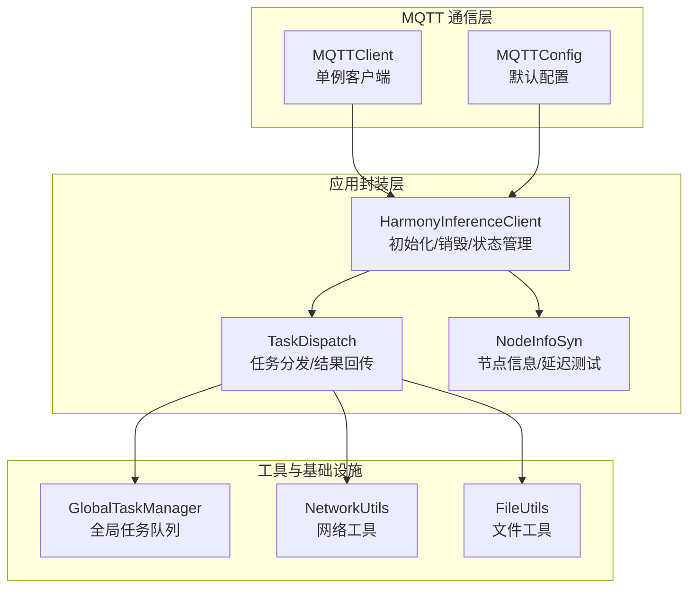
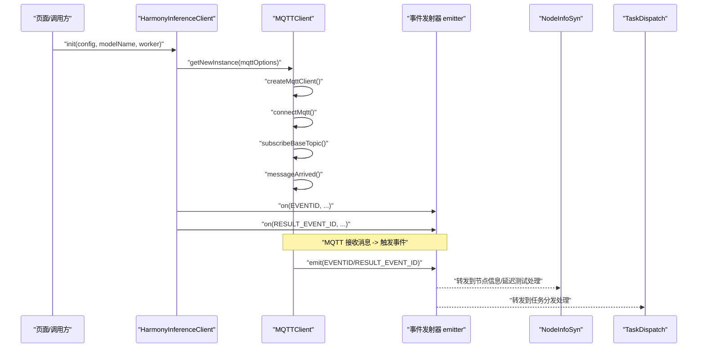
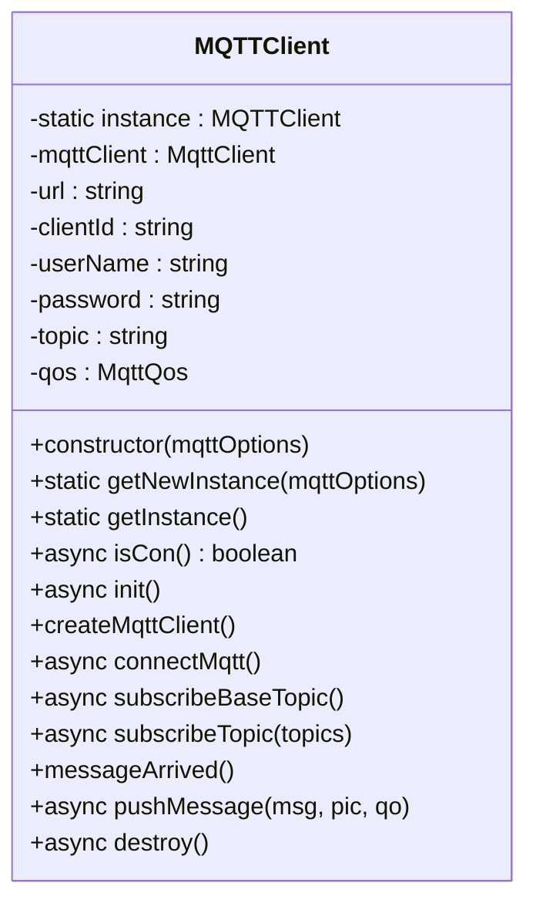
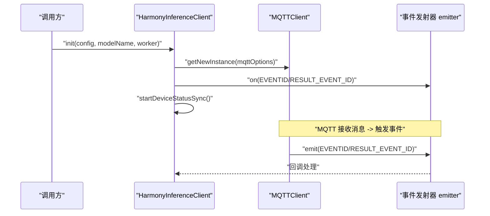
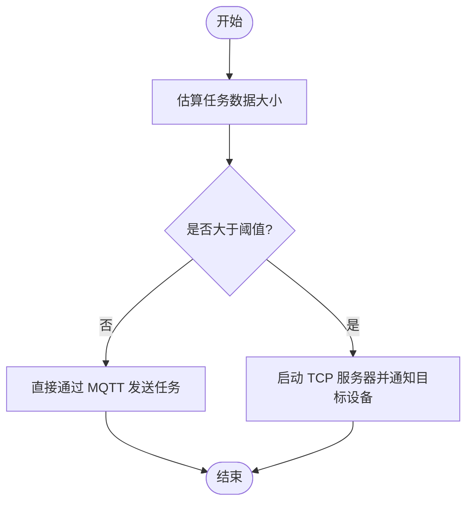
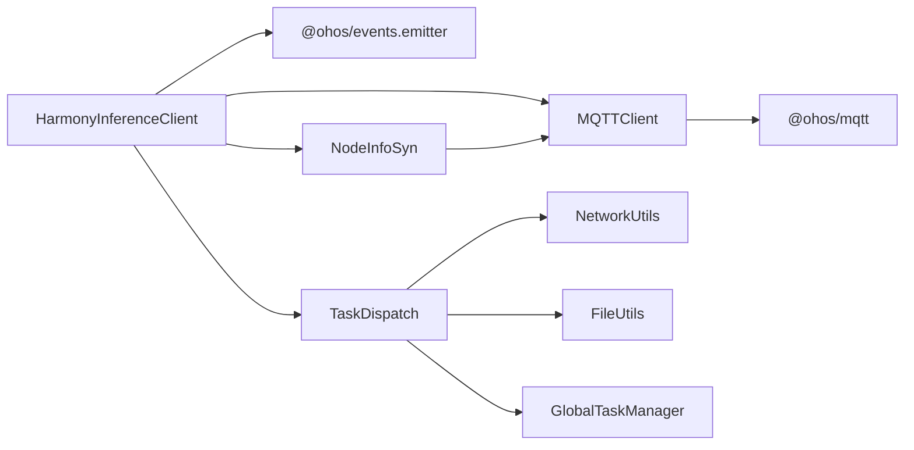

# MQTT 通信客户端

<cite>
**本文引用的文件**
- [MQTTClient.ets](file://entry/src/main/ets/manager/broker/MQTTClient.ets)
- [MQTTConfig.ets](file://entry/src/main/ets/manager/broker/MQTTConfig.ets)
- [HarmonyInferenceClient.ets](file://entry/src/main/ets/manager/HarmonyInferenceClient.ets)
- [TaskDispatch.ets](file://entry/src/main/ets/manager/broker/task/TaskDispatch.ets)
- [NodeInfoSyn.ets](file://entry/src/main/ets/manager/broker/monitor/NodeInfoSyn.ets)
- [GlobalTaskManager.ets](file://entry/src/main/ets/manager/worker/GlobalTaskManager.ets)
- [NetworkUtils.ets](file://entry/src/main/ets/manager/transfer/utils/NetworkUtils.ets)
- [FileUtils.ets](file://entry/src/main/ets/manager/transfer/utils/FileUtils.ets)
- [TestClientPage.ets](file://entry/src/main/ets/pages/TestClientPage.ets)
</cite>

## 更新摘要
**变更内容**
- 更新了日志标准化部分，反映了 MQTTClient 模块已完成全面的日志标准化，所有 MQTT 操作现在包含统一的 '[HarmonyInference] [MQTT]' 前缀
- 日志前缀标准化优化：将所有MQTT操作的日志前缀从'[MQTTClient]'统一更改为'[MQTT]'，提升了日志的一致性和可观测性
- 增强了连接管理和消息处理的可观测性说明
- 更新了故障排除指南中的日志分析部分

## 目录
1. [简介](#简介)
2. [项目结构](#项目结构)
3. [核心组件](#核心组件)
4. [架构总览](#架构总览)
5. [详细组件分析](#详细组件分析)
6. [日志标准化与可观测性](#日志标准化与可观测性)
7. [依赖关系分析](#依赖关系分析)
8. [性能考虑](#性能考虑)
9. [故障排除指南](#故障排除指南)
10. [结论](#结论)
11. [附录](#附录)

## 简介
本技术文档围绕 MQTT 通信客户端进行深入解析，重点覆盖以下方面：
- MQTTClient 类的实现细节：单例模式设计、连接管理机制、主题订阅与消息处理流程
- MQTTOptionsType 配置选项、连接参数设置、QoS 服务质量等级
- pushMessage 方法的消息发送机制、messageArrived 回调函数的事件处理、destroy 方法的资源清理
- 与事件发射器 emitter 的集成方式，以及错误处理和重连机制
- **新增**：日志标准化与统一前缀，提升连接管理和消息处理的可观测性
- 性能优化建议与故障排除指南
- 提供具体代码示例的路径，帮助读者快速定位实现位置

## 项目结构
该仓库采用按功能域划分的组织方式，MQTT 通信相关的核心代码位于 entry/src/main/ets/manager/broker 下，配合 HarmonyInferenceClient 作为高层封装，统一对外暴露初始化、连接状态管理、事件监听与任务分发能力。

**图表来源**
- [MQTTClient.ets:24-223](file://entry/src/main/ets/manager/broker/MQTTClient.ets#L24-L223)
- [MQTTConfig.ets:1-7](file://entry/src/main/ets/manager/broker/MQTTConfig.ets#L1-L7)
- [HarmonyInferenceClient.ets:52-357](file://entry/src/main/ets/manager/HarmonyInferenceClient.ets#L52-L357)
- [TaskDispatch.ets:98-302](file://entry/src/main/ets/manager/broker/task/TaskDispatch.ets#L98-L302)
- [NodeInfoSyn.ets:40-173](file://entry/src/main/ets/manager/broker/monitor/NodeInfoSyn.ets#L40-L173)
- [GlobalTaskManager.ets:4-27](file://entry/src/main/ets/manager/worker/GlobalTaskManager.ets#L4-L27)
- [NetworkUtils.ets:7-131](file://entry/src/main/ets/manager/transfer/utils/NetworkUtils.ets#L7-L131)
- [FileUtils.ets:8-193](file://entry/src/main/ets/manager/transfer/utils/FileUtils.ets#L8-L193)

**章节来源**
- [MQTTClient.ets:1-223](file://entry/src/main/ets/manager/broker/MQTTClient.ets#L1-L223)
- [HarmonyInferenceClient.ets:1-357](file://entry/src/main/ets/manager/HarmonyInferenceClient.ets#L1-L357)

## 核心组件
- MQTTClient：负责 MQTT 客户端生命周期管理（创建、连接、订阅、消息监听、发布、销毁），现已实现统一日志前缀标准化
- HarmonyInferenceClient：高层封装，负责初始化 MQTT、建立事件监听、连接状态轮询、任务提交与结果等待
- TaskDispatch：任务分发与结果回传，支持小文件直接通过 MQTT 传输，大文件通过 TCP 协议传输
- NodeInfoSyn：节点信息同步与网络延迟测试
- GlobalTaskManager：全局任务队列管理
- NetworkUtils/FileUtils：网络与文件传输辅助工具

**章节来源**
- [MQTTClient.ets:24-223](file://entry/src/main/ets/manager/broker/MQTTClient.ets#L24-L223)
- [HarmonyInferenceClient.ets:52-357](file://entry/src/main/ets/manager/HarmonyInferenceClient.ets#L52-L357)
- [TaskDispatch.ets:98-302](file://entry/src/main/ets/manager/broker/task/TaskDispatch.ets#L98-L302)
- [NodeInfoSyn.ets:40-173](file://entry/src/main/ets/manager/broker/monitor/NodeInfoSyn.ets#L40-L173)
- [GlobalTaskManager.ets:4-27](file://entry/src/main/ets/manager/worker/GlobalTaskManager.ets#L4-L27)
- [NetworkUtils.ets:7-131](file://entry/src/main/ets/manager/transfer/utils/NetworkUtils.ets#L7-L131)
- [FileUtils.ets:8-193](file://entry/src/main/ets/manager/transfer/utils/FileUtils.ets#L8-L193)

## 架构总览
MQTT 通信客户端采用"高层封装 + 事件驱动 + 任务分发"的架构：
- HarmonyInferenceClient 负责初始化 MQTT 客户端、建立事件监听器、周期性检查连接状态
- MQTTClient 负责底层连接、订阅、消息监听与发布，现已实现统一日志前缀标准化
- 事件发射器 emitter 在 MQTT 收到消息后触发不同事件，分别由 NodeInfoSyn、TaskDispatch 等模块处理
- TaskDispatch 根据任务大小选择直接 MQTT 或 TCP 传输，并负责结果回传

**图表来源**
- [HarmonyInferenceClient.ets:83-154](file://entry/src/main/ets/manager/HarmonyInferenceClient.ets#L83-L154)
- [MQTTClient.ets:76-182](file://entry/src/main/ets/manager/broker/MQTTClient.ets#L76-L182)
- [NodeInfoSyn.ets:119-151](file://entry/src/main/ets/manager/broker/monitor/NodeInfoSyn.ets#L119-L151)
- [TaskDispatch.ets:107-126](file://entry/src/main/ets/manager/broker/task/TaskDispatch.ets#L107-L126)

## 详细组件分析

### MQTTClient 类分析
- 单例模式设计
  - 提供静态工厂方法 getNewInstance 与 getInstance，确保全局唯一实例
  - 内部维护静态实例变量，避免重复创建
- 连接管理机制
  - createMqttClient：基于 MqttAsync 创建客户端，支持持久化类型配置
  - connectMqtt：设置用户名/密码、连接超时、自动重连、MQTT 版本等参数，现已实现统一日志前缀
  - isCon：异步查询连接状态
- 主题订阅与消息处理
  - subscribeBaseTopic：订阅基础主题；随后调用 subscribeTopic 订阅一组固定主题
  - messageArrived：注册 messageArrived 回调，区分 /task/result 与其他主题，分别通过 emitter 发送高优先级或即时优先级事件
- 消息发送机制
  - pushMessage：publish 包装，支持自定义主题与 QoS，现已实现统一日志前缀
- 资源清理
  - destroy：销毁底层客户端，同时移除事件监听，现已实现统一日志前缀

**图表来源**
- [MQTTClient.ets:24-223](file://entry/src/main/ets/manager/broker/MQTTClient.ets#L24-L223)

**章节来源**
- [MQTTClient.ets:24-223](file://entry/src/main/ets/manager/broker/MQTTClient.ets#L24-L223)

### HarmonyInferenceClient 类分析
- 单例模式与初始化
  - getInstance：全局单例
  - init：构建 MQTTOptionsType 并调用 MQTTClient.getNewInstance；初始化事件监听器；初始化模型与全局任务队列；启动设备状态同步
- 连接状态管理
  - initMQTTClient：周期性检查 MQTT 连接状态，连接成功后触发延迟测试
- 事件监听与处理
  - initEventListeners：监听 EVENTID 与 RESULT_EVENT_ID，分别转发到节点信息、延迟测试、参数优化、任务分配等处理逻辑
- 任务提交与结果等待
  - submitTask：通过调度器决定本地执行或远程执行；远程执行时通过 Map 等待结果返回
- 资源清理
  - destroy：关闭 MQTT 连接、释放 Worker、移除事件监听

**图表来源**
- [HarmonyInferenceClient.ets:83-154](file://entry/src/main/ets/manager/HarmonyInferenceClient.ets#L83-L154)
- [MQTTClient.ets:76-182](file://entry/src/main/ets/manager/broker/MQTTClient.ets#L76-L182)

**章节来源**
- [HarmonyInferenceClient.ets:52-357](file://entry/src/main/ets/manager/HarmonyInferenceClient.ets#L52-L357)

### TaskDispatch 类分析
- 任务分发策略
  - sendTask：根据任务大小估算选择直接 MQTT 或 TCP 传输；直接传输时通过 MQTTClient.pushMessage 发送任务消息
  - sendLargeFile：启动 TCP 服务器，通过 MQTT 发送任务通知，目标设备再发起 TCP 连接
- 结果回传
  - sendTaskResult：将任务结果通过 MQTTClient.pushMessage 发送到 /task/result
  - parseResultMessage：过滤本设备发出的任务结果，写入内部 Map 以便上层等待
- 大文件处理
  - receiveLargeFile：发起 TCP 连接接收文件，校验哈希，解码为任务参数，执行本地推理并回传结果

**图表来源**
- [TaskDispatch.ets:107-165](file://entry/src/main/ets/manager/broker/task/TaskDispatch.ets#L107-L165)

**章节来源**
- [TaskDispatch.ets:98-302](file://entry/src/main/ets/manager/broker/task/TaskDispatch.ets#L98-L302)
- [NetworkUtils.ets:12-29](file://entry/src/main/ets/manager/transfer/utils/NetworkUtils.ets#L12-L29)
- [FileUtils.ets:77-115](file://entry/src/main/ets/manager/transfer/utils/FileUtils.ets#L77-L115)

### NodeInfoSyn 类分析
- 节点信息同步
  - sendOwnInfo：将本设备系统信息通过 MQTT 发送到 /device/status
  - parseNodeInfoMessage：解析其他设备节点信息，更新本地缓存
- 延迟测试
  - testLatencySend：发送包含时间戳的消息用于测试网络延迟
  - testLatencyRec：接收延迟测试消息，计算往返时间

**章节来源**
- [NodeInfoSyn.ets:63-170](file://entry/src/main/ets/manager/broker/monitor/NodeInfoSyn.ets#L63-L170)

### GlobalTaskManager 与任务队列
- GlobalTaskManager：全局单例，负责初始化与获取 SerialTaskQueue，确保任务顺序执行
- 与 TaskDispatch 的协作：TaskDispatch 将任务加入队列执行，完成后回传结果

**章节来源**
- [GlobalTaskManager.ets:4-27](file://entry/src/main/ets/manager/worker/GlobalTaskManager.ets#L4-L27)
- [TaskDispatch.ets:187-212](file://entry/src/main/ets/manager/broker/task/TaskDispatch.ets#L187-L212)

## 日志标准化与可观测性

### 统一日志前缀标准
MQTTClient 模块已完成全面的日志标准化，所有 MQTT 操作现在包含统一的 '[HarmonyInference] [MQTT]' 前缀，显著提升了系统的可观测性和调试效率。

**更新** 日志前缀已从`[MQTTClient]`标准化为`[MQTT]`，并增加了`[HarmonyInference]`前缀，形成统一的`[HarmonyInference] [MQTT]`格式

### 日志分类与用途
- **连接日志**：`[HarmonyInference] [MQTT] MQTT服务器连接成功/失败`
  - 用于监控连接状态变化和诊断连接问题
  - 包含详细的连接响应信息和错误详情

- **订阅日志**：`[HarmonyInference] [MQTT] 订阅基础主题成功/失败`
  - 记录主题订阅的状态和结果
  - 支持批量订阅操作的完整跟踪

- **消息处理日志**：`[HarmonyInference] [MQTT] 接收消息成功/失败`
  - 监控消息接收的成功率和异常情况
  - 区分不同主题的消息处理优先级

- **消息发送日志**：`[HarmonyInference] [MQTT] 消息发送成功/失败`
  - 跟踪消息发布的状态和成功率
  - 记录消息主题和发送结果

- **资源管理日志**：`[HarmonyInference] [MQTT] 实例销毁成功/失败`
  - 监控客户端实例的生命周期管理
  - 确保资源正确释放和清理

### 可观测性增强
- **统一格式**：所有日志采用一致的`[HarmonyInference] [MQTT]`前缀格式，便于日志聚合和分析
- **详细信息**：日志包含操作类型、主题名称、状态信息等关键数据
- **错误追踪**：错误日志提供完整的错误信息和上下文
- **性能监控**：通过日志可以追踪连接建立、消息处理、资源管理等关键操作的耗时

### 日志分析与故障排除
- **连接问题诊断**：通过连接日志快速定位认证失败、网络不可达等问题
- **订阅问题排查**：订阅日志帮助识别主题权限、QoS 配置等订阅失败原因
- **消息丢失追踪**：消息处理和发送日志协助分析消息丢失和重复问题
- **资源泄漏检测**：销毁日志确保客户端实例正确释放，防止资源泄漏

**章节来源**
- [MQTTClient.ets:99-103](file://entry/src/main/ets/manager/broker/MQTTClient.ets#L99-L103)
- [MQTTClient.ets:115-119](file://entry/src/main/ets/manager/broker/MQTTClient.ets#L115-L119)
- [MQTTClient.ets:154-157](file://entry/src/main/ets/manager/broker/MQTTClient.ets#L154-L157)
- [MQTTClient.ets:198-202](file://entry/src/main/ets/manager/broker/MQTTClient.ets#L198-L202)
- [MQTTClient.ets:211-216](file://entry/src/main/ets/manager/broker/MQTTClient.ets#L211-L216)

## 依赖关系分析
- MQTTClient 依赖 @ohos/mqtt 提供的 MqttAsync/MqttClient/MqttMessage/MqttQos/MqttResponse/MqttSubscribeOptions
- HarmonyInferenceClient 依赖 MQTTClient、emitter、NodeInfoSyn、TaskDispatch、GlobalTaskManager
- TaskDispatch 依赖 NetworkUtils、FileUtils、GlobalTaskManager
- NodeInfoSyn 依赖 MQTTClient、MQTTOption、systemDateTime

**图表来源**
- [MQTTClient.ets:1-10](file://entry/src/main/ets/manager/broker/MQTTClient.ets#L1-L10)
- [HarmonyInferenceClient.ets:1-13](file://entry/src/main/ets/manager/HarmonyInferenceClient.ets#L1-L13)
- [TaskDispatch.ets:1-10](file://entry/src/main/ets/manager/broker/task/TaskDispatch.ets#L1-L10)
- [NodeInfoSyn.ets:1-10](file://entry/src/main/ets/manager/broker/monitor/NodeInfoSyn.ets#L1-L10)

**章节来源**
- [MQTTClient.ets:1-10](file://entry/src/main/ets/manager/broker/MQTTClient.ets#L1-L10)
- [HarmonyInferenceClient.ets:1-13](file://entry/src/main/ets/manager/HarmonyInferenceClient.ets#L1-L13)
- [TaskDispatch.ets:1-10](file://entry/src/main/ets/manager/broker/task/TaskDispatch.ets#L1-L10)
- [NodeInfoSyn.ets:1-10](file://entry/src/main/ets/manager/broker/monitor/NodeInfoSyn.ets#L1-L10)

## 性能考虑
- QoS 选择
  - 默认 QoS 为 1，保证至少一次送达；若对延迟敏感且可容忍丢包，可考虑 QoS 0
- 自动重连与连接超时
  - connectMqtt 中启用 automaticReconnect，合理设置 connectTimeout，减少断线重连对业务的影响
- 事件优先级
  - 对 /task/result 使用 IMMEDIATE 优先级，确保任务结果尽快到达
  - 对常规消息使用 HIGH 优先级，兼顾吞吐与实时性
- 大文件传输
  - 通过阈值判断选择 TCP 传输，避免 MQTT 传输大文件导致阻塞
- 任务队列
  - 使用 GlobalTaskManager 的串行队列，避免并发冲突与资源竞争
- **日志性能影响**
  - 统一日志前缀不影响性能，但建议在生产环境中合理配置日志级别

## 故障排除指南
- 连接失败
  - 检查 MQTTConfig 中 url、clientId、userName、password 是否正确
  - 查看 connectMqtt 的错误日志，确认网络可达与认证信息
  - 通过 `[HarmonyInference] [MQTT] MQTT服务器连接失败` 日志获取详细错误信息
- 订阅失败
  - 确认 topic 与 qos 设置一致，检查 subscribeBaseTopic 与 subscribeTopic 的调用顺序
  - 查看 `[HarmonyInference] [MQTT] 订阅基础主题失败` 日志获取失败原因
- 消息未到达
  - 确认 messageArrived 回调已注册，检查 emitter 事件监听是否生效
  - 验证 /task/result 专用事件是否单独处理
  - 通过 `[HarmonyInference] [MQTT] 接收消息失败` 日志诊断消息接收问题
- 资源未释放
  - 调用 destroy 后检查 emitter.off 是否执行，避免内存泄漏
  - 通过 `[HarmonyInference] [MQTT] 实例销毁成功` 日志确认资源释放
- 大文件传输异常
  - 检查 NetworkUtils.getIpAddress 与 FileUtils.hash 校验流程
- **日志分析**
  - 利用统一日志前缀进行问题定位和性能分析
  - 通过日志中的详细信息快速识别问题根因

**章节来源**
- [MQTTClient.ets:84-104](file://entry/src/main/ets/manager/broker/MQTTClient.ets#L84-L104)
- [MQTTClient.ets:106-145](file://entry/src/main/ets/manager/broker/MQTTClient.ets#L106-L145)
- [MQTTClient.ets:147-182](file://entry/src/main/ets/manager/broker/MQTTClient.ets#L147-L182)
- [MQTTClient.ets:205-219](file://entry/src/main/ets/manager/broker/MQTTClient.ets#L205-L219)
- [TaskDispatch.ets:133-165](file://entry/src/main/ets/manager/broker/task/TaskDispatch.ets#L133-L165)
- [NetworkUtils.ets:12-29](file://entry/src/main/ets/manager/transfer/utils/NetworkUtils.ets#L12-L29)
- [FileUtils.ets:107-115](file://entry/src/main/ets/manager/transfer/utils/FileUtils.ets#L107-L115)

## 结论
该 MQTT 通信客户端通过清晰的分层设计与事件驱动机制，实现了稳定的连接管理、主题订阅与消息处理。**最新的日志标准化改进**进一步提升了系统的可观测性，统一的 '[HarmonyInference] [MQTT]' 前缀使得连接管理、消息处理和资源管理的监控更加直观和高效。结合任务分发与网络工具，能够灵活应对小文件与大文件场景。建议在生产环境中合理配置 QoS 与重连策略，并持续监控连接状态与事件处理链路，充分利用统一日志前缀进行问题诊断和性能优化。

## 附录

### 配置选项与参数说明
- MQTTOptionsType
  - url：MQTT 服务器地址
  - clientId：客户端标识
  - userName/password：认证凭据
  - topic：默认主题
  - qos：服务质量等级
- MQTTConfig（HarmonyInferenceClient）
  - url、clientId、userName、password、topic、qos

**章节来源**
- [MQTTClient.ets:15-22](file://entry/src/main/ets/manager/broker/MQTTClient.ets#L15-L22)
- [HarmonyInferenceClient.ets:26-33](file://entry/src/main/ets/manager/HarmonyInferenceClient.ets#L26-L33)

### 初始化与使用示例（路径）
- 初始化客户端
  - 示例路径：[TestClientPage.ets:21-29](file://entry/src/main/ets/pages/TestClientPage.ets#L21-L29)
  - 初始化调用：[HarmonyInferenceClient.ets:163-196](file://entry/src/main/ets/manager/HarmonyInferenceClient.ets#L163-L196)
- 订阅主题
  - 基础订阅：[MQTTClient.ets:106-123](file://entry/src/main/ets/manager/broker/MQTTClient.ets#L106-L123)
  - 批量订阅：[MQTTClient.ets:124-145](file://entry/src/main/ets/manager/broker/MQTTClient.ets#L124-L145)
- 发送消息
  - 发布消息：[MQTTClient.ets:190-203](file://entry/src/main/ets/manager/broker/MQTTClient.ets#L190-L203)
  - 任务分发发送：[TaskDispatch.ets:107-126](file://entry/src/main/ets/manager/broker/task/TaskDispatch.ets#L107-L126)
- 接收与处理
  - 消息监听：[MQTTClient.ets:147-182](file://entry/src/main/ets/manager/broker/MQTTClient.ets#L147-L182)
  - 事件监听与处理：[HarmonyInferenceClient.ets:116-154](file://entry/src/main/ets/manager/HarmonyInferenceClient.ets#L116-L154)
- 销毁客户端
  - 资源清理：[MQTTClient.ets:205-219](file://entry/src/main/ets/manager/broker/MQTTClient.ets#L205-L219)
  - 应用层销毁：[HarmonyInferenceClient.ets:198-225](file://entry/src/main/ets/manager/HarmonyInferenceClient.ets#L198-L225)