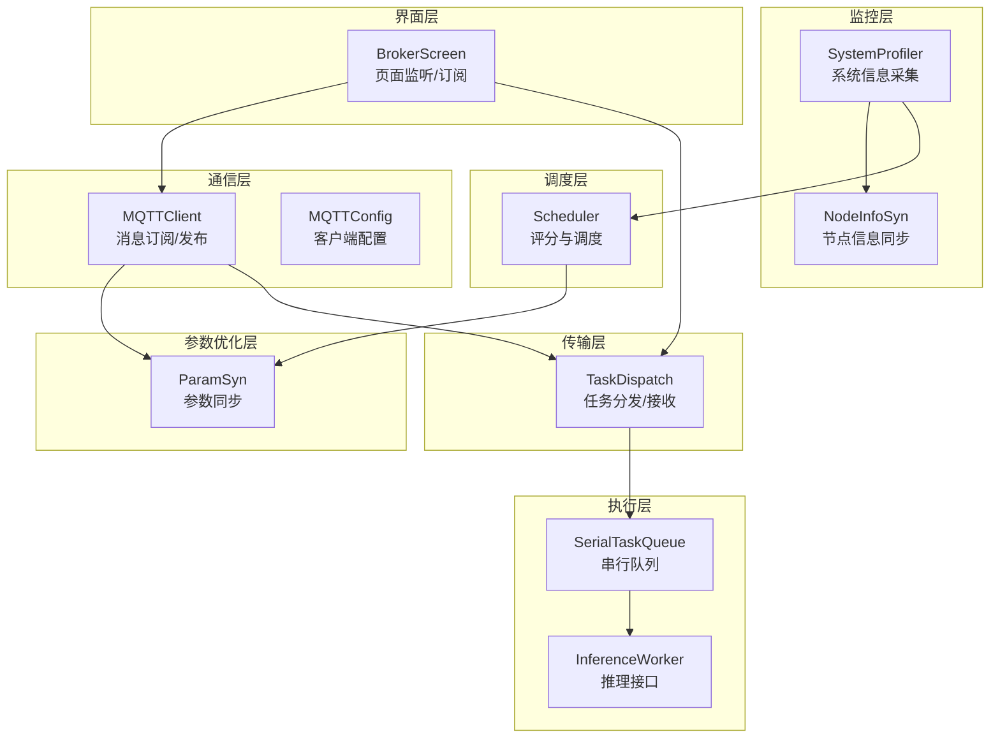
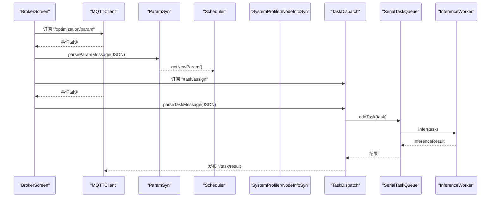
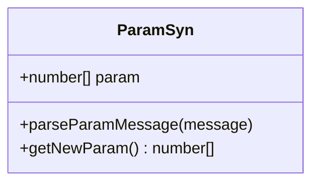
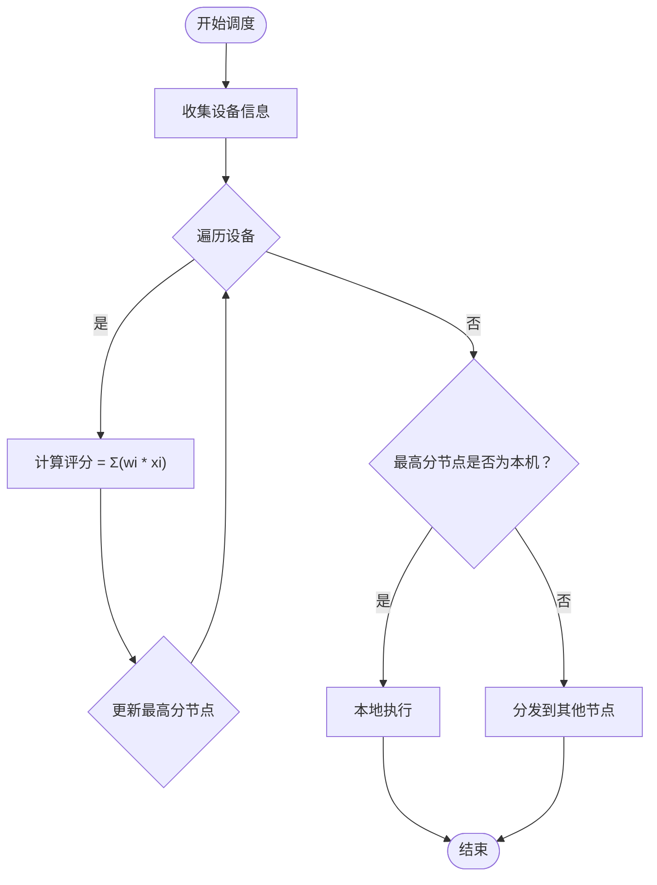
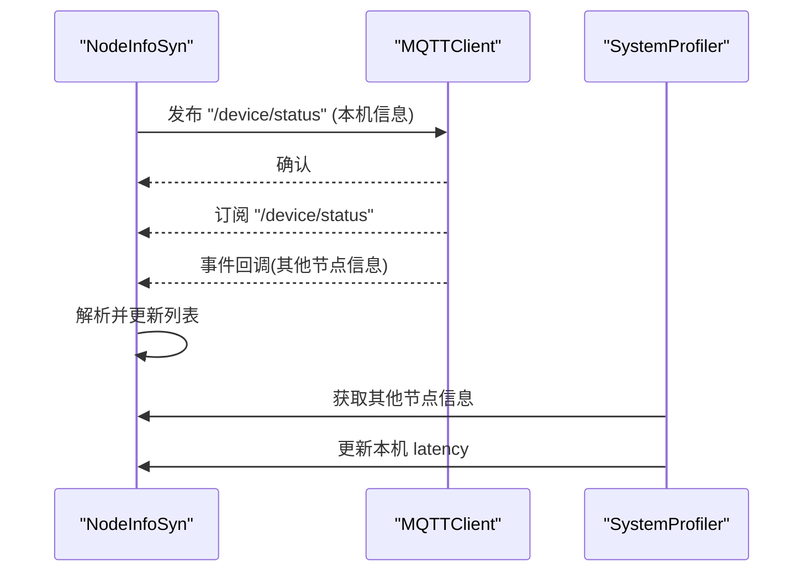
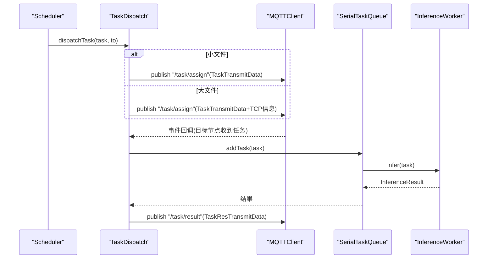
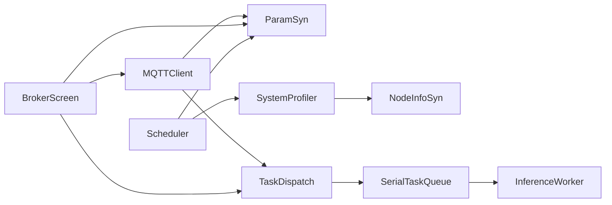

# 参数优化同步

<cite>
**本文引用的文件**
- [ParamSyn.ets](file://entry/src/main/ets/manager/broker/paramOpt/ParamSyn.ets)
- [Scheduler.ets](file://entry/src/main/ets/manager/scheduler/Scheduler.ets)
- [SystemProfiler.ets](file://entry/src/main/ets/manager/monitor/SystemProfiler.ets)
- [NodeInfoSyn.ets](file://entry/src/main/ets/manager/broker/monitor/NodeInfoSyn.ets)
- [MQTTClient.ets](file://entry/src/main/ets/manager/broker/MQTTClient.ets)
- [MQTTConfig.ets](file://entry/src/main/ets/manager/broker/MQTTConfig.ets)
- [TaskDispatch.ets](file://entry/src/main/ets/manager/broker/task/TaskDispatch.ets)
- [BrokerScreen.ets](file://entry/src/main/ets/pages/tabs/BrokerScreen.ets)
- [InferenceWorker.ets](file://entry/src/main/ets/manager/worker/InferenceWorker.ets)
- [SerialTaskQueue.ets](file://entry/src/main/ets/manager/worker/SerialTaskQueue.ets)
</cite>

## 目录
1. [简介](#简介)
2. [项目结构](#项目结构)
3. [核心组件](#核心组件)
4. [架构总览](#架构总览)
5. [组件详解](#组件详解)
6. [依赖关系分析](#依赖关系分析)
7. [性能考量](#性能考量)
8. [故障排查指南](#故障排查指南)
9. [结论](#结论)
10. [附录](#附录)

## 简介
本技术文档围绕参数优化同步模块展开，重点解析 ParamSyn 类的参数管理机制，涵盖动态参数调整、权重配置管理、优化策略实施，以及参数同步的触发条件、更新传播机制与冲突解决策略。文档还记录了支持的参数类型、默认值与范围限制，并提供配置示例、监听参数变化的方法、应用优化策略的步骤、算法工作原理、性能影响评估、实时调整机制、调优指南、最佳实践与常见问题解决方案。

## 项目结构
参数优化同步模块位于 Broker 层的 paramOpt 子目录，配合调度层、监控层与传输层共同完成参数下发、解析、评分与任务分发。关键文件如下：
- 参数同步：ParamSyn.ets
- 调度与评分：Scheduler.ets
- 系统信息采集：SystemProfiler.ets、NodeInfoSyn.ets
- 通信与订阅：MQTTClient.ets、MQTTConfig.ets
- 任务分发与接收：TaskDispatch.ets
- 页面监听与订阅：BrokerScreen.ets
- 推理任务与队列：InferenceWorker.ets、SerialTaskQueue.ets

图表来源
- [ParamSyn.ets](file://entry/src/main/ets/manager/broker/paramOpt/ParamSyn.ets#L1-L40)
- [Scheduler.ets](file://entry/src/main/ets/manager/scheduler/Scheduler.ets#L1-L105)
- [SystemProfiler.ets](file://entry/src/main/ets/manager/monitor/SystemProfiler.ets#L1-L120)
- [NodeInfoSyn.ets](file://entry/src/main/ets/manager/broker/monitor/NodeInfoSyn.ets#L1-L173)
- [MQTTClient.ets](file://entry/src/main/ets/manager/broker/MQTTClient.ets#L1-L223)
- [MQTTConfig.ets](file://entry/src/main/ets/manager/broker/MQTTConfig.ets#L1-L7)
- [TaskDispatch.ets](file://entry/src/main/ets/manager/broker/task/TaskDispatch.ets#L1-L302)
- [BrokerScreen.ets](file://entry/src/main/ets/pages/tabs/BrokerScreen.ets#L1-L162)
- [InferenceWorker.ets](file://entry/src/main/ets/manager/worker/InferenceWorker.ets#L1-L90)
- [SerialTaskQueue.ets](file://entry/src/main/ets/manager/worker/SerialTaskQueue.ets#L1-L104)

章节来源
- [ParamSyn.ets](file://entry/src/main/ets/manager/broker/paramOpt/ParamSyn.ets#L1-L40)
- [Scheduler.ets](file://entry/src/main/ets/manager/scheduler/Scheduler.ets#L1-L105)
- [SystemProfiler.ets](file://entry/src/main/ets/manager/monitor/SystemProfiler.ets#L1-L120)
- [NodeInfoSyn.ets](file://entry/src/main/ets/manager/broker/monitor/NodeInfoSyn.ets#L1-L173)
- [MQTTClient.ets](file://entry/src/main/ets/manager/broker/MQTTClient.ets#L1-L223)
- [MQTTConfig.ets](file://entry/src/main/ets/manager/broker/MQTTConfig.ets#L1-L7)
- [TaskDispatch.ets](file://entry/src/main/ets/manager/broker/task/TaskDispatch.ets#L1-L302)
- [BrokerScreen.ets](file://entry/src/main/ets/pages/tabs/BrokerScreen.ets#L1-L162)
- [InferenceWorker.ets](file://entry/src/main/ets/manager/worker/InferenceWorker.ets#L1-L90)
- [SerialTaskQueue.ets](file://entry/src/main/ets/manager/worker/SerialTaskQueue.ets#L1-L104)

## 核心组件
- ParamSyn：负责接收/解析来自 MQTT 的参数更新消息，维护当前生效的参数数组，并对外提供读取接口。
- Scheduler：基于系统采集的设备信息与 ParamSyn 提供的权重参数，计算节点评分，决定本地执行还是分发到其他节点。
- SystemProfiler/NodeInfoSyn：采集本机系统指标，汇总其他节点信息，计算网络延迟等。
- MQTTClient/MQTTConfig：建立与 Broker 的连接，订阅/发布消息，统一事件派发。
- TaskDispatch：负责任务的发送、接收、解析与结果回传，支持小文件直接传输与大文件 TCP 传输。
- BrokerScreen：页面侧订阅 /optimization/param 等主题，将消息转发给 ParamSyn 与 TaskDispatch。
- InferenceWorker/SerialTaskQueue：执行推理任务，串行处理队列，保证执行顺序与稳定性。

章节来源
- [ParamSyn.ets](file://entry/src/main/ets/manager/broker/paramOpt/ParamSyn.ets#L1-L40)
- [Scheduler.ets](file://entry/src/main/ets/manager/scheduler/Scheduler.ets#L1-L105)
- [SystemProfiler.ets](file://entry/src/main/ets/manager/monitor/SystemProfiler.ets#L1-L120)
- [NodeInfoSyn.ets](file://entry/src/main/ets/manager/broker/monitor/NodeInfoSyn.ets#L1-L173)
- [MQTTClient.ets](file://entry/src/main/ets/manager/broker/MQTTClient.ets#L1-L223)
- [MQTTConfig.ets](file://entry/src/main/ets/manager/broker/MQTTConfig.ets#L1-L7)
- [TaskDispatch.ets](file://entry/src/main/ets/manager/broker/task/TaskDispatch.ets#L1-L302)
- [BrokerScreen.ets](file://entry/src/main/ets/pages/tabs/BrokerScreen.ets#L1-L162)
- [InferenceWorker.ets](file://entry/src/main/ets/manager/worker/InferenceWorker.ets#L1-L90)
- [SerialTaskQueue.ets](file://entry/src/main/ets/manager/worker/SerialTaskQueue.ets#L1-L104)

## 架构总览
参数优化同步的整体流程如下：
- ParamSyn 从 MQTT 的 /optimization/param 主题接收参数更新消息，解析后保存到内部数组。
- Scheduler 在每次调度前从 ParamSyn 获取最新参数，结合 SystemProfiler/NodeInfoSyn 的设备信息计算评分。
- 若最优节点不是本机，则通过 TaskDispatch 将任务分发到目标节点；若为本机，则加入 SerialTaskQueue 执行推理。
- BrokerScreen 作为页面入口，负责订阅相关主题并将消息转发给对应模块。

图表来源
- [BrokerScreen.ets](file://entry/src/main/ets/pages/tabs/BrokerScreen.ets#L35-L54)
- [MQTTClient.ets](file://entry/src/main/ets/manager/broker/MQTTClient.ets#L107-L182)
- [ParamSyn.ets](file://entry/src/main/ets/manager/broker/paramOpt/ParamSyn.ets#L25-L37)
- [Scheduler.ets](file://entry/src/main/ets/manager/scheduler/Scheduler.ets#L30-L70)
- [TaskDispatch.ets](file://entry/src/main/ets/manager/broker/task/TaskDispatch.ets#L187-L212)
- [SerialTaskQueue.ets](file://entry/src/main/ets/manager/worker/SerialTaskQueue.ets#L24-L83)
- [InferenceWorker.ets](file://entry/src/main/ets/manager/worker/InferenceWorker.ets#L76-L89)

## 组件详解

### ParamSyn 参数同步类
- 角色与职责
  - 接收来自 MQTT 的参数更新消息，解析 JSON 并更新内部参数数组。
  - 对外提供读取最新参数的方法，供调度器使用。
- 数据结构与默认值
  - 参数数组为固定长度 5 的数值数组，默认值为 [1,1,1,1,1]。
  - 参数含义（由调度器评分公式推断）：分别对应 CPU 使用率、内存使用率、电池电量、存储空间、网络延迟（越低越好）的权重。
- 更新传播机制
  - 通过 MQTT 的 /optimization/param 主题接收参数更新。
  - 页面侧 BrokerScreen 订阅该主题并通过事件回调将消息交给 ParamSyn。
- 冲突解决策略
  - 采用“最后到达即生效”的策略，不进行去重或合并，确保实时性。
- 性能与复杂度
  - 解析与赋值均为 O(1)，整体开销极低。
- 使用示例（路径）
  - 订阅参数主题：[BrokerScreen.ets](file://entry/src/main/ets/pages/tabs/BrokerScreen.ets#L35)
  - 解析参数消息：[ParamSyn.ets](file://entry/src/main/ets/manager/broker/paramOpt/ParamSyn.ets#L25-L29)
  - 获取最新参数：[ParamSyn.ets](file://entry/src/main/ets/manager/broker/paramOpt/ParamSyn.ets#L35-L37)

图表来源
- [ParamSyn.ets](file://entry/src/main/ets/manager/broker/paramOpt/ParamSyn.ets#L13-L39)

章节来源
- [ParamSyn.ets](file://entry/src/main/ets/manager/broker/paramOpt/ParamSyn.ets#L1-L40)
- [BrokerScreen.ets](file://entry/src/main/ets/pages/tabs/BrokerScreen.ets#L46-L48)
- [MQTTClient.ets](file://entry/src/main/ets/manager/broker/MQTTClient.ets#L120)

### Scheduler 调度与评分
- 角色与职责
  - 收集设备信息，计算节点评分，选择最优节点执行任务。
  - 通过 ParamSyn 获取权重参数，结合系统指标进行加权评分。
- 评分公式（由代码推断）
  - score = w1*(1 - cpuUsage) + w2*(1 - memoryUsage) + w3*batteryLevel + w4*storageFree + w5*(1 - latency)
  - 权重 w1..w5 来自 ParamSyn 的参数数组。
- 冲突与并发
  - 评分过程无共享状态写入，读取的是 ParamSyn 的当前值，避免锁竞争。
- 性能与复杂度
  - 遍历设备集合 O(N)，每次评分 O(1)，总体 O(N)。
- 使用示例（路径）
  - 获取权重参数：[Scheduler.ets](file://entry/src/main/ets/manager/scheduler/Scheduler.ets#L66-L70)
  - 调度决策入口：[Scheduler.ets](file://entry/src/main/ets/manager/scheduler/Scheduler.ets#L30-L57)

图表来源
- [Scheduler.ets](file://entry/src/main/ets/manager/scheduler/Scheduler.ets#L30-L70)

章节来源
- [Scheduler.ets](file://entry/src/main/ets/manager/scheduler/Scheduler.ets#L1-L105)

### SystemProfiler 与 NodeInfoSyn
- 角色与职责
  - SystemProfiler 采集本机 CPU、内存、存储、电池与网络延迟等指标，并汇总其他节点信息。
  - NodeInfoSyn 负责节点信息的发送、接收与管理，支持延迟测试。
- 关键点
  - 延迟计算：通过 /test/latency 主题进行往返时间测试，更新本机 latency。
  - 设备名：来源于 MQTT 客户端 ID（clientId），用于区分节点。
- 使用示例（路径）
  - 发送本机信息：[NodeInfoSyn.ets](file://entry/src/main/ets/manager/broker/monitor/NodeInfoSyn.ets#L63-L80)
  - 接收并解析节点信息：[NodeInfoSyn.ets](file://entry/src/main/ets/manager/broker/monitor/NodeInfoSyn.ets#L100-L125)
  - 更新本机延迟：[SystemProfiler.ets](file://entry/src/main/ets/manager/monitor/SystemProfiler.ets#L114-L116)

图表来源
- [NodeInfoSyn.ets](file://entry/src/main/ets/manager/broker/monitor/NodeInfoSyn.ets#L63-L125)
- [SystemProfiler.ets](file://entry/src/main/ets/manager/monitor/SystemProfiler.ets#L67-L116)

章节来源
- [SystemProfiler.ets](file://entry/src/main/ets/manager/monitor/SystemProfiler.ets#L1-L120)
- [NodeInfoSyn.ets](file://entry/src/main/ets/manager/broker/monitor/NodeInfoSyn.ets#L1-L173)

### MQTTClient 与 MQTTConfig
- 角色与职责
  - 建立与 Broker 的连接，订阅多个主题（含 /optimization/param），并将消息通过事件发射器分发给上层模块。
  - 提供统一的发布接口，支持按主题发送消息。
- 关键点
  - 订阅主题：/device/list、/device/status、/task/assign、/task/result、/optimization/param、/test/latency。
  - 事件派发：通过事件 ID 将消息内容传递给页面或其他模块。
- 使用示例（路径）
  - 订阅主题：[MQTTClient.ets](file://entry/src/main/ets/manager/broker/MQTTClient.ets#L120)
  - 事件分发：[MQTTClient.ets](file://entry/src/main/ets/manager/broker/MQTTClient.ets#L148-L182)
  - 客户端配置：[MQTTConfig.ets](file://entry/src/main/ets/manager/broker/MQTTConfig.ets#L4-L6)

章节来源
- [MQTTClient.ets](file://entry/src/main/ets/manager/broker/MQTTClient.ets#L1-L223)
- [MQTTConfig.ets](file://entry/src/main/ets/manager/broker/MQTTConfig.ets#L1-L7)

### TaskDispatch 任务分发与接收
- 角色与职责
  - 将推理任务封装为传输数据，通过 MQTT 或 TCP 发送到目标节点。
  - 接收任务消息，判断是否为本机任务，若是则加入队列执行并回传结果。
- 关键点
  - 小文件：直接通过 MQTT 的 /task/assign 主题发送。
  - 大文件：通过 TCPTransferProtocol 建立连接，先发布任务通知，再由目标设备发起 TCP 连接拉取。
- 使用示例（路径）
  - 发送任务（含大文件分支）：[TaskDispatch.ets](file://entry/src/main/ets/manager/broker/task/TaskDispatch.ets#L107-L165)
  - 接收任务并执行：[TaskDispatch.ets](file://entry/src/main/ets/manager/broker/task/TaskDispatch.ets#L187-L212)
  - 发送结果：[TaskDispatch.ets](file://entry/src/main/ets/manager/broker/task/TaskDispatch.ets#L272-L281)

图表来源
- [TaskDispatch.ets](file://entry/src/main/ets/manager/broker/task/TaskDispatch.ets#L107-L165)
- [TaskDispatch.ets](file://entry/src/main/ets/manager/broker/task/TaskDispatch.ets#L187-L212)
- [TaskDispatch.ets](file://entry/src/main/ets/manager/broker/task/TaskDispatch.ets#L272-L281)

章节来源
- [TaskDispatch.ets](file://entry/src/main/ets/manager/broker/task/TaskDispatch.ets#L1-L302)

### BrokerScreen 页面监听与订阅
- 角色与职责
  - 初始化 MQTT 客户端，订阅 /optimization/param、/task/assign 等主题。
  - 将事件回调中的消息内容分发给 ParamSyn、TaskDispatch 等模块。
- 使用示例（路径）
  - 订阅主题：[BrokerScreen.ets](file://entry/src/main/ets/pages/tabs/BrokerScreen.ets#L35)
  - 分发到 ParamSyn：[BrokerScreen.ets](file://entry/src/main/ets/pages/tabs/BrokerScreen.ets#L46-L48)
  - 分发到 TaskDispatch：[BrokerScreen.ets](file://entry/src/main/ets/pages/tabs/BrokerScreen.ets#L50-L52)

章节来源
- [BrokerScreen.ets](file://entry/src/main/ets/pages/tabs/BrokerScreen.ets#L1-L162)

### 推理执行链路（补充）
- SerialTaskQueue 保证任务串行执行，避免并发冲突。
- InferenceWorker 定义推理接口，具体实现由 Worker 层提供。
- 使用示例（路径）
  - 加入队列并执行：[SerialTaskQueue.ets](file://entry/src/main/ets/manager/worker/SerialTaskQueue.ets#L24-L83)
  - 推理接口定义：[InferenceWorker.ets](file://entry/src/main/ets/manager/worker/InferenceWorker.ets#L76-L89)

章节来源
- [SerialTaskQueue.ets](file://entry/src/main/ets/manager/worker/SerialTaskQueue.ets#L1-L104)
- [InferenceWorker.ets](file://entry/src/main/ets/manager/worker/InferenceWorker.ets#L1-L90)

## 依赖关系分析
- ParamSyn 依赖 MQTTClient 的事件回调，由 BrokerScreen 订阅 /optimization/param 并转发。
- Scheduler 依赖 ParamSyn 的参数数组与 SystemProfiler 的设备信息。
- SystemProfiler 依赖 NodeInfoSyn 的节点信息与 MQTTConfig 的 clientId。
- TaskDispatch 依赖 MQTTClient 发布/接收任务消息，并与 SerialTaskQueue/InferenceWorker 协作。
- BrokerScreen 作为入口，串联 MQTTClient、ParamSyn、TaskDispatch。

图表来源
- [BrokerScreen.ets](file://entry/src/main/ets/pages/tabs/BrokerScreen.ets#L35-L54)
- [ParamSyn.ets](file://entry/src/main/ets/manager/broker/paramOpt/ParamSyn.ets#L25-L37)
- [Scheduler.ets](file://entry/src/main/ets/manager/scheduler/Scheduler.ets#L66-L70)
- [SystemProfiler.ets](file://entry/src/main/ets/manager/monitor/SystemProfiler.ets#L67-L116)
- [NodeInfoSyn.ets](file://entry/src/main/ets/manager/broker/monitor/NodeInfoSyn.ets#L63-L125)
- [TaskDispatch.ets](file://entry/src/main/ets/manager/broker/task/TaskDispatch.ets#L107-L165)
- [SerialTaskQueue.ets](file://entry/src/main/ets/manager/worker/SerialTaskQueue.ets#L24-L83)
- [InferenceWorker.ets](file://entry/src/main/ets/manager/worker/InferenceWorker.ets#L76-L89)

章节来源
- [BrokerScreen.ets](file://entry/src/main/ets/pages/tabs/BrokerScreen.ets#L1-L162)
- [ParamSyn.ets](file://entry/src/main/ets/manager/broker/paramOpt/ParamSyn.ets#L1-L40)
- [Scheduler.ets](file://entry/src/main/ets/manager/scheduler/Scheduler.ets#L1-L105)
- [SystemProfiler.ets](file://entry/src/main/ets/manager/monitor/SystemProfiler.ets#L1-L120)
- [NodeInfoSyn.ets](file://entry/src/main/ets/manager/broker/monitor/NodeInfoSyn.ets#L1-L173)
- [TaskDispatch.ets](file://entry/src/main/ets/manager/broker/task/TaskDispatch.ets#L1-L302)
- [SerialTaskQueue.ets](file://entry/src/main/ets/manager/worker/SerialTaskQueue.ets#L1-L104)
- [InferenceWorker.ets](file://entry/src/main/ets/manager/worker/InferenceWorker.ets#L1-L90)

## 性能考量
- 参数更新频率
  - ParamSyn 采用“最后到达即生效”，参数更新频繁时可能引发调度器多次评分，建议控制参数下发频率。
- 评分复杂度
  - 调度器对每个节点评分 O(1)，整体 O(N)，节点数量较多时需关注遍历成本。
- 传输开销
  - 小文件直接通过 MQTT，大文件走 TCP，注意网络带宽与连接稳定性。
- 执行队列
  - SerialTaskQueue 串行执行，避免并发冲突但吞吐受限，可结合业务场景评估是否需要并行化。

## 故障排查指南
- 无法连接 Broker
  - 检查 MQTT 客户端初始化与连接状态查询：[MQTTClient.ets](file://entry/src/main/ets/manager/broker/MQTTClient.ets#L59-L65)
  - 页面状态显示与重连逻辑：[BrokerScreen.ets](file://entry/src/main/ets/pages/tabs/BrokerScreen.ets#L57-L69)
- 参数未生效
  - 确认 /optimization/param 主题是否正确订阅与转发：[BrokerScreen.ets](file://entry/src/main/ets/pages/tabs/BrokerScreen.ets#L35-L54)
  - 检查 ParamSyn 的解析与赋值逻辑：[ParamSyn.ets](file://entry/src/main/ets/manager/broker/paramOpt/ParamSyn.ets#L25-L29)
- 任务未分发或未执行
  - 检查 /task/assign 主题订阅与消息解析：[BrokerScreen.ets](file://entry/src/main/ets/pages/tabs/BrokerScreen.ets#L50-L52)
  - 检查 TaskDispatch 的发送与接收逻辑：[TaskDispatch.ets](file://entry/src/main/ets/manager/broker/task/TaskDispatch.ets#L107-L165)
  - 检查 SerialTaskQueue 的入队与执行：[SerialTaskQueue.ets](file://entry/src/main/ets/manager/worker/SerialTaskQueue.ets#L24-L83)
- 延迟计算异常
  - 检查 /test/latency 流程与 SystemProfiler 的延迟更新：[NodeInfoSyn.ets](file://entry/src/main/ets/manager/broker/monitor/NodeInfoSyn.ets#L131-L170), [SystemProfiler.ets](file://entry/src/main/ets/manager/monitor/SystemProfiler.ets#L114-L116)

章节来源
- [MQTTClient.ets](file://entry/src/main/ets/manager/broker/MQTTClient.ets#L59-L65)
- [BrokerScreen.ets](file://entry/src/main/ets/pages/tabs/BrokerScreen.ets#L57-L69)
- [ParamSyn.ets](file://entry/src/main/ets/manager/broker/paramOpt/ParamSyn.ets#L25-L29)
- [TaskDispatch.ets](file://entry/src/main/ets/manager/broker/task/TaskDispatch.ets#L107-L165)
- [SerialTaskQueue.ets](file://entry/src/main/ets/manager/worker/SerialTaskQueue.ets#L24-L83)
- [NodeInfoSyn.ets](file://entry/src/main/ets/manager/broker/monitor/NodeInfoSyn.ets#L131-L170)
- [SystemProfiler.ets](file://entry/src/main/ets/manager/monitor/SystemProfiler.ets#L114-L116)

## 结论
参数优化同步模块通过 MQTT 实现参数下发与任务分发，ParamSyn 提供轻量级参数管理，Scheduler 基于权重参数与系统指标进行评分决策。整体架构清晰、模块职责明确，具备良好的扩展性。建议在生产环境中控制参数更新频率、优化网络传输策略，并结合业务场景评估执行队列的并发策略。

## 附录

### 参数类型、默认值与范围限制
- 参数类型
  - 数值数组，长度为 5。
- 默认值
  - [1,1,1,1,1]。
- 范围限制
  - 代码未显式限制范围，建议在下发端进行合理性校验（如权重应为非负数，且总和不宜过大导致数值溢出）。

章节来源
- [ParamSyn.ets](file://entry/src/main/ets/manager/broker/paramOpt/ParamSyn.ets#L15-L18)

### 配置参数同步的步骤
- 订阅主题
  - 在页面侧订阅 /optimization/param 等主题：[BrokerScreen.ets](file://entry/src/main/ets/pages/tabs/BrokerScreen.ets#L35)
- 下发参数
  - 通过 MQTT 发布 JSON 格式的参数数组到 /optimization/param 主题。
- 监听参数变化
  - 页面事件回调中调用 ParamSyn 的解析方法：[BrokerScreen.ets](file://entry/src/main/ets/pages/tabs/BrokerScreen.ets#L46-L48)
- 应用优化策略
  - 调度器在评分时自动读取最新参数：[Scheduler.ets](file://entry/src/main/ets/manager/scheduler/Scheduler.ets#L66-L70)

章节来源
- [BrokerScreen.ets](file://entry/src/main/ets/pages/tabs/BrokerScreen.ets#L35-L54)
- [ParamSyn.ets](file://entry/src/main/ets/manager/broker/paramOpt/ParamSyn.ets#L25-L37)
- [Scheduler.ets](file://entry/src/main/ets/manager/scheduler/Scheduler.ets#L66-L70)

### 参数优化算法工作原理
- 评分公式
  - score = w1*(1 - cpuUsage) + w2*(1 - memoryUsage) + w3*batteryLevel + w4*storageFree + w5*(1 - latency)
- 实时调整机制
  - ParamSyn 接收新参数后立即生效，调度器下次调度时读取最新权重，实现参数的实时调整。

章节来源
- [Scheduler.ets](file://entry/src/main/ets/manager/scheduler/Scheduler.ets#L66-L70)
- [ParamSyn.ets](file://entry/src/main/ets/manager/broker/paramOpt/ParamSyn.ets#L25-L37)

### 调优指南与最佳实践
- 控制参数更新频率，避免频繁触发调度。
- 在下发端对参数进行合理性校验，确保权重非负且分布合理。
- 对大文件任务优先使用 TCP 传输，减少 MQTT 压力。
- 为 SerialTaskQueue 预留足够的执行时间，避免队列积压。

### 常见问题与解决方案
- 参数未生效：检查 /optimization/param 订阅与事件转发逻辑。
- 任务未分发：确认 /task/assign 主题订阅与消息解析。
- 延迟异常：检查 /test/latency 流程与 SystemProfiler 的延迟更新。