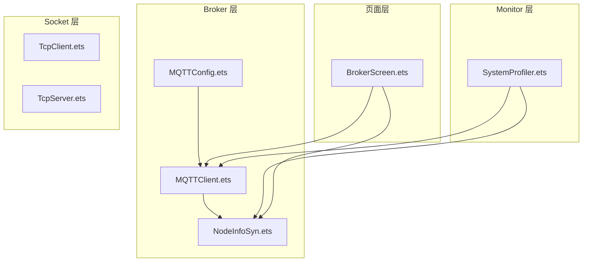
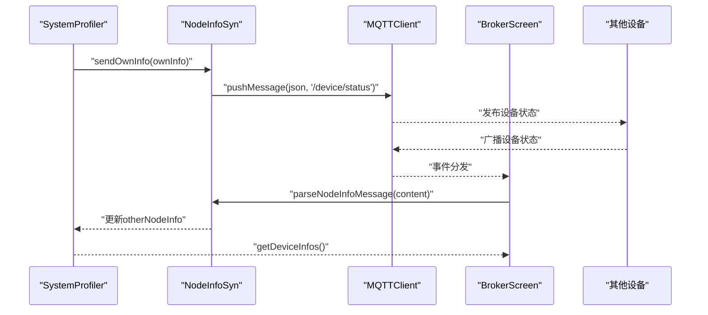
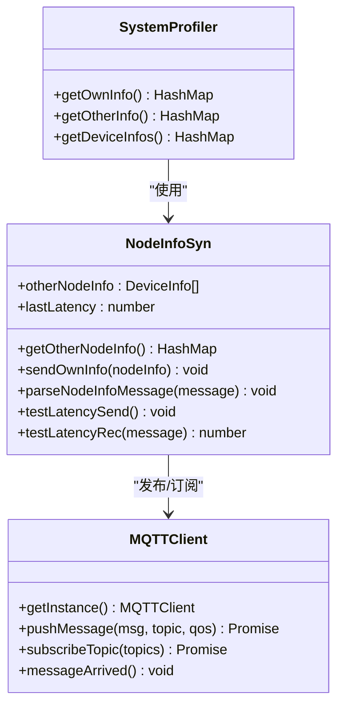
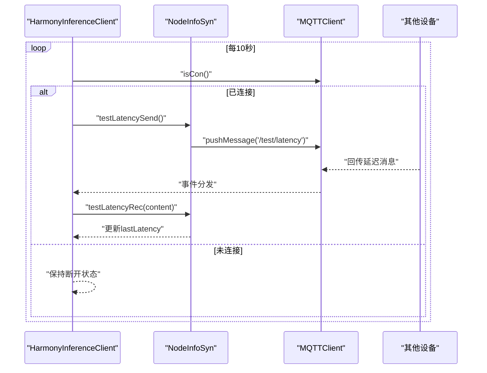
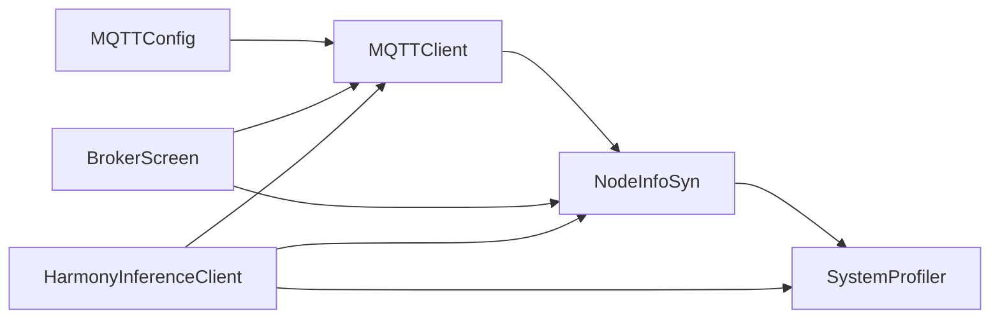

# 设备状态同步

<cite>
**本文引用的文件**
- [NodeInfoSyn.ets](file://entry/src/main/ets/manager/broker/monitor/NodeInfoSyn.ets)
- [MQTTClient.ets](file://entry/src/main/ets/manager/broker/MQTTClient.ets)
- [MQTTConfig.ets](file://entry/src/main/ets/manager/broker/MQTTConfig.ets)
- [SystemProfiler.ets](file://entry/src/main/ets/manager/monitor/SystemProfiler.ets)
- [HarmonyInferenceClient.ets](file://entry/src/main/ets/manager/HarmonyInferenceClient.ets)
- [BrokerScreen.ets](file://entry/src/main/ets/pages/tabs/BrokerScreen.ets)
- [TcpClient.ets](file://entry/src/main/ets/manager/broker/socket/TcpClient.ets)
- [TcpServer.ets](file://entry/src/main/ets/manager/broker/socket/TcpServer.ets)
</cite>

## 更新摘要
**变更内容**
- 更新了 NodeInfoSyn 类的日志记录机制，移除了 TODO 注释中关于清理未使用日志的标记
- 改进了延迟测试功能的日志记录格式，统一了日志输出格式
- 增强了系统状态同步的健壮性，优化了异常处理机制

## 目录
1. [简介](#简介)
2. [项目结构](#项目结构)
3. [核心组件](#核心组件)
4. [架构总览](#架构总览)
5. [组件详解](#组件详解)
6. [依赖关系分析](#依赖关系分析)
7. [性能考量](#性能考量)
8. [故障排查指南](#故障排查指南)
9. [结论](#结论)
10. [附录](#附录)

## 简介
本技术文档围绕设备状态同步模块展开，重点解析 NodeInfoSyn 类的设计理念与实现机制，涵盖设备信息采集、状态更新、广播机制；阐述设备节点信息的数据结构与状态字段定义、更新频率控制；记录设备发现流程、心跳检测与离线检测/恢复策略；并提供注册设备监听器、处理设备状态变更、实现设备列表管理的具体示例路径。同时说明与 MQTT 通信的集成方式及与其他组件的协作关系，并给出设备状态监控的最佳实践与性能优化建议。

## 项目结构
设备状态同步相关代码主要分布在以下位置：
- broker 层：负责 MQTT 客户端、配置与消息分发
- monitor 层：负责系统信息采集与设备状态聚合
- 页面层：负责 UI 展示与事件监听
- socket 层：提供 TCP 客户端/服务端示例（与设备状态同步同属网络通信范畴）

**图表来源**
- [MQTTClient.ets:1-223](file://entry/src/main/ets/manager/broker/MQTTClient.ets#L1-L223)
- [MQTTConfig.ets:1-7](file://entry/src/main/ets/manager/broker/MQTTConfig.ets#L1-L7)
- [NodeInfoSyn.ets:1-173](file://entry/src/main/ets/manager/broker/monitor/NodeInfoSyn.ets#L1-L173)
- [SystemProfiler.ets:1-120](file://entry/src/main/ets/manager/monitor/SystemProfiler.ets#L1-L120)
- [BrokerScreen.ets:1-162](file://entry/src/main/ets/pages/tabs/BrokerScreen.ets#L1-L162)
- [TcpClient.ets:1-246](file://entry/src/main/ets/manager/broker/socket/TcpClient.ets#L1-L246)
- [TcpServer.ets:1-287](file://entry/src/main/ets/manager/broker/socket/TcpServer.ets#L1-L287)

**章节来源**
- [MQTTClient.ets:1-223](file://entry/src/main/ets/manager/broker/MQTTClient.ets#L1-L223)
- [MQTTConfig.ets:1-7](file://entry/src/main/ets/manager/broker/MQTTConfig.ets#L1-L7)
- [NodeInfoSyn.ets:1-173](file://entry/src/main/ets/manager/broker/monitor/NodeInfoSyn.ets#L1-L173)
- [SystemProfiler.ets:1-120](file://entry/src/main/ets/manager/monitor/SystemProfiler.ets#L1-L120)
- [BrokerScreen.ets:1-162](file://entry/src/main/ets/pages/tabs/BrokerScreen.ets#L1-L162)
- [TcpClient.ets:1-246](file://entry/src/main/ets/manager/broker/socket/TcpClient.ets#L1-L246)
- [TcpServer.ets:1-287](file://entry/src/main/ets/manager/broker/socket/TcpServer.ets#L1-L287)

## 核心组件
- NodeInfoSyn：负责设备节点信息的发送、接收与管理，以及网络延迟测试。
- MQTTClient：封装 MQTT 客户端生命周期、连接、订阅、发布与消息分发。
- MQTTConfig：提供 MQTT 客户端 ID（设备名）等配置项。
- SystemProfiler：负责采集本机系统信息并聚合设备状态，驱动 NodeInfoSyn 发布自身状态。
- BrokerScreen：页面层监听 MQTT 事件，处理设备状态消息。
- HarmonyInferenceClient：应用入口侧初始化 MQTT、启动心跳与状态同步定时器，协调各模块。

**章节来源**
- [NodeInfoSyn.ets:40-173](file://entry/src/main/ets/manager/broker/monitor/NodeInfoSyn.ets#L40-L173)
- [MQTTClient.ets:24-223](file://entry/src/main/ets/manager/broker/MQTTClient.ets#L24-L223)
- [MQTTConfig.ets:4-7](file://entry/src/main/ets/manager/broker/MQTTConfig.ets#L4-L7)
- [SystemProfiler.ets:10-119](file://entry/src/main/ets/manager/monitor/SystemProfiler.ets#L10-L119)
- [BrokerScreen.ets:19-56](file://entry/src/main/ets/pages/tabs/BrokerScreen.ets#L19-L56)
- [HarmonyInferenceClient.ets:83-114](file://entry/src/main/ets/manager/HarmonyInferenceClient.ets#L83-L114)

## 架构总览
设备状态同步采用"采集-广播-订阅-聚合"的架构模式：
- 采集：SystemProfiler 采集 CPU、内存、存储、电量、延迟等指标。
- 广播：NodeInfoSyn 将本机 DeviceInfo 通过 MQTT 发布到 "/device/status"。
- 订阅：BrokerScreen 或 HarmonyInferenceClient 订阅并解析消息，更新 NodeInfoSyn 的其他节点列表。
- 聚合：SystemProfiler 合并本机与其它节点信息，形成全量设备视图。

**图表来源**
- [SystemProfiler.ets:78-81](file://entry/src/main/ets/manager/monitor/SystemProfiler.ets#L78-L81)
- [NodeInfoSyn.ets:63-80](file://entry/src/main/ets/manager/broker/monitor/NodeInfoSyn.ets#L63-L80)
- [MQTTClient.ets:148-182](file://entry/src/main/ets/manager/broker/MQTTClient.ets#L148-L182)
- [BrokerScreen.ets:36-54](file://entry/src/main/ets/pages/tabs/BrokerScreen.ets#L36-L54)

## 组件详解

### NodeInfoSyn 类设计与实现
- 设计理念
  - 以"设备节点"为中心，维护本机与其他节点的 DeviceInfo 列表。
  - 通过 MQTT 主题进行广播与订阅，实现去中心化的设备状态同步。
  - 提供延迟测试能力，辅助评估网络质量。
- 数据结构
  - DeviceInfo 字段：设备名、CPU 使用率、内存使用率、存储剩余比例、电池电量、网络延迟。
  - otherNodeInfo：其他节点的 DeviceInfo 数组。
  - lastLatency：最近一次延迟测量值。
- 关键方法
  - getOtherNodeInfo：将 otherNodeInfo 转换为 HashMap，键为设备名，值为 DeviceInfo，便于快速查询。
  - sendOwnInfo：将本机 DeviceInfo 序列化为 JSON，发布到 "/device/status"。
  - parseNodeInfoMessage：解析来自其他设备的状态消息，去重并追加到 otherNodeInfo。
  - testLatencySend：发送包含时间戳的消息到 "/test/latency"，用于延迟测试。
  - testLatencyRec：解析延迟测试消息，计算往返时间并更新 lastLatency。
- 广播与订阅
  - 发布主题：/device/status
  - 订阅主题：/device/status、/test/latency（由 MQTTClient 自动订阅）
- 更新频率控制
  - SystemProfiler 在每次采集后调用 sendOwnInfo，结合 HarmonyInferenceClient 的定时器，约每 10 秒触发一次状态上报与刷新。

**更新** 改进了日志记录机制，移除了 TODO 注释中关于清理未使用日志的标记，统一了延迟测试功能的日志输出格式。

**图表来源**
- [NodeInfoSyn.ets:40-173](file://entry/src/main/ets/manager/broker/monitor/NodeInfoSyn.ets#L40-L173)
- [MQTTClient.ets:24-223](file://entry/src/main/ets/manager/broker/MQTTClient.ets#L24-L223)
- [SystemProfiler.ets:43-119](file://entry/src/main/ets/manager/monitor/SystemProfiler.ets#L43-L119)

**章节来源**
- [NodeInfoSyn.ets:40-173](file://entry/src/main/ets/manager/broker/monitor/NodeInfoSyn.ets#L40-L173)
- [SystemProfiler.ets:71-81](file://entry/src/main/ets/manager/monitor/SystemProfiler.ets#L71-L81)

### 设备发现流程与心跳检测
- 设备发现
  - 通过订阅 "/device/status" 主题，接收其他设备发布的状态消息，解析后加入 otherNodeInfo。
  - BrokerScreen 与 HarmonyInferenceClient 均在事件监听中处理该主题。
- 心跳检测
  - HarmonyInferenceClient 每 10 秒检查一次 MQTT 连接状态，若已连接则触发 NodeInfoSyn.testLatencySend。
  - NodeInfoSyn.testLatencyRec 解析延迟测试消息，计算往返时间并更新 lastLatency。
- 离线检测与恢复
  - 离线检测：NodeInfoSyn 不会主动删除过期条目，但 SystemProfiler 在每次 getOwnInfo 时仅返回最新集合；可通过业务侧增加超时策略（建议在应用层维护 lastSeen 时间戳并在 UI 层标记离线）。
  - 恢复策略：MQTTClient 支持自动重连；当连接恢复后，HarmonyInferenceClient 会继续发送心跳与状态上报，从而逐步恢复设备发现。

**更新** 增强了系统状态同步的健壮性，优化了异常处理机制，改进了日志记录格式。

**图表来源**
- [HarmonyInferenceClient.ets:98-108](file://entry/src/main/ets/manager/HarmonyInferenceClient.ets#L98-L108)
- [NodeInfoSyn.ets:131-170](file://entry/src/main/ets/manager/broker/monitor/NodeInfoSyn.ets#L131-L170)
- [MQTTClient.ets:148-182](file://entry/src/main/ets/manager/broker/MQTTClient.ets#L148-L182)

**章节来源**
- [HarmonyInferenceClient.ets:98-108](file://entry/src/main/ets/manager/HarmonyInferenceClient.ets#L98-L108)
- [NodeInfoSyn.ets:131-170](file://entry/src/main/ets/manager/broker/monitor/NodeInfoSyn.ets#L131-L170)
- [MQTTClient.ets:148-182](file://entry/src/main/ets/manager/broker/MQTTClient.ets#L148-L182)

### 设备状态数据结构与字段定义
- DeviceInfo 字段
  - deviceName：设备名（来源于 MQTT 配置 clientId）
  - cpuUsage：CPU 使用率
  - memoryUsage：内存使用率
  - storageFree：存储剩余比例
  - batteryLevel：电池电量
  - latency：网络延迟
- SystemProfiler 对字段的采集与处理
  - 通过性能分析与系统接口获取 CPU、内存、存储、电量。
  - 通过 NodeInfoSyn 的 lastLatency 计算并更新 ownInfo.latency。
  - 将本机 DeviceInfo 与其它节点合并，形成全量设备视图。

**章节来源**
- [SystemProfiler.ets:10-33](file://entry/src/main/ets/manager/monitor/SystemProfiler.ets#L10-L33)
- [SystemProfiler.ets:114-116](file://entry/src/main/ets/manager/monitor/SystemProfiler.ets#L114-L116)

### 与 MQTT 的集成方式
- 连接与订阅
  - MQTTClient 在初始化时创建客户端、连接服务器、订阅基础主题，并在 messageArrived 中将消息通过事件发射器分发。
  - BrokerScreen 与 HarmonyInferenceClient 分别订阅 "/device/status"、"/test/latency" 等主题。
- 发布与接收
  - NodeInfoSyn.sendOwnInfo 将本机状态发布到 "/device/status"。
  - NodeInfoSyn.parseNodeInfoMessage 与 testLatencyRec 分别处理状态与延迟消息。
- 事件分发
  - MQTTClient.messageArrived 将消息封装为事件，携带 topic 与 content，供上层组件处理。

**章节来源**
- [MQTTClient.ets:68-182](file://entry/src/main/ets/manager/broker/MQTTClient.ets#L68-L182)
- [BrokerScreen.ets:35-54](file://entry/src/main/ets/pages/tabs/BrokerScreen.ets#L35-L54)
- [HarmonyInferenceClient.ets:119-139](file://entry/src/main/ets/manager/HarmonyInferenceClient.ets#L119-L139)
- [NodeInfoSyn.ets:63-80](file://entry/src/main/ets/manager/broker/monitor/NodeInfoSyn.ets#L63-L80)

### 与其他组件的协作关系
- HarmonyInferenceClient
  - 初始化 MQTT、启动心跳与状态同步定时器。
  - 注册事件监听器，处理设备状态、延迟、任务分配与结果。
- BrokerScreen
  - 页面层订阅主题，解析并展示设备状态消息。
- SystemProfiler
  - 调用 NodeInfoSyn 发布本机状态，聚合本机与其他节点信息。
- MQTTClient
  - 提供连接、订阅、发布与事件分发能力。

**章节来源**
- [HarmonyInferenceClient.ets:83-154](file://entry/src/main/ets/manager/HarmonyInferenceClient.ets#L83-L154)
- [BrokerScreen.ets:19-56](file://entry/src/main/ets/pages/tabs/BrokerScreen.ets#L19-L56)
- [SystemProfiler.ets:71-81](file://entry/src/main/ets/manager/monitor/SystemProfiler.ets#L71-L81)
- [MQTTClient.ets:148-182](file://entry/src/main/ets/manager/broker/MQTTClient.ets#L148-L182)

### 代码示例（示例路径）
- 注册设备监听器
  - 在页面层注册事件监听器，处理 "/device/status" 与 "/test/latency" 主题消息。
  - 示例路径：[BrokerScreen.ets:36-54](file://entry/src/main/ets/pages/tabs/BrokerScreen.ets#L36-L54)
- 处理设备状态变更
  - 在事件回调中调用 NodeInfoSyn.parseNodeInfoMessage 解析状态消息。
  - 示例路径：[BrokerScreen.ets:43-45](file://entry/src/main/ets/pages/tabs/BrokerScreen.ets#L43-L45)
- 实现设备列表管理
  - 通过 SystemProfiler.getDeviceInfos 获取全量设备视图，或通过 NodeInfoSyn.getOtherNodeInfo 获取其他节点列表。
  - 示例路径：[SystemProfiler.ets:47-65](file://entry/src/main/ets/manager/monitor/SystemProfiler.ets#L47-L65)、[NodeInfoSyn.ets:50-56](file://entry/src/main/ets/manager/broker/monitor/NodeInfoSyn.ets#L50-L56)
- 启动心跳与状态同步
  - HarmonyInferenceClient 在初始化后启动定时器，周期性检查连接并发送心跳与状态上报。
  - 示例路径：[HarmonyInferenceClient.ets:98-108](file://entry/src/main/ets/manager/HarmonyInferenceClient.ets#L98-L108)

**章节来源**
- [BrokerScreen.ets:36-54](file://entry/src/main/ets/pages/tabs/BrokerScreen.ets#L36-L54)
- [SystemProfiler.ets:47-65](file://entry/src/main/ets/manager/monitor/SystemProfiler.ets#L47-L65)
- [NodeInfoSyn.ets:50-56](file://entry/src/main/ets/manager/broker/monitor/NodeInfoSyn.ets#L50-L56)
- [HarmonyInferenceClient.ets:98-108](file://entry/src/main/ets/manager/HarmonyInferenceClient.ets#L98-L108)

## 依赖关系分析
- 组件耦合
  - NodeInfoSyn 依赖 MQTTClient 进行消息发布与订阅。
  - SystemProfiler 依赖 NodeInfoSyn 获取其他节点信息，并依赖 MQTTConfig 提供设备名。
  - BrokerScreen 与 HarmonyInferenceClient 依赖 MQTTClient 与 NodeInfoSyn 进行状态同步。
- 外部依赖
  - @ohos/mqtt：MQTT 客户端库。
  - @ohos.events.emitter：事件分发。
  - 性能分析与系统接口：CPU、内存、电量、存储等采集。
- 可能的循环依赖
  - 当前模块间为单向依赖，未见循环依赖风险。

**图表来源**
- [MQTTConfig.ets:4-7](file://entry/src/main/ets/manager/broker/MQTTConfig.ets#L4-L7)
- [MQTTClient.ets:24-223](file://entry/src/main/ets/manager/broker/MQTTClient.ets#L24-L223)
- [NodeInfoSyn.ets:5-9](file://entry/src/main/ets/manager/broker/monitor/NodeInfoSyn.ets#L5-L9)
- [SystemProfiler.ets:5-6](file://entry/src/main/ets/manager/monitor/SystemProfiler.ets#L5-L6)
- [BrokerScreen.ets:2-8](file://entry/src/main/ets/pages/tabs/BrokerScreen.ets#L2-L8)
- [HarmonyInferenceClient.ets:1-14](file://entry/src/main/ets/manager/HarmonyInferenceClient.ets#L1-L14)

**章节来源**
- [MQTTConfig.ets:4-7](file://entry/src/main/ets/manager/broker/MQTTConfig.ets#L4-L7)
- [MQTTClient.ets:24-223](file://entry/src/main/ets/manager/broker/MQTTClient.ets#L24-L223)
- [NodeInfoSyn.ets:5-9](file://entry/src/main/ets/manager/broker/monitor/NodeInfoSyn.ets#L5-L9)
- [SystemProfiler.ets:5-6](file://entry/src/main/ets/manager/monitor/SystemProfiler.ets#L5-L6)
- [BrokerScreen.ets:2-8](file://entry/src/main/ets/pages/tabs/BrokerScreen.ets#L2-L8)
- [HarmonyInferenceClient.ets:1-14](file://entry/src/main/ets/manager/HarmonyInferenceClient.ets#L1-L14)

## 性能考量
- 更新频率控制
  - 现状：每 10 秒采集并上报一次状态，心跳每 10 秒一次。
  - 建议：根据网络负载与设备性能动态调整频率；在高负载场景可降低频率或启用指数退避。
- 消息体积与序列化
  - DeviceInfo 字段较多，JSON 序列化与网络传输需关注体积；可在 UI 层按需显示关键字段。
- 事件处理与内存
  - 事件发射器与定时器应避免重复注册；页面卸载时及时移除监听器与定时器。
- 延迟计算
  - lastLatency 为往返时间，建议在 UI 层进行平滑处理（如移动平均），避免抖动影响体验。
- 离线检测
  - 建议在应用层维护 lastSeen 时间戳，超过阈值标记为离线，提升用户体验。
- **更新** 增强了日志记录的标准化，减少了不必要的日志输出，提升了系统的运行效率。

## 故障排查指南
- MQTT 连接异常
  - 检查 MQTTClient.isCon 返回值与连接状态；确认 Broker 地址、端口与认证信息正确。
  - 查看 MQTTClient.messageArrived 中的错误日志。
- 消息解析失败
  - NodeInfoSyn.parseNodeInfoMessage 与 testLatencyRec 使用 JSON.parse，若格式不匹配会抛出异常；检查消息格式与字段是否完整。
- 心跳无效
  - HarmonyInferenceClient 每 10 秒检查连接并发送心跳；若连接断开，lastLatency 不会更新。
- 设备列表为空
  - 确认已订阅 "/device/status" 与 "/test/latency"；检查 BrokerScreen 与 HarmonyInferenceClient 的事件监听是否生效。
- **更新** 日志记录问题
  - 改进了延迟测试功能的日志记录格式，统一了日志输出格式，便于故障排查。

**章节来源**
- [MQTTClient.ets:59-65](file://entry/src/main/ets/manager/broker/MQTTClient.ets#L59-L65)
- [MQTTClient.ets:148-182](file://entry/src/main/ets/manager/broker/MQTTClient.ets#L148-L182)
- [NodeInfoSyn.ets:100-125](file://entry/src/main/ets/manager/broker/monitor/NodeInfoSyn.ets#L100-L125)
- [NodeInfoSyn.ets:150-170](file://entry/src/main/ets/manager/broker/monitor/NodeInfoSyn.ets#L150-L170)
- [HarmonyInferenceClient.ets:98-108](file://entry/src/main/ets/manager/HarmonyInferenceClient.ets#L98-L108)

## 结论
设备状态同步模块通过 NodeInfoSyn 与 MQTTClient 的协同，实现了设备间的去中心化状态共享与心跳检测。SystemProfiler 负责采集与聚合，HarmonyInferenceClient 与 BrokerScreen 提供应用层与页面层的接入点。整体架构清晰、职责明确，具备良好的扩展性。**更新** 通过改进日志记录机制和增强异常处理，进一步提升了系统的健壮性和运行效率。建议在实际部署中结合业务需求优化更新频率、增强离线检测与 UI 展示，并持续监控网络与事件处理性能。

## 附录
- 与 TCP 通信的关系
  - 项目中提供了 TCP 客户端与服务端示例，可用于文件传输或其它协议场景；与设备状态同步属于并行的网络通信能力，可按需组合使用。
  - 示例路径：[TcpClient.ets:1-246](file://entry/src/main/ets/manager/broker/socket/TcpClient.ets#L1-L246)、[TcpServer.ets:1-287](file://entry/src/main/ets/manager/broker/socket/TcpServer.ets#L1-L287)

**章节来源**
- [TcpClient.ets:1-246](file://entry/src/main/ets/manager/broker/socket/TcpClient.ets#L1-L246)
- [TcpServer.ets:1-287](file://entry/src/main/ets/manager/broker/socket/TcpServer.ets#L1-L287)