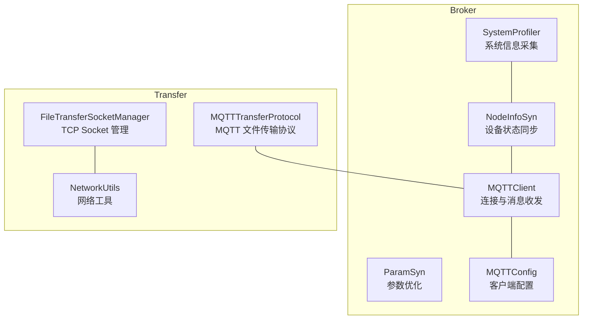
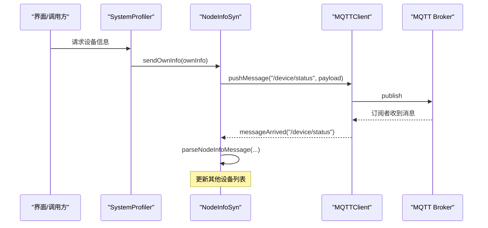
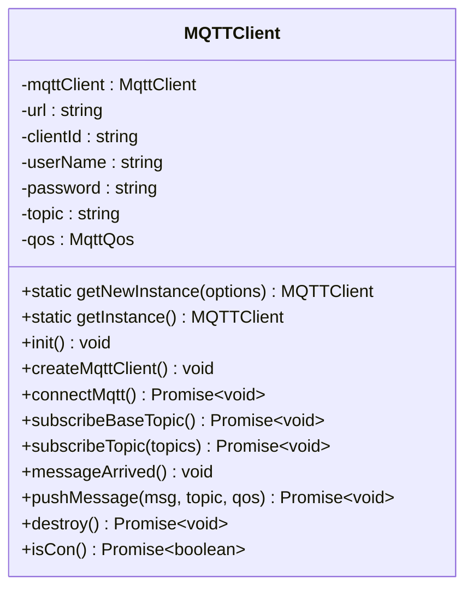
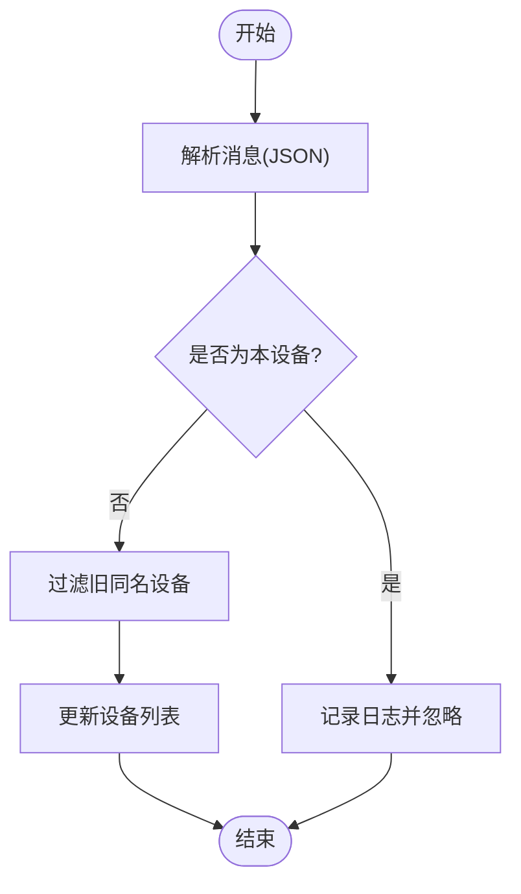
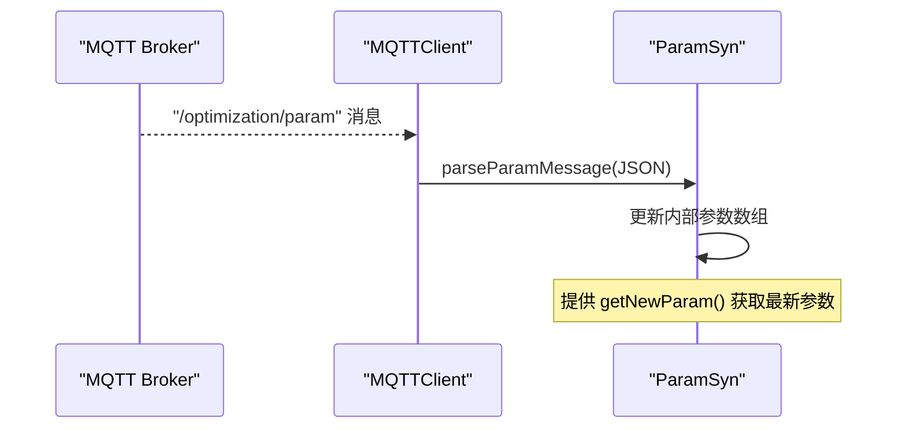
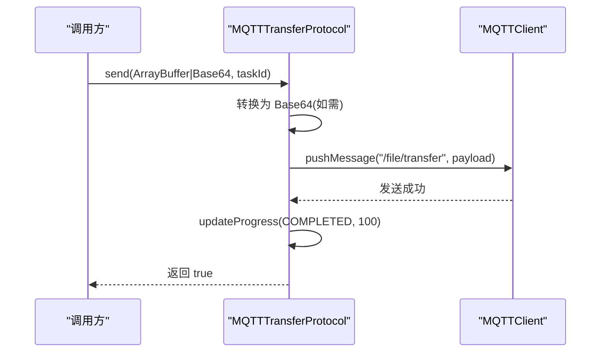
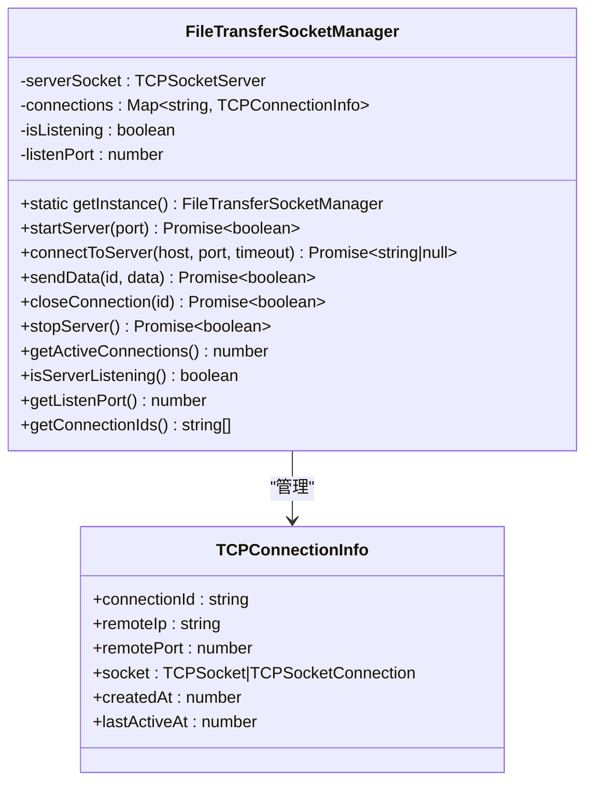
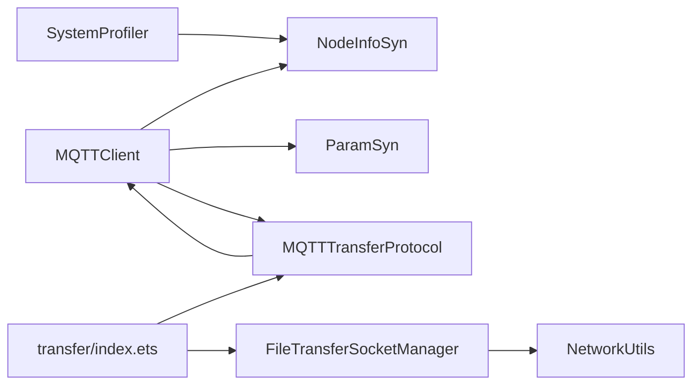

# 通信系统

<cite>
**本文引用的文件**
- [MQTTClient.ets](file://entry/src/main/ets/manager/broker/MQTTClient.ets)
- [NodeInfoSyn.ets](file://entry/src/main/ets/manager/broker/monitor/NodeInfoSyn.ets)
- [ParamSyn.ets](file://entry/src/main/ets/manager/broker/paramOpt/ParamSyn.ets)
- [MQTTConfig.ets](file://entry/src/main/ets/manager/broker/MQTTConfig.ets)
- [SystemProfiler.ets](file://entry/src/main/ets/manager/monitor/SystemProfiler.ets)
- [MQTTTransferProtocol.ets](file://entry/src/main/ets/manager/transfer/protocol/MQTTTransferProtocol.ets)
- [FileTransferSocketManager.ets](file://entry/src/main/ets/manager/transfer/socket/FileTransferSocketManager.ets)
- [NetworkUtils.ets](file://entry/src/main/ets/manager/transfer/utils/NetworkUtils.ets)
- [TcpClient.ets](file://entry/src/main/ets/manager/broker/socket/TcpClient.ets)
- [transfer/index.ets](file://entry/src/main/ets/manager/transfer/index.ets)
</cite>

## 目录
1. [引言](#引言)
2. [项目结构](#项目结构)
3. [核心组件](#核心组件)
4. [架构总览](#架构总览)
5. [详细组件分析](#详细组件分析)
6. [依赖分析](#依赖分析)
7. [性能考虑](#性能考虑)
8. [故障排查指南](#故障排查指南)
9. [结论](#结论)
10. [附录](#附录)

## 引言
本文件面向“通信系统”的子功能，聚焦以下三个关键模块的实现细节、调用关系、接口与领域模型：
- MQTTClient 的连接管理：包括初始化、自动重连、主题订阅、消息收发与事件派发。
- NodeInfoSyn 的设备状态同步：负责设备信息的采集、广播、解析与网络延迟测试。
- ParamSyn 的参数优化机制：负责参数消息的解析与提供最新参数。

文档同时解释这些模块与系统其他部分（如传输协议、TCP Socket 管理、网络工具）的集成关系，给出配置项、参数与返回值说明，并提供常见问题与排障建议，兼顾初学者与资深开发者的理解需求。

## 项目结构
通信系统位于入口模块的 manager/broker 与 manager/transfer 下，采用按职责分层组织：
- broker：通信基础设施（MQTT、TCP、监控与参数优化）
- transfer：文件传输协议与 Socket 管理
- monitor：系统信息采集与设备状态聚合
- utils：网络工具与通用能力

图表来源
- [MQTTClient.ets](file://entry/src/main/ets/manager/broker/MQTTClient.ets#L24-L223)
- [NodeInfoSyn.ets](file://entry/src/main/ets/manager/broker/monitor/NodeInfoSyn.ets#L40-L173)
- [ParamSyn.ets](file://entry/src/main/ets/manager/broker/paramOpt/ParamSyn.ets#L13-L40)
- [MQTTConfig.ets](file://entry/src/main/ets/manager/broker/MQTTConfig.ets#L4-L7)
- [SystemProfiler.ets](file://entry/src/main/ets/manager/monitor/SystemProfiler.ets#L43-L120)
- [MQTTTransferProtocol.ets](file://entry/src/main/ets/manager/transfer/protocol/MQTTTransferProtocol.ets#L10-L185)
- [FileTransferSocketManager.ets](file://entry/src/main/ets/manager/transfer/socket/FileTransferSocketManager.ets#L31-L354)
- [NetworkUtils.ets](file://entry/src/main/ets/manager/transfer/utils/NetworkUtils.ets#L7-L131)

章节来源
- [MQTTClient.ets](file://entry/src/main/ets/manager/broker/MQTTClient.ets#L1-L223)
- [NodeInfoSyn.ets](file://entry/src/main/ets/manager/broker/monitor/NodeInfoSyn.ets#L1-L173)
- [ParamSyn.ets](file://entry/src/main/ets/manager/broker/paramOpt/ParamSyn.ets#L1-L40)
- [MQTTConfig.ets](file://entry/src/main/ets/manager/broker/MQTTConfig.ets#L1-L7)
- [SystemProfiler.ets](file://entry/src/main/ets/manager/monitor/SystemProfiler.ets#L1-L120)
- [MQTTTransferProtocol.ets](file://entry/src/main/ets/manager/transfer/protocol/MQTTTransferProtocol.ets#L1-L185)
- [FileTransferSocketManager.ets](file://entry/src/main/ets/manager/transfer/socket/FileTransferSocketManager.ets#L1-L354)
- [NetworkUtils.ets](file://entry/src/main/ets/manager/transfer/utils/NetworkUtils.ets#L1-L131)

## 核心组件
- MQTTClient：单例 MQTT 客户端，封装连接、订阅、发布与事件派发；支持自动重连与多主题批量订阅。
- NodeInfoSyn：设备状态同步器，负责本设备信息广播、其他设备信息解析与网络延迟测试。
- ParamSyn：参数同步器，维护当前生效参数数组，解析参数更新消息并提供最新参数。
- SystemProfiler：系统信息采集器，聚合本设备与网络中其他设备的状态，驱动 NodeInfoSyn 广播。
- MQTTTransferProtocol：基于 MQTT 的文件传输协议实现，负责小文件直传、进度跟踪与重试。
- FileTransferSocketManager：TCP Socket 管理器，提供服务器监听、客户端连接、消息收发与连接生命周期管理。
- NetworkUtils：网络工具，提供 IP 获取、网络状态检测、端口校验等基础能力。
- TcpClient：TCP 客户端页面与 Worker 交互示例，演示消息发送与连接控制。

章节来源
- [MQTTClient.ets](file://entry/src/main/ets/manager/broker/MQTTClient.ets#L24-L223)
- [NodeInfoSyn.ets](file://entry/src/main/ets/manager/broker/monitor/NodeInfoSyn.ets#L40-L173)
- [ParamSyn.ets](file://entry/src/main/ets/manager/broker/paramOpt/ParamSyn.ets#L13-L40)
- [SystemProfiler.ets](file://entry/src/main/ets/manager/monitor/SystemProfiler.ets#L43-L120)
- [MQTTTransferProtocol.ets](file://entry/src/main/ets/manager/transfer/protocol/MQTTTransferProtocol.ets#L10-L185)
- [FileTransferSocketManager.ets](file://entry/src/main/ets/manager/transfer/socket/FileTransferSocketManager.ets#L31-L354)
- [NetworkUtils.ets](file://entry/src/main/ets/manager/transfer/utils/NetworkUtils.ets#L7-L131)
- [TcpClient.ets](file://entry/src/main/ets/manager/broker/socket/TcpClient.ets#L1-L246)

## 架构总览
MQTTClient 作为通信中枢，负责与 Broker 建立连接并订阅多个业务主题；NodeInfoSyn 与 SystemProfiler 协作完成设备状态采集与广播；ParamSyn 提供参数优化所需的数据；MQTTTransferProtocol 基于 MQTT 实现文件传输；FileTransferSocketManager 提供 TCP 传输能力；NetworkUtils 为 Socket 管理提供网络信息支撑。

图表来源
- [SystemProfiler.ets](file://entry/src/main/ets/manager/monitor/SystemProfiler.ets#L71-L81)
- [NodeInfoSyn.ets](file://entry/src/main/ets/manager/broker/monitor/NodeInfoSyn.ets#L63-L80)
- [MQTTClient.ets](file://entry/src/main/ets/manager/broker/MQTTClient.ets#L148-L182)

## 详细组件分析

### MQTTClient：连接管理与消息收发
- 单例模式：提供静态工厂方法创建与获取实例，避免重复初始化。
- 初始化流程：创建客户端 → 连接服务器 → 订阅基础主题 → 订阅扩展主题 → 注册消息回调。
- 连接参数：用户名/密码、连接超时、自动重连、MQTT 版本选择等。
- 主题订阅：支持单主题与多主题批量订阅；内置常用业务主题集合。
- 消息派发：根据主题区分普通消息与结果消息，通过事件发射器派发到上层处理。
- 发布与销毁：提供消息发布与实例销毁能力，销毁时清理事件监听。

图表来源
- [MQTTClient.ets](file://entry/src/main/ets/manager/broker/MQTTClient.ets#L24-L223)

章节来源
- [MQTTClient.ets](file://entry/src/main/ets/manager/broker/MQTTClient.ets#L24-L223)

### NodeInfoSyn：设备状态同步
- 角色定位：负责本设备状态广播、其他设备状态解析与网络延迟测试。
- 设备信息对象：包含设备名称、评分与系统参数（CPU、内存、存储、电量、延迟）。
- 本设备信息广播：将自身 DeviceInfo 通过 MQTT 发送到 /device/status。
- 其他设备信息管理：解析消息，过滤自身，去重并更新列表；提供 HashMap 快速查询。
- 延迟测试：发送包含时间戳的消息到 /test/latency，接收后计算往返延迟并更新 lastLatency。
- 与 SystemProfiler 的协作：SystemProfiler 在采集完成后调用 NodeInfoSyn.sendOwnInfo 广播。

图表来源
- [NodeInfoSyn.ets](file://entry/src/main/ets/manager/broker/monitor/NodeInfoSyn.ets#L100-L125)

章节来源
- [NodeInfoSyn.ets](file://entry/src/main/ets/manager/broker/monitor/NodeInfoSyn.ets#L40-L173)
- [SystemProfiler.ets](file://entry/src/main/ets/manager/monitor/SystemProfiler.ets#L71-L81)

### ParamSyn：参数优化机制
- 参数消息结构：包含一个数值数组 param。
- 状态维护：维护当前生效参数数组，默认值为 [1,1,1,1,1]。
- 解析与更新：解析 JSON 消息，更新内部参数数组。
- 查询接口：提供获取最新参数的方法，返回数组副本。

图表来源
- [ParamSyn.ets](file://entry/src/main/ets/manager/broker/paramOpt/ParamSyn.ets#L25-L37)
- [MQTTClient.ets](file://entry/src/main/ets/manager/broker/MQTTClient.ets#L148-L182)

章节来源
- [ParamSyn.ets](file://entry/src/main/ets/manager/broker/paramOpt/ParamSyn.ets#L13-L40)

### SystemProfiler：系统信息采集与聚合
- 设备信息模型：DeviceInfo 包含设备名称、CPU、内存、存储、电量、延迟。
- 采集流程：获取设备名、CPU、内存、存储、电量，更新延迟，广播本设备信息。
- 聚合视图：合并本设备与其他设备信息，提供统一查询接口。
- 与 NodeInfoSyn 的协作：在采集完成后调用 sendOwnInfo 广播。

章节来源
- [SystemProfiler.ets](file://entry/src/main/ets/manager/monitor/SystemProfiler.ets#L10-L120)
- [NodeInfoSyn.ets](file://entry/src/main/ets/manager/broker/monitor/NodeInfoSyn.ets#L63-L80)

### MQTTTransferProtocol：MQTT 文件传输协议
- 协议职责：基于现有 MQTT 客户端，实现小文件（≤2MB）的直接传输。
- 连接检查：复用 MQTTClient 的连接状态，无需主动断开。
- 发送流程：支持 ArrayBuffer 或 Base64 字符串，转换后通过 /file/transfer 主题发送；带重试与进度更新。
- 进度管理：维护每个任务的进度状态，完成后清理。

图表来源
- [MQTTTransferProtocol.ets](file://entry/src/main/ets/manager/transfer/protocol/MQTTTransferProtocol.ets#L70-L109)
- [MQTTClient.ets](file://entry/src/main/ets/manager/broker/MQTTClient.ets#L190-L203)

章节来源
- [MQTTTransferProtocol.ets](file://entry/src/main/ets/manager/transfer/protocol/MQTTTransferProtocol.ets#L10-L185)

### FileTransferSocketManager：TCP Socket 管理
- 单例管理：提供服务器监听与客户端连接的统一入口。
- 服务器启动：绑定本机 IP 与端口，监听客户端连接，记录连接信息。
- 客户端连接：绑定本地地址，连接远程服务器，生成连接 ID 并保存。
- 消息收发：设置消息回调与关闭处理，维护连接活跃时间。
- 生命周期：支持关闭指定连接与停止服务器，清理所有连接。

图表来源
- [FileTransferSocketManager.ets](file://entry/src/main/ets/manager/transfer/socket/FileTransferSocketManager.ets#L31-L354)

章节来源
- [FileTransferSocketManager.ets](file://entry/src/main/ets/manager/transfer/socket/FileTransferSocketManager.ets#L31-L354)

### NetworkUtils：网络工具
- IP 获取：从 WiFi 管理器获取 IP 信息并格式化为点分十进制。
- 网络状态：检测 WiFi 是否激活。
- 子网掩码与网关：解析并返回网络参数。
- 端口校验：验证端口范围并提供默认值。

章节来源
- [NetworkUtils.ets](file://entry/src/main/ets/manager/transfer/utils/NetworkUtils.ets#L7-L131)

### TcpClient：TCP 客户端示例
- 页面交互：提供服务端 IP/端口输入、消息输入、连接与关闭按钮。
- Worker 通信：通过 ThreadWorker 发送消息与接收响应，展示历史消息。
- 生命周期：页面消失时终止 Worker。

章节来源
- [TcpClient.ets](file://entry/src/main/ets/manager/broker/socket/TcpClient.ets#L1-L246)

## 依赖分析
- MQTTClient 依赖 @ohos/mqtt 与事件发射器，向上传递给 NodeInfoSyn、ParamSyn、MQTTTransferProtocol 使用。
- NodeInfoSyn 依赖 MQTTClient 与 SystemProfiler 的 DeviceInfo 结构。
- SystemProfiler 依赖 Battery、Statfs、NDK 获取系统信息，并调用 NodeInfoSyn 广播。
- MQTTTransferProtocol 依赖 MQTTClient 与 FileUtils，实现文件传输。
- FileTransferSocketManager 依赖 NetworkUtils 与 NetworkKit socket API。
- transfer/index.ets 对外统一导出传输相关接口与实现，便于上层按需引入。

图表来源
- [transfer/index.ets](file://entry/src/main/ets/manager/transfer/index.ets#L1-L45)
- [MQTTClient.ets](file://entry/src/main/ets/manager/broker/MQTTClient.ets#L1-L223)
- [NodeInfoSyn.ets](file://entry/src/main/ets/manager/broker/monitor/NodeInfoSyn.ets#L1-L173)
- [ParamSyn.ets](file://entry/src/main/ets/manager/broker/paramOpt/ParamSyn.ets#L1-L40)
- [SystemProfiler.ets](file://entry/src/main/ets/manager/monitor/SystemProfiler.ets#L1-L120)
- [MQTTTransferProtocol.ets](file://entry/src/main/ets/manager/transfer/protocol/MQTTTransferProtocol.ets#L1-L185)
- [FileTransferSocketManager.ets](file://entry/src/main/ets/manager/transfer/socket/FileTransferSocketManager.ets#L1-L354)
- [NetworkUtils.ets](file://entry/src/main/ets/manager/transfer/utils/NetworkUtils.ets#L1-L131)

章节来源
- [transfer/index.ets](file://entry/src/main/ets/manager/transfer/index.ets#L1-L45)

## 性能考虑
- MQTTClient 自动重连与连接超时参数可平衡稳定性与资源消耗。
- NodeInfoSyn 的设备列表更新采用去重与过滤策略，避免重复广播与解析开销。
- MQTTTransferProtocol 的重试次数与超时时间影响传输可靠性与等待时间，应结合网络环境调优。
- FileTransferSocketManager 的连接池与活跃时间维护有助于资源回收与并发控制。
- SystemProfiler 的并发任务执行与 round 处理减少 UI 阻塞与数据抖动。

## 故障排查指南
- MQTT 连接失败
  - 检查 MQTTConfig 的 clientId/url/用户名/密码是否正确。
  - 查看 connectMqtt 的错误日志，确认自动重连是否生效。
  - 章节来源
    - [MQTTConfig.ets](file://entry/src/main/ets/manager/broker/MQTTConfig.ets#L4-L7)
    - [MQTTClient.ets](file://entry/src/main/ets/manager/broker/MQTTClient.ets#L85-L104)
- 主题订阅失败
  - 确认 subscribeBaseTopic 与 subscribeTopic 的 QoS 与主题列表。
  - 章节来源
    - [MQTTClient.ets](file://entry/src/main/ets/manager/broker/MQTTClient.ets#L107-L145)
- 消息未到达
  - 检查 messageArrived 的主题分支与事件派发。
  - 章节来源
    - [MQTTClient.ets](file://entry/src/main/ets/manager/broker/MQTTClient.ets#L148-L182)
- 设备状态不同步
  - 确认 SystemProfiler.sendOwnInfo 是否被调用，NodeInfoSyn.parseNodeInfoMessage 是否正确解析。
  - 章节来源
    - [SystemProfiler.ets](file://entry/src/main/ets/manager/monitor/SystemProfiler.ets#L71-L81)
    - [NodeInfoSyn.ets](file://entry/src/main/ets/manager/broker/monitor/NodeInfoSyn.ets#L100-L125)
- 参数未更新
  - 检查 /optimization/param 主题消息格式与 ParamSyn.parseParamMessage 的解析。
  - 章节来源
    - [ParamSyn.ets](file://entry/src/main/ets/manager/broker/paramOpt/ParamSyn.ets#L25-L37)
- TCP 连接异常
  - 检查 NetworkUtils 的 IP 获取与端口校验，确认 FileTransferSocketManager 的连接流程。
  - 章节来源
    - [NetworkUtils.ets](file://entry/src/main/ets/manager/transfer/utils/NetworkUtils.ets#L12-L29)
    - [FileTransferSocketManager.ets](file://entry/src/main/ets/manager/transfer/socket/FileTransferSocketManager.ets#L167-L228)

## 结论
通信系统通过 MQTTClient 提供稳定的消息通道，结合 NodeInfoSyn 与 SystemProfiler 实现设备状态的动态同步，配合 ParamSyn 的参数优化机制形成闭环。MQTTTransferProtocol 与 FileTransferSocketManager 分别覆盖轻量与海量场景的传输需求。整体设计清晰、职责明确，具备良好的扩展性与可维护性。

## 附录
- 配置项与参数
  - MQTTOptionsType：url、clientId、userName、password、topic、qos
  - MQTTClient.connectMqtt：connectTimeout、automaticReconnect、MQTTVersion
  - MQTTTransferProtocol：DEFAULT_TIMEOUT、MAX_RETRIES
  - FileTransferSocketManager：listenPort、NetAddress、TCPConnectOptions
  - NetworkUtils.validatePort：默认端口与范围校验
- 返回值与事件
  - MQTTClient.pushMessage/publish：Promise<MqttResponse>
  - MQTTClient.isCon：Promise<boolean>
  - NodeInfoSyn.getOtherNodeInfo：HashMap<string, DeviceInfo>
  - ParamSyn.getNewParam：number[]
  - FileTransferSocketManager.startServer/connectToServer/sendData/closeConnection/stopServer：Promise<boolean>