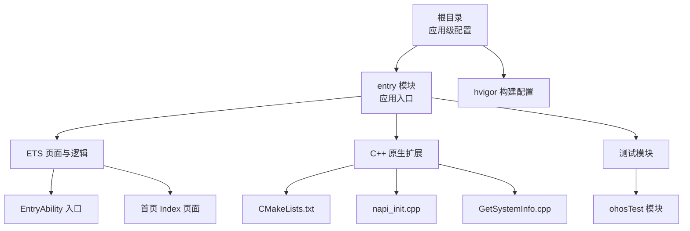
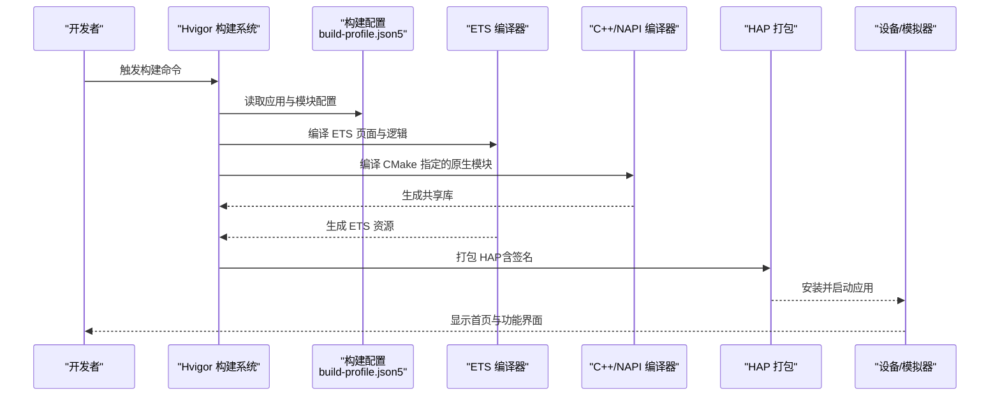

# 快速开始

<cite>
**本文引用的文件**
- [build-profile.json5](file://build-profile.json5)
- [hvigorfile.ts](file://hvigorfile.ts)
- [oh-package.json5](file://oh-package.json5)
- [entry/build-profile.json5](file://entry/build-profile.json5)
- [entry/hvigorfile.ts](file://entry/hvigorfile.ts)
- [entry/src/main/module.json5](file://entry/src/main/module.json5)
- [entry/src/ohosTest/module.json5](file://entry/src/ohosTest/module.json5)
- [entry/src/main/cpp/CMakeLists.txt](file://entry/src/main/cpp/CMakeLists.txt)
- [entry/src/main/cpp/napi_init.cpp](file://entry/src/main/cpp/napi_init.cpp)
- [entry/src/main/cpp/GetSystemInfo.cpp](file://entry/src/main/cpp/GetSystemInfo.cpp)
- [entry/src/main/ets/entryability/EntryAbility.ets](file://entry/src/main/ets/entryability/EntryAbility.ets)
- [entry/src/main/ets/pages/Index.ets](file://entry/src/main/ets/pages/Index.ets)
- [entry/src/main/resources/base/element/string.json](file://entry/src/main/resources/base/element/string.json)
</cite>

## 目录
1. [简介](#简介)
2. [项目结构](#项目结构)
3. [核心组件](#核心组件)
4. [架构总览](#架构总览)
5. [详细组件分析](#详细组件分析)
6. [依赖分析](#依赖分析)
7. [性能考虑](#性能考虑)
8. [故障排除指南](#故障排除指南)
9. [结论](#结论)
10. [附录](#附录)

## 简介
本指南面向首次接触 OH_Co3 项目的开发者，帮助你在最短时间内完成环境准备、项目克隆、编译与运行，并提供最小可运行示例与常见问题排查建议。项目基于 OpenHarmony 的 Stage 模式构建，采用 ArkTS/ETS 开发 UI 页面，结合 C++ NAPI 扩展实现系统信息采集能力。

## 项目结构
项目采用模块化组织方式，顶层为应用级配置，子模块 entry 作为应用入口模块，包含 ETS 页面、C++ 原生扩展以及测试模块等。

图表来源
- [hvigorfile.ts](file://hvigorfile.ts#L1-L7)
- [entry/hvigorfile.ts](file://entry/hvigorfile.ts#L1-L7)
- [entry/src/main/module.json5](file://entry/src/main/module.json5#L1-L86)
- [entry/src/ohosTest/module.json5](file://entry/src/ohosTest/module.json5#L1-L38)
- [entry/src/main/cpp/CMakeLists.txt](file://entry/src/main/cpp/CMakeLists.txt#L1-L13)
- [entry/src/main/ets/pages/Index.ets](file://entry/src/main/ets/pages/Index.ets#L1-L75)

章节来源
- [build-profile.json5](file://build-profile.json5#L1-L51)
- [entry/build-profile.json5](file://entry/build-profile.json5#L1-L39)

## 核心组件
- 应用入口模块（entry）
  - 类型为“entry”，声明了主 Ability、页面、权限与设备类型等。
  - 参考路径：[entry/src/main/module.json5](file://entry/src/main/module.json5#L1-L86)
- 构建与打包配置
  - 应用级与模块级 build-profile.json5 定义了签名、SDK 版本、目标 ABI、构建模式等。
  - 参考路径：
    - [build-profile.json5](file://build-profile.json5#L1-L51)
    - [entry/build-profile.json5](file://entry/build-profile.json5#L1-L39)
- 构建脚本
  - hvigorfile.ts 使用内置插件，定义系统任务与可选扩展插件。
  - 参考路径：
    - [hvigorfile.ts](file://hvigorfile.ts#L1-L7)
    - [entry/hvigorfile.ts](file://entry/hvigorfile.ts#L1-L7)
- ETS 页面与入口
  - EntryAbility 负责窗口生命周期与页面加载；Index 页面作为入口页。
  - 参考路径：
    - [entry/src/main/ets/entryability/EntryAbility.ets](file://entry/src/main/ets/entryability/EntryAbility.ets#L1-L65)
    - [entry/src/main/ets/pages/Index.ets](file://entry/src/main/ets/pages/Index.ets#L1-L75)
- 原生扩展（C++ NAPI）
  - 通过 CMake 编译共享库，导出 CPU/内存使用率接口供 ETS 调用。
  - 参考路径：
    - [entry/src/main/cpp/CMakeLists.txt](file://entry/src/main/cpp/CMakeLists.txt#L1-L13)
    - [entry/src/main/cpp/napi_init.cpp](file://entry/src/main/cpp/napi_init.cpp#L1-L31)
    - [entry/src/main/cpp/GetSystemInfo.cpp](file://entry/src/main/cpp/GetSystemInfo.cpp#L1-L181)

章节来源
- [entry/src/main/module.json5](file://entry/src/main/module.json5#L1-L86)
- [entry/src/main/ets/entryability/EntryAbility.ets](file://entry/src/main/ets/entryability/EntryAbility.ets#L1-L65)
- [entry/src/main/ets/pages/Index.ets](file://entry/src/main/ets/pages/Index.ets#L1-L75)
- [entry/src/main/cpp/CMakeLists.txt](file://entry/src/main/cpp/CMakeLists.txt#L1-L13)
- [entry/src/main/cpp/napi_init.cpp](file://entry/src/main/cpp/napi_init.cpp#L1-L31)
- [entry/src/main/cpp/GetSystemInfo.cpp](file://entry/src/main/cpp/GetSystemInfo.cpp#L1-L181)

## 架构总览
下图展示了从构建到运行的关键流程：hvigor 读取配置 → 编译 ETS 与 C++ → 生成 HAP 包 → 安装到设备或模拟器。

图表来源
- [hvigorfile.ts](file://hvigorfile.ts#L1-L7)
- [entry/hvigorfile.ts](file://entry/hvigorfile.ts#L1-L7)
- [build-profile.json5](file://build-profile.json5#L1-L51)
- [entry/build-profile.json5](file://entry/build-profile.json5#L1-L39)
- [entry/src/main/cpp/CMakeLists.txt](file://entry/src/main/cpp/CMakeLists.txt#L1-L13)

## 详细组件分析

### 构建与打包配置
- 应用级配置要点
  - 签名配置：包含默认签名项与证书材料路径。
  - 产品配置：指定 SDK 版本、兼容版本、运行时 OS 与目标 SDK。
  - 构建模式：debug 与 release。
- 模块级配置要点
  - apiType 设为 stageMode。
  - externalNativeOptions 指定 CMakeLists.txt 路径与 ABI 过滤（arm64-v8a）。
  - release 构建启用混淆规则文件。
- 参考路径
  - [build-profile.json5](file://build-profile.json5#L1-L51)
  - [entry/build-profile.json5](file://entry/build-profile.json5#L1-L39)

章节来源
- [build-profile.json5](file://build-profile.json5#L1-L51)
- [entry/build-profile.json5](file://entry/build-profile.json5#L1-L39)

### 模块与权限声明
- 模块类型为 entry，声明主 Ability（EntryAbility）、页面、设备类型与安装策略。
- 请求权限列表包含网络、定位、蓝牙、互联网等，用于演示通信与网络相关功能。
- 参考路径
  - [entry/src/main/module.json5](file://entry/src/main/module.json5#L1-L86)

章节来源
- [entry/src/main/module.json5](file://entry/src/main/module.json5#L1-L86)

### 测试模块
- 测试模块类型为 feature，声明测试 Ability 与页面，便于 UI 可视化测试与自动化测试。
- 参考路径
  - [entry/src/ohosTest/module.json5](file://entry/src/ohosTest/module.json5#L1-L38)

章节来源
- [entry/src/ohosTest/module.json5](file://entry/src/ohosTest/module.json5#L1-L38)

### ETS 入口与页面
- EntryAbility 实现窗口生命周期回调，加载首页 Index。
- Index 页面为入口页，包含标签页与底部栏，当前默认展示测试页面。
- 参考路径
  - [entry/src/main/ets/entryability/EntryAbility.ets](file://entry/src/main/ets/entryability/EntryAbility.ets#L1-L65)
  - [entry/src/main/ets/pages/Index.ets](file://entry/src/main/ets/pages/Index.ets#L1-L75)

章节来源
- [entry/src/main/ets/entryability/EntryAbility.ets](file://entry/src/main/ets/entryability/EntryAbility.ets#L1-L65)
- [entry/src/main/ets/pages/Index.ets](file://entry/src/main/ets/pages/Index.ets#L1-L75)

### 原生扩展（C++ NAPI）
- CMakeLists 指定包含目录与编译共享库，链接日志与 ACE NAPI 库。
- napi_init 注册导出函数，模块名为 entry。
- GetSystemInfo 提供 CPU/内存使用率计算与系统信息解析。
- 参考路径
  - [entry/src/main/cpp/CMakeLists.txt](file://entry/src/main/cpp/CMakeLists.txt#L1-L13)
  - [entry/src/main/cpp/napi_init.cpp](file://entry/src/main/cpp/napi_init.cpp#L1-L31)
  - [entry/src/main/cpp/GetSystemInfo.cpp](file://entry/src/main/cpp/GetSystemInfo.cpp#L1-L181)

章节来源
- [entry/src/main/cpp/CMakeLists.txt](file://entry/src/main/cpp/CMakeLists.txt#L1-L13)
- [entry/src/main/cpp/napi_init.cpp](file://entry/src/main/cpp/napi_init.cpp#L1-L31)
- [entry/src/main/cpp/GetSystemInfo.cpp](file://entry/src/main/cpp/GetSystemInfo.cpp#L1-L181)

## 依赖分析
- 项目依赖
  - 运行时依赖：@ohos/mqtt（版本约束见依赖声明）。
  - 开发依赖：@ohos/hypium、@ohos/hamock。
- 构建与任务
  - hvigorfile.ts 使用内置系统任务，未配置自定义插件。
- 参考路径
  - [oh-package.json5](file://oh-package.json5#L1-L17)
  - [hvigorfile.ts](file://hvigorfile.ts#L1-L7)
  - [entry/hvigorfile.ts](file://entry/hvigorfile.ts#L1-L7)

章节来源
- [oh-package.json5](file://oh-package.json5#L1-L17)
- [hvigorfile.ts](file://hvigorfile.ts#L1-L7)
- [entry/hvigorfile.ts](file://entry/hvigorfile.ts#L1-L7)

## 性能考虑
- 构建优化
  - release 模式启用混淆规则，有助于减小包体与提升运行时性能。
- 原生扩展
  - CMake 中保留调试符号，便于调试；生产可按需裁剪。
- 页面与网络
  - 权限声明覆盖网络、定位、蓝牙等场景，注意在真实设备上按需申请与释放权限。

章节来源
- [entry/build-profile.json5](file://entry/build-profile.json5#L16-L30)
- [entry/src/main/cpp/CMakeLists.txt](file://entry/src/main/cpp/CMakeLists.txt#L6-L7)

## 故障排除指南
- 构建失败（找不到签名材料或证书）
  - 检查应用级 build-profile.json5 中的 certpath、storeFile、storePassword 等路径是否有效。
  - 参考路径：[build-profile.json5](file://build-profile.json5#L1-L51)
- ABI 不匹配导致运行异常
  - 确认 externalNativeOptions 中 abiFilters 设置为 arm64-v8a，与设备 ABI 一致。
  - 参考路径：[entry/build-profile.json5](file://entry/build-profile.json5#L11-L13)
- 页面加载失败
  - 检查 EntryAbility 的 onWindowStageCreate 是否正确加载 pages/Index。
  - 参考路径：
    - [entry/src/main/ets/entryability/EntryAbility.ets](file://entry/src/main/ets/entryability/EntryAbility.ets#L33-L44)
    - [entry/src/main/ets/pages/Index.ets](file://entry/src/main/ets/pages/Index.ets#L50-L72)
- 原生接口调用失败
  - 确认 napi_init 已注册模块名与导出函数，CMake 成功编译共享库并被 HAP 引入。
  - 参考路径：
    - [entry/src/main/cpp/napi_init.cpp](file://entry/src/main/cpp/napi_init.cpp#L17-L30)
    - [entry/src/main/cpp/CMakeLists.txt](file://entry/src/main/cpp/CMakeLists.txt#L12-L13)
- 权限未生效
  - 在 module.json5 中确认请求权限已声明，且设备/模拟器允许授权。
  - 参考路径：[entry/src/main/module.json5](file://entry/src/main/module.json5#L36-L84)

章节来源
- [build-profile.json5](file://build-profile.json5#L1-L51)
- [entry/build-profile.json5](file://entry/build-profile.json5#L11-L13)
- [entry/src/main/ets/entryability/EntryAbility.ets](file://entry/src/main/ets/entryability/EntryAbility.ets#L33-L44)
- [entry/src/main/ets/pages/Index.ets](file://entry/src/main/ets/pages/Index.ets#L50-L72)
- [entry/src/main/cpp/napi_init.cpp](file://entry/src/main/cpp/napi_init.cpp#L17-L30)
- [entry/src/main/cpp/CMakeLists.txt](file://entry/src/main/cpp/CMakeLists.txt#L12-L13)
- [entry/src/main/module.json5](file://entry/src/main/module.json5#L36-L84)

## 结论
通过本指南，你可以在本地完成 OH_Co3 项目的环境准备与最小可运行示例验证。建议先在模拟器中运行，再逐步迁移到真机设备，同时根据实际需求调整权限与构建配置。

## 附录

### 系统要求与前置条件
- 开发工具
  - DevEco Studio（建议使用与 OpenHarmony SDK 版本匹配的版本）
  - Node.js（用于包管理与构建）
- SDK 与运行时
  - OpenHarmony SDK（与 build-profile.json5 中 compileSdkVersion、compatibleSdkVersion 对齐）
  - 运行时 OS：HarmonyOS
- 设备
  - 支持 arm64-v8a 的设备或模拟器

章节来源
- [build-profile.json5](file://build-profile.json5#L22-L26)
- [entry/build-profile.json5](file://entry/build-profile.json5#L11-L13)

### 最小可运行示例步骤
- 步骤 1：克隆仓库后，打开项目根目录
- 步骤 2：在 DevEco Studio 中导入项目
- 步骤 3：配置签名（如提示），参考应用级签名配置
  - 参考路径：[build-profile.json5](file://build-profile.json5#L3-L16)
- 步骤 4：执行构建命令（使用 hvigor）
  - 参考路径：
    - [hvigorfile.ts](file://hvigorfile.ts#L1-L7)
    - [entry/hvigorfile.ts](file://entry/hvigorfile.ts#L1-L7)
- 步骤 5：在模拟器或设备上安装并运行
  - 首页应显示 Index 页面，默认加载测试页面
  - 参考路径：
    - [entry/src/main/ets/entryability/EntryAbility.ets](file://entry/src/main/ets/entryability/EntryAbility.ets#L33-L44)
    - [entry/src/main/ets/pages/Index.ets](file://entry/src/main/ets/pages/Index.ets#L50-L72)

章节来源
- [build-profile.json5](file://build-profile.json5#L1-L51)
- [hvigorfile.ts](file://hvigorfile.ts#L1-L7)
- [entry/hvigorfile.ts](file://entry/hvigorfile.ts#L1-L7)
- [entry/src/main/ets/entryability/EntryAbility.ets](file://entry/src/main/ets/entryability/EntryAbility.ets#L33-L44)
- [entry/src/main/ets/pages/Index.ets](file://entry/src/main/ets/pages/Index.ets#L50-L72)

### 构建命令与调试方法
- 构建命令
  - 使用 hvigor 执行构建（具体命令由 IDE 或终端触发）
  - 参考路径：
    - [hvigorfile.ts](file://hvigorfile.ts#L1-L7)
    - [entry/hvigorfile.ts](file://entry/hvigorfile.ts#L1-L7)
- 调试方法
  - 启用 debug 构建模式，查看日志输出（EntryAbility 中使用 hilog 输出）
  - 参考路径：
    - [entry/src/main/ets/entryability/EntryAbility.ets](file://entry/src/main/ets/entryability/EntryAbility.ets#L17-L19)
    - [entry/src/main/ets/pages/Index.ets](file://entry/src/main/ets/pages/Index.ets#L19-L28)

章节来源
- [hvigorfile.ts](file://hvigorfile.ts#L1-L7)
- [entry/hvigorfile.ts](file://entry/hvigorfile.ts#L1-L7)
- [entry/src/main/ets/entryability/EntryAbility.ets](file://entry/src/main/ets/entryability/EntryAbility.ets#L17-L19)
- [entry/src/main/ets/pages/Index.ets](file://entry/src/main/ets/pages/Index.ets#L19-L28)

### 部署到不同设备
- 模拟器
  - 在 DevEco Studio 中选择模拟器目标，直接运行
- 真机设备
  - 开启开发者选项与 USB 调试，连接设备后运行
- 注意事项
  - ABI 与 SDK 版本需与 build-profile.json5 中配置一致
  - 参考路径：
    - [entry/build-profile.json5](file://entry/build-profile.json5#L11-L13)
    - [build-profile.json5](file://build-profile.json5#L22-L26)

章节来源
- [entry/build-profile.json5](file://entry/build-profile.json5#L11-L13)
- [build-profile.json5](file://build-profile.json5#L22-L26)

### 社区支持资源
- OpenHarmony 官方文档与社区论坛
- DevEco Studio 插件与模板资源
- 如遇问题，请在社区论坛搜索相关主题或提交 Issue