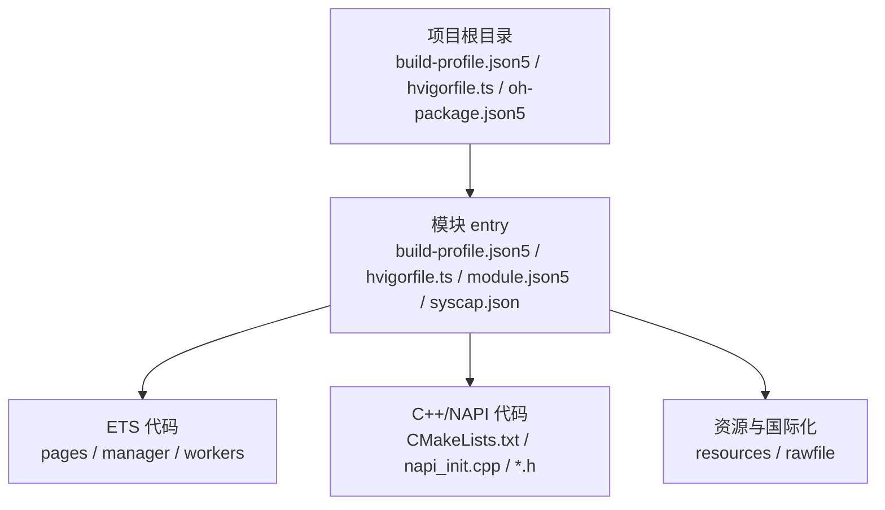
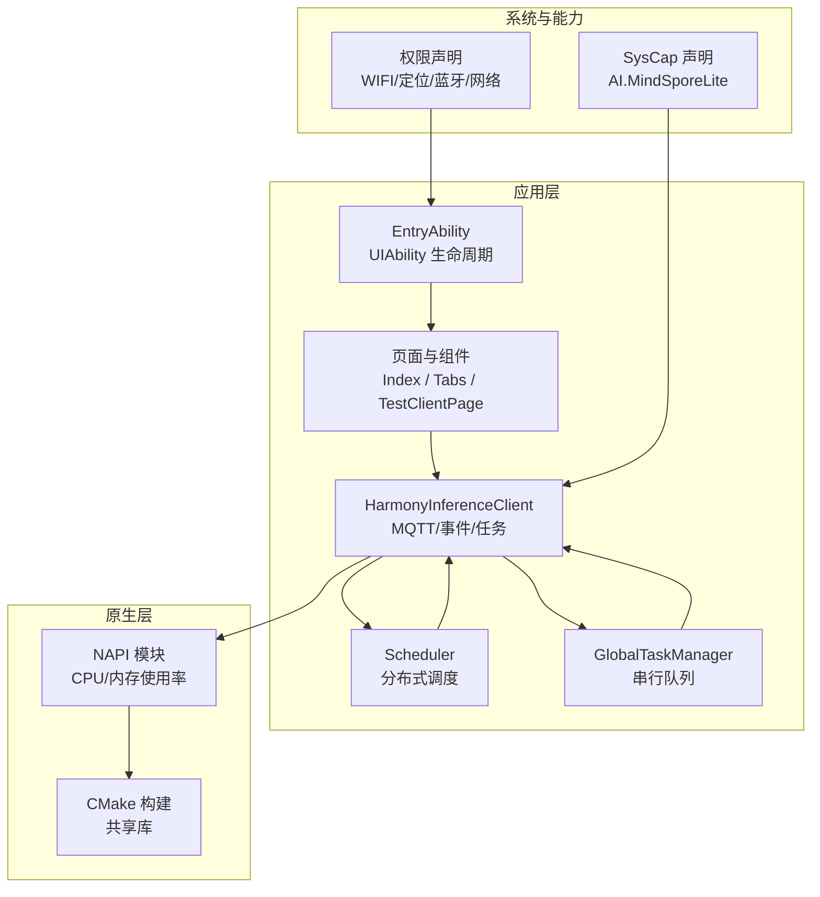
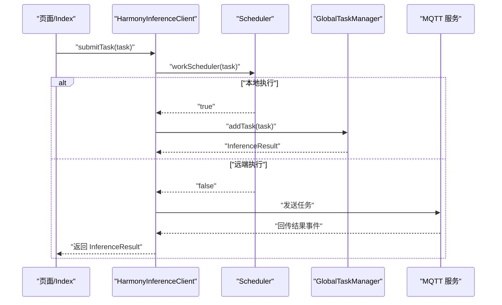
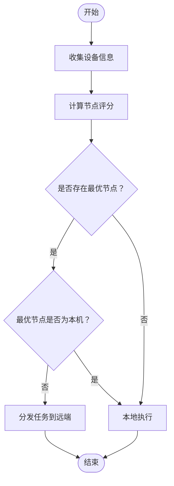
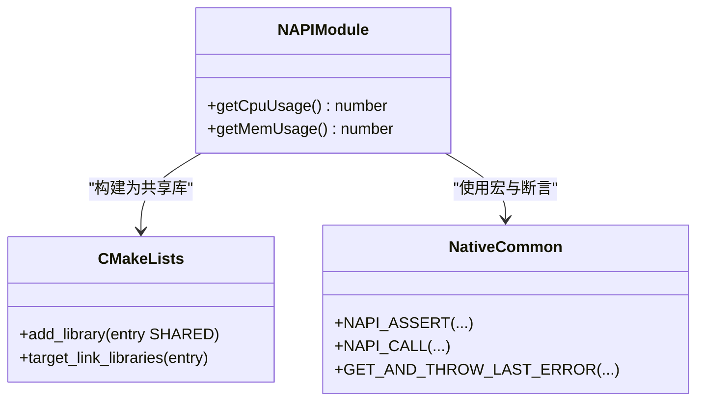
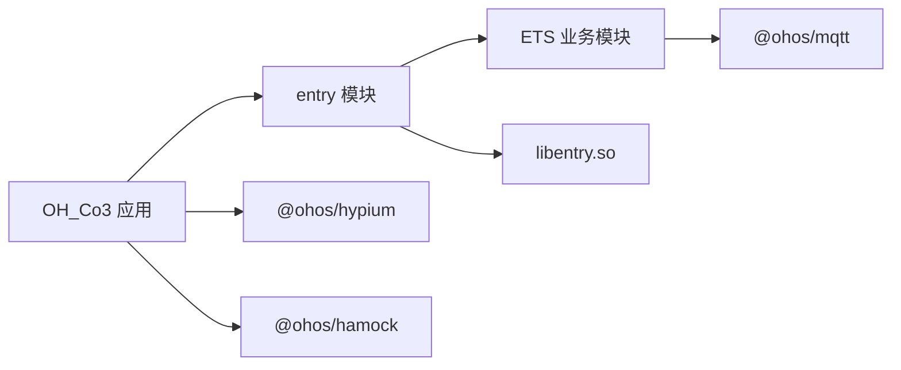

# 技术栈

<cite>
**本文引用的文件**
- [build-profile.json5](file://build-profile.json5)
- [oh-package.json5](file://oh-package.json5)
- [entry/build-profile.json5](file://entry/build-profile.json5)
- [entry/oh-package.json5](file://entry/oh-package.json5)
- [hvigorfile.ts](file://hvigorfile.ts)
- [entry/hvigorfile.ts](file://entry/hvigorfile.ts)
- [entry/src/main/module.json5](file://entry/src/main/module.json5)
- [entry/src/main/syscap.json](file://entry/src/main/syscap.json)
- [entry/src/main/cpp/CMakeLists.txt](file://entry/src/main/cpp/CMakeLists.txt)
- [entry/src/main/cpp/napi_init.cpp](file://entry/src/main/cpp/napi_init.cpp)
- [entry/src/main/cpp/common/native_common.h](file://entry/src/main/cpp/common/native_common.h)
- [entry/src/main/cpp/types/libentry/index.d.ts](file://entry/src/main/cpp/types/libentry/index.d.ts)
- [entry/src/main/ets/entryability/EntryAbility.ets](file://entry/src/main/ets/entryability/EntryAbility.ets)
- [entry/src/main/ets/pages/Index.ets](file://entry/src/main/ets/pages/Index.ets)
- [entry/src/main/ets/manager/HarmonyInferenceClient.ets](file://entry/src/main/ets/manager/HarmonyInferenceClient.ets)
- [entry/src/main/ets/manager/scheduler/Scheduler.ets](file://entry/src/main/ets/manager/scheduler/Scheduler.ets)
- [entry/src/main/ets/manager/worker/GlobalTaskManager.ets](file://entry/src/main/ets/manager/worker/GlobalTaskManager.ets)
</cite>

## 目录
1. [引言](#引言)
2. [项目结构](#项目结构)
3. [核心组件](#核心组件)
4. [架构总览](#架构总览)
5. [组件详解](#组件详解)
6. [依赖关系分析](#依赖关系分析)
7. [性能考量](#性能考量)
8. [故障排查指南](#故障排查指南)
9. [结论](#结论)
10. [附录](#附录)

## 引言
本技术栈文档面向 OH_Co3 项目，系统梳理其基于 OpenHarmony 的整体技术选型与实现方式，重点覆盖以下方面：
- 平台与语言：OpenHarmony 运行时、ArkTS/ETS 前端开发范式、分布式与多设备协同能力
- 混合开发：ArkTS/ETS 与 C++/NAPI 的混合架构，以及如何通过 NAPI 暴露系统能力供前端调用
- 架构设计：从应用入口 Ability 到页面与业务模块，再到分布式任务调度与推理执行的整体流程
- 版本与兼容：SDK/运行时版本、ABI/编译选项、权限与系统能力声明
- 最佳实践：模块化组织、事件驱动、任务分发策略、错误处理与可观测性

本项目以“分布式 AI 推理”为核心目标，结合 MQTT 通信、设备状态采集、任务调度与本地/远程推理执行，形成一套可扩展的跨设备推理框架。

## 项目结构
项目采用典型的 OpenHarmony Stage Mode 结构，根目录包含应用级配置与模块级配置，模块 entry 下包含 ETS 页面与逻辑、C++ 混合代码、构建脚本与资源文件。关键目录与文件职责如下：
- 根配置
  - build-profile.json5：应用签名、产品配置、SDK/兼容版本、构建模式
  - oh-package.json5：项目元信息与依赖声明（含 @ohos/mqtt）
  - hvigorfile.ts：根级构建任务插件配置
- 模块 entry
  - build-profile.json5：模块级构建选项（ArkTS 编译、外部原生构建、混淆规则）
  - module.json5：模块能力、页面、权限、技能意图等声明
  - syscap.json：设备类型与系统能力声明（含 AI 推理相关能力）
  - src/main/ets：ArkTS/ETS 页面与业务模块
  - src/main/cpp：C++/NAPI 实现与 CMake 构建脚本
  - hvigorfile.ts：模块级构建任务插件配置

图表来源
- [build-profile.json5](file://build-profile.json5#L1-L51)
- [hvigorfile.ts](file://hvigorfile.ts#L1-L7)
- [entry/build-profile.json5](file://entry/build-profile.json5#L1-L39)
- [entry/hvigorfile.ts](file://entry/hvigorfile.ts#L1-L7)
- [entry/src/main/module.json5](file://entry/src/main/module.json5#L1-L86)
- [entry/src/main/syscap.json](file://entry/src/main/syscap.json#L1-L13)

章节来源
- [build-profile.json5](file://build-profile.json5#L1-L51)
- [oh-package.json5](file://oh-package.json5#L1-L17)
- [hvigorfile.ts](file://hvigorfile.ts#L1-L7)
- [entry/build-profile.json5](file://entry/build-profile.json5#L1-L39)
- [entry/oh-package.json5](file://entry/oh-package.json5#L1-L13)
- [entry/hvigorfile.ts](file://entry/hvigorfile.ts#L1-L7)

## 核心组件
- OpenHarmony 平台与运行时
  - SDK/兼容版本：6.0.0(20)，运行时为 HarmonyOS
  - 设备类型：default、tablet
- ArkTS/ETS 前端
  - 页面与组件：@Entry、@Component、@Provide/@Consume、Tabs/TabsContent
  - 生命周期：UIAbility 生命周期回调（onCreate/onDestroy/onWindowStageCreate/onWindowStageDestroy/onForeground/onBackground）
  - 事件与通信：@ohos/events.emitter、@ohos/mqtt
- C++/NAPI 混合层
  - 通过 NAPI 暴露系统能力（CPU/内存使用率），供 ArkTS 调用
  - CMake 构建共享库，链接系统 NAPI/日志库
- 分布式与系统能力
  - 权限：WIFI、定位、蓝牙、网络、媒体位置等
  - 系统能力：AI.MindSporeLite（MindSpore Lite 推理）
- 架构核心模块
  - HarmonyInferenceClient：统一客户端，负责 MQTT 初始化、事件监听、任务提交与结果聚合
  - Scheduler：分布式任务调度器，基于设备状态与参数动态评分，决定本地或远端执行
  - GlobalTaskManager：全局串行任务队列，承载本地推理执行

章节来源
- [entry/src/main/module.json5](file://entry/src/main/module.json5#L1-L86)
- [entry/src/main/syscap.json](file://entry/src/main/syscap.json#L1-L13)
- [entry/src/main/ets/entryability/EntryAbility.ets](file://entry/src/main/ets/entryability/EntryAbility.ets#L1-L65)
- [entry/src/main/ets/pages/Index.ets](file://entry/src/main/ets/pages/Index.ets#L1-L75)
- [entry/src/main/ets/manager/HarmonyInferenceClient.ets](file://entry/src/main/ets/manager/HarmonyInferenceClient.ets#L1-L357)
- [entry/src/main/ets/manager/scheduler/Scheduler.ets](file://entry/src/main/ets/manager/scheduler/Scheduler.ets#L1-L105)
- [entry/src/main/ets/manager/worker/GlobalTaskManager.ets](file://entry/src/main/ets/manager/worker/GlobalTaskManager.ets#L1-L27)
- [entry/src/main/cpp/CMakeLists.txt](file://entry/src/main/cpp/CMakeLists.txt#L1-L13)
- [entry/src/main/cpp/napi_init.cpp](file://entry/src/main/cpp/napi_init.cpp#L1-L31)

## 架构总览
下图展示 OH_Co3 的技术架构与组件交互：应用入口 Ability 负责页面加载；ETS 层通过 HarmonyInferenceClient 管理 MQTT 通信与任务；Scheduler 决策任务执行位置；GlobalTaskManager 负责本地队列；C++/NAPI 模块提供系统能力查询；SysCap 声明 AI 能力。

图表来源
- [entry/src/main/ets/entryability/EntryAbility.ets](file://entry/src/main/ets/entryability/EntryAbility.ets#L1-L65)
- [entry/src/main/ets/pages/Index.ets](file://entry/src/main/ets/pages/Index.ets#L1-L75)
- [entry/src/main/ets/manager/HarmonyInferenceClient.ets](file://entry/src/main/ets/manager/HarmonyInferenceClient.ets#L1-L357)
- [entry/src/main/ets/manager/scheduler/Scheduler.ets](file://entry/src/main/ets/manager/scheduler/Scheduler.ets#L1-L105)
- [entry/src/main/ets/manager/worker/GlobalTaskManager.ets](file://entry/src/main/ets/manager/worker/GlobalTaskManager.ets#L1-L27)
- [entry/src/main/syscap.json](file://entry/src/main/syscap.json#L1-L13)
- [entry/src/main/module.json5](file://entry/src/main/module.json5#L1-L86)
- [entry/src/main/cpp/CMakeLists.txt](file://entry/src/main/cpp/CMakeLists.txt#L1-L13)
- [entry/src/main/cpp/napi_init.cpp](file://entry/src/main/cpp/napi_init.cpp#L1-L31)

## 组件详解

### ArkTS/ETS：页面与生命周期
- 页面与导航
  - @Entry 与 @Component 组合定义页面结构
  - Tabs/TabsContent 与 @Builder 构建底部标签页
  - @Provide/@Consume 实现父子组件状态同步
- 生命周期
  - UIAbility 生命周期回调：onCreate/onDestroy/onWindowStageCreate/onWindowStageDestroy/onForeground/onBackground
  - 页面级 onPageShow/onPageHide 用于资源管理与全屏控制
- 资源与国际化
  - resources/base 与多语言目录提供字符串与媒体资源

章节来源
- [entry/src/main/ets/pages/Index.ets](file://entry/src/main/ets/pages/Index.ets#L1-L75)
- [entry/src/main/ets/entryability/EntryAbility.ets](file://entry/src/main/ets/entryability/EntryAbility.ets#L1-L65)

### ArkTS/ETS：应用入口 Ability
- 职责
  - 加载主页面（Index），处理窗口生命周期
  - 记录日志，便于调试与可观测性
- 与页面协作
  - 通过 windowStage.loadContent 加载页面
  - 与 @Provide 状态配合，实现页面间共享

章节来源
- [entry/src/main/ets/entryability/EntryAbility.ets](file://entry/src/main/ets/entryability/EntryAbility.ets#L1-L65)

### ArkTS/ETS：分布式推理客户端（HarmonyInferenceClient）
- 职责
  - 初始化 MQTT 客户端与事件监听
  - 管理模型初始化与 Worker 生命周期
  - 维护任务状态与结果缓存
  - 提供连接状态查询与设备状态视图
- 关键流程
  - 初始化：设置 clientId，建立 MQTT 连接，注册事件监听，初始化模型与全局队列
  - 销毁：关闭 MQTT、释放 Worker、移除事件监听
  - 任务提交：通过调度器判断本地/远端执行，本地则入队，远端则等待结果回传

图表来源
- [entry/src/main/ets/manager/HarmonyInferenceClient.ets](file://entry/src/main/ets/manager/HarmonyInferenceClient.ets#L1-L357)
- [entry/src/main/ets/manager/scheduler/Scheduler.ets](file://entry/src/main/ets/manager/scheduler/Scheduler.ets#L1-L105)
- [entry/src/main/ets/manager/worker/GlobalTaskManager.ets](file://entry/src/main/ets/manager/worker/GlobalTaskManager.ets#L1-L27)

章节来源
- [entry/src/main/ets/manager/HarmonyInferenceClient.ets](file://entry/src/main/ets/manager/HarmonyInferenceClient.ets#L1-L357)

### ArkTS/ETS：任务调度器（Scheduler）
- 职责
  - 收集设备列表与状态，计算节点评分
  - 依据评分选择最优节点，决定本地或远端执行
  - 封装任务并发送至目标节点
- 评分维度
  - CPU/内存使用率、电池电量、存储空闲、网络延迟等参数（来自参数同步模块）

图表来源
- [entry/src/main/ets/manager/scheduler/Scheduler.ets](file://entry/src/main/ets/manager/scheduler/Scheduler.ets#L1-L105)

章节来源
- [entry/src/main/ets/manager/scheduler/Scheduler.ets](file://entry/src/main/ets/manager/scheduler/Scheduler.ets#L1-L105)

### ArkTS/ETS：全局任务队列（GlobalTaskManager）
- 职责
  - 单例化串行队列，承载本地推理任务
  - 初始化时注入推理 Worker，提供统一的任务入队与执行接口

章节来源
- [entry/src/main/ets/manager/worker/GlobalTaskManager.ets](file://entry/src/main/ets/manager/worker/GlobalTaskManager.ets#L1-L27)

### C++/NAPI：系统能力桥接
- 职责
  - 通过 NAPI 暴露 CPU/内存使用率查询接口
  - 注册模块并导出属性/方法，供 ArkTS 调用
- 构建与链接
  - CMake 构建共享库，链接系统 NAPI/日志库
  - 头文件提供 NAPI 宏与断言工具，统一错误处理

图表来源
- [entry/src/main/cpp/napi_init.cpp](file://entry/src/main/cpp/napi_init.cpp#L1-L31)
- [entry/src/main/cpp/CMakeLists.txt](file://entry/src/main/cpp/CMakeLists.txt#L1-L13)
- [entry/src/main/cpp/common/native_common.h](file://entry/src/main/cpp/common/native_common.h#L1-L99)
- [entry/src/main/cpp/types/libentry/index.d.ts](file://entry/src/main/cpp/types/libentry/index.d.ts#L1-L6)

章节来源
- [entry/src/main/cpp/napi_init.cpp](file://entry/src/main/cpp/napi_init.cpp#L1-L31)
- [entry/src/main/cpp/CMakeLists.txt](file://entry/src/main/cpp/CMakeLists.txt#L1-L13)
- [entry/src/main/cpp/common/native_common.h](file://entry/src/main/cpp/common/native_common.h#L1-L99)
- [entry/src/main/cpp/types/libentry/index.d.ts](file://entry/src/main/cpp/types/libentry/index.d.ts#L1-L6)

### 权限与系统能力
- 权限
  - WIFI、定位、蓝牙、网络、媒体位置等，按需声明并在使用场景中标注
- 系统能力
  - 开发阶段新增 SystemCapability.AI.MindSporeLite，支持推理模型加载与执行

章节来源
- [entry/src/main/module.json5](file://entry/src/main/module.json5#L36-L84)
- [entry/src/main/syscap.json](file://entry/src/main/syscap.json#L8-L12)

## 依赖关系分析
- 项目依赖
  - @ohos/mqtt：用于设备间通信与任务/参数/状态同步
  - Hypium/hamock：测试框架与模拟环境
- 模块依赖
  - entry 模块依赖 libentry.so（C++ 类型定义与共享库）
- 构建依赖
  - ArkTS 编译与混淆规则
  - 外部原生构建（CMake）、ABI 过滤（arm64-v8a）

图表来源
- [oh-package.json5](file://oh-package.json5#L9-L17)
- [entry/oh-package.json5](file://entry/oh-package.json5#L8-L11)
- [entry/build-profile.json5](file://entry/build-profile.json5#L7-L14)

章节来源
- [oh-package.json5](file://oh-package.json5#L1-L17)
- [entry/oh-package.json5](file://entry/oh-package.json5#L1-L13)
- [entry/build-profile.json5](file://entry/build-profile.json5#L1-L39)

## 性能考量
- 构建优化
  - 发布模式启用混淆规则，减小包体并提升运行时性能
  - 外部原生构建仅针对 arm64-v8a，减少 ABI 处理开销
- 任务调度
  - 基于设备状态的评分机制，优先选择性能更优的节点执行
  - 本地队列串行化避免并发冲突，远端执行通过事件回传结果
- 原生桥接
  - NAPI 接口简洁，避免频繁上下文切换
  - 错误处理宏统一异常抛出，降低异常路径成本

章节来源
- [entry/build-profile.json5](file://entry/build-profile.json5#L18-L30)
- [entry/build-profile.json5](file://entry/build-profile.json5#L11-L14)
- [entry/src/main/ets/manager/scheduler/Scheduler.ets](file://entry/src/main/ets/manager/scheduler/Scheduler.ets#L66-L70)
- [entry/src/main/cpp/common/native_common.h](file://entry/src/main/cpp/common/native_common.h#L21-L56)

## 故障排查指南
- 构建与签名
  - 确认签名配置与证书路径正确，避免打包失败
  - 检查 SDK/兼容版本与运行时匹配
- 权限与能力
  - 若出现网络/定位/蓝牙访问受限，检查 module.json5 中权限声明与使用场景
  - AI 能力需在 syscap.json 中声明
- 通信与事件
  - MQTT 连接状态可通过客户端提供的状态查询接口确认
  - 事件监听需确保 eventId 与主题一致，避免消息丢失
- 原生桥接
  - NAPI 方法名与导出模块名需一致，避免调用失败
  - 使用断言与错误宏捕获底层异常，便于定位问题

章节来源
- [build-profile.json5](file://build-profile.json5#L1-L51)
- [entry/src/main/module.json5](file://entry/src/main/module.json5#L36-L84)
- [entry/src/main/syscap.json](file://entry/src/main/syscap.json#L8-L12)
- [entry/src/main/ets/manager/HarmonyInferenceClient.ets](file://entry/src/main/ets/manager/HarmonyInferenceClient.ets#L228-L236)
- [entry/src/main/cpp/napi_init.cpp](file://entry/src/main/cpp/napi_init.cpp#L6-L15)
- [entry/src/main/cpp/common/native_common.h](file://entry/src/main/cpp/common/native_common.h#L21-L56)

## 结论
OH_Co3 采用 OpenHarmony 平台与 ArkTS/ETS 前端开发范式，结合 C++/NAPI 混合能力与分布式任务调度，构建了面向多设备的推理框架。通过清晰的模块划分与事件驱动架构，项目实现了从页面到通信、从调度到执行的完整闭环。建议在后续迭代中完善设备状态同步与参数优化的自动化策略，增强可观测性与容错能力。

## 附录
- 版本与兼容
  - SDK/兼容版本：6.0.0(20)
  - 运行时：HarmonyOS
  - ABI：arm64-v8a
- 关键配置要点
  - ArkTS 编译与混淆规则
  - 外部原生构建路径与参数
  - 页面与权限声明
  - 系统能力声明（AI 推理）

章节来源
- [build-profile.json5](file://build-profile.json5#L22-L26)
- [entry/build-profile.json5](file://entry/build-profile.json5#L11-L14)
- [entry/src/main/module.json5](file://entry/src/main/module.json5#L13-L13)
- [entry/src/main/syscap.json](file://entry/src/main/syscap.json#L8-L12)