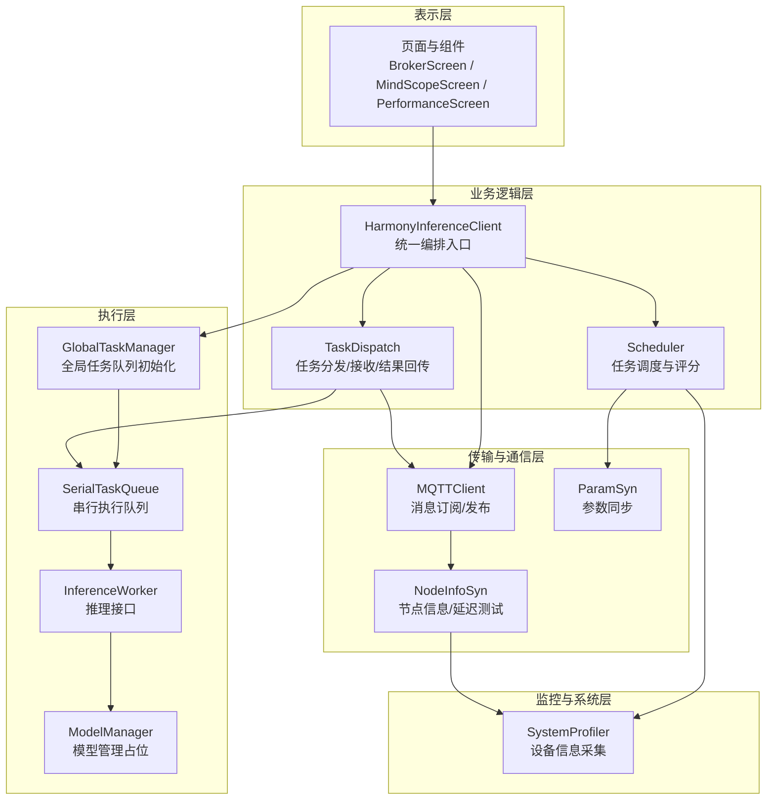
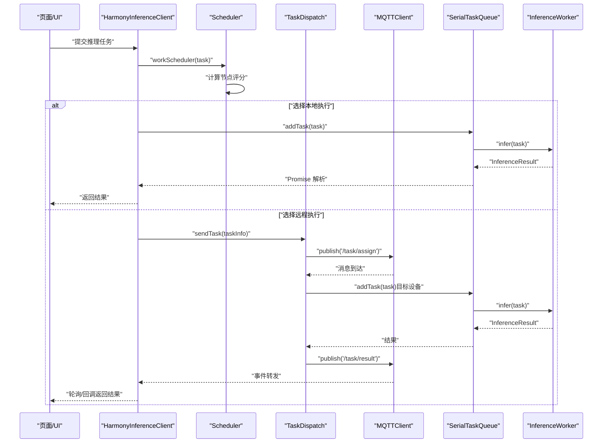
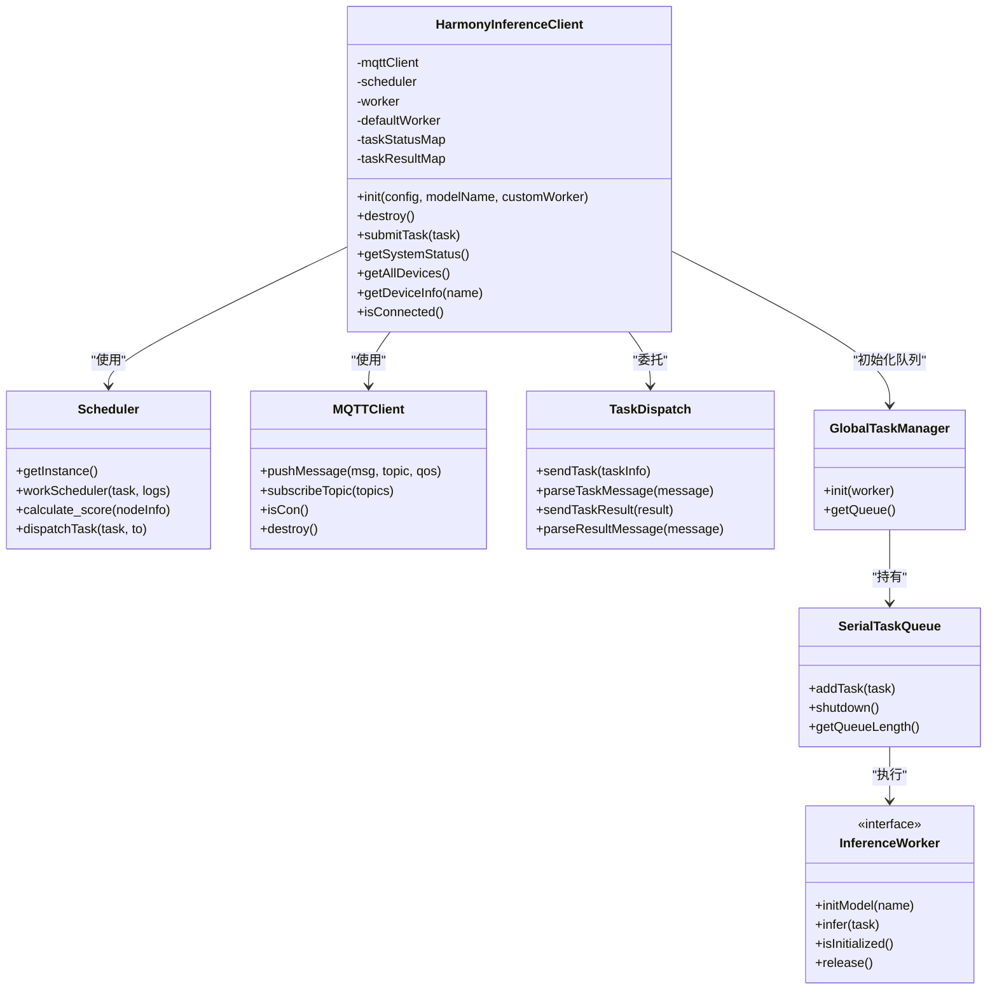
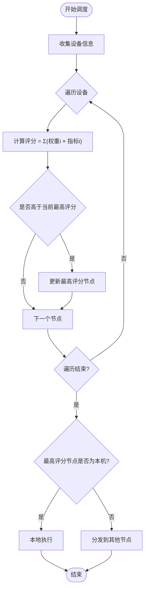
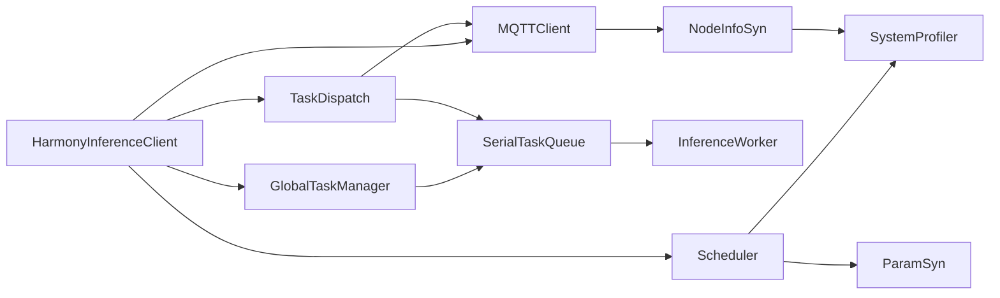

# 架构概览

<cite>
**本文引用的文件**
- [HarmonyInferenceClient.ets](file://entry/src/main/ets/manager/HarmonyInferenceClient.ets)
- [Scheduler.ets](file://entry/src/main/ets/manager/scheduler/Scheduler.ets)
- [MQTTClient.ets](file://entry/src/main/ets/manager/broker/MQTTClient.ets)
- [TaskDispatch.ets](file://entry/src/main/ets/manager/broker/task/TaskDispatch.ets)
- [NodeInfoSyn.ets](file://entry/src/main/ets/manager/broker/monitor/NodeInfoSyn.ets)
- [ParamSyn.ets](file://entry/src/main/ets/manager/broker/paramOpt/ParamSyn.ets)
- [SystemProfiler.ets](file://entry/src/main/ets/manager/monitor/SystemProfiler.ets)
- [GlobalTaskManager.ets](file://entry/src/main/ets/manager/worker/GlobalTaskManager.ets)
- [SerialTaskQueue.ets](file://entry/src/main/ets/manager/worker/SerialTaskQueue.ets)
- [InferenceWorker.ets](file://entry/src/main/ets/manager/worker/InferenceWorker.ets)
- [FileTransferManager.ets](file://entry/src/main/ets/manager/transfer/FileTransferManager.ets)
- [TransferProtocolInterface.ets](file://entry/src/main/ets/manager/transfer/protocol/TransferProtocolInterface.ets)
- [ProtocolRegistry.ets](file://entry/src/main/ets/manager/transfer/protocol/ProtocolRegistry.ets)
- [TransferEvents.ets](file://entry/src/main/ets/manager/transfer/event/TransferEvents.ets)
- [ModelManager.ets.b](file://entry/src/main/ets/manager/worker/ModelManager.ets.b)
</cite>

## 目录
1. [简介](#简介)
2. [项目结构](#项目结构)
3. [核心组件](#核心组件)
4. [架构总览](#架构总览)
5. [详细组件分析](#详细组件分析)
6. [依赖分析](#依赖分析)
7. [性能考虑](#性能考虑)
8. [故障排查指南](#故障排查指南)
9. [结论](#结论)
10. [附录](#附录)

## 简介
OH_Co3 是一个面向分布式设备的推理编排与任务分发系统，围绕 HarmonyInferenceClient 为核心控制器，结合 MQTT 通信、设备状态采集、任务调度与本地执行队列，形成“表示层（UI 展示）—业务逻辑层（编排与调度）—数据访问/传输层（MQTT/TCP/本地模型）”的分层架构。系统支持跨设备的任务分发与结果回传，具备任务结果缓存、参数优化、网络延迟测试与设备评分等能力，适用于多设备协同的分布式推理场景。

## 项目结构
项目采用按“功能域+层次”的组织方式：
- 表示层：页面与组件（Tabs 页面、测试页等）
- 业务逻辑层：编排与调度（HarmonyInferenceClient、Scheduler、TaskDispatch）
- 传输与通信层：MQTT 客户端、任务/文件传输协议与事件
- 监控与系统层：设备信息采集、节点同步、参数同步
- 执行层：推理 Worker、全局任务队列、模型管理占位

图表来源
- [HarmonyInferenceClient.ets](file://entry/src/main/ets/manager/HarmonyInferenceClient.ets#L52-L357)
- [Scheduler.ets](file://entry/src/main/ets/manager/scheduler/Scheduler.ets#L14-L105)
- [TaskDispatch.ets](file://entry/src/main/ets/manager/broker/task/TaskDispatch.ets#L98-L302)
- [MQTTClient.ets](file://entry/src/main/ets/manager/broker/MQTTClient.ets#L24-L223)
- [NodeInfoSyn.ets](file://entry/src/main/ets/manager/broker/monitor/NodeInfoSyn.ets#L40-L173)
- [ParamSyn.ets](file://entry/src/main/ets/manager/broker/paramOpt/ParamSyn.ets#L13-L40)
- [SystemProfiler.ets](file://entry/src/main/ets/manager/monitor/SystemProfiler.ets#L43-L120)
- [GlobalTaskManager.ets](file://entry/src/main/ets/manager/worker/GlobalTaskManager.ets#L4-L27)
- [SerialTaskQueue.ets](file://entry/src/main/ets/manager/worker/SerialTaskQueue.ets#L13-L104)
- [InferenceWorker.ets](file://entry/src/main/ets/manager/worker/InferenceWorker.ets#L75-L90)
- [ModelManager.ets.b](file://entry/src/main/ets/manager/worker/ModelManager.ets.b#L28-L169)

章节来源
- [HarmonyInferenceClient.ets](file://entry/src/main/ets/manager/HarmonyInferenceClient.ets#L52-L357)
- [Scheduler.ets](file://entry/src/main/ets/manager/scheduler/Scheduler.ets#L14-L105)
- [TaskDispatch.ets](file://entry/src/main/ets/manager/broker/task/TaskDispatch.ets#L98-L302)
- [MQTTClient.ets](file://entry/src/main/ets/manager/broker/MQTTClient.ets#L24-L223)
- [NodeInfoSyn.ets](file://entry/src/main/ets/manager/broker/monitor/NodeInfoSyn.ets#L40-L173)
- [ParamSyn.ets](file://entry/src/main/ets/manager/broker/paramOpt/ParamSyn.ets#L13-L40)
- [SystemProfiler.ets](file://entry/src/main/ets/manager/monitor/SystemProfiler.ets#L43-L120)
- [GlobalTaskManager.ets](file://entry/src/main/ets/manager/worker/GlobalTaskManager.ets#L4-L27)
- [SerialTaskQueue.ets](file://entry/src/main/ets/manager/worker/SerialTaskQueue.ets#L13-L104)
- [InferenceWorker.ets](file://entry/src/main/ets/manager/worker/InferenceWorker.ets#L75-L90)
- [ModelManager.ets.b](file://entry/src/main/ets/manager/worker/ModelManager.ets.b#L28-L169)

## 核心组件
- HarmonyInferenceClient：统一编排入口，负责初始化 MQTT、事件监听、系统状态聚合、任务提交与结果等待、设备状态同步。
- Scheduler：基于设备性能与参数进行评分，决定任务本地执行或分发到其他节点。
- MQTTClient：MQTT 客户端封装，负责连接、订阅、发布、事件转发。
- TaskDispatch：任务分发与接收、大文件 TCP 传输协调、结果回传。
- NodeInfoSyn/SystemProfiler：设备信息采集与节点同步，提供评分所需指标。
- ParamSyn：参数同步，驱动调度评分权重。
- GlobalTaskManager/SerialTaskQueue/InferenceWorker：本地任务队列与推理接口抽象。
- FileTransferManager/TransferProtocolInterface/ProtocolRegistry/TransferEvents：文件传输框架（可扩展 MQTT/TCP 等协议）。

章节来源
- [HarmonyInferenceClient.ets](file://entry/src/main/ets/manager/HarmonyInferenceClient.ets#L52-L357)
- [Scheduler.ets](file://entry/src/main/ets/manager/scheduler/Scheduler.ets#L14-L105)
- [MQTTClient.ets](file://entry/src/main/ets/manager/broker/MQTTClient.ets#L24-L223)
- [TaskDispatch.ets](file://entry/src/main/ets/manager/broker/task/TaskDispatch.ets#L98-L302)
- [NodeInfoSyn.ets](file://entry/src/main/ets/manager/broker/monitor/NodeInfoSyn.ets#L40-L173)
- [ParamSyn.ets](file://entry/src/main/ets/manager/broker/paramOpt/ParamSyn.ets#L13-L40)
- [SystemProfiler.ets](file://entry/src/main/ets/manager/monitor/SystemProfiler.ets#L43-L120)
- [GlobalTaskManager.ets](file://entry/src/main/ets/manager/worker/GlobalTaskManager.ets#L4-L27)
- [SerialTaskQueue.ets](file://entry/src/main/ets/manager/worker/SerialTaskQueue.ets#L13-L104)
- [InferenceWorker.ets](file://entry/src/main/ets/manager/worker/InferenceWorker.ets#L75-L90)
- [FileTransferManager.ets](file://entry/src/main/ets/manager/transfer/FileTransferManager.ets#L17-L375)
- [TransferProtocolInterface.ets](file://entry/src/main/ets/manager/transfer/protocol/TransferProtocolInterface.ets#L63-L120)
- [ProtocolRegistry.ets](file://entry/src/main/ets/manager/transfer/protocol/ProtocolRegistry.ets#L7-L93)
- [TransferEvents.ets](file://entry/src/main/ets/manager/transfer/event/TransferEvents.ets#L62-L206)

## 架构总览
系统采用“集中式编排 + 分布式执行”的模式：
- 表示层：页面展示系统状态、性能指标与任务结果。
- 业务逻辑层：HarmonyInferenceClient 作为门面，协调 MQTT、调度器、任务分发与本地队列。
- 传输与通信层：MQTT 用于小任务与控制消息，TCP 用于大文件分发；事件总线用于结果与控制事件。
- 监控与系统层：SystemProfiler 采集 CPU/内存/存储/电量/延迟，NodeInfoSyn 与其他设备交换状态。
- 执行层：GlobalTaskManager 初始化串行队列，SerialTaskQueue 顺序执行 InferenceWorker，ModelManager 为模型加载占位。

图表来源
- [HarmonyInferenceClient.ets](file://entry/src/main/ets/manager/HarmonyInferenceClient.ets#L309-L353)
- [Scheduler.ets](file://entry/src/main/ets/manager/scheduler/Scheduler.ets#L30-L57)
- [TaskDispatch.ets](file://entry/src/main/ets/manager/broker/task/TaskDispatch.ets#L107-L126)
- [MQTTClient.ets](file://entry/src/main/ets/manager/broker/MQTTClient.ets#L153-L182)
- [SerialTaskQueue.ets](file://entry/src/main/ets/manager/worker/SerialTaskQueue.ets#L24-L83)
- [InferenceWorker.ets](file://entry/src/main/ets/manager/worker/InferenceWorker.ets#L75-L90)

## 详细组件分析

### HarmonyInferenceClient（统一编排入口）
- 职责
  - 初始化 MQTT、事件监听、系统状态同步、模型与全局队列。
  - 对外暴露任务提交接口，内部根据调度器决策本地或远程执行。
  - 维护任务状态与结果缓存，提供查询接口。
- 关键流程
  - 初始化：设置 MQTT 选项、创建 MQTT 实例、订阅主题、初始化事件监听。
  - 任务提交：调度器评估后，本地走队列执行，远程等待结果。
  - 资源释放：销毁 MQTT、释放 Worker、移除事件监听。

图表来源
- [HarmonyInferenceClient.ets](file://entry/src/main/ets/manager/HarmonyInferenceClient.ets#L52-L357)
- [Scheduler.ets](file://entry/src/main/ets/manager/scheduler/Scheduler.ets#L14-L105)
- [MQTTClient.ets](file://entry/src/main/ets/manager/broker/MQTTClient.ets#L24-L223)
- [TaskDispatch.ets](file://entry/src/main/ets/manager/broker/task/TaskDispatch.ets#L98-L302)
- [GlobalTaskManager.ets](file://entry/src/main/ets/manager/worker/GlobalTaskManager.ets#L4-L27)
- [SerialTaskQueue.ets](file://entry/src/main/ets/manager/worker/SerialTaskQueue.ets#L13-L104)
- [InferenceWorker.ets](file://entry/src/main/ets/manager/worker/InferenceWorker.ets#L75-L90)

章节来源
- [HarmonyInferenceClient.ets](file://entry/src/main/ets/manager/HarmonyInferenceClient.ets#L52-L357)

### Scheduler（任务调度与评分）
- 职责
  - 收集全网设备信息，计算评分，选择最优节点执行任务。
  - 将任务封装为传输数据并通过 TaskDispatch 发送。
- 评分策略
  - 基于参数同步模块提供的权重数组，对 CPU、内存、电量、存储、延迟进行加权求和。

图表来源
- [Scheduler.ets](file://entry/src/main/ets/manager/scheduler/Scheduler.ets#L30-L57)
- [ParamSyn.ets](file://entry/src/main/ets/manager/broker/paramOpt/ParamSyn.ets#L25-L37)
- [SystemProfiler.ets](file://entry/src/main/ets/manager/monitor/SystemProfiler.ets#L47-L81)

章节来源
- [Scheduler.ets](file://entry/src/main/ets/manager/scheduler/Scheduler.ets#L14-L105)
- [ParamSyn.ets](file://entry/src/main/ets/manager/broker/paramOpt/ParamSyn.ets#L13-L40)
- [SystemProfiler.ets](file://entry/src/main/ets/manager/monitor/SystemProfiler.ets#L43-L120)

### MQTTClient（消息通道）
- 职责
  - 创建/连接 MQTT 客户端，订阅基础主题与业务主题。
  - 接收消息后通过事件总线转发，区分任务结果与普通控制消息。
  - 提供 publish 接口用于业务消息发送。
- 主题与事件
  - 订阅：/device/status、/task/assign、/task/result、/optimization/param、/test/latency。
  - 事件：EVENTID（普通消息）、RESULT_EVENT_ID（任务结果）。

章节来源
- [MQTTClient.ets](file://entry/src/main/ets/manager/broker/MQTTClient.ets#L24-L223)

### TaskDispatch（任务分发与结果回传）
- 职责
  - 小任务通过 MQTT 直接传输；大任务通过 TCP 协议传输（阈值 2MB）。
  - 接收任务消息后，若目标为本机则加入队列执行并回传结果。
  - 解析结果消息，筛选本设备发出的任务结果并写入缓存。
- TCP 流程
  - 发送端：启动 TCP 服务器，通过 MQTT 通知目标设备连接。
  - 接收端：根据通知建立连接，接收文件并回传结果。

章节来源
- [TaskDispatch.ets](file://entry/src/main/ets/manager/broker/task/TaskDispatch.ets#L98-L302)

### NodeInfoSyn/SystemProfiler（设备状态与评分输入）
- NodeInfoSyn
  - 发送本机状态到 /device/status。
  - 解析其他设备状态，维护其他节点列表。
  - 延迟测试：发送/接收时间戳，计算延迟。
- SystemProfiler
  - 采集 CPU、内存、存储、电量、延迟。
  - 合并本机与其他节点信息，供调度器使用。

章节来源
- [NodeInfoSyn.ets](file://entry/src/main/ets/manager/broker/monitor/NodeInfoSyn.ets#L40-L173)
- [SystemProfiler.ets](file://entry/src/main/ets/manager/monitor/SystemProfiler.ets#L43-L120)

### GlobalTaskManager/SerialTaskQueue/InferenceWorker（本地执行）
- GlobalTaskManager
  - 单例初始化串行队列，提供获取队列接口。
- SerialTaskQueue
  - 顺序执行任务，支持并发保护与队列长度统计。
- InferenceWorker
  - 推理接口抽象，定义任务输入/输出与初始化/释放。

章节来源
- [GlobalTaskManager.ets](file://entry/src/main/ets/manager/worker/GlobalTaskManager.ets#L4-L27)
- [SerialTaskQueue.ets](file://entry/src/main/ets/manager/worker/SerialTaskQueue.ets#L13-L104)
- [InferenceWorker.ets](file://entry/src/main/ets/manager/worker/InferenceWorker.ets#L75-L90)

### 文件传输框架（可选扩展）
- FileTransferManager
  - 统一入口，自动选择协议（MQTT/TCP），注册/注销协议，事件通知。
- TransferProtocolInterface/ProtocolRegistry/TransferEvents
  - 协议接口抽象、注册中心、事件管理，便于扩展新协议与监听传输状态。

章节来源
- [FileTransferManager.ets](file://entry/src/main/ets/manager/transfer/FileTransferManager.ets#L17-L375)
- [TransferProtocolInterface.ets](file://entry/src/main/ets/manager/transfer/protocol/TransferProtocolInterface.ets#L63-L120)
- [ProtocolRegistry.ets](file://entry/src/main/ets/manager/transfer/protocol/ProtocolRegistry.ets#L7-L93)
- [TransferEvents.ets](file://entry/src/main/ets/manager/transfer/event/TransferEvents.ets#L62-L206)

## 依赖分析
- 组件耦合
  - HarmonyInferenceClient 依赖 Scheduler、TaskDispatch、MQTTClient、GlobalTaskManager。
  - Scheduler 依赖 SystemProfiler、ParamSyn、TaskDispatch。
  - TaskDispatch 依赖 MQTTClient、GlobalTaskManager、网络工具与文件工具。
  - 本地执行链路：GlobalTaskManager -> SerialTaskQueue -> InferenceWorker。
- 外部依赖
  - @ohos/mqtt：MQTT 客户端与消息事件。
  - @ohos.events.emitter：事件总线。
  - @ohos.util.HashMap：设备信息容器。
  - @kit.BasicServicesKit、@kit.ArkTS、@kit.PerformanceAnalysisKit：系统信息与并发工具。

图表来源
- [HarmonyInferenceClient.ets](file://entry/src/main/ets/manager/HarmonyInferenceClient.ets#L52-L357)
- [Scheduler.ets](file://entry/src/main/ets/manager/scheduler/Scheduler.ets#L14-L105)
- [TaskDispatch.ets](file://entry/src/main/ets/manager/broker/task/TaskDispatch.ets#L98-L302)
- [MQTTClient.ets](file://entry/src/main/ets/manager/broker/MQTTClient.ets#L24-L223)
- [NodeInfoSyn.ets](file://entry/src/main/ets/manager/broker/monitor/NodeInfoSyn.ets#L40-L173)
- [SystemProfiler.ets](file://entry/src/main/ets/manager/monitor/SystemProfiler.ets#L43-L120)
- [GlobalTaskManager.ets](file://entry/src/main/ets/manager/worker/GlobalTaskManager.ets#L4-L27)
- [SerialTaskQueue.ets](file://entry/src/main/ets/manager/worker/SerialTaskQueue.ets#L13-L104)
- [InferenceWorker.ets](file://entry/src/main/ets/manager/worker/InferenceWorker.ets#L75-L90)

章节来源
- [HarmonyInferenceClient.ets](file://entry/src/main/ets/manager/HarmonyInferenceClient.ets#L52-L357)
- [Scheduler.ets](file://entry/src/main/ets/manager/scheduler/Scheduler.ets#L14-L105)
- [TaskDispatch.ets](file://entry/src/main/ets/manager/broker/task/TaskDispatch.ets#L98-L302)
- [MQTTClient.ets](file://entry/src/main/ets/manager/broker/MQTTClient.ets#L24-L223)
- [NodeInfoSyn.ets](file://entry/src/main/ets/manager/broker/monitor/NodeInfoSyn.ets#L40-L173)
- [SystemProfiler.ets](file://entry/src/main/ets/manager/monitor/SystemProfiler.ets#L43-L120)
- [GlobalTaskManager.ets](file://entry/src/main/ets/manager/worker/GlobalTaskManager.ets#L4-L27)
- [SerialTaskQueue.ets](file://entry/src/main/ets/manager/worker/SerialTaskQueue.ets#L13-L104)
- [InferenceWorker.ets](file://entry/src/main/ets/manager/worker/InferenceWorker.ets#L75-L90)

## 性能考虑
- 任务调度评分
  - 权重参数可动态下发，建议结合业务场景与网络状况进行调优。
- 本地执行队列
  - 串行队列保证稳定性，若需吞吐提升可评估并发队列与资源隔离。
- 大文件传输
  - 2MB 阈值可根据网络环境调整；TCP 传输需关注连接建立与校验开销。
- 事件与轮询
  - 结果等待采用轮询+事件回调，建议结合事件优先级与超时策略优化体验。
- 系统指标采集
  - CPU/内存/存储/电量/延迟采集频率与精度需平衡功耗与准确性。

## 故障排查指南
- MQTT 连接问题
  - 检查 URL、clientId、用户名/密码与订阅主题是否正确。
  - 关注连接超时与自动重连配置。
- 任务超时
  - 任务提交后 30 秒超时，确认远程节点是否正确接收与执行。
- 结果未返回
  - 检查 /task/result 主题是否订阅，事件转发是否触发。
- 设备状态不同步
  - 确认 /device/status 与 /test/latency 是否互通，节点列表是否更新。
- 本地执行异常
  - 查看队列长度与执行状态，确认 Worker 初始化与释放流程。

章节来源
- [MQTTClient.ets](file://entry/src/main/ets/manager/broker/MQTTClient.ets#L68-L104)
- [HarmonyInferenceClient.ets](file://entry/src/main/ets/manager/HarmonyInferenceClient.ets#L331-L347)
- [TaskDispatch.ets](file://entry/src/main/ets/manager/broker/task/TaskDispatch.ets#L272-L281)
- [NodeInfoSyn.ets](file://entry/src/main/ets/manager/broker/monitor/NodeInfoSyn.ets#L131-L170)
- [SerialTaskQueue.ets](file://entry/src/main/ets/manager/worker/SerialTaskQueue.ets#L51-L83)

## 结论
OH_Co3 通过清晰的分层架构与模块化设计，实现了从任务提交到分布式执行与结果回传的闭环。HarmonyInferenceClient 作为编排中枢，结合 MQTT 的轻量消息与 TCP 的大文件能力，满足多设备协同推理的需求。调度器基于系统状态与动态参数进行评分，兼顾性能与能耗。未来可在并发队列、协议扩展与可观测性方面持续演进。

## 附录
- 模型管理
  - ModelManager 当前为占位实现，后续可接入具体模型加载与预处理逻辑。
- 页面与示例
  - 页面组件提供系统状态与性能展示入口，便于调试与演示。

章节来源
- [ModelManager.ets.b](file://entry/src/main/ets/manager/worker/ModelManager.ets.b#L28-L169)