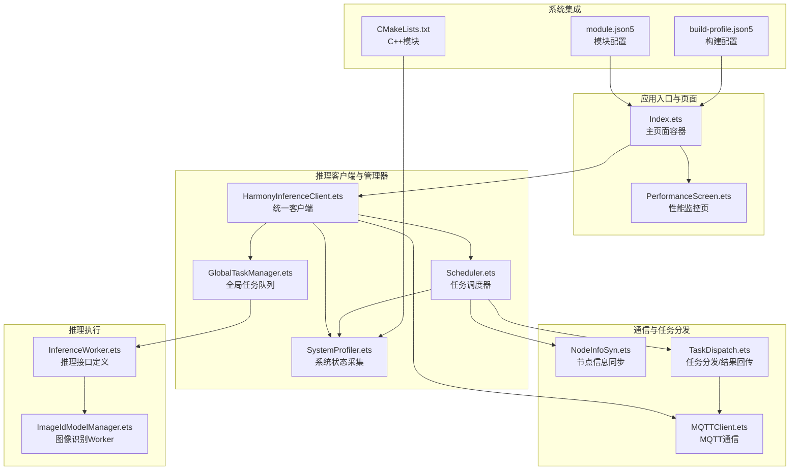
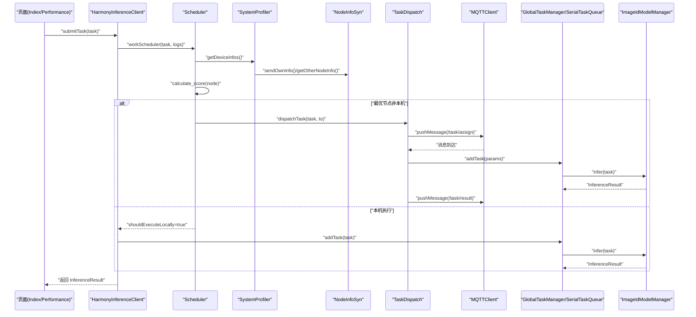
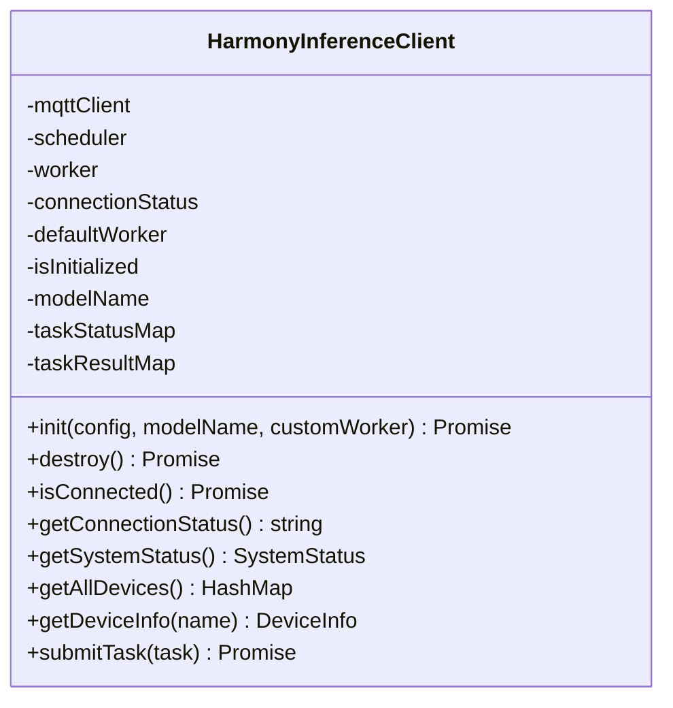
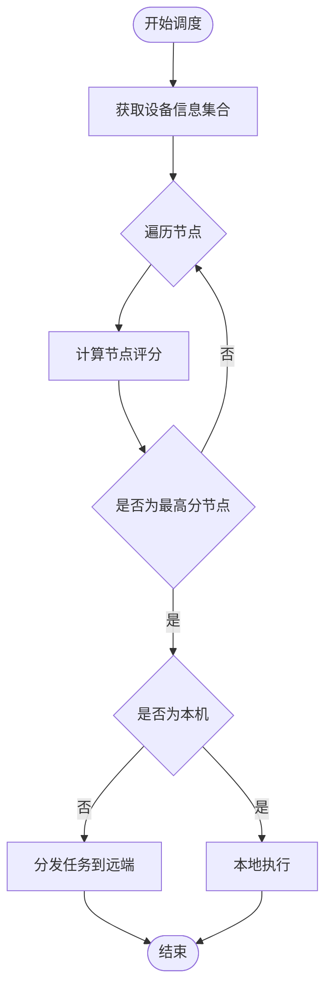
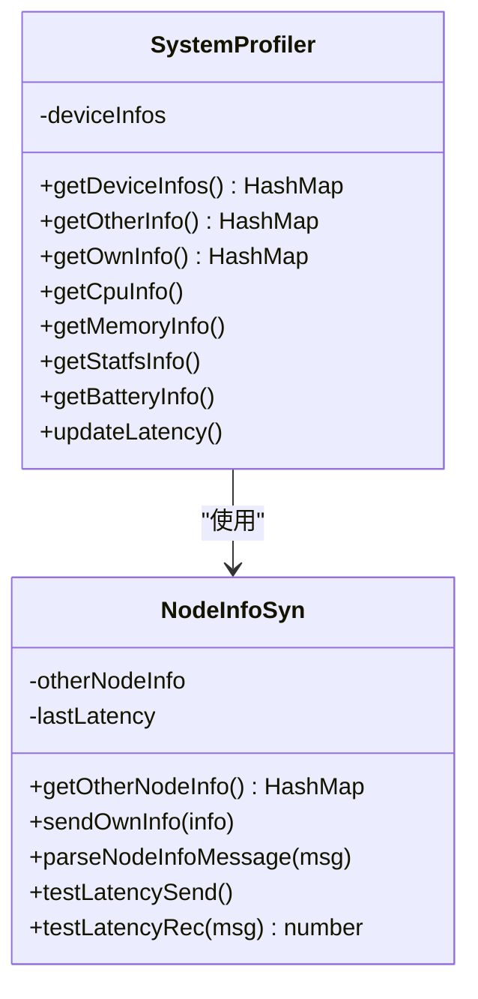
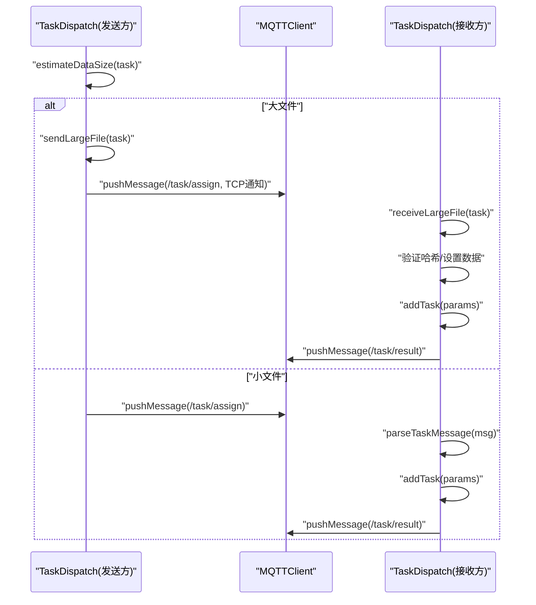
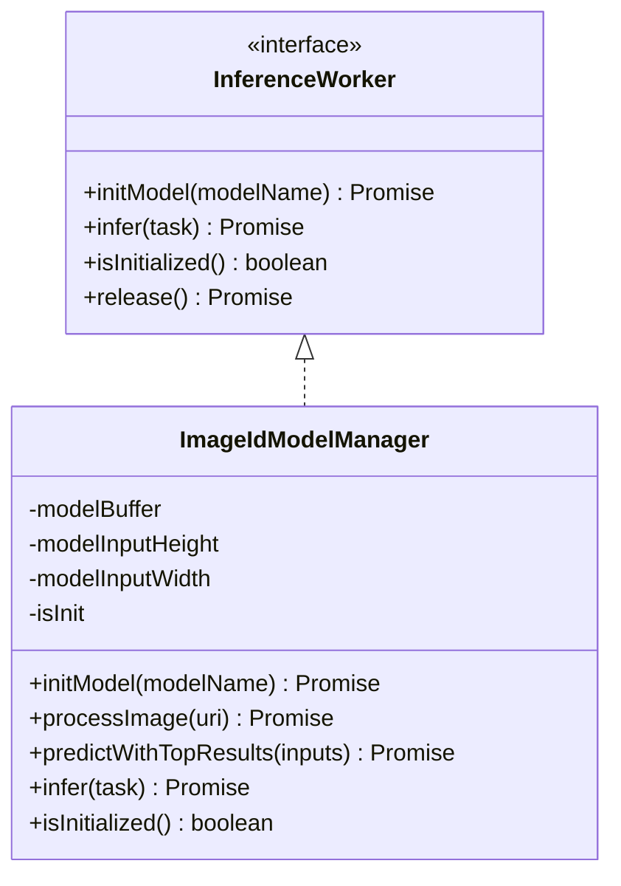
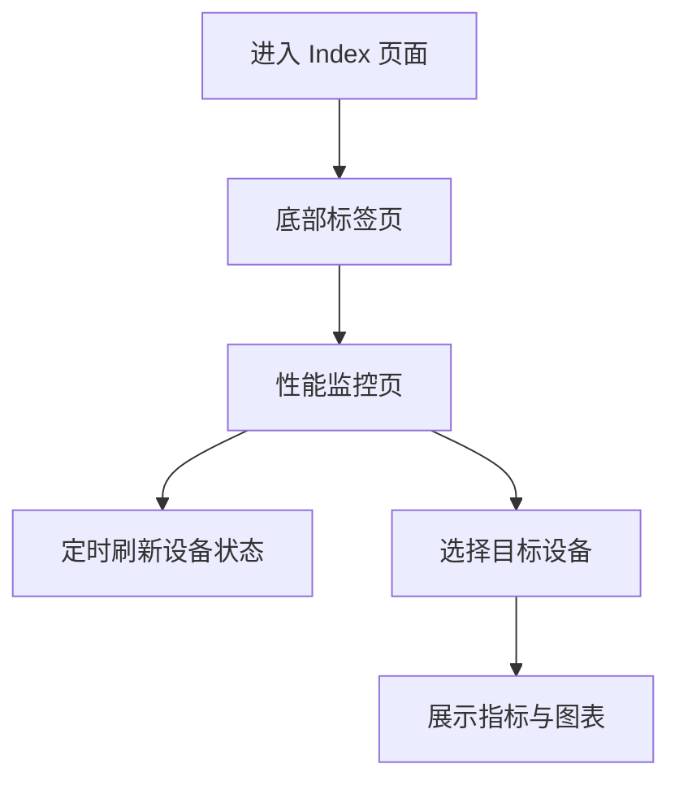
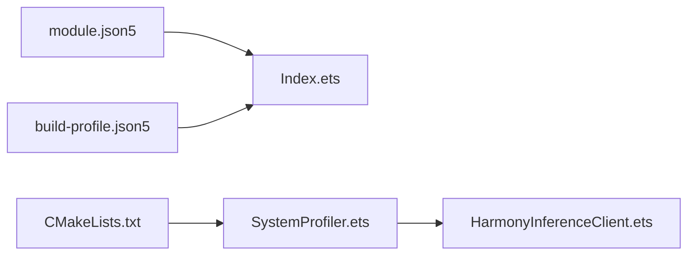

# 项目介绍

<cite>
**本文引用的文件**
- [entry/src/main/module.json5](file://entry/src/main/module.json5)
- [entry/build-profile.json5](file://entry/build-profile.json5)
- [entry/src/main/cpp/CMakeLists.txt](file://entry/src/main/cpp/CMakeLists.txt)
- [entry/src/main/ets/pages/Index.ets](file://entry/src/main/ets/pages/Index.ets)
- [entry/src/main/ets/pages/tabs/PerformanceScreen.ets](file://entry/src/main/ets/pages/tabs/PerformanceScreen.ets)
- [entry/src/main/ets/TestImageTask/ImageIdModelManager.ets](file://entry/src/main/ets/TestImageTask/ImageIdModelManager.ets)
- [entry/src/main/ets/manager/HarmonyInferenceClient.ets](file://entry/src/main/ets/manager/HarmonyInferenceClient.ets)
- [entry/src/main/ets/manager/scheduler/Scheduler.ets](file://entry/src/main/ets/manager/scheduler/Scheduler.ets)
- [entry/src/main/ets/manager/broker/MQTTClient.ets](file://entry/src/main/ets/manager/broker/MQTTClient.ets)
- [entry/src/main/ets/manager/broker/monitor/NodeInfoSyn.ets](file://entry/src/main/ets/manager/broker/monitor/NodeInfoSyn.ets)
- [entry/src/main/ets/manager/broker/task/TaskDispatch.ets](file://entry/src/main/ets/manager/broker/task/TaskDispatch.ets)
- [entry/src/main/ets/manager/monitor/SystemProfiler.ets](file://entry/src/main/ets/manager/monitor/SystemProfiler.ets)
- [entry/src/main/ets/manager/worker/InferenceWorker.ets](file://entry/src/main/ets/manager/worker/InferenceWorker.ets)
- [entry/src/main/ets/manager/worker/GlobalTaskManager.ets](file://entry/src/main/ets/manager/worker/GlobalTaskManager.ets)
- [AppScope/resources/base/element/string.json](file://AppScope/resources/base/element/string.json)
</cite>

## 目录
1. [简介](#简介)
2. [项目结构](#项目结构)
3. [核心组件](#核心组件)
4. [架构总览](#架构总览)
5. [详细组件分析](#详细组件分析)
6. [依赖关系分析](#依赖关系分析)
7. [性能考量](#性能考量)
8. [故障排查指南](#故障排查指南)
9. [结论](#结论)
10. [附录](#附录)

## 简介
OH_Co3 是一个面向 OpenHarmony 的分布式推理应用，旨在利用多设备协同实现高效、低延迟的 AI 推理任务执行。项目围绕“分布式推理”这一核心理念，通过设备间的状态感知、任务调度与传输、性能监控与优化，构建跨设备的智能推理平台。

- 核心目标与价值主张
  - 多设备协同推理：在同网设备中动态发现节点、评估性能并进行任务分发，最大化整体吞吐与响应速度。
  - 智能任务分配：基于系统状态（CPU、内存、电量、存储、网络延迟）与权重参数，计算节点评分，自动选择最优执行位置。
  - 性能监控与可视化：实时采集设备状态并通过界面展示，辅助用户了解系统负载与资源使用情况。
  - 易用与可扩展：提供统一的推理客户端入口与可插拔的 Worker 接口，便于接入不同模型与任务类型。

- 分布式推理在 OpenHarmony 上的意义
  - OpenHarmony 设备形态多样、资源差异显著，分布式推理能够将计算压力分散到具备更强算力或更低负载的设备上，提升整体体验。
  - 依托 MQTT 等轻量通信协议，可在弱网环境下稳定地进行任务分发与结果回传，满足多终端协同场景需求。

- 目标用户与典型场景
  - 目标用户：开发者、研究者、需要在多设备间进行推理任务编排与性能可视化的用户。
  - 典型场景：多平板/手机协同进行图像识别、跨设备语音转写、边缘侧与中心侧混合推理等。

- 技术创新点与竞争优势
  - 动态节点评分与参数化优化：通过系统状态与权重参数的组合，形成可调的评分函数，支持按需优化。
  - 智能任务传输：根据任务数据大小自动选择直传或 TCP 大文件传输，兼顾小任务效率与大文件可靠性。
  - 统一推理抽象：通过 InferenceWorker 接口抽象不同模型与任务类型，降低接入成本。
  - 可观测性：内置系统状态采集与可视化界面，便于诊断与优化。

## 项目结构
项目采用模块化组织，前端以 ArkTS 页面与组件为主，后端管理器负责调度、通信、任务分发与性能监控，底层通过 C++ 模块提供系统信息采集能力。

**图表来源**
- [entry/src/main/ets/pages/Index.ets](file://entry/src/main/ets/pages/Index.ets#L1-L75)
- [entry/src/main/ets/pages/tabs/PerformanceScreen.ets](file://entry/src/main/ets/pages/tabs/PerformanceScreen.ets#L1-L204)
- [entry/src/main/ets/manager/HarmonyInferenceClient.ets](file://entry/src/main/ets/manager/HarmonyInferenceClient.ets#L1-L357)
- [entry/src/main/ets/manager/scheduler/Scheduler.ets](file://entry/src/main/ets/manager/scheduler/Scheduler.ets#L1-L105)
- [entry/src/main/ets/manager/monitor/SystemProfiler.ets](file://entry/src/main/ets/manager/monitor/SystemProfiler.ets#L1-L120)
- [entry/src/main/ets/manager/broker/MQTTClient.ets](file://entry/src/main/ets/manager/broker/MQTTClient.ets#L1-L223)
- [entry/src/main/ets/manager/broker/monitor/NodeInfoSyn.ets](file://entry/src/main/ets/manager/broker/monitor/NodeInfoSyn.ets#L1-L173)
- [entry/src/main/ets/manager/broker/task/TaskDispatch.ets](file://entry/src/main/ets/manager/broker/task/TaskDispatch.ets#L1-L302)
- [entry/src/main/ets/manager/worker/GlobalTaskManager.ets](file://entry/src/main/ets/manager/worker/GlobalTaskManager.ets#L1-L27)
- [entry/src/main/ets/manager/worker/InferenceWorker.ets](file://entry/src/main/ets/manager/worker/InferenceWorker.ets#L1-L90)
- [entry/src/main/ets/TestImageTask/ImageIdModelManager.ets](file://entry/src/main/ets/TestImageTask/ImageIdModelManager.ets#L1-L258)
- [entry/src/main/module.json5](file://entry/src/main/module.json5#L1-L86)
- [entry/build-profile.json5](file://entry/build-profile.json5#L1-L39)
- [entry/src/main/cpp/CMakeLists.txt](file://entry/src/main/cpp/CMakeLists.txt#L1-L13)

**章节来源**
- [entry/src/main/ets/pages/Index.ets](file://entry/src/main/ets/pages/Index.ets#L1-L75)
- [entry/src/main/ets/pages/tabs/PerformanceScreen.ets](file://entry/src/main/ets/pages/tabs/PerformanceScreen.ets#L1-L204)
- [entry/src/main/ets/manager/HarmonyInferenceClient.ets](file://entry/src/main/ets/manager/HarmonyInferenceClient.ets#L1-L357)
- [entry/src/main/ets/manager/scheduler/Scheduler.ets](file://entry/src/main/ets/manager/scheduler/Scheduler.ets#L1-L105)
- [entry/src/main/ets/manager/monitor/SystemProfiler.ets](file://entry/src/main/ets/manager/monitor/SystemProfiler.ets#L1-L120)
- [entry/src/main/ets/manager/broker/MQTTClient.ets](file://entry/src/main/ets/manager/broker/MQTTClient.ets#L1-L223)
- [entry/src/main/ets/manager/broker/monitor/NodeInfoSyn.ets](file://entry/src/main/ets/manager/broker/monitor/NodeInfoSyn.ets#L1-L173)
- [entry/src/main/ets/manager/broker/task/TaskDispatch.ets](file://entry/src/main/ets/manager/broker/task/TaskDispatch.ets#L1-L302)
- [entry/src/main/ets/manager/worker/GlobalTaskManager.ets](file://entry/src/main/ets/manager/worker/GlobalTaskManager.ets#L1-L27)
- [entry/src/main/ets/manager/worker/InferenceWorker.ets](file://entry/src/main/ets/manager/worker/InferenceWorker.ets#L1-L90)
- [entry/src/main/ets/TestImageTask/ImageIdModelManager.ets](file://entry/src/main/ets/TestImageTask/ImageIdModelManager.ets#L1-L258)
- [entry/src/main/module.json5](file://entry/src/main/module.json5#L1-L86)
- [entry/build-profile.json5](file://entry/build-profile.json5#L1-L39)
- [entry/src/main/cpp/CMakeLists.txt](file://entry/src/main/cpp/CMakeLists.txt#L1-L13)

## 核心组件
- HarmonyInferenceClient：统一的推理客户端，负责初始化、事件监听、任务提交、状态查询与资源释放。
- Scheduler：任务调度器，聚合系统状态，计算节点评分，决定本地执行或远程分发。
- SystemProfiler：系统状态采集器，提供 CPU、内存、存储、电量、延迟等指标。
- MQTTClient：MQTT 通信客户端，负责连接、订阅、发布与事件派发。
- NodeInfoSyn：节点信息同步模块，负责设备状态广播、延迟测试与节点列表维护。
- TaskDispatch：任务分发与结果回传模块，支持直传与 TCP 大文件传输。
- GlobalTaskManager：全局任务队列管理器，持有串行任务队列并对外暴露。
- InferenceWorker：推理接口抽象，定义模型初始化、推理执行与资源释放。
- ImageIdModelManager：图像识别 Worker 示例，实现图片预处理、模型推理与结果封装。
- 页面与可视化：Index 与 PerformanceScreen 提供导航与性能监控界面。

**章节来源**
- [entry/src/main/ets/manager/HarmonyInferenceClient.ets](file://entry/src/main/ets/manager/HarmonyInferenceClient.ets#L52-L357)
- [entry/src/main/ets/manager/scheduler/Scheduler.ets](file://entry/src/main/ets/manager/scheduler/Scheduler.ets#L14-L105)
- [entry/src/main/ets/manager/monitor/SystemProfiler.ets](file://entry/src/main/ets/manager/monitor/SystemProfiler.ets#L43-L120)
- [entry/src/main/ets/manager/broker/MQTTClient.ets](file://entry/src/main/ets/manager/broker/MQTTClient.ets#L24-L223)
- [entry/src/main/ets/manager/broker/monitor/NodeInfoSyn.ets](file://entry/src/main/ets/manager/broker/monitor/NodeInfoSyn.ets#L40-L173)
- [entry/src/main/ets/manager/broker/task/TaskDispatch.ets](file://entry/src/main/ets/manager/broker/task/TaskDispatch.ets#L98-L302)
- [entry/src/main/ets/manager/worker/GlobalTaskManager.ets](file://entry/src/main/ets/manager/worker/GlobalTaskManager.ets#L4-L27)
- [entry/src/main/ets/manager/worker/InferenceWorker.ets](file://entry/src/main/ets/manager/worker/InferenceWorker.ets#L75-L90)
- [entry/src/main/ets/TestImageTask/ImageIdModelManager.ets](file://entry/src/main/ets/TestImageTask/ImageIdModelManager.ets#L31-L258)
- [entry/src/main/ets/pages/Index.ets](file://entry/src/main/ets/pages/Index.ets#L1-L75)
- [entry/src/main/ets/pages/tabs/PerformanceScreen.ets](file://entry/src/main/ets/pages/tabs/PerformanceScreen.ets#L1-L204)

## 架构总览
下图展示了从页面到推理执行的整体流程：用户通过页面触发任务，客户端协调调度与通信，系统状态参与评分，任务被分发到最优节点执行，结果回传并呈现。

**图表来源**
- [entry/src/main/ets/manager/HarmonyInferenceClient.ets](file://entry/src/main/ets/manager/HarmonyInferenceClient.ets#L309-L353)
- [entry/src/main/ets/manager/scheduler/Scheduler.ets](file://entry/src/main/ets/manager/scheduler/Scheduler.ets#L30-L57)
- [entry/src/main/ets/manager/monitor/SystemProfiler.ets](file://entry/src/main/ets/manager/monitor/SystemProfiler.ets#L47-L81)
- [entry/src/main/ets/manager/broker/monitor/NodeInfoSyn.ets](file://entry/src/main/ets/manager/broker/monitor/NodeInfoSyn.ets#L63-L80)
- [entry/src/main/ets/manager/broker/task/TaskDispatch.ets](file://entry/src/main/ets/manager/broker/task/TaskDispatch.ets#L107-L126)
- [entry/src/main/ets/manager/broker/MQTTClient.ets](file://entry/src/main/ets/manager/broker/MQTTClient.ets#L190-L203)
- [entry/src/main/ets/manager/worker/GlobalTaskManager.ets](file://entry/src/main/ets/manager/worker/GlobalTaskManager.ets#L8-L21)
- [entry/src/main/ets/TestImageTask/ImageIdModelManager.ets](file://entry/src/main/ets/TestImageTask/ImageIdModelManager.ets#L205-L237)

## 详细组件分析

### 推理客户端 HarmonyInferenceClient
- 职责：统一初始化、事件监听、任务提交、状态查询与资源释放；协调调度器、通信与任务队列。
- 关键流程：
  - 初始化：建立 MQTT 连接、注册事件监听、初始化模型与全局任务队列。
  - 任务提交：委托调度器决策执行位置，本地则加入队列执行，远程则等待结果回传。
  - 状态查询：聚合系统状态，提供设备列表与单个设备信息。
- 异常处理：捕获初始化与销毁过程中的错误，保证资源正确释放。

**图表来源**
- [entry/src/main/ets/manager/HarmonyInferenceClient.ets](file://entry/src/main/ets/manager/HarmonyInferenceClient.ets#L52-L357)

**章节来源**
- [entry/src/main/ets/manager/HarmonyInferenceClient.ets](file://entry/src/main/ets/manager/HarmonyInferenceClient.ets#L163-L225)
- [entry/src/main/ets/manager/HarmonyInferenceClient.ets](file://entry/src/main/ets/manager/HarmonyInferenceClient.ets#L285-L353)

### 任务调度器 Scheduler
- 职责：收集设备信息，计算节点评分，选择最优节点；必要时将任务通过 TaskDispatch 分发到远端。
- 评分函数：结合 CPU、内存、电量、存储、延迟等指标与权重参数，输出综合评分。
- 传输策略：根据任务数据大小选择直传或 TCP 大文件传输。

**图表来源**
- [entry/src/main/ets/manager/scheduler/Scheduler.ets](file://entry/src/main/ets/manager/scheduler/Scheduler.ets#L30-L57)
- [entry/src/main/ets/manager/broker/task/TaskDispatch.ets](file://entry/src/main/ets/manager/broker/task/TaskDispatch.ets#L107-L126)

**章节来源**
- [entry/src/main/ets/manager/scheduler/Scheduler.ets](file://entry/src/main/ets/manager/scheduler/Scheduler.ets#L30-L104)

### 系统状态采集 SystemProfiler 与节点信息同步 NodeInfoSyn
- SystemProfiler：周期性采集 CPU、内存、存储、电量与延迟，合并本机与其他节点信息，供调度器使用。
- NodeInfoSyn：负责将本机状态广播到 /device/status，解析其他节点状态并维护延迟测试。

**图表来源**
- [entry/src/main/ets/manager/monitor/SystemProfiler.ets](file://entry/src/main/ets/manager/monitor/SystemProfiler.ets#L43-L120)
- [entry/src/main/ets/manager/broker/monitor/NodeInfoSyn.ets](file://entry/src/main/ets/manager/broker/monitor/NodeInfoSyn.ets#L40-L173)

**章节来源**
- [entry/src/main/ets/manager/monitor/SystemProfiler.ets](file://entry/src/main/ets/manager/monitor/SystemProfiler.ets#L47-L116)
- [entry/src/main/ets/manager/broker/monitor/NodeInfoSyn.ets](file://entry/src/main/ets/manager/broker/monitor/NodeInfoSyn.ets#L100-L170)

### 通信与任务分发 MQTTClient 与 TaskDispatch
- MQTTClient：负责连接、订阅多个主题、消息派发与销毁。
- TaskDispatch：负责任务消息的发送、解析、大文件 TCP 传输与结果回传。

**图表来源**
- [entry/src/main/ets/manager/broker/MQTTClient.ets](file://entry/src/main/ets/manager/broker/MQTTClient.ets#L125-L145)
- [entry/src/main/ets/manager/broker/task/TaskDispatch.ets](file://entry/src/main/ets/manager/broker/task/TaskDispatch.ets#L107-L126)
- [entry/src/main/ets/manager/broker/task/TaskDispatch.ets](file://entry/src/main/ets/manager/broker/task/TaskDispatch.ets#L187-L212)
- [entry/src/main/ets/manager/broker/task/TaskDispatch.ets](file://entry/src/main/ets/manager/broker/task/TaskDispatch.ets#L218-L266)

**章节来源**
- [entry/src/main/ets/manager/broker/MQTTClient.ets](file://entry/src/main/ets/manager/broker/MQTTClient.ets#L107-L145)
- [entry/src/main/ets/manager/broker/task/TaskDispatch.ets](file://entry/src/main/ets/manager/broker/task/TaskDispatch.ets#L107-L126)
- [entry/src/main/ets/manager/broker/task/TaskDispatch.ets](file://entry/src/main/ets/manager/broker/task/TaskDispatch.ets#L187-L212)
- [entry/src/main/ets/manager/broker/task/TaskDispatch.ets](file://entry/src/main/ets/manager/broker/task/TaskDispatch.ets#L218-L266)

### 推理执行与接口 InferenceWorker 与 ImageIdModelManager
- InferenceWorker：定义 initModel、infer、isInitialized、release 等接口，统一不同模型的接入方式。
- ImageIdModelManager：实现图像识别 Worker，包含图片预处理、模型推理与 Top-K 结果提取。

**图表来源**
- [entry/src/main/ets/manager/worker/InferenceWorker.ets](file://entry/src/main/ets/manager/worker/InferenceWorker.ets#L75-L90)
- [entry/src/main/ets/TestImageTask/ImageIdModelManager.ets](file://entry/src/main/ets/TestImageTask/ImageIdModelManager.ets#L31-L258)

**章节来源**
- [entry/src/main/ets/manager/worker/InferenceWorker.ets](file://entry/src/main/ets/manager/worker/InferenceWorker.ets#L1-L90)
- [entry/src/main/ets/TestImageTask/ImageIdModelManager.ets](file://entry/src/main/ets/TestImageTask/ImageIdModelManager.ets#L45-L237)

### 页面与可视化 Index 与 PerformanceScreen
- Index：提供底部标签页容器，承载性能监控、推理与通信等功能页。
- PerformanceScreen：展示 CPU、内存、存储、电量等指标，支持设备切换查看。

**图表来源**
- [entry/src/main/ets/pages/Index.ets](file://entry/src/main/ets/pages/Index.ets#L50-L72)
- [entry/src/main/ets/pages/tabs/PerformanceScreen.ets](file://entry/src/main/ets/pages/tabs/PerformanceScreen.ets#L29-L60)

**章节来源**
- [entry/src/main/ets/pages/Index.ets](file://entry/src/main/ets/pages/Index.ets#L1-L75)
- [entry/src/main/ets/pages/tabs/PerformanceScreen.ets](file://entry/src/main/ets/pages/tabs/PerformanceScreen.ets#L1-L204)

## 依赖关系分析
- 模块与构建
  - module.json5 定义了应用模块、页面、权限与设备类型等元信息。
  - build-profile.json5 指定 Stage Mode 构建选项、外部原生 ABI 与混淆规则。
  - CMakeLists.txt 配置 C++ 模块编译与链接，导出系统信息能力供 JS/TS 使用。

**图表来源**
- [entry/src/main/module.json5](file://entry/src/main/module.json5#L1-L86)
- [entry/build-profile.json5](file://entry/build-profile.json5#L1-L39)
- [entry/src/main/cpp/CMakeLists.txt](file://entry/src/main/cpp/CMakeLists.txt#L1-L13)
- [entry/src/main/ets/manager/monitor/SystemProfiler.ets](file://entry/src/main/ets/manager/monitor/SystemProfiler.ets#L4-L8)

**章节来源**
- [entry/src/main/module.json5](file://entry/src/main/module.json5#L1-L86)
- [entry/build-profile.json5](file://entry/build-profile.json5#L1-L39)
- [entry/src/main/cpp/CMakeLists.txt](file://entry/src/main/cpp/CMakeLists.txt#L1-L13)

## 性能考量
- 任务调度评分：通过系统状态与权重参数的线性组合，平衡 CPU、内存、电量、存储与延迟，避免在高负载或低电量设备上执行重任务。
- 传输策略：小任务走 MQTT 直传，大文件走 TCP 传输并支持哈希校验，兼顾效率与可靠性。
- 本地执行与队列：通过串行任务队列保证同一时间仅执行一个任务，避免资源争用。
- 可视化监控：定期刷新设备状态，帮助用户直观了解系统负载与资源使用情况。

[本节为通用指导，无需列出具体文件来源]

## 故障排查指南
- MQTT 连接问题
  - 现象：连接状态持续为 Disconnected 或 Error。
  - 排查：确认 MQTT 配置、网络连通性与订阅主题是否正确。
  - 参考：MQTTClient 初始化与连接、订阅与销毁流程。
- 任务超时
  - 现象：submitTask 返回超时错误。
  - 排查：检查远端设备是否在线、是否正确订阅 /task/assign 与 /task/result，确认 TaskDispatch 是否正确回传结果。
- 推理失败
  - 现象：InferenceResult.success=false。
  - 排查：确认模型已初始化、输入类型与数据格式正确，检查 ImageIdModelManager 的预处理与推理流程。
- 状态不更新
  - 现象：性能页指标长时间不变。
  - 排查：确认 SystemProfiler 的定时刷新与 NodeInfoSyn 的广播/接收逻辑。

**章节来源**
- [entry/src/main/ets/manager/broker/MQTTClient.ets](file://entry/src/main/ets/manager/broker/MQTTClient.ets#L68-L104)
- [entry/src/main/ets/manager/broker/MQTTClient.ets](file://entry/src/main/ets/manager/broker/MQTTClient.ets#L107-L145)
- [entry/src/main/ets/manager/broker/task/TaskDispatch.ets](file://entry/src/main/ets/manager/broker/task/TaskDispatch.ets#L288-L298)
- [entry/src/main/ets/TestImageTask/ImageIdModelManager.ets](file://entry/src/main/ets/TestImageTask/ImageIdModelManager.ets#L205-L237)
- [entry/src/main/ets/pages/tabs/PerformanceScreen.ets](file://entry/src/main/ets/pages/tabs/PerformanceScreen.ets#L29-L34)

## 结论
OH_Co3 通过统一的推理客户端、智能调度与通信模块、可扩展的推理接口与可视化监控，构建了面向 OpenHarmony 的分布式推理框架。其核心优势在于：以系统状态驱动的任务分配、灵活的传输策略、清晰的模块边界与良好的可扩展性。该方案既适合初学者快速上手，也为有经验的开发者提供了深入定制的空间。

[本节为总结性内容，无需列出具体文件来源]

## 附录
- 应用名称：OH_Co3
- 模块与页面：见 module.json5 与 Index 页面配置
- 构建与原生集成：见 build-profile.json5 与 CMakeLists.txt

**章节来源**
- [AppScope/resources/base/element/string.json](file://AppScope/resources/base/element/string.json#L1-L9)
- [entry/src/main/module.json5](file://entry/src/main/module.json5#L1-L86)
- [entry/build-profile.json5](file://entry/build-profile.json5#L1-L39)
- [entry/src/main/cpp/CMakeLists.txt](file://entry/src/main/cpp/CMakeLists.txt#L1-L13)