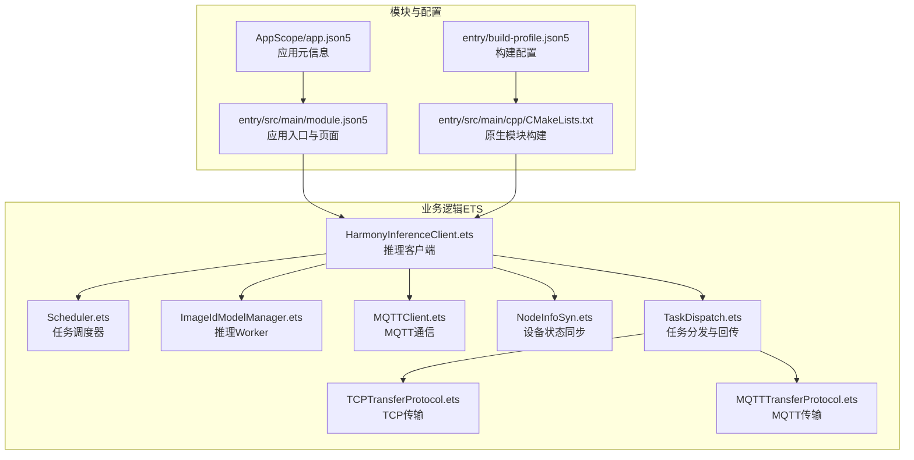
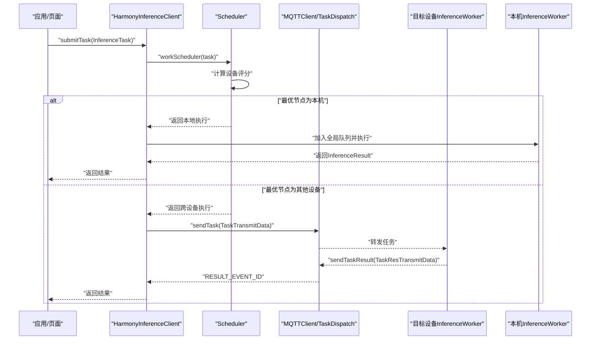
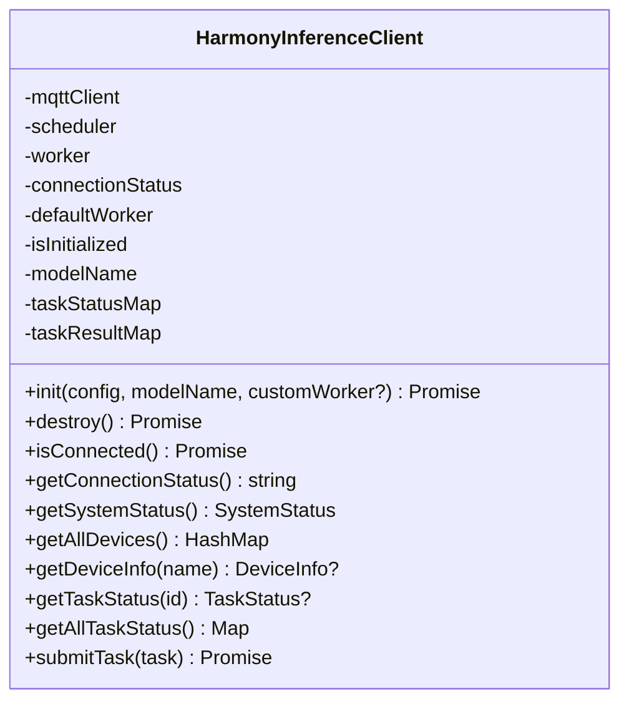
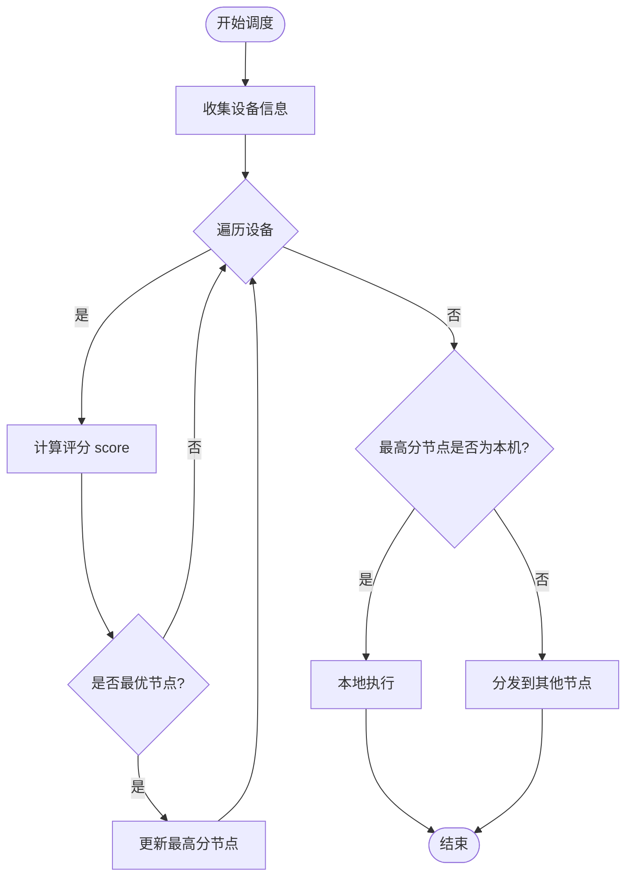
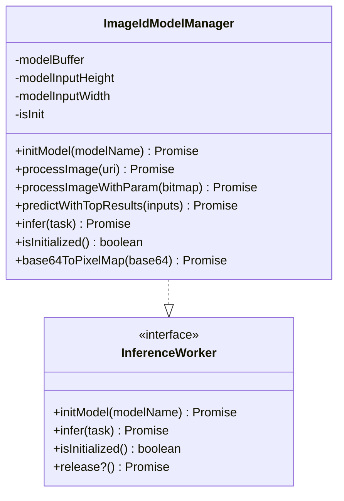
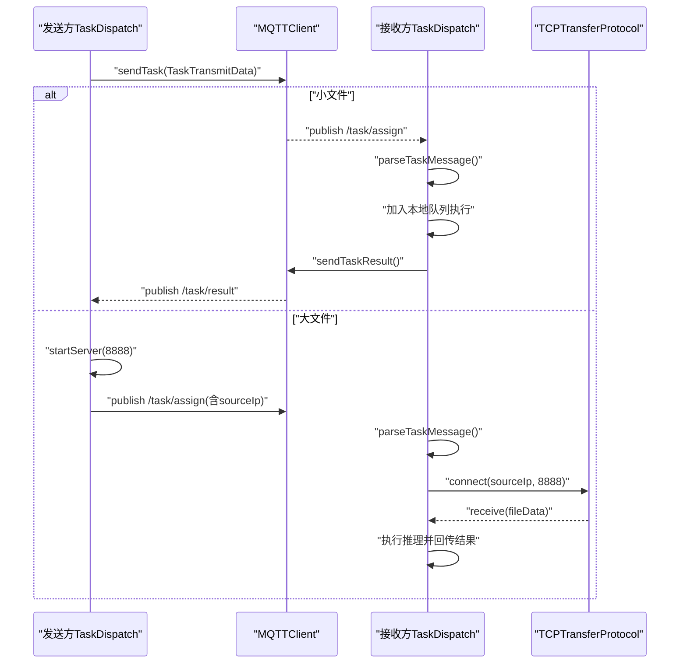
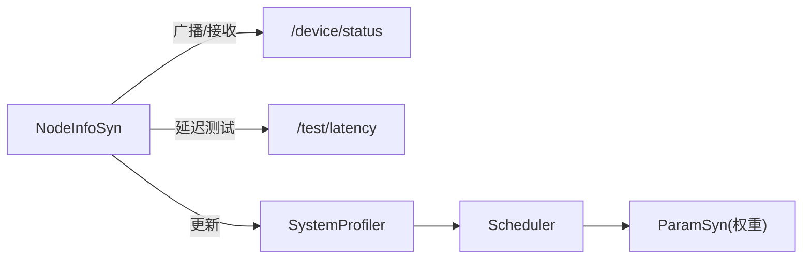
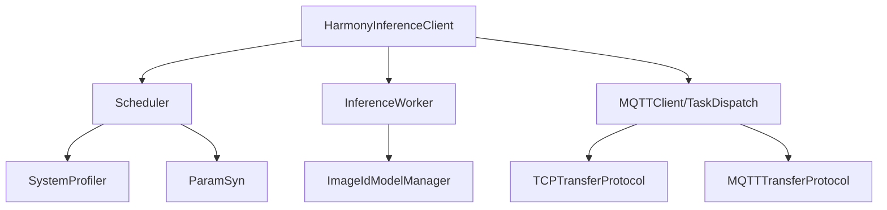

# 项目概述

<cite>
**本文引用的文件**
- [entry/src/main/module.json5](file://entry/src/main/module.json5)
- [entry/build-profile.json5](file://entry/build-profile.json5)
- [AppScope/app.json5](file://AppScope/app.json5)
- [entry/src/main/cpp/CMakeLists.txt](file://entry/src/main/cpp/CMakeLists.txt)
- [entry/src/main/cpp/napi_init.cpp](file://entry/src/main/cpp/napi_init.cpp)
- [entry/src/main/cpp/GetSystemInfo.cpp](file://entry/src/main/cpp/GetSystemInfo.cpp)
- [entry/src/main/ets/manager/HarmonyInferenceClient.ets](file://entry/src/main/ets/manager/HarmonyInferenceClient.ets)
- [entry/src/main/ets/manager/scheduler/Scheduler.ets](file://entry/src/main/ets/manager/scheduler/Scheduler.ets)
- [entry/src/main/ets/manager/worker/InferenceWorker.ets](file://entry/src/main/ets/manager/worker/InferenceWorker.ets)
- [entry/src/main/ets/TestImageTask/ImageIdModelManager.ets](file://entry/src/main/ets/TestImageTask/ImageIdModelManager.ets)
- [entry/src/main/ets/manager/broker/MQTTClient.ets](file://entry/src/main/ets/manager/broker/MQTTClient.ets)
- [entry/src/main/ets/manager/broker/monitor/NodeInfoSyn.ets](file://entry/src/main/ets/manager/broker/monitor/NodeInfoSyn.ets)
- [entry/src/main/ets/manager/broker/task/TaskDispatch.ets](file://entry/src/main/ets/manager/broker/task/TaskDispatch.ets)
- [entry/src/main/ets/manager/transfer/protocol/TCPTransferProtocol.ets](file://entry/src/main/ets/manager/transfer/protocol/TCPTransferProtocol.ets)
- [entry/src/main/ets/manager/transfer/protocol/MQTTTransferProtocol.ets](file://entry/src/main/ets/manager/transfer/protocol/MQTTTransferProtocol.ets)
</cite>

## 目录
1. [简介](#简介)
2. [项目结构](#项目结构)
3. [核心组件](#核心组件)
4. [架构总览](#架构总览)
5. [详细组件分析](#详细组件分析)
6. [依赖关系分析](#依赖关系分析)
7. [性能考量](#性能考量)
8. [故障排查指南](#故障排查指南)
9. [结论](#结论)
10. [附录](#附录)

## 简介
OH_Co3 是面向 OpenHarmony 的分布式推理应用，旨在利用多设备协同能力，在设备间动态调度推理任务，实现跨设备的高性能、低延迟智能推理。项目围绕“分布式推理”这一核心理念，结合 MQTT 通信、设备状态感知、任务调度与传输协议，构建从任务提交、设备选择、任务分发、执行到结果回传的完整闭环。

- 分布式推理概念：将单设备的 AI 推理能力扩展到多设备网络，依据设备的 CPU、内存、电量、存储与网络延迟等指标进行评分，选择最优节点执行任务，或将大文件通过 TCP 传输到目标设备执行，再将结果回传。
- 技术选型理由：OpenHarmony 提供统一的分布式能力与轻量运行时；ETS/JS 生态完善，便于快速开发；MQTT 适配局域网内设备发现与消息分发；TCP 协议保障大文件可靠传输；NAPI 层提供系统信息采集能力。
- 创新价值：在 OpenHarmony 上实现“就近执行、按需分发”的智能推理，降低单设备负载，提升整体系统推理吞吐与响应速度。

## 项目结构
项目采用“模块化 + 分层”组织方式：
- 模块层：entry 为主模块，声明应用入口、页面与权限。
- 语言层：ETS 作为前端与业务逻辑主体，C++ N-API 提供系统信息采集。
- 功能层：管理器（manager）负责推理客户端、调度器、任务分发、传输协议、监控与参数优化等。
- 测试与构建：hvigor 构建工具、build-profile.json5 配置、CMakeLists.txt 配置原生模块。

**图表来源**
- [entry/src/main/module.json5](file://entry/src/main/module.json5#L1-L86)
- [entry/build-profile.json5](file://entry/build-profile.json5#L1-L39)
- [AppScope/app.json5](file://AppScope/app.json5#L1-L11)
- [entry/src/main/cpp/CMakeLists.txt](file://entry/src/main/cpp/CMakeLists.txt#L1-L13)
- [entry/src/main/ets/manager/HarmonyInferenceClient.ets](file://entry/src/main/ets/manager/HarmonyInferenceClient.ets#L1-L357)
- [entry/src/main/ets/manager/scheduler/Scheduler.ets](file://entry/src/main/ets/manager/scheduler/Scheduler.ets#L1-L105)
- [entry/src/main/ets/TestImageTask/ImageIdModelManager.ets](file://entry/src/main/ets/TestImageTask/ImageIdModelManager.ets#L1-L258)
- [entry/src/main/ets/manager/broker/MQTTClient.ets](file://entry/src/main/ets/manager/broker/MQTTClient.ets#L1-L223)
- [entry/src/main/ets/manager/broker/monitor/NodeInfoSyn.ets](file://entry/src/main/ets/manager/broker/monitor/NodeInfoSyn.ets#L1-L173)
- [entry/src/main/ets/manager/broker/task/TaskDispatch.ets](file://entry/src/main/ets/manager/broker/task/TaskDispatch.ets#L1-L302)
- [entry/src/main/ets/manager/transfer/protocol/TCPTransferProtocol.ets](file://entry/src/main/ets/manager/transfer/protocol/TCPTransferProtocol.ets#L1-L351)
- [entry/src/main/ets/manager/transfer/protocol/MQTTTransferProtocol.ets](file://entry/src/main/ets/manager/transfer/protocol/MQTTTransferProtocol.ets#L1-L185)

**章节来源**
- [entry/src/main/module.json5](file://entry/src/main/module.json5#L1-L86)
- [entry/build-profile.json5](file://entry/build-profile.json5#L1-L39)
- [AppScope/app.json5](file://AppScope/app.json5#L1-L11)
- [entry/src/main/cpp/CMakeLists.txt](file://entry/src/main/cpp/CMakeLists.txt#L1-L13)

## 核心组件
- 推理客户端（HarmonyInferenceClient）
  - 单例模式，负责初始化 MQTT、注册事件监听、管理模型与任务队列、对外暴露任务提交与状态查询接口。
  - 关键职责：连接管理、事件分发、任务提交、结果聚合、系统状态获取。
- 任务调度器（Scheduler）
  - 基于设备状态评分选择最优节点；若非本机最优则将任务通过 MQTT 分发。
  - 评分因子：CPU 使用率、内存使用率、电池电量、可用存储、网络延迟。
- 推理 Worker（ImageIdModelManager）
  - 实现 InferenceWorker 接口，负责模型加载、图像预处理、调用推理引擎、返回结果。
  - 支持图片输入，输出 Top-K 置信度与类别索引。
- 通信与传输（MQTTClient、TaskDispatch、TCPTransferProtocol、MQTTTransferProtocol）
  - MQTTClient：连接、订阅、发布、事件派发。
  - TaskDispatch：任务打包、大小估算、直传/大文件TCP分流、结果回传。
  - TCPTransferProtocol：分块、重试、进度上报、哈希校验。
  - MQTTTransferProtocol：小文件直传封装。
- 设备状态与参数（NodeInfoSyn、SystemProfiler、ParamSyn）
  - NodeInfoSyn：设备状态广播、延迟测试、节点信息维护。
  - SystemProfiler：设备信息聚合。
  - ParamSyn：评分参数同步。

**章节来源**
- [entry/src/main/ets/manager/HarmonyInferenceClient.ets](file://entry/src/main/ets/manager/HarmonyInferenceClient.ets#L1-L357)
- [entry/src/main/ets/manager/scheduler/Scheduler.ets](file://entry/src/main/ets/manager/scheduler/Scheduler.ets#L1-L105)
- [entry/src/main/ets/manager/worker/InferenceWorker.ets](file://entry/src/main/ets/manager/worker/InferenceWorker.ets#L1-L90)
- [entry/src/main/ets/TestImageTask/ImageIdModelManager.ets](file://entry/src/main/ets/TestImageTask/ImageIdModelManager.ets#L1-L258)
- [entry/src/main/ets/manager/broker/MQTTClient.ets](file://entry/src/main/ets/manager/broker/MQTTClient.ets#L1-L223)
- [entry/src/main/ets/manager/broker/task/TaskDispatch.ets](file://entry/src/main/ets/manager/broker/task/TaskDispatch.ets#L1-L302)
- [entry/src/main/ets/manager/transfer/protocol/TCPTransferProtocol.ets](file://entry/src/main/ets/manager/transfer/protocol/TCPTransferProtocol.ets#L1-L351)
- [entry/src/main/ets/manager/transfer/protocol/MQTTTransferProtocol.ets](file://entry/src/main/ets/manager/transfer/protocol/MQTTTransferProtocol.ets#L1-L185)
- [entry/src/main/ets/manager/broker/monitor/NodeInfoSyn.ets](file://entry/src/main/ets/manager/broker/monitor/NodeInfoSyn.ets#L1-L173)

## 架构总览
下图展示了从任务提交到结果返回的端到端流程，包括本地执行与跨设备分发两种路径。

**图表来源**
- [entry/src/main/ets/manager/HarmonyInferenceClient.ets](file://entry/src/main/ets/manager/HarmonyInferenceClient.ets#L309-L353)
- [entry/src/main/ets/manager/scheduler/Scheduler.ets](file://entry/src/main/ets/manager/scheduler/Scheduler.ets#L30-L57)
- [entry/src/main/ets/manager/broker/task/TaskDispatch.ets](file://entry/src/main/ets/manager/broker/task/TaskDispatch.ets#L107-L126)
- [entry/src/main/ets/manager/broker/MQTTClient.ets](file://entry/src/main/ets/manager/broker/MQTTClient.ets#L158-L182)

## 详细组件分析

### 推理客户端（HarmonyInferenceClient）
- 职责
  - 初始化与销毁：建立 MQTT 连接、注册事件、初始化模型与全局队列。
  - 任务提交：委托调度器决策执行位置，本地则入队执行，远端则等待结果。
  - 状态查询：设备状态、任务状态、连接状态。
- 关键接口
  - init(config, modelName, customWorker?): Promise<boolean>
  - destroy(): Promise<void>
  - isConnected(): Promise<boolean>
  - getSystemStatus(): SystemStatus
  - submitTask(task: InferenceTask): Promise<InferenceResult>
- 数据模型
  - SystemStatus：ownDevice、otherDevices、allDevices
  - TaskStatus：taskId、status、result、error

**图表来源**
- [entry/src/main/ets/manager/HarmonyInferenceClient.ets](file://entry/src/main/ets/manager/HarmonyInferenceClient.ets#L52-L357)

**章节来源**
- [entry/src/main/ets/manager/HarmonyInferenceClient.ets](file://entry/src/main/ets/manager/HarmonyInferenceClient.ets#L163-L236)
- [entry/src/main/ets/manager/HarmonyInferenceClient.ets](file://entry/src/main/ets/manager/HarmonyInferenceClient.ets#L285-L353)

### 任务调度器（Scheduler）
- 职责
  - 收集全网设备信息，计算评分，选择最优节点。
  - 若最优节点非本机，将任务封装并通过 TaskDispatch 分发。
- 评分函数
  - score = w1*(1-cpuUsage) + w2*(1-memoryUsage) + w3*battery + w4*storageFree + w5*(1-latency)
  - 权重由参数同步模块提供，支持动态优化。
- 关键接口
  - getInstance(): Scheduler
  - workScheduler(task, logMessages): Boolean
  - calculate_score(nodeInfo): number
  - dispatchTask(task, to): Promise<void>

**图表来源**
- [entry/src/main/ets/manager/scheduler/Scheduler.ets](file://entry/src/main/ets/manager/scheduler/Scheduler.ets#L30-L57)
- [entry/src/main/ets/manager/scheduler/Scheduler.ets](file://entry/src/main/ets/manager/scheduler/Scheduler.ets#L66-L70)

**章节来源**
- [entry/src/main/ets/manager/scheduler/Scheduler.ets](file://entry/src/main/ets/manager/scheduler/Scheduler.ets#L14-L105)

### 推理 Worker（ImageIdModelManager）
- 职责
  - 模型加载：从资源管理器读取模型文件到内存。
  - 图像预处理：缩放、裁剪、像素读取、归一化。
  - 推理执行：调用推理引擎，提取 Top-K 结果。
- 接口实现
  - initModel(modelName): Promise<void>
  - infer(task: InferenceTask): Promise<InferenceResult>
  - isInitialized(): boolean
- 输入/输出
  - 输入：InferenceTask（type=image，data=ImageInputData）
  - 输出：InferenceResult（success, result=maxArray, maxIndexArray）

**图表来源**
- [entry/src/main/ets/TestImageTask/ImageIdModelManager.ets](file://entry/src/main/ets/TestImageTask/ImageIdModelManager.ets#L31-L258)
- [entry/src/main/ets/manager/worker/InferenceWorker.ets](file://entry/src/main/ets/manager/worker/InferenceWorker.ets#L75-L90)

**章节来源**
- [entry/src/main/ets/TestImageTask/ImageIdModelManager.ets](file://entry/src/main/ets/TestImageTask/ImageIdModelManager.ets#L45-L95)
- [entry/src/main/ets/TestImageTask/ImageIdModelManager.ets](file://entry/src/main/ets/TestImageTask/ImageIdModelManager.ets#L205-L237)

### 通信与传输（MQTTClient、TaskDispatch、TCPTransferProtocol、MQTTTransferProtocol）
- MQTTClient
  - 负责连接、订阅、发布、事件派发；对特定主题（如 /task/result）使用 RESULT_EVENT_ID，其余使用 EVENTID。
- TaskDispatch
  - 任务打包与分发：直传（≤2MB）走 MQTT，大文件（>2MB）走 TCP。
  - 大文件流程：发送端启动 TCP 服务器，通过 MQTT 通知目标设备连接；目标设备连接后接收文件并执行推理，回传结果。
- TCPTransferProtocol
  - 分块传输、重试、进度上报、哈希校验；提供连接、断开、发送、接收、取消等能力。
- MQTTTransferProtocol
  - 小文件直传封装，基于 MQTTClient 发布/订阅。

**图表来源**
- [entry/src/main/ets/manager/broker/task/TaskDispatch.ets](file://entry/src/main/ets/manager/broker/task/TaskDispatch.ets#L107-L126)
- [entry/src/main/ets/manager/broker/task/TaskDispatch.ets](file://entry/src/main/ets/manager/broker/task/TaskDispatch.ets#L133-L165)
- [entry/src/main/ets/manager/broker/task/TaskDispatch.ets](file://entry/src/main/ets/manager/broker/task/TaskDispatch.ets#L187-L212)
- [entry/src/main/ets/manager/transfer/protocol/TCPTransferProtocol.ets](file://entry/src/main/ets/manager/transfer/protocol/TCPTransferProtocol.ets#L80-L96)
- [entry/src/main/ets/manager/broker/MQTTClient.ets](file://entry/src/main/ets/manager/broker/MQTTClient.ets#L158-L182)

**章节来源**
- [entry/src/main/ets/manager/broker/MQTTClient.ets](file://entry/src/main/ets/manager/broker/MQTTClient.ets#L47-L123)
- [entry/src/main/ets/manager/broker/task/TaskDispatch.ets](file://entry/src/main/ets/manager/broker/task/TaskDispatch.ets#L107-L181)
- [entry/src/main/ets/manager/transfer/protocol/TCPTransferProtocol.ets](file://entry/src/main/ets/manager/transfer/protocol/TCPTransferProtocol.ets#L123-L205)

### 设备状态与参数（NodeInfoSyn、SystemProfiler、ParamSyn）
- NodeInfoSyn
  - 广播本机状态（/device/status）、接收其他节点状态、延迟测试（/test/latency）。
- SystemProfiler
  - 聚合设备信息，供调度器与状态同步模块使用。
- ParamSyn
  - 参数同步，提供评分权重等动态参数。

**图表来源**
- [entry/src/main/ets/manager/broker/monitor/NodeInfoSyn.ets](file://entry/src/main/ets/manager/broker/monitor/NodeInfoSyn.ets#L63-L80)
- [entry/src/main/ets/manager/broker/monitor/NodeInfoSyn.ets](file://entry/src/main/ets/manager/broker/monitor/NodeInfoSyn.ets#L100-L125)
- [entry/src/main/ets/manager/broker/monitor/NodeInfoSyn.ets](file://entry/src/main/ets/manager/broker/monitor/NodeInfoSyn.ets#L131-L142)
- [entry/src/main/ets/manager/broker/monitor/NodeInfoSyn.ets](file://entry/src/main/ets/manager/broker/monitor/NodeInfoSyn.ets#L150-L170)

**章节来源**
- [entry/src/main/ets/manager/broker/monitor/NodeInfoSyn.ets](file://entry/src/main/ets/manager/broker/monitor/NodeInfoSyn.ets#L40-L173)

## 依赖关系分析
- 组件耦合
  - HarmonyInferenceClient 依赖 Scheduler、InferenceWorker、MQTTClient、TaskDispatch、SystemProfiler。
  - Scheduler 依赖 SystemProfiler、ParamSyn、TaskDispatch。
  - TaskDispatch 依赖 MQTTClient、TCPTransferProtocol、FileUtils、NetworkUtils。
  - ImageIdModelManager 实现 InferenceWorker 接口。
- 外部依赖
  - OpenHarmony MQTT、事件系统、基础服务（时间戳）、多媒体与文件能力。
- 构建与运行
  - hvigor 构建、CMake 原生模块、Stage Mode 构建选项、ABI 限定为 arm64-v8a。

**图表来源**
- [entry/src/main/ets/manager/HarmonyInferenceClient.ets](file://entry/src/main/ets/manager/HarmonyInferenceClient.ets#L1-L14)
- [entry/src/main/ets/manager/scheduler/Scheduler.ets](file://entry/src/main/ets/manager/scheduler/Scheduler.ets#L1-L8)
- [entry/src/main/ets/manager/broker/task/TaskDispatch.ets](file://entry/src/main/ets/manager/broker/task/TaskDispatch.ets#L1-L10)
- [entry/src/main/ets/manager/transfer/protocol/TCPTransferProtocol.ets](file://entry/src/main/ets/manager/transfer/protocol/TCPTransferProtocol.ets#L1-L10)
- [entry/src/main/ets/manager/transfer/protocol/MQTTTransferProtocol.ets](file://entry/src/main/ets/manager/transfer/protocol/MQTTTransferProtocol.ets#L1-L9)
- [entry/src/main/ets/TestImageTask/ImageIdModelManager.ets](file://entry/src/main/ets/TestImageTask/ImageIdModelManager.ets#L6-L8)

**章节来源**
- [entry/build-profile.json5](file://entry/build-profile.json5#L2-L15)
- [entry/src/main/cpp/CMakeLists.txt](file://entry/src/main/cpp/CMakeLists.txt#L1-L13)

## 性能考量
- 本地执行 vs 跨设备分发
  - 本地执行避免网络开销，适合小任务与实时性要求高的场景。
  - 跨设备分发可利用更强算力设备，但需考虑网络延迟与带宽。
- 传输策略
  - ≤2MB：MQTT 直传，低延迟、高吞吐。
  - >2MB：TCP 分块传输，具备重试与哈希校验，保证可靠性。
- 评分与参数优化
  - 动态权重（ParamSyn）可根据网络环境与设备状态调整，提升调度准确性。
- 资源与并发
  - 全局串行队列（SerialTaskQueue）避免并发冲突；必要时可扩展为并发队列并加锁保护共享资源。

## 故障排查指南
- 连接问题
  - 检查 MQTT 连接状态与事件监听是否注册；确认订阅主题正确。
  - 关注 RESULT_EVENT_ID 与 EVENTID 的区分与派发。
- 任务超时
  - submitTask 默认 30 秒超时，检查目标设备是否正确接收任务与回传结果。
- 传输失败
  - 大文件：确认 TCP 服务器启动、端口开放、目标设备连接成功。
  - 小文件：检查 MQTT 发布/订阅是否成功，payload 是否正确。
- 模型加载
  - 确认模型文件存在且可读，初始化标志位 isInit 正确更新。

**章节来源**
- [entry/src/main/ets/manager/broker/MQTTClient.ets](file://entry/src/main/ets/manager/broker/MQTTClient.ets#L59-L73)
- [entry/src/main/ets/manager/HarmonyInferenceClient.ets](file://entry/src/main/ets/manager/HarmonyInferenceClient.ets#L331-L346)
- [entry/src/main/ets/manager/broker/task/TaskDispatch.ets](file://entry/src/main/ets/manager/broker/task/TaskDispatch.ets#L133-L165)
- [entry/src/main/ets/TestImageTask/ImageIdModelManager.ets](file://entry/src/main/ets/TestImageTask/ImageIdModelManager.ets#L45-L53)

## 结论
OH_Co3 将分布式推理思想落地到 OpenHarmony，通过 MQTT 与 TCP 协议实现任务与数据的高效分发，借助设备状态与参数动态优化实现智能调度。项目结构清晰、职责分离明确，既适合初学者理解分布式推理的基本流程，也为资深开发者提供了可扩展的架构与完善的接口契约。

## 附录

### 常见用例示例
- 图像识别
  - 提交 InferenceTask（type=image），由 ImageIdModelManager 预处理并推理，返回 Top-K 置信度与类别索引。
- 任务提交与结果获取
  - 调用 HarmonyInferenceClient.submitTask(task)，等待 Promise 返回 InferenceResult。
- 跨设备推理
  - 若调度器选择其他设备，任务经 MQTT 分发，目标设备执行后通过 /task/result 回传结果。

**章节来源**
- [entry/src/main/ets/manager/worker/InferenceWorker.ets](file://entry/src/main/ets/manager/worker/InferenceWorker.ets#L2-L21)
- [entry/src/main/ets/TestImageTask/ImageIdModelManager.ets](file://entry/src/main/ets/TestImageTask/ImageIdModelManager.ets#L205-L237)
- [entry/src/main/ets/manager/HarmonyInferenceClient.ets](file://entry/src/main/ets/manager/HarmonyInferenceClient.ets#L309-L353)

### 公共接口与参数说明
- HarmonyInferenceClient
  - init(config: MQTTConfig, modelName: string, customWorker?: InferenceWorker): Promise<boolean>
  - destroy(): Promise<void>
  - isConnected(): Promise<boolean>
  - getSystemStatus(): SystemStatus
  - submitTask(task: InferenceTask): Promise<InferenceResult>
- InferenceWorker
  - initModel(modelName: string): Promise<void>
  - infer(task: InferenceTask): Promise<InferenceResult>
  - isInitialized(): boolean
  - release?(): Promise<void>
- InferenceTask
  - taskId: string
  - type: InferenceInputType
  - data: ImageInputData | TextInputData | AudioInputData | ArrayBuffer
  - params?: Record<string, string | number | boolean | ArrayBuffer>
- InferenceResult
  - success: boolean
  - message?: string
  - result?: ImageResult | TextResult | AudioResult | CustomResult

**章节来源**
- [entry/src/main/ets/manager/HarmonyInferenceClient.ets](file://entry/src/main/ets/manager/HarmonyInferenceClient.ets#L163-L196)
- [entry/src/main/ets/manager/worker/InferenceWorker.ets](file://entry/src/main/ets/manager/worker/InferenceWorker.ets#L75-L90)
- [entry/src/main/ets/manager/worker/InferenceWorker.ets](file://entry/src/main/ets/manager/worker/InferenceWorker.ets#L2-L71)